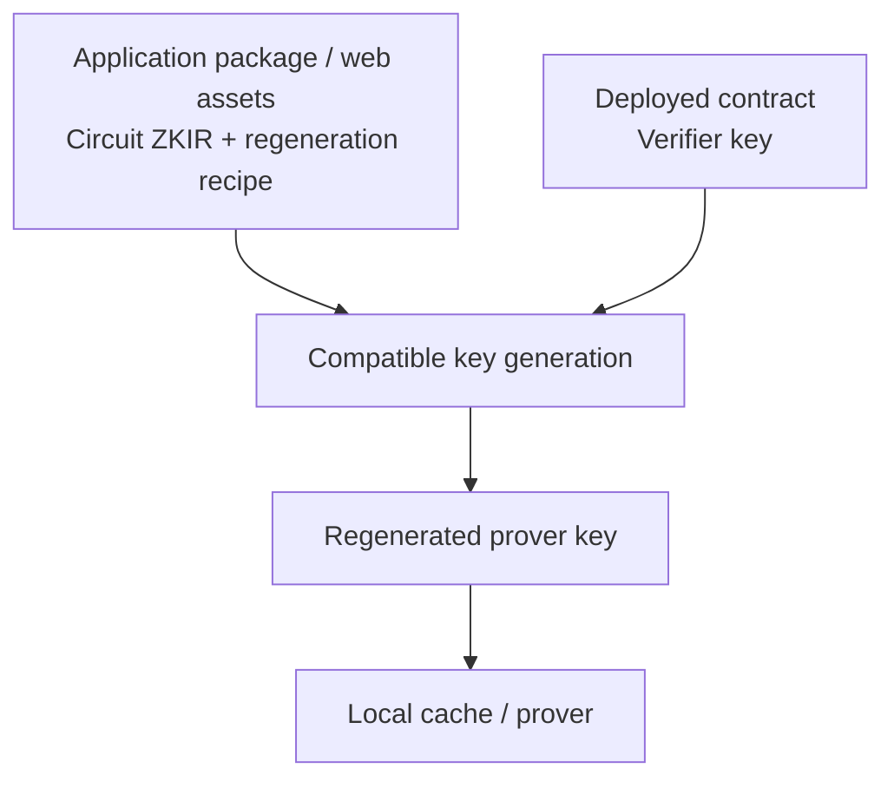

<!--
 Copyright Midnight Foundation

 Licensed under the Apache License, Version 2.0 (the "License");
 you may not use this file except in compliance with the License.
 You may obtain a copy of the License at

     https://www.apache.org/licenses/LICENSE-2.0

 Unless required by applicable law or agreed to in writing, software
 distributed under the License is distributed on an "AS IS" BASIS,
 WITHOUT WARRANTIES OR CONDITIONS OF ANY KIND, either express or implied.
 See the License for the specific language governing permissions and
 limitations under the License.
-->

> **Published as MIP-0020 (Proposed), 4 October 2026.** The
> [numbered upstream text](https://github.com/midnightntwrk/midnight-improvement-proposals/blob/main/mips/mip-0020-prover-key-regeneration.md)
> is canonical; the pre-publication working text below is retained for local
> references. Authors remain Nicolas Di Prima and Vincent Hanquez.
> Continue review in https://github.com/midnightntwrk/midnight-improvement-proposals/discussions/345.

## Abstract

Applications should distribute a circuit's small ZKIR file instead of its
large prover key. When the circuit is needed, the client reads its deployed
verifier key, regenerates the prover key, and caches it. ZKIR can travel with
an npm package, CLI, wallet integration, or web application's static assets.
This path requires no contract registry or separate prover-key hosting service.

The construction already exists in Midnight's key-generation libraries:
`pk = setup_pk(zkir, vk)`. A native experiment reproduced the prover keys of
all 30 tested Passport account circuits byte for byte using their ZKIR and
verifier keys read from chain. The ZKIR JSON files total 633,533 bytes; the
prover keys occupy gigabytes.

This MIP standardises the application-supplied recipe, compatible regeneration
profile, chain-state binding, validation and cache behaviour needed to make
that construction a supported SDK capability. It proposes native and
JavaScript/WASM entry points and an SDK artefact provider that derives keys
on demand. Regeneration uses public inputs and does not require transaction
witnesses. The `setup_pk` step needs no structured reference string (SRS);
the baseline consistency check and subsequent proving still use it.

This addresses the prover-key distribution part of MPS-0039. It changes no
contract, verifier key or consensus rule.

## Motivation

A developer can include a few kilobytes of ZKIR with the code that calls a
contract. Shipping a prover key of hundreds of megabytes for that same
circuit is much harder, particularly when an SDK supports several contracts.
The chain already publishes the other input needed to regenerate the key.

The current experiment uses Rust library internals. It does not provide a
supported browser or SDK regeneration API, a portable recipe, or integrated
cache invalidation. Different builds reporting the same version have also
produced different key bytes. Applications need an explicit compatibility
contract rather than an instruction to install whichever toolchain happens
to share a version string.

The proposed deployment model is ordinary application distribution:



The application already selects the network, contract address and operation
it wants to call. It supplies the corresponding ZKIR through its normal
release process. Discovering arbitrary unknown contracts is a separate
capability, not a prerequisite for this model.

## Specification

The terms MUST, SHOULD and MAY describe conformance requirements.

### 1. Scope and inputs

A regeneration request binds four inputs:

1. The target network, contract address and operation selected by the caller.
2. The exact bundled ZKIR bytes for that operation.
3. The deployed operation's verifier-key bytes, obtained through the client's
   normal chain-state provider at an identified ledger state.
4. A supported, immutable regeneration profile defining how those bytes are
   interpreted and the prover key is generated and encoded.

Applications MAY package recipes for multiple deployments or reuse a recipe
where deployments have the same circuit. A verifier key carried in a bundle
MUST NOT override the verifier key obtained for the target deployment.

ZKIR distribution MUST work using application-owned assets alone. A registry,
new on-chain metadata field, source-code publication service, or third-party
discovery service MUST NOT be required for conformance.

### 2. Application recipe

The following notation defines a UTF-8 JSON descriptor. It is a proposed
interchange format, not an API already exported by the SDK:

```typescript
type RegenerationBundleV1 = {
  version: 1;
  circuits: CircuitRecipeV1[];
};

type CircuitRecipeV1 = {
  circuit: string;
  zkir: string;
  zkirEncoding: 'zkir-v3-json' | 'zkir-v3-tagged';
  zkirSha256: string;
  profile: string;
  expectedProverKeySha256?: string;
};
```

- `circuit` is the exact exported circuit name used by the SDK to select the
  deployed operation. Duplicate circuit names in one descriptor are invalid.
- `zkir` is a relative asset path beneath the descriptor's directory, using
  `/` separators, with no scheme, leading slash, empty, `.` or `..` segment,
  query, fragment or percent-encoded component. A web application can serve
  it from the same static bundle; an SDK can resolve it inside its package.
  The host MAY supply the equivalent bytes directly rather than perform I/O.
- `zkirEncoding` selects the profile's JSON or tagged-binary parser. The
  consumer MUST NOT guess the format from the file extension.
- `zkirSha256` is the SHA-256 digest of the exact asset bytes, expressed as
  64 lowercase hexadecimal characters. No JSON reformatting or newline
  normalisation precedes hashing.
- `profile` is the exact case-sensitive identifier defined in section 3.
- `expectedProverKeySha256`, when present, is the SHA-256 digest of the
  profile's complete serialised prover-key bytes, in the same hex format.
  It permits compatibility with an existing compiler manifest without
  shipping the prover-key file.

Duplicate JSON member names, unknown version numbers, unsupported fields or
invalid field types MUST be rejected. Metadata and ZKIR digest agreement
identifies the bundled asset; it does not by itself authenticate it against
the chain. That check is specified in section 4.

### 3. Regeneration profiles

A profile fixes the ZKIR parser and relation construction, key-generation
algorithm and parameters, verifier-key decoder, prover-key encoder, and
compatible SRS family used for validation and proving. An implementation
MUST advertise the profile identifiers it supports and reject others.

Profile identifiers MUST NOT be reassigned to different behaviour. A profile
is identified by a pinned specification/build recipe and conformance vectors,
not merely a compiler or crate version string. Its implementation is shipped
as part of the application's supported tooling. Receiving a recipe does not
authorise downloading or executing a new keygen implementation.

The initial draft profile is named `ledger9-e5da670-pk-v1` and pins:

- midnight-ledger revision
  `e5da67016d143db7822bbcd79eb1dd4ca198cb07`, including `zkir-v3`,
  `transient-crypto` and `serialize`;
- the reference experiment's dependency lock file, SHA-256
  `dbe09a085b423bb17e5e797cab8e8e15124c75d9af832b96f44cd1a4db9824d9`;
- `midnight-zk-stdlib` 2.3.5, `midnight-proofs` 0.8.2 and
  `midnight-circuits` 7.2.4 as resolved by that lock;
- the pinned `IrSource` loaders for JSON/tagged ZKIR, the tagged
  `VerifierKey` wrapper and `MidnightVK` processed encoding, and the tagged
  `ProverKey<IrSource>` output encoding exercised by the reference;
- the pinned toolchain's circuit-size selection and ledger-9 SRS family.
  SRS material MUST come from the client's configured, authenticated
  parameter provider; an application recipe cannot substitute another SRS.

The profile and its complete vectors require maintainer confirmation before
acceptance. Other implementations MAY implement the same profile if they
reproduce its specified bytes; identical executable binaries are not required.
Changed ZKIR/key encodings or keygen behaviour require a new profile.

### 4. Regeneration and consistency checking

The proposed library surface provides these operations; language-specific
names may differ, but their inputs and guarantees MUST match:

```text
derive(profile, zkirEncoding, zkirBytes, verifierKeyBytes) -> proverKeyBytes
validate(profile, zkirEncoding, zkirBytes, verifierKeyBytes, params) -> success/error
```

`derive` MUST parse the supplied ZKIR and deployed verifier key under the
selected profile, reject malformed or trailing input, check compatible
circuit sizes, apply `setup_pk(ir, vk)`, and return the profile's encoded
prover key. It MUST require neither an SRS nor witnesses. Its success means
the key was constructed, not that the ZKIR has been authenticated.

For the initial profile, `validate` MUST independently run
`setup_vk(params, ir)` using the configured SRS at the required size,
serialise the result under the profile, and compare it byte for byte with
the deployed verifier key. A mismatch MUST fail before the SDK uses the
derived key for proving or accepts it as a validated cache entry. Validation
may be performed before derivation to avoid unnecessary work.

This distinction matters: handing an existing verifier key to `setup_pk`
does not independently demonstrate that the supplied ZKIR corresponds to it.
Inspecting that same embedded key in the output would be circular. The
baseline validation above supplies the independent check. A future profile
may specify another reviewed check, but cannot silently omit it.

SDK integration MUST:

1. Resolve the target operation from chain state and obtain its verifier key.
2. Verify the recipe and the ZKIR asset digest, then select a supported profile.
3. Reuse a validated cache entry for these exact inputs, or validate and
   derive a new key.
4. Check `expectedProverKeySha256`, if provided, and any existing applicable
   compiler-manifest prover-key digest. A mismatch is an error, not a reason
   to regenerate the expected digest or disable integrity checks.
5. Supply the resulting key to the existing proving path.

The new SDK provider MUST support a recipe-based mode in which no `.prover`
file or pre-existing digest of that file is required: the validated
derivation supplies it. Integrity checks for other supplied artefacts remain
applicable. This MIP does not authenticate the application's executable or
replace the compiled executable needed to construct a transaction transcript.

### 5. Caching and upgrades

A cache entry MUST be identified by the tuple:

```text
(profile identifier, ZKIR encoding, SHA-256(ZKIR bytes), SHA-256(verifier-key bytes))
```

Implementations may choose their own cache serialisation, but MUST encode
tuple boundaries unambiguously. Entries MUST record successful validation
and a digest of the generated prover-key bytes; incomplete writes and
corrupted entries MUST be discarded. Validation reuse is allowed only for
the same profile, inputs and authenticated parameter configuration.

The mapping from `(network, contract address, operation)` to that tuple is
separate. Clients MUST resolve it against the chain state used for call
construction, rather than treating an address or circuit name as a permanent
key identity. If a maintenance update changes the verifier key, the old
mapping is invalid. A stale bundled ZKIR then produces a clear incompatibility
error until the application distributes the matching recipe.

The ledger remains authoritative if an update races with proof generation
or submission. Clients MUST surface that failure and refresh/rebuild rather
than claim a cached key ensures future acceptance. Implementations MAY evict
and regenerate keys to respect local storage limits.

### 6. Distribution, execution and errors

SDKs SHOULD load only the ZKIR for the circuit being used. Regeneration MAY
run in a native process, browser worker or proof-server process. Public-input
key regeneration does not itself delegate witnesses or transaction execution.
Changing where proving occurs remains the application's separate decision.

Implementations MUST distinguish unsupported recipe/profile/encoding,
malformed input, missing deployed operation, asset-digest mismatch,
ZKIR/verifier-key mismatch, expected-prover-key mismatch and resource-limit
failure. A failure MUST NOT be converted to a successful cache entry.
Implementations MUST bound input parsing and resource use; practical limits
are implementation-specific and MUST be documented.

This MIP defines no proof-server HTTP protocol. Servers can adopt the same
regeneration library for their locally configured assets. Changes to remote
proving requests can be coordinated separately with MPS-0039's key-by-reference
work, without making them a dependency of local regeneration.

### 7. Versioning

The recipe format is version 1. Incompatible recipe changes increment
`version`; unknown versions fail explicitly. Profile changes use new immutable
identifiers and invalidate the relevant cache identity. New ledger versions
are not automatically compatible with the initial ledger-9 profile.

## Rationale

**Distribute the small input, regenerate the large output.** The measured
30-circuit fixture has 633,533 bytes of JSON ZKIR; its largest JSON file is
41,267 bytes. Those are ordinary application-asset sizes. The native
`setup_pk` measurements range from 0.01 s at k=9 to 0.72–1.35 s at k=17.
They exclude SRS-based validation, output serialisation, writing and proving;
they are not browser or end-to-end latency measurements.

**No registry dependency.** Applications already distribute the code and
interfaces for contracts they support. Distributing ZKIR beside them needs
no new ecosystem-wide service. A registry could later help a client discover
an unknown contract, but does not improve the basic regeneration equation
and is unnecessary for a known integration.

**Use the deployed verifier key.** It identifies what the selected contract
operation currently verifies against. Reading it avoids distributing a
potentially stale copy as the authority and lets clients detect upgrades.

**Compatibility must be more precise than a version string.** The experiment
found different keys and an incompatible encoding in builds labelled
`zkir-v3` 3.0.0-rc.2. Explicit profiles prevent a client from guessing which
implementation reproduces the deployed circuit's key material.

| Approach | Distribution cost | Trade-off |
| --- | --- | --- |
| Ship full prover keys | Large per-circuit files | No regeneration step; still needs compatible readers |
| Compress prover keys (#329) | Smaller key downloads | Fast decoding; still distributes a prover-key representation |
| Bundle ZKIR and derive from deployed VK | Small per-circuit assets | Keygen/validation cost and memory move to the consumer |
| Registry or hosted key store | Additional service and availability dependency | Useful for discovery or shared infrastructure; not required here |

Compression and regeneration are complementary. A derived cache entry could
be stored using a supported lossless compressed representation. Devices that
cannot afford regeneration may still choose precomputed keys. Neither route
removes the prover's working-memory requirements.

## Path to Active

### Acceptance Criteria

- [ ] Ledger/cryptography maintainers confirm the initial profile, consistency
  check and compatibility claims, including adversarial ZKIR/VK mismatch tests.
- [ ] Publish exact positive and negative vectors, input/key digests, complete
  producer/dependency pins and parameter identities for the initial profile.
- [ ] A supported native API and JavaScript/WASM binding implement derivation
  and validation, with matching outputs on the supported platforms.
- [ ] An SDK artefact provider accepts the version-1 bundle, handles caches
  and upgrades, and retains applicable manifest integrity checks.
- [ ] Demonstrate a successful on-node contract call from bundled ZKIR and a
  chain-read verifier key, with no distributed prover-key file or registry.
- [ ] Publish separate timings and peak memory for validation, derivation,
  serialisation and proving, including browser limits and large contract keys.
- [ ] Publish compatible package versions and migration guidance. Editors
  record the tooling release that fulfils this off-chain standard's rollout;
  no consensus activation is requested.

### Implementation Plan

1. Discuss this draft under MPS-0039 with ledger, Compact and SDK maintainers,
   and coordinate with the author of the smaller-prover-keys proposal #329.
2. Turn the native feasibility code into supported library entry points;
   publish the initial profile and vectors.
3. Expose those operations to JavaScript/WASM and implement the SDK provider.
4. Package ZKIR with a reference application and exercise cold/warm caches,
   upgrade handling and a complete accepted transaction.
5. Release the supported libraries and provider. Adopt regeneration in
   applications that benefit; integrate proof servers where useful.

## Backwards Compatibility Assessment

No hard fork, contract redeployment, verifier-key replacement or ledger
transaction-format change is required. Existing deployments are usable if
the application has their matching ZKIR and a supported profile. Deployments
whose ZKIR is unavailable are not made discoverable by this MIP.

Existing `.prover` files and providers remain valid. The initial profile
targets byte-identical output, so consumers of that encoding can use the
regenerated file unchanged. Older SDKs need a provider update or a native
pre-generation step. Adoption does not justify disabling manifest checks.

## Security Considerations

The source of authority is the verifier key read for the selected network,
contract and operation, subject to the client's existing chain-provider and
finality assumptions. A ZKIR digest supplied beside a file only detects
disagreement with that descriptor; it is not an independent trust anchor.
The section 4 check binds the relation to the deployed verifier key under
the proof system's assumptions.

ZKIR and verifier keys are public inputs. Regeneration must not accept
transaction witnesses, signing keys or recovery secrets. Using a service to
derive public keys does not by itself justify sending that service witnesses
for proving.

Small input files can request expensive computation. Implementations must
check sizes and supported parameters before expensive allocation, run
regeneration with appropriate isolation/cancellation, and handle failure
without accepting partial keys. A verifier-key match authenticates the
relation under the proof system; it does not certify benign resource use,
application behaviour or the safety of accompanying JavaScript.

The feasibility experiment establishes matching outputs for honest tested
inputs. It does not establish a universal cross-version guarantee or replace
cryptographic review of mismatch handling. The comparison of recomputed and
deployed verifier keys must be independently exercised in conformance tests.

## Implementation

The merged [Passport experiment][experiment] implements native
`setup_pk(ir, vk)` and a separate `setup_vk` control. It reproduces all 30
tested account-contract prover keys using chain-read verifier-key bytes.
This is feasibility evidence, not a complete implementation of this MIP's
recipe, validation policy, cache or SDK provider.

The attempted on-node call with a derived key passed the SDK's byte-integrity
check and reached node admission, then hit the separately observed
unshielded-deposit rejection (error 231). It is not evidence of a successful
accepted transaction; that remains an acceptance criterion.

Required changes are supported keygen exports in the native and WASM
libraries, the SDK's recipe-based artefact provider, and application build
packaging. ZKIR emission already exists. Browser keygen availability and
peak memory for `setup_pk` alone were not demonstrated by the experiment.
The reported approximately 2.4 GiB peak was for the full CLI path, not the
isolated regeneration step proposed here.

## Testing

1. **Compatibility vectors:** every tested circuit regenerates to the expected
   key bytes; native and WASM implementations agree under the same profile.
   Include both JSON and tagged-binary ZKIR and exact tagged-key encodings.
2. **Negative vectors:** wrong ZKIR, another circuit's VK, incompatible
   same-version producers, corrupt/truncated/trailing data, duplicate recipe
   fields and unsupported profiles are rejected at the defined stage.
3. **Integrity:** altered ZKIR fails the asset digest; a changed digest in the
   recipe does not defeat VK validation; a supplied prover-key digest is
   checked; existing manifest mismatches remain failures.
4. **Lifecycle:** cold generation, warm reuse, partial cache writes, corruption,
   eviction, network/operation selection, maintenance updates and update races
   exercise the invalidation and retry rules.
5. **Integration:** a bundled web/native example derives and proves without
   downloading a `.prover` file or contacting a registry, and its transaction
   is accepted by a node. Test an explicit resource-limit failure as well.
6. **Performance:** measure each phase separately, including peak memory;
   report hardware, browser/runtime, profile, circuit size and cache state.

## References

- [MPS-0039: Calling a Contract Requires Its Full Compiled Artifacts][mps39].
- [MIP-0001: Midnight Improvement Proposal Process][process].
- [Passport #170: prover-key regeneration evidence][pr170].
- [Native experiment, scripts and producer lock file][experiment].
- [All-circuit regeneration results][results] and [determinism results][determinism].
- [midnight-ledger key-generation source at the tested revision][ledger].
- [Upstream #329: Smaller prover key files][compression] — complementary
  compression work, currently a draft.

[mps39]: https://github.com/midnightntwrk/midnight-improvement-proposals/blob/main/mps/mps-0039-lightweight-contract-interaction.md
[process]: https://github.com/midnightntwrk/midnight-improvement-proposals/blob/main/mips/mip-0001-mip-process.md
[pr170]: https://github.com/midnightntwrk/passport/pull/170
[experiment]: https://github.com/midnightntwrk/passport/tree/56f46d455eb667841f88fd491985ef6a448e0711/experiments/proving-key-regeneration
[results]: https://github.com/midnightntwrk/passport/blob/56f46d455eb667841f88fd491985ef6a448e0711/experiments/proving-key-regeneration/results-pk-from-onchain-vk-2026-09-23.txt
[determinism]: https://github.com/midnightntwrk/passport/blob/56f46d455eb667841f88fd491985ef6a448e0711/experiments/proving-key-regeneration/results-determinism-2026-09-23.txt
[ledger]: https://github.com/midnightntwrk/midnight-ledger/tree/e5da67016d143db7822bbcd79eb1dd4ca198cb07
[compression]: https://github.com/midnightntwrk/midnight-improvement-proposals/pull/329

## Acknowledgements

Hector Bulgarini, co-author of MPS-0039, and the Midnight ledger, Compact and
SDK contributors whose key-generation and deployment tooling underpin the
reference experiment.

## Copyright Waiver

All contributions (code and text) submitted in this MIP must be licensed
under the Apache License, Version 2.0. Submission requires agreement to the
Midnight Foundation Contributor License Agreement, which includes the
assignment of copyright for contributions to the Foundation.

This working draft was prepared with AI assistance. The named human authors
are responsible for its review and submission.
