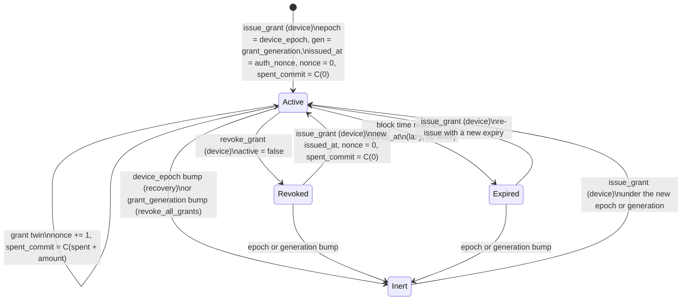

<!--
 Copyright 2026 Midnight Foundation

 Licensed under the Apache License, Version 2.0 (the "License");
 you may not use this file except in compliance with the License.
 You may obtain a copy of the License at

     https://www.apache.org/licenses/LICENSE-2.0

 Unless required by applicable law or agreed to in writing, software
 distributed under the License is distributed on an "AS IS" BASIS,
 WITHOUT WARRANTIES OR CONDITIONS OF ANY KIND, either express or implied.
 See the License for the specific language governing permissions and
 limitations under the License.
-->

<!-- WORKING DRAFT. Open items are tagged inline and collected in
     Specification section 15: [RULING] = pending a product, policy, or
     editorial decision; [DEP] = blocked on an upstream Compact, ledger,
     connector, or browser feature; [CIRCUIT] = pending circuit evidence;
     [CRYPTO] = pending cryptographer review. Every tag carries the
     default the text currently adopts. -->

## Table of contents

- [Abstract](#abstract)
- [Motivation](#motivation)
- [Specification](#specification)
  - [1. Scope of this document](#1-scope-of-this-document)
  - [2. Terminology](#2-terminology)
  - [3. Grantee keys and arms](#3-grantee-keys-and-arms)
  - [4. Ledger state and grant identity](#4-ledger-state-and-grant-identity)
  - [5. Scope semantics](#5-scope-semantics)
  - [6. The grant seam](#6-the-grant-seam)
  - [7. Lifecycle](#7-lifecycle)
  - [8. Read-scope delegation](#8-read-scope-delegation)
  - [9. GrantRequest and the redirect binding](#9-grantrequest-and-the-redirect-binding)
  - [10. Sign-in](#10-sign-in)
  - [11. Ecosystem carriage](#11-ecosystem-carriage)
  - [12. Invariants](#12-invariants)
  - [13. Companion erratum to MIP-0013 section 9](#13-companion-erratum-to-mip-0013-section-9)
  - [14. Versioning](#14-versioning)
  - [15. Open items](#15-open-items)
- [Rationale](#rationale)
- [Path to Active](#path-to-active)
- [Backwards Compatibility Assessment](#backwards-compatibility-assessment)
- [Security Considerations](#security-considerations)
- [Implementation](#implementation)
- [Testing](#testing)
- [References](#references)
- [Acknowledgements](#acknowledgements)
- [Copyright Waiver](#copyright-waiver)

## Abstract

This MIP specifies a second authoriser class behind the authorisation
seam of MIP-0013, the **scoped grant**, and the ceremony by which a
third party obtains one. A grant is a contract-maintained record in a
custody account conforming to MIP-0012 and MIP-0013 that admits one
grantee key of one registered signature scheme to a bounded subset of
the account's asset-facing operations: three spend circuits, one token
color, a per-call cap, a cumulative cap, a bound on the value of any
coin the grantee may touch, an optional recipient pin, and an optional
expiry. Scope is enforced in-circuit on every call, and any active
device can revoke a grant from chain state. A grant may also be
read-only, in which case the record anchors, enumerates, and revokes an
otherwise invisible viewing capability.

The record is keyed by a contract-recomputable identity over the
account address, the grantee key, its origin, and a small slot number,
so that one credential has at most one live record per slot and every
record of a grantee is enumerable from public state. Fields that would
name a held coin's color, a counterparty, or a released value are
stored as salted commitments, so the custody invariants of MIP-0012
hold unchanged. Freshness is a per-grant nonce read from the record
inside the circuit; grant calls never touch the device counter.

The connection flow is the normative redirect binding of one
transport-independent `GrantRequest` object: a dApp redirects the user
to an authoriser page carrying its origin and key with a
browser-attested proof of possession; the user authenticates with the
account's device passkey, sees exactly the scope the ledger will
record, approves; the authoriser submits one device-gated `issue_grant`
call; the user returns to the dApp, which verifies its grant by reading
chain state and thereafter signs in with the passkey registered for that
dApp. The same record and seam serve agents and intra-user delegation
through non-browser bindings. Read access is delivered as the MIP-0012
viewing capability sealed to a dApp-supplied key, and the MIP states as
its dominant residual risk that the ledger enforces spend scope and not
read scope.

## Motivation

MIP-0012 fixes how a custody contract holds and releases value behind
one abstract seam, `require_authorised()`, and its section 2 names
"delegated or scoped spending policies (grants, allowances, session
permissions)" as authorisation-policy objects behind that same seam,
deferred to a conforming extension. MIP-0013 instantiates the seam with
device keys and states in its section 4 that "scoped grants are
permitted extensions that interact only with this seam and MUST NOT
weaken any invariant of section 9". Its security consideration S7
records the gap that makes the extension necessary: `add_device` grants
full authority, so today the only way to let any third party act on an
account is to make it a device. This document is the reserved
extension.

Three inadequacies of the current ecosystem motivate the shape chosen.

**There is no bounded authority.** A dApp that wants to show an
account's holdings, or to move a bounded amount of one token on the
user's behalf, has today two options on a MIP-0013 account: hold a full
device key, which is total compromise of asset release if the dApp is
compromised (MIP-0013 S5), or hold nothing and route every action
through the owner's own client. Neither is a connection. The
account-custody prototype demonstrated a colour-scoped, value-capped,
epoch-bound withdraw grant enforced in-circuit on a devnet node, which
establishes that bounded authority is expressible at the seam; it did
not establish origin binding, expiry, signature-based grantee
authentication, or any connection protocol, which is what a standard
must supply.

**Connection is not standard, and what exists is the wrong layer.** The
dApp connector API and the Open Wallet Standard define how a dApp or an
agent talks to a wallet: session establishment, message signing, and
client-side policy. Both are wallet-side, off-chain, and ephemeral. The
Open Wallet Standard's policy design explicitly asks to pair with "an
account contract that verifies a scoped authorisation in-circuit" and
states that client-side policy is defence in depth, not the sole gate.
MPS-0003 frames dApp-to-wallet connection as a chain-identifier problem
and lists custom connector protocols as the current workaround. MPS-0029
records that Compact exposes no authenticated caller identity, so a
separate verifier contract cannot know who called it. None of these
produces a scoped, revocable, on-chain object that a dApp's signature
can target; each points at one.

**The redirect pattern is well known and well known to fail.** NEAR's
access-key login flow is the closest deployed analogue of the user
brief's connection: a dApp generates a key, redirects to the wallet with
its public key and return URL, and the wallet adds the key to the
account. Its documented defects are login CSRF (nothing proves the dApp
possesses the key it asks to add, and nothing binds the return to the
requesting session), an open redirector through attacker-controlled
return URLs, disclosure of the account's whole key list to every dApp,
and a non-expiring default. OAuth 2.0 and its security best current
practice have fixed these classes for a decade. A Midnight standard has
the opportunity to borrow the fixes and to add the one thing OAuth
cannot: a browser-written origin attestation (the WebAuthn
`clientDataJSON.origin`) in place of a self-asserted `from` parameter,
and a chain record in place of an authorization code.

The absence of a standard here has a demonstrated cost in the adjacent
upstream proposal for private mandate tokens, which standardises a
capability-scoped, value-capped, expiring, revocable delegation record
of exactly this shape but authenticates the agent through an
unconstrained sender witness, which is the `ownPublicKey()` pattern
MIP-0012 section 4 forbids, and attaches the record to an
admin-overwritten balance rather than to custodied assets. The safe
pattern, a grant verified inside the custody seam by a signature over a
challenge that binds the call, is what this MIP standardises.

## Specification

The key words MUST, MUST NOT, SHOULD, SHOULD NOT, and MAY are to be
interpreted as described in RFC 2119.

### 1. Scope of this document

This MIP standardises:

1. the **grant record** and its identity in the ledger state of a
   custody account (section 4) and the semantics of its scope fields
   (section 5);
2. the **grant seam**: how a grantee key satisfies `require_authorised()`
   for exactly three asset-releasing circuits, with scope evaluated
   in-circuit over the values the custody chip consumes (section 6);
3. the **lifecycle** circuits and state machine: issue, revoke, revoke
   all, lazy expiry, and re-issue (section 7);
4. **read-scope delegation**: how the MIP-0012 viewing capability is
   sealed to a grantee and recorded declaratively (section 8);
5. the **`GrantRequest`** object and its normative https redirect
   binding, including the consent screen, the response, the error
   vocabulary, and the return-leg verification (section 9);
6. **account-linked sign-in** backed by a live grant (section 10);
7. how the grant vocabulary is carried in CAIP-25 sessions and mapped to
   Open Wallet Standard policy terms (section 11).

`issue_grant` is a device-gated circuit that the owner can call with no
ceremony from their own client, offline from any authoriser page; a
conforming account is fully usable with no authoriser in existence. The
`GrantRequest` object is the interoperable way a third party asks for a
grant; the redirect is one binding of it. The same record, identity,
seam, and lifecycle serve intra-user delegation (a user's second device,
a script, a household member) through the `self:` grantee form, so no
parallel mechanism exists for it.

Out of scope, with the successor or owner named where one exists:

- a new injected wallet API, connector method, or Open Wallet Standard
  capability definition (only the object they carry);
- a client-side policy language (Open Wallet Standard PE-1 owns it);
- proving and submission transport, fee sponsorship, and remote proving;
  this MIP says only what the transaction must contain;
- unlinkable, address-hiding sign-in and any authoriser-signed identity
  assertion or pairwise pseudonym (the sign-in MIP recommended by the
  planning register, hereafter "the sign-in MIP");
- selective-disclosure credential proofs attached to or required by a
  grant, and non-asset objects (contracts, attestations);
- per-grantee, hierarchical, or epoch-scoped viewing keys and the
  per-coin mirror mode (the MIP-0012 R9 successor, the named dependency
  for spend without full disclosure); proxied reads;
- chain-agnostic or "all chains" grants: a grant authorises calls on one
  contract on one chain by construction; a chain-agnostic record class,
  if needed, lives at the intent layer; a request MAY carry other
  CAIP-217 scope objects this MIP does not enforce;
- a general "callable contracts" object; the account contract has no
  call-forwarding circuit;
- grant delegation chains; grants are non-delegable;
- m-of-n device policy, two-of-n revocation of high-value grants,
  threshold grantee keys beyond what the JubJub arm permits, per-device
  scheme agility;
- the device-identity remedy for MIP-0013 erratum 8 itself
  (recommended to share the schema bump, specified by MIP-0013 errata);
- the `schnorr_bip340` grantee arm (pending upstream point operations),
  activation of the r1 arm `[DEP]`, and spend through wallet-provider
  keys `[DEP]`;
- window-bounded rate limits (schema reserved; enforcement is a circuit
  revision), tombstone pruning, automatic expiry cleanup;
- authoriser discovery beyond a chooser and manual entry;
- authenticated request objects (`.well-known` client metadata) for
  browser clients without WebAuthn `[DEP]`, Related Origin Requests, and
  any passkey shared across the authoriser and dApp origins;
- merging device and grant twins into one circuit;
- seed-anchored `deriveSecret` counterparts (MIP-0015); the grantee's
  own per-origin passkey answers the durable-secret need;
- migration of `spec_version = 1` accounts, the recovery seam's
  internals, how the viewing secret reaches a second authoriser device
  (MIP-0012), agent identity registration, and Zswap user-held coins;
- address-only disclosure ceremonies with no on-chain effect; the
  address is public information the user can share.

### 2. Terminology

- **Account**: a custody contract instance conforming to MIP-0012 and
  MIP-0013 (hereafter "the custody MIP" and "the authorisation MIP").
- **Device**, **device key**, **device entry**, **epoch**,
  **`auth_nonce`**: as defined by the authorisation MIP. A grantee is
  not a device and never counts toward `device_count`.
- **Grant**: a record in the account's ledger state admitting one
  grantee key to a bounded subset of operations under stated bounds.
- **Grantee**: the holder of the grantee key: a browser dApp, a wallet
  provider, an agent, or the owner acting through a delegate key.
- **Grantee key**: a `(scheme, pk)` pair drawn from the signature-scheme
  registry, plus, for the k1 arm only, an envelope id (section 3).
- **Arm**: the per-scheme circuit family of the registry: `v1` (Schnorr
  over JubJub), `k1` (ECDSA over secp256k1), `r1` (ECDSA over secp256r1
  through the WebAuthn envelope).
- **Origin**: the normalised identity of the grantee (section 4.4): an
  RFC 6454 web origin for browser clients, or an `rdns:`, `mais:`, or
  `self:` identifier for non-browser clients.
- **Grant identity** (`grant_id`): the contract-recomputable hash keying
  the record (section 4.3).
- **Slot**: a dApp-chosen byte distinguishing up to 256 records of one
  key at one origin.
- **Scope**: the immutable bounds of a grant (section 5); **plaintext
  scope**: the scope as the approver consents to it, before commitment.
- **Grant twin**: a gated circuit `<operation>_with_grant_<arm>` that
  verifies a grant in the position where the device twin verifies a
  device signature.
- **Authoriser**: a role, not a service (section 11.3): a party holding
  a device key of the account that renders a `GrantRequest`, drives
  `issue_grant`, and, to serve `read`, holds the account viewing secret.
- **Viewing capability**, **viewing secret**, **inbox**, **coin store**,
  **color**: as defined by the custody MIP.
- **Browser binding**: the delivery of a `GrantRequest` by top-level
  navigation to an authoriser page (section 9). **Non-browser binding**:
  any other delivery (a pasted or scanned object, a local channel).
- **`pad(N, s)`**: the ASCII bytes of `s` followed by zero bytes to a
  total width of `N` bytes. **`H(x)`**: SHA-256 of the byte string `x`.

### 3. Grantee keys and arms

#### 3.1 Registered grantee arms

A grantee key is a `(scheme, pk)` pair from the signature-scheme
registry of the authorisation MIP's successor scheme document
(hereafter "the schemes MIP"), plus, for `k1` only, an `envelope` id.
Three grantee arms are registered by this MIP:

| Arm | Scheme | Envelope | Registry status | Today |
|---|---|---|---|---|
| `v1` | Schnorr over JubJub | intrinsic (none) | Active | yes |
| `k1` | ECDSA over secp256k1 | `0` none, `1` connector prefix | Interim, inherited from the schemes MIP with its sunset | yes |
| `r1` | ECDSA over secp256r1 through the WebAuthn envelope | intrinsic (WebAuthn message) | Active upon `[DEP]` secp256r1 language surface | no |

`envelope` is the k1 digest selector and nothing else: the k1 arm
verifies over `envelope_digest(envelope, h)` where
`envelope_digest(0, h) = H(h)` and
`envelope_digest(1, h) = H(pad(27, "midnight_signed_message:32:") || h)`,
the mandatory prefix of the dApp connector's `signData` surface. It is
absent from the wire form and from the identity preimage for `v1` and
`r1`, whose digest wrapping is intrinsic to the scheme. No `2 =
webauthn` envelope id is filed. The `schnorr_bip340` scheme the
connector also emits is reserved and `[DEP]` on upstream secp256k1
point operations.

#### 3.2 Grantee forms

Five grantee forms are admitted through one table; none is privileged
in the schema:

| Form | Arm, envelope | Today | Origin proof at issuance | Scopes admitted | Serves |
|---|---|---|---|---|---|
| Per-dApp WebAuthn credential on the dApp origin | `r1` | `[DEP]` | the assertion itself (`clientDataJSON.origin`) | all | browser dApps once secp256r1 ships |
| Per-connection software key gated by a companion passkey on the dApp origin | `k1` envelope `0`, or `v1` | yes | WebAuthn assertion by the companion passkey over `request_digest`, which covers the software key | all | browser dApps now |
| Wallet-provider key through the connector `signData` | `k1` envelope `1`; `schnorr_bip340` reserved `[DEP]` | yes | WebAuthn assertion by a companion passkey on the dApp origin, exactly as the software form; `signData` supplies possession only | `read` only in v1 `[RULING]` | "connect my wallet to my account" |
| Agent or vaulted key (`rdns:`, `mais:` identity) | `v1` or `k1` envelope `0` | yes | operator assertion in the non-browser binding, displayed as such | all | agents, servers |
| Intra-user delegate (`self:<label>` identity) | `v1` or `k1` envelope `0` | yes | none needed: approved in person on the owner's own device in the non-browser binding | all | a second device, a script, a household member |

Rules:

- Grantee keys MUST be generated per connection: one key per account per
  origin. A key MUST NOT be reused across accounts or origins.
- An authoriser MUST refuse to issue a grant to a `pk` it knows to be
  enrolled as a device key of the same account. The contract cannot
  check this, since device keys are not stored; the rule is part of
  GR-2.
- **Wallet-provider keys are restricted to `read` in v1** `[RULING]`.
  Connector `signData` under envelope `1` is a blind 32-byte
  message-signing surface. Once a grant exists for a wallet key, every
  element of a spend challenge is public or attacker-chosen (the tag,
  the account address, the wallet key, `grant_id`, `issued_at`, the
  record's `nonce`, and the operation arguments), so any other site the
  user connects the same wallet to could compute a valid spend challenge
  and obtain a signature by asking the wallet to sign a message the user
  cannot interpret. An authoriser MUST return `unsupported_scheme` for
  any withdraw string requested by an envelope-1 grantee. Spend through
  envelope `1` is `[DEP]` on a connector surface that displays a
  decoded, structured description of a grant call with per-call
  confirmation.

#### 3.3 Key validation

Key validation is exactly what the following table says and no more,
performed by the authoriser at issuance and again by the seam at every
use:

| Arm | Check | Not checked |
|---|---|---|
| `k1` | coordinate pair `(0, 0)` rejected in either identity-flag encoding (the point at infinity) | on-curve membership `[CIRCUIT]`; the cofactor is 1, so subgroup membership is vacuous |
| `v1` | `[8]P != O` (the identity and the whole 8-torsion) | on-curve membership `[CIRCUIT]` |
| `r1` | `r != 0`, `s != 0`, recomputed point non-identity (schemes MIP section 3.3 item 5) | on-curve membership of the public key `[CIRCUIT]` |

Whether a `Secp256k1Point` or `JubjubPoint` can be constructed off-curve
from witness data is not evidenced. Before this MIP leaves Draft, the
seam either gains an on-curve assertion or cites type-level evidence
that the runtime enforces membership `[CIRCUIT]`; the negative
conformance suite (Testing item 2) carries off-curve and invalid-curve
grantee keys beside the identity and small-order ones.

#### 3.4 Wire form of a grantee key

`pk` is 128 lowercase hexadecimal characters encoding the affine
coordinates `x || y`, each a 32-byte little-endian integer, for every
curve. Inputs in SEC 1 form (compressed or uncompressed, big-endian)
MUST be decompressed and byte-reversed per coordinate before use; a
normalisation vector is published with the conformance vectors (Testing
item 5). Wire `scheme` names are the connector's spellings where they
exist and two registry spellings where they do not, mapped to the
registry markers by one normative table `[RULING]`:

| Wire `scheme` | Registry arm | `envelope` member | Source of the spelling |
|---|---|---|---|
| `ecdsa_secp256k1_sha256` | `k1` | MUST, `0` or `1` | dApp connector specification |
| `schnorr_bip340` | reserved | absent | dApp connector specification; `[DEP]` |
| `schnorr_jubjub` | `v1` | absent | this MIP, filed into the schemes MIP registry |
| `ecdsa_secp256r1_webauthn` | `r1` | absent | this MIP, filed into the schemes MIP registry |

### 4. Ledger state and grant identity

#### 4.1 New cells and structs (`spec_version = 2`)

A grant-capable account extends the custody MIP's and the authorisation
MIP's ledger state with two cells. This is a schema change: the account
exposes `spec_version = 2` (custody MIP section 8), and a
`spec_version = 1` account cannot gain grants by maintenance update
(Backwards Compatibility Assessment). The redeploy SHOULD land together
with the device-identity remedy for the authorisation MIP's erratum 8
`[RULING]`.

```compact
export ledger grants:           Map<Bytes<32>, GrantRecord>;
// keyed by grant_id (section 4.3)

export ledger grant_generation: Uint<32>;
// bumped only by revoke_all_grants; every record carries the value
// at issue and is inert once it differs
```

`GrantScope` (immutable after issue; 164 bytes of payload):

| Field | Type | Width | Meaning |
|---|---|---|---|
| `op_withdraw_unshielded` | `Boolean` | 1 | admits the `withdraw_unshielded` twin |
| `op_withdraw_shielded` | `Boolean` | 1 | admits the `withdraw_shielded` twin |
| `op_withdraw_shielded_to_contract` | `Boolean` | 1 | admits the `withdraw_shielded_to_contract` twin |
| `read` | `Boolean` | 1 | declarative: the viewing capability was delegated (section 8) |
| `object_commit` | `Bytes<32>` | 32 | salted commitment to `color`, `recipient_kind`, `recipient`, `max_coin_value` (section 4.5) |
| `per_call_cap` | `Uint<128>` | 16 | `amount <= per_call_cap` on every call; MUST be `<= cap` |
| `cap` | `Uint<128>` | 16 | `spent + amount <= cap` cumulatively |
| `expires_at` | `Uint<64>` | 8 | in the unit of `kernel.blockTimeLessThan` on the target ledger `[CIRCUIT]`; `0` means never, explicitly |
| `rp_id_hash` | `Bytes<32>` | 32 | `r1` grantees only: SHA-256 of the dApp host; zero otherwise |
| `read_pk_hash` | `Bytes<32>` | 32 | SHA-256 of the delegate's X25519 `read_pk` when `read`; zero otherwise |
| `window_len` | `Uint<64>` | 8 | reserved; MUST be `0` in v1 `[RULING]` |
| `window_cap` | `Uint<128>` | 16 | reserved; MUST be `0` in v1 `[RULING]` |

`GrantRecord` (81 bytes plus the scope):

| Field | Type | Width | Written by | Meaning |
|---|---|---|---|---|
| `epoch` | `Uint<32>` | 4 | contract, at issue | `device_epoch` observed inside `issue_grant` |
| `gen` | `Uint<32>` | 4 | contract, at issue | `grant_generation` observed inside `issue_grant` |
| `issued_at` | `Uint<64>` | 8 | contract, at issue | `auth_nonce` as advanced by the device seam of the issuing call; unique per issuance |
| `nonce` | `Uint<64>` | 8 | contract, every grant call | per-grant freshness; read into the challenge and advanced by every grant call |
| `spent_commit` | `Bytes<32>` | 32 | contract, at issue and every grant call | salted commitment to the cumulative value released under this grant (section 4.5) |
| `window_start` | `Uint<64>` | 8 | reserved | `0` in v1 |
| `window_spent` | `Uint<128>` | 16 | reserved | `0` in v1 |
| `active` | `Boolean` | 1 | contract | `false` is a tombstone (revoked) |
| `scope` | `GrantScope` | 164 | contract, at issue | immutable after issue |

Byte budget: about 277 bytes per grant including the 32-byte key,
before the ledger's field alignment; one hundred grants, live or
tombstoned, are about 28 KB of contract state. The record stores no
key, no origin, and no scheme. `[CIRCUIT]`: a struct embedding a struct
as a `Map` value is not evidenced (the prototype's map value is a struct
of scalar fields only); the flattened fallback (the scope fields inlined
into `GrantRecord`) changes no wire form, no challenge preimage, and no
byte recipe.

#### 4.2 Plaintext scope

The plaintext scope the approver consents to, and that `issue_grant`
takes as arguments, is:

| Argument | Type | Rule |
|---|---|---|
| the four flags | `Boolean` each | at least one operation flag or `read` MUST be set; shielded flags imply `read` |
| `color` | `Bytes<32>` | the token color; all-zero is Night |
| `recipient_kind` | `Uint<8>` | `0` any, `1` `UserAddress`, `2` `ZswapCoinPublicKey`, `3` `ContractAddress` |
| `recipient` | `Bytes<32>` | the address bytes when `recipient_kind != 0`, else zero |
| `max_coin_value` | `Uint<128>` | a shielded twin aborts if the consumed coin's value exceeds it; MUST be `>= per_call_cap` when any spend flag is set |
| `per_call_cap`, `cap`, `expires_at`, `rp_id_hash`, `read_pk_hash`, `window_len`, `window_cap` | as in `GrantScope` | as in `GrantScope` |
| `scope_salt` | `Bytes<32>` | chosen by the authoriser at issue; a readability key for the record, never an authorisation secret |

The circuit computes `object_commit` and the initial `spent_commit` from
these; `color`, `recipient`, and `max_coin_value` never appear in ledger
state in the clear. The salt is bound in the device challenge, delivered
to the grantee in the response, and kept in the owner's roster.

#### 4.3 Grant identity

`grant_id` is a deterministic commitment recomputed in-circuit from the
presented key at every use and pre-derived by the authoriser at issue.
Every preimage in this MIP is defined normatively as a byte
concatenation of fixed-width elements hashed with SHA-256; the exported
pure circuits of a conforming contract are one implementation of the
recipe, not its definition, so a dApp recomputes its `grant_id` with
plain SHA-256 and no Midnight stack. The recipes rely on the fact that
Compact's `persistentHash` over a tuple of byte atoms is SHA-256 of
their raw concatenation. Integer elements are serialised at the width
of their Compact type, little-endian, as the coordinates are `[CIRCUIT]`
(the published vectors of Testing item 5 pin the compiled encoding; a
divergence is corrected in the recipe, never in the vectors).

| Arm | `grant_id` preimage (in order) | Width |
|---|---|---|
| `k1` | `pad(32, "midnight:account:grant:id:k1:v1") \|\| self \|\| x \|\| y \|\| u8(envelope) \|\| origin_hash \|\| u8(slot)` | 162 |
| `r1` | `pad(32, "midnight:account:grant:id:r1:v1") \|\| self \|\| x \|\| y \|\| origin_hash \|\| u8(slot)` | 161 |
| `v1` | `pad(32, "midnight:account:grant:id:v1") \|\| self \|\| pk_jubjub \|\| origin_hash \|\| u8(slot)` | 129 |

where `self` is the account's own contract address (32 bytes), `x` and
`y` are the 32-byte little-endian affine coordinates of the grantee key,
and `pk_jubjub` is the 32-byte encoding of the `JubjubPoint` element in
the layout this MIP publishes with its vectors `[CIRCUIT]` (the type is
opaque in Compact, with no evidenced coordinate accessor; the layout is
the one the reference signer already reproduces for the device family
without the compiled module). `envelope` is present only in the `k1`
preimage.

Consequences that are normative:

- one tuple `(account, arm, key, [envelope,] origin, slot)` has at most
  one live record; issuance fails while a live record exists under that
  id; revocation retires the id;
- a key holds at most 256 records at one origin, every one of them
  enumerable by anyone who knows the key and the origin, in at most 256
  lookups;
- an unregistered key, a wrong origin, a wrong slot, a key of another
  arm, and, on `k1`, a wrong envelope all fail identically at the
  membership assert, before any signature is examined;
- no secret lives in the identity preimage; grant security rests on the
  grantee signing key alone. `[CRYPTO]`: the hiding argument for
  `grant_id` rests on the entropy of a per-connection key; for a
  publicly known key (the wallet-provider form) the dictionary test "is
  key K connected to origin X on account A" is trivially answerable, and
  this MIP says so (Security Considerations).

#### 4.4 Origin normalisation and `origin_hash`

`origin_hash = H(pad(32, "midnight:account:grant:origin:v1") || client_id_bytes)`,
computed off-chain, where `client_id` is normalised exactly:

- browser clients: the lowercase ASCII RFC 6454 serialisation of the
  origin (`https://bank.example`): scheme and host lowercase, default
  port omitted, non-default port kept, no path, no trailing slash, IDN
  hosts in punycode;
- non-browser clients: `rdns:<reverse-dns>`, `mais:<id>`, or
  `self:<label>`, lowercase.

`origin_hash` is a private argument of every grant twin and of nothing
else; it never appears in ledger state; it is derived from public
information and is not a secret. `slot`, `scope_salt`, and `spent_prev`
are likewise private arguments.

#### 4.5 Commitments and the scope digest

| Derivation | Preimage (in order) | Tag width |
|---|---|---|
| `object_commit` | `pad(32, "midnight:account:grant:obj:v1") \|\| scope_salt \|\| color \|\| u8(recipient_kind) \|\| recipient \|\| u128(max_coin_value)` | 32 |
| `spent_commit` | `pad(32, "midnight:account:grant:spent:v1") \|\| scope_salt \|\| u128(spent)` | 32 |
| `scope_digest` | `pad(32, "midnight:account:grant:scope:v1") \|\| flag(op_withdraw_unshielded) \|\| flag(op_withdraw_shielded) \|\| flag(op_withdraw_shielded_to_contract) \|\| flag(read) \|\| color \|\| u8(recipient_kind) \|\| recipient \|\| u128(max_coin_value) \|\| u128(per_call_cap) \|\| u128(cap) \|\| u64(expires_at) \|\| rp_id_hash \|\| read_pk_hash \|\| u64(window_len) \|\| u128(window_cap) \|\| scope_salt` | 32 |

`flag(b)` is the single byte `0x01` for true and `0x00` for false, so
the recipe does not depend on hashing a `Boolean` in-circuit
`[CIRCUIT]` (inside the pure circuit the flags enter as `Uint<8>` values
through a select if `Boolean` tuple elements are not supported).
`scope_digest` is the single element through which the device challenge
of `issue_grant` binds the whole plaintext scope (AUTH-3 by collision
resistance), keeping that challenge within the evidenced tuple arity.
The `scope` tag family is `[RULING]` (added by this document; the
derivation is named by the design record without a tag). `[CIRCUIT]`:
the sixteen-element `scope_digest` tuple exceeds the largest evidenced
arity of ten; the fallback is a two-stage hash, in which case this
recipe is revised before Proposed.

### 5. Scope semantics

#### 5.1 Axes

A grant realises three axes: the **operation** axis as three Booleans
and a declarative `read`; the **object** axis as one token color and an
optional recipient pin, committed; the **quantitative** axis as
`per_call_cap`, `cap`, `max_coin_value`, and `expires_at`. Rate windows
are reserved in the schema and not enforced in v1.

Rules asserted at issue:

1. at least one operation flag or `read` MUST be set (no "empty means
   all");
2. `op_withdraw_shielded` or `op_withdraw_shielded_to_contract` implies
   `read` (a grantee must hold the viewing secret to select a coin);
3. `per_call_cap <= cap`;
4. any spend flag requires `cap > 0` and `max_coin_value >= per_call_cap`;
5. `read` requires a non-zero `read_pk_hash`;
6. `window_len == 0` and `window_cap == 0`.

`max_coin_value` exists because the value at risk from a shielded grant
is the coin the grantee selects, not the cap: a grantee capped at `C`
may present a coin of value `V` much greater than `C`, send `C`, and
never record the change, orphaning `V - C`. The field makes the value at
risk a number the consent screen displays and the approver narrows.
Clients SHOULD recommend `max_coin_value == cap` where the owner can
pre-split coins.

`expires_at` is expressed in the unit of `kernel.blockTimeLessThan` on
the target ledger, with `0` meaning never, stated explicitly (the UCAN
`exp: null` convention); a non-expiring grant is a declaration, never an
omission. `[CIRCUIT]`: the corpus evidences that the comparison compiles
and executes, not the node's unit; a millisecond clock would make every
second-denominated grant born expired. The unit is pinned on a ledger-9
network before this MIP leaves Draft and recorded in the grant scheme's
registry entry; clients MUST sanity-check a candidate `expires_at`
against a freshly read block time before signing.

There is no `network_id` cell. A contract address is derived from the
deploy transaction's content, so two independent deployments already
have distinct addresses, and `kernel.self()` is bound in every grant
challenge and inside `grant_id`. Cross-network separation therefore
rests on `kernel.self()` plus a client obligation never to reuse deploy
transaction content across networks; a state-preserving fork is not
defeated by any cell, and expiry and revocation on the surviving chain
are the defence. The wire `chain` member remains normative for the
request, where it tells the authoriser which chain to serve.

#### 5.2 Feature strings and the mapping table

Scope travels on the wire as feature strings named after the circuit
exports. Each maps to exactly one Boolean; the grant string is canonical
on the wire and the Boolean is canonical in the record:

| Feature string | Record field | Gated twin | Implies | C23 / Open Wallet Standard scope string | Notes |
|---|---|---|---|---|---|
| `midnight:account:withdraw_unshielded` | `op_withdraw_unshielded` | `withdraw_unshielded_with_grant_<arm>` | | `midnight:unshielded` | |
| `midnight:account:withdraw_shielded` | `op_withdraw_shielded` | `withdraw_shielded_with_grant_<arm>` | `read` | `midnight:shielded` | |
| `midnight:account:withdraw_shielded_to_contract` | `op_withdraw_shielded_to_contract` | `withdraw_shielded_to_contract_with_grant_<arm>` | `read` | `midnight:shielded` | |
| `midnight:account:read` | `read` | none (section 8) | | `midnight:shielded` (read side) | unshielded balances are public and need no capability |
| `midnight:account:signin` | none | none | | none | reserved for the sign-in MIP; v1 authorisers MUST refuse it with `invalid_scope` |

The mapping is many-to-one: a coarse connection scope string covers
several grant strings, so a peer translating in the other direction
MUST ask for the grant strings it needs rather than infer them. The
strings travel in a dedicated `midnight:account:grants` member of a
CAIP-25 session (or in CAIP-25 `scopedProperties`) alongside their
bounds, never in the CAIP-217 `methods` member, which is reserved for
JSON-RPC method names; a CAIP-25 peer MUST NOT treat a grant feature
string as invokable (section 11.1).

A request whose bounds are inconsistent with its strings is rejected as
the error table of section 9.6 says: a spend string without `color`,
`cap`, `max_coin_value`, and `expires_at`; `per_call_cap > cap`;
`max_coin_value < per_call_cap`; a recipient kind that no requested
operation can honour (`invalid_scope`); a withdraw string from an
envelope-1 grantee (`unsupported_scheme`).

### 6. The grant seam

#### 6.1 Circuit list

Per grantee arm `s` in `{jubjub, k256}` today and `{p256}` upon `[DEP]`,
a conforming contract exports exactly three grant twins over the
unchanged custody chips:

- `withdraw_unshielded_with_grant_<s>(color: Bytes<32>, amount: Uint<128>, recipient: UserAddress, ...grant auth): []`
- `withdraw_shielded_with_grant_<s>(recipient: ZswapCoinPublicKey, color: Bytes<32>, amount: Uint<128>, change_entry: Bytes<192>, ...grant auth): Maybe<ShieldedCoinInfo>`
- `withdraw_shielded_to_contract_with_grant_<s>(recipient: ContractAddress, color: Bytes<32>, amount: Uint<128>, change_entry: Bytes<192>, ...grant auth): [ShieldedCoinInfo, Maybe<ShieldedCoinInfo>]`
- exported pure `challenge_<operation>_with_grant_<s>` for each of the three;
- exported pure `derive_grant_id_with_<s>`.

`...grant auth` trails the operation arguments, in this order:

| Arm | Grant authorising material |
|---|---|
| `k256` | `pk: Secp256k1Point, envelope: Uint<8>, origin_hash: Bytes<32>, slot: Uint<8>, scope_salt: Bytes<32>, recipient_kind: Uint<8>, pinned_recipient: Bytes<32>, max_coin_value: Uint<128>, spent_prev: Uint<128>, sig: Secp256k1EcdsaSignature` |
| `jubjub` | `pk: JubjubPoint, origin_hash: Bytes<32>, slot: Uint<8>, scope_salt: Bytes<32>, recipient_kind: Uint<8>, pinned_recipient: Bytes<32>, max_coin_value: Uint<128>, spent_prev: Uint<128>, sig_r: JubjubPoint, sig_s: Field, grind_nonce: Uint<64>` |
| `p256` | as `k256` without `envelope` and with the WebAuthn witness set of the schemes MIP section 3.3 in place of `sig` |

There is no nonce argument: the record's `nonce` is read in-circuit.
The authorising material is witness data and MUST NOT be disclosed by
the circuit.

Per device arm `a` in `{jubjub, k256}`, device-gated through the
unchanged device seam:

- `issue_grant_with_<a>(grant_id: Bytes<32>, <plaintext scope fields of section 4.2>, scope_salt: Bytes<32>, ...device auth): []`
- `revoke_grant_with_<a>(grant_id: Bytes<32>, ...device auth): []`
- `revoke_all_grants_with_<a>(...device auth): []`
- exported pure `derive_grant_scope_digest`, `derive_grant_object_commit`, `derive_grant_spent_commit`;
- exported pure `challenge_issue_grant_with_<a>`, `challenge_revoke_grant_with_<a>`, `challenge_revoke_all_grants_with_<a>` in the existing device tag family (`midnight:account:auth:v1:issue_grant`, `midnight:account:auth:k1:v1:issue_grant`, and so on), where the `issue_grant` challenge's argument list is `[grant_id, scope_digest]`.

No grant twin exists for `rotate_enc_key`, `add_device`, `remove_device`,
`append_inbox`, `issue_grant`, `revoke_grant`, or `revoke_all_grants`. A
`spec_version = 2` account therefore carries 30 non-pure circuits (18
existing, 6 grant twins, 6 lifecycle circuits), 33 with the p256 twins.

#### 6.2 Seam chip, ordered steps

The grant seam is written once per grantee arm as three chips
(`authenticate_grant`, `check_spend_scope`, `settle_grant`) so the three
twins share code. Every predicate is evaluated over the value the
custody chip will consume, never over an argument that merely selects
it: shielded twins invoke `held_coin(color)` before step 5 and test the
returned coin's `color` and `value`; the unshielded twin tests its
`color` argument, which is what its chip consumes. A grant twin
performs, in order:

1. **Key guard.** Per the table of section 3.3: `k256` rejects the point
   at infinity in either encoding; `jubjub` asserts `[8]pk != O`; `p256`
   per the schemes MIP. On-curve membership `[CIRCUIT]`.
2. **Identity.** `id = derive_grant_id_with_<s>(kernel.self(), pk, [envelope,] origin_hash, slot)`,
   disclosed; assert `grants.member(id)`; `g = grants.lookup(id)`. A
   lookup MUST be dominated by a membership assert and never combined
   with it in one boolean expression, because both operands of a
   conjunction are evaluated and a lookup of a non-member has no defined
   value.
3. **Liveness.** Assert `g.active`; assert `g.epoch == device_epoch`;
   assert `g.gen == grant_generation`; assert
   `g.scope.expires_at == 0 || kernel.blockTimeLessThan(g.scope.expires_at)`
   (a select, both sides evaluated; the comparison argument reaches the
   public transcript, which is harmless because the record is public).
4. **Operation.** Assert the twin's own flag (`g.scope.op_<this twin>`),
   a per-twin constant selection over the three Booleans.
5. **Object and bounds.** With `obj_color = coin.color` on the shielded
   twins and `obj_color = color` on the unshielded twin:
   - assert `derive_grant_object_commit(scope_salt, obj_color, recipient_kind, pinned_recipient, max_coin_value) == g.scope.object_commit`;
   - shielded twins: assert `coin.value <= max_coin_value`;
   - assert `amount <= g.scope.per_call_cap`;
   - assert `derive_grant_spent_commit(scope_salt, spent_prev) == g.spent_commit`;
   - compute `wide = spent_prev + amount` in the widened type; assert
     `wide <= g.scope.cap`; then narrow to `new_spent: Uint<128>` (the
     narrowing cannot fail once the cap assert passed, since `cap` is a
     `Uint<128>`; the order is normative and the two failures are
     distinct);
   - assert `recipient_kind == 0 || (recipient_kind == <this twin's kind> && pinned_recipient == recipient bytes)`.
6. **Challenge and verification.** `h = challenge_<operation>_with_grant_<s>(...)`
   over the preimage of section 6.3. `k256`: `secp256k1EcdsaVerify(envelope_digest(envelope, h), sig, pk)`,
   both `s` forms accepted. `jubjub`: `ecMulGenerator(sig_s) == ecAdd(sig_r, ecMul(pk, h as Field))`
   with the grinding rule of the authorisation MIP section 5.2. `p256`:
   the WebAuthn envelope of the schemes MIP section 3.3 with
   `rpIdHash == g.scope.rp_id_hash`, the user-verified flag set, and an
   `authenticatorData` of exactly 37 bytes (ED flag clear; the
   fixed-width envelope cannot verify an extension-bearing assertion).
7. **Write-back.** `grants.insert(id, g')` where `g'` is `g` with
   `nonce + 1` and `spent_commit = derive_grant_spent_commit(scope_salt, new_spent)`,
   spelled out as a full struct literal; then `round += 1`. `auth_nonce`,
   `devices`, `device_count`, and `enc_key` are neither read nor written.

The custody chip (`do_withdraw_unshielded`, `do_withdraw_shielded`,
`do_withdraw_shielded_to_contract`) runs unchanged after step 7, as it
does after the device seam. The shielded twins then, under a disclosed
statement-level branch on whether the send produced change, append
`change_entry` through the inbox chip in the same circuit, so the change
entry is written in the same transaction as the spend, and return the
chip's result. The signature is not what enforces the object scope
under a grant, since the grantee signs its own witness choice; that is
why step 5 tests `coin.color` and `coin.value` directly.

The commitment openings (`scope_salt`, `recipient_kind`,
`pinned_recipient`, `max_coin_value`, `spent_prev`) are private
arguments verified by equality against the record and bound
transitively through `grant_id`, which determines the record, which
determines the commitments; a substituted opening aborts at the
commitment assert rather than authorising anything. `[CRYPTO]`: confirm
that the transitive binding satisfies AUTH-3; the fallback binds the
openings directly at the cost of tuple arity.

#### 6.3 Challenge preimages

Per-twin domain-separation tag, hashed from a 64-byte pad as the
authorisation MIP's amended section 5.1 requires:

`DST = H(pad(64, "midnight:account:grant:auth:<marker>v1:<operation>"))`

with `<marker>` empty for `v1`, `k1:` for `k1`, `r1:` for `r1`, and
`<operation>` one of `withdraw_unshielded`, `withdraw_shielded`,
`withdraw_shielded_to_contract`. The longest member is 63 of 64 bytes;
the 64-byte width is a normative budget on future operation names.

| Arm | Preimage (in order) |
|---|---|
| ECDSA arms (`k1`, `r1`) | `DST \|\| self \|\| x \|\| y \|\| grant_id \|\| u64(issued_at) \|\| ...args \|\| ...witness_values \|\| u64(g.nonce)` |
| JubJub arm (`v1`) | `DST \|\| self \|\| sig_r \|\| pk \|\| grant_id \|\| u64(issued_at) \|\| ...args \|\| ...witness_values \|\| u64(g.nonce) \|\| u64(grind_nonce)` |

`...args` are the operation arguments that vary per call, in
declaration order with their Compact types: `color`, `amount`,
`recipient`, and for the shielded twins `change_entry`.
`...witness_values` is the qualified coin returned by `held_coin` on
the shielded twins and empty on the unshielded twin (AUTH-10). `g.nonce`
and `g.issued_at` are read from the record inside the circuit, exactly
as the device arms read `auth_nonce`. ECDSA preimages exclude signature
material (SIG-3) and need no grinding; the JubJub arm grinds
`grind_nonce` until the little-endian value of `h` is below the subgroup
order, as the authorisation MIP section 5.2. `k1` verifies over
`envelope_digest(envelope, h)`; `r1` over the WebAuthn message whose
`clientDataJSON.challenge` is `h`. `[CIRCUIT]`: the shielded ECDSA
preimage has twelve elements and the JubJub one fourteen against a
largest evidenced arity of ten; the fallback pre-hashes the operation
arguments into one `args_digest` element.

Binding `grant_id` makes one signature unusable across two grants of
the same key; binding `issued_at` makes one signature unusable across
two issuances of the same id (GR-6); per-operation tags keep SIG-1;
malleated ECDSA twins authorise one execution because `nonce` advances
(SIG-4).

#### 6.4 Grantee private state and coin selection

A grantee spending shielded value maintains a wallet-local coin store
per the custody MIP section 6.5 (it holds the viewing secret, since
shielded scopes imply `read`) and reconstructs coin descriptions and
`mt_index` values from the inbox and chain data before it can prove.
Owner and grantee, or two grantees, select coins independently with no
coordination protocol. Clients SHOULD apply a deterministic selection
rule (the smallest coin of the color that covers `amount`, ties broken
by `mt_index`). The failure modes are: a proving failure when both
select the same coin (no transaction exists, INV-5); a fee-wasting race
when both submit; and the zombie-state class the atomic change backfill
exists to prevent.

The change description is precomputable before proving because the
standard library evolves the output coin's nonce deterministically from
the input coin's `[CIRCUIT]`; the grantee encrypts it to `enc_key` and
passes it as `change_entry`, bound in the challenge. A garbage entry
remains possible and is bounded by `max_coin_value` and detected by the
owner's discovery walk, which recomputes each candidate coin's
commitment against chain data (custody MIP section 6.5). The fallback,
if the description proves not precomputable, is a bounded standalone
append twin (`append_budget` in the scope, `appends` in the record)
`[RULING]`.

#### 6.5 Disclosure

Disclosed per grant call: `grant_id` (lookup and write-back), the
rewritten `nonce` and `spent_commit`, the `expires_at` argument of the
kernel comparison, and what the custody chip already discloses
(`color`, `amount`, and `recipient` on the unshielded twin, whose
balances are public; the contract address of a contract-recipient
output; the change-entry ciphertext on a shielded twin). Not disclosed:
`pk`, `origin_hash`, `slot`, `scope_salt`, the openings, `spent_prev`,
the signature, the qualified coin, and on shielded twins `color`,
`amount`, and a `ZswapCoinPublicKey` recipient, which feed the send
path's commitments exactly as under a device twin.

The record publishes the operation flags, `read`, `per_call_cap`, `cap`,
`expires_at`, `rp_id_hash`, `read_pk_hash`, `nonce` (the call count),
and `active`; it commits to `color`, the recipient pin,
`max_coin_value`, and `spent`. `grant_id` is a stable per-grant
pseudonym disclosed on every call: it hides in the entropy of a
per-connection key, is unequal across accounts because `kernel.self()`
is in the preimage, and is confined to grant-authorised calls (device
calls never touch `grants`); for a publicly known key it is trivially
computable. Its relation to AUTH-9 is settled by the companion erratum
of section 13 `[CRYPTO]`.

#### 6.6 Cost

Over the corresponding device twin, per arm: the identity hash replaces
the two device-entry hashes (the `k1` identity preimage is 162 bytes
against the `k1` device entry's 140; the `v1` identity preimage 129
against the `v1` device entry's 108), so the net change in hashing is
minus one hash plus the two commitment openings and one re-commit
(three hashes over three to six elements, about two SHA-256
compressions each), one map lookup and one insert of a 245-byte struct,
one `Uint<128>` addition with the widened comparison, about a dozen
comparisons, one kernel block-time comparison, and on shielded twins
one inbox insert of 192 bytes under a disclosed branch. Anchors: the
k256 device seam at k=15, 31,046 rows (envelope `0`) and k=16, 32,900
rows (envelope `1`), about 0.5 to 0.8 s; the P-256 WebAuthn envelope at
k=16, 36,466 rows, 1.1 to 1.2 s; JubJub well below (49 MB against 117 MB
prover keys). Expected: k256 grant twins at k=16 on either envelope,
p256 at k=16, jubjub at its device twin's k or one above; all inside the
browser-provable envelope. `[CIRCUIT]`: all figures to be measured.

Deploy budget, stated as a total: the reference implementation already
exports 18 non-pure circuits and prices at 53,076 bytes written against
a 50,000-byte per-block budget and 2.011 s of compute against 2.000 s,
so it deploys in waves. A `spec_version = 2` account carries 30 non-pure
circuits (33 with p256) at about 2,950 bytes of verifier key each, about
88 KB; roughly three waves. Waves after the first are hand-built
maintenance-update transactions. The grant circuits MUST be part of the
`spec_version = 2` deploy wave plan, and maintenance-authority
retirement MUST follow the last grant wave: a retired account can never
receive a future arm's circuits, so a `spec_version = 2` account
deployed without the grant circuits and with the authority retired can
never gain grants and must migrate. Pure circuits add no keys.

### 7. Lifecycle

#### 7.1 Circuit semantics

All three lifecycle circuits are device-gated through the unchanged
device seam, which advances `auth_nonce` and `round` before the body
runs. A ledger `Map.lookup` MUST be dominated by a `member` branch or a
preceding assert (section 6.2 step 2). `[CIRCUIT]`: the bodies below are
pending compilation; "issue over an absent id" and "revoke an absent id"
are conformance items.

`issue_grant(grant_id, <plaintext scope>, scope_salt)`:

1. Disclose `grant_id` as `id`.
2. If `grants.member(id)`: read the old record and assert that it is
   not live, that is, `!old.active || old.epoch != device_epoch || old.gen != grant_generation`
   ("grant already active"). Issue over an absent id, a tombstone, or an
   inert record succeeds.
3. Assert the issue rules of section 5.1 in order: non-empty scope;
   shielded implies `read`; `per_call_cap <= cap`; spend requires
   `cap > 0` and `max_coin_value >= per_call_cap`; `read` requires a
   non-zero `read_pk_hash`; window fields zero.
4. Write the whole record: `epoch = device_epoch`,
   `gen = grant_generation`, `issued_at = auth_nonce` (already advanced
   by the device seam, so unique per issuance), `nonce = 0`,
   `spent_commit = derive_grant_spent_commit(scope_salt, 0)`, window
   fields zero, `active = true`, and the scope with
   `object_commit = derive_grant_object_commit(scope_salt, color, recipient_kind, recipient, max_coin_value)`
   and the clear fields disclosed. `color`, `recipient`, and
   `max_coin_value` are never disclosed; only their commitment is.

`revoke_grant(grant_id)`:

1. Disclose `grant_id`; assert `grants.member(id)` ("unknown grant").
2. Read the record; assert `active` ("grant not live").
3. Rewrite the record unchanged except `active = false`.

`revoke_all_grants()`:

1. `grant_generation += 1`.
2. Optionally clear the map for state relief `[CIRCUIT]` (availability
   of a reset primitive is not evidenced); the generation check carries
   safety.

Since the reference contract uses no spread or update syntax, a
conforming implementation spells every struct literal out in full.

#### 7.2 State machine



| From | Event | To | Written |
|---|---|---|---|
| absent, tombstone, or inert | `issue_grant` | active (epoch `e`, gen `g`, `issued_at` `i`) | whole record |
| active | grant twin succeeds | active | `nonce + 1`, `spent_commit` |
| active | `revoke_grant` | tombstone | `active = false` |
| active | block time reaches `expires_at` | expired (lazy; record unchanged) | nothing |
| any | recovery bumps `device_epoch` | inert by epoch | nothing (MAY clear the map) |
| any | `revoke_all_grants` bumps `grant_generation` | inert by generation | `grant_generation` |
| tombstone, expired, or inert | grant twin | abort, no state change | nothing |

Rules: every transition into Active is device-gated and carries fresh
consent over the whole scope; no in-place modification exists;
modification is revoke then issue under fresh consent, composable in one
transaction `[CIRCUIT]`; Revoked, Expired, and Inert all abort every
grant twin with no state change; only `revoke_all_grants` and recovery
are O(1) over the whole register; `remove_device` has no edge in this
machine. Re-issue over a tombstone is permitted and yields a new
incarnation with `nonce = 0`, a fresh `spent_commit` to zero, and a
fresh `issued_at`; dApps SHOULD choose a fresh `slot` on re-issue where
one is free. Tombstones are kept in v1 for enumerability and audit;
pruning is a revision item `[RULING]`. Counters are `Uint<32>` or wider
and owner-driven only. Grants belong to the account, not to the issuing
device; no `issued_by` is recorded, since it would disclose a stable
device identifier contrary to AUTH-9.

#### 7.3 Recovery and device removal

The recovery seam of the authorisation MIP section 8 is unchanged in its
obligation: it bumps `device_epoch`, and the in-circuit equality check
of section 6.2 step 3 makes every grant inert. Clearing `grants` at
recovery is state hygiene a recovery circuit MAY perform; safety does
not depend on it.

Single-device removal does not cascade to grants in the contract
`[RULING]`. On removing a device for suspected compromise the owner's
client MUST call `revoke_all_grants` in the same transaction or
immediately after, because a briefly compromised device can have issued
grants with `expires_at = 0`, maximum caps, and no recipient pin to keys
it controls, and the grant seam checks only `active`, `epoch`, and
`gen`. The alternative, `remove_device_with_<arm>` bumping
`grant_generation` internally, is a circuit change with no schema change
and is recorded in Rationale R19 with its cost.

#### 7.4 Composition in one transaction

A grant call MAY be composed with other calls of the same or other
contracts, including a device call of the same account or another
account's call. Each grant call consumes exactly one `nonce` increment,
so `N` composed calls under one grant need `N` consecutive counters and
`N` signatures; the cumulative cap is enforced per call against the
record as it stands at that call's execution, so a transaction cannot
exceed `cap` in aggregate; the per-call cap is per circuit invocation,
never per transaction; the recipient pin is evaluated per call and
survives grafting; reordering composed calls invalidates the signatures.

### 8. Read-scope delegation

Read is the custody MIP's viewing capability (its R9), not a circuit.
The on-chain `read` flag is declarative: it lets the owner enumerate
from chain state which grants hold the viewing secret, anchors the
consent wording to a stored field, and lets the shielded-implies-read
rule be asserted at issue. The ledger enforces spend scope and not read
scope.

1. **Delegate key.** The request carries `read_pk`, a 32-byte X25519
   public key. Browser grantees derive the corresponding secret from the
   WebAuthn PRF output of their per-origin passkey, so the capability is
   usable only after the user authenticates on the dApp origin; agents
   use a vault key. The PRF evaluation is a separate `credentials.get`
   from any grant-call assertion (an assertion requesting an extension
   sets the ED flag and appends CBOR output, so its `authenticatorData`
   exceeds the 37 bytes the r1 gate verifies); its output never enters a
   circuit. `[DEP]` PRF availability in target browsers. The authoriser
   MUST reject the twelve known low-order X25519 points and MUST abort on
   an all-zero shared secret (the RFC 7748 contributory check) with
   `invalid_request`. `read_pk_hash = H(read_pk)` is stored in the
   scope.
2. **Rotate before share.** Before issuing any grant with `read = true`
   the authoriser MUST perform `rotate_enc_key` and re-encrypt live
   holdings into fresh inbox entries (custody MIP section 6.7), so the
   delegated secret reads current and future holdings but not spent
   history `[RULING]`.
3. **Sealing.** The authoriser seals the 32-byte account encryption
   secret to `read_pk`: `shared = X25519(eph_sk, read_pk)`;
   `key = HKDF-SHA256(ikm = shared, salt = empty, info = "midnight:account:grant:view:v1" || grant_id, L = 32)`;
   AEAD AES-256-GCM with a random 12-byte nonce and associated data
   `version || suite || eph_pk || grant_id || account`, so that the
   ephemeral key, the grant, and the account are authenticated in the
   container. The container, **GrantViewSeal v1**, is 94 bytes with its
   own version and suite numbering space, distinct from InboxEntry:

   | Offset | Length | Field |
   |---|---|---|
   | 0 | 1 | `version` = `0x01` |
   | 1 | 1 | `suite` = `0x01` (X25519 + HKDF-SHA256 + AES-256-GCM) |
   | 2 | 32 | ephemeral X25519 public key |
   | 34 | 12 | AEAD nonce |
   | 46 | 16 | AEAD tag |
   | 62 | 32 | ciphertext of the account encryption secret |

   It is delivered base64url in the response fragment as `view`, never
   written to chain, never in a query component. `[CRYPTO]`: the sealing
   suite, the PRF-to-X25519 derivation on the dApp side, and the
   low-order rejection.
4. **Reading.** The dApp reads by enumerating the account's contract
   actions and decrypting locally (custody MIP section 6.5), verifying
   every candidate coin by recomputing its commitment against chain
   data before treating the entry as authentic and quarantining the
   rest; no indexer receives the secret. This check is a MUST for every
   inbox reader: `deposit_shielded` is permissionless and the contract
   cannot verify the correspondence between a coin and its entry, so a
   holder of the viewing secret can write plausible but unverifiable
   entries; a conforming reader treats them as inert noise. This MIP
   raises a companion note to the custody MIP's R9 that "pure viewing
   capability" should read "viewing capability plus the ability to write
   undecryptable or unverifiable noise into the inbox".
5. **Re-seal.** Any re-seal (silent reconnect, section 9.8) MUST target
   the key whose hash is `read_pk_hash`; a differing `read_pk` is
   `invalid_request`. The authoriser MUST record every re-seal in the
   owner's roster.
6. **Revocation.** On revocation of any grant with `read = true` the
   owner's client MUST `rotate_enc_key` and re-encrypt live holdings;
   the delegate keeps what it already read (custody MIP S2); the consent
   screen says so in advance.
7. **Coarseness, stated as the dominant residual risk.** `read` delivers
   the account encryption secret itself, which decrypts the whole inbox,
   every color, current and future until rotation. A grant tightly
   scoped in the spend dimension is therefore unscoped in the disclosure
   dimension, and no schema field can bound it; every read-granted party
   holds the same secret, so grants are not isolated from each other
   (one dApp sees another dApp's activity and the owner's), and revoking
   one blinds all until re-consent. This is the coarsest scope the
   standard admits; spend without full disclosure awaits the custody
   MIP's R9 successor (per-grantee or epoch-scoped viewing keys), which
   this MIP records as its named successor dependency. The consent
   screen carries the disclosure sentence as its first item for any
   request that implies `read`.
8. **Read-only grants** are in scope and first-class: a dApp that shows
   balances holds a grant with `read = true` and no operation flag; the
   record earns its transaction by being the enumerable, revocable
   anchor of an otherwise invisible capability. Unshielded balances are
   public and need no capability; every grant discloses the account
   address, which is all an unshielded read needs.
9. **Authoriser capability.** Possession of the viewing secret is an
   independent capability of the authoriser role; an authoriser holding
   only a device key cannot serve a read request and MUST refuse it with
   `read_unavailable`. How the secret reaches a second device is the
   custody MIP's business.

### 9. GrantRequest and the redirect binding

#### 9.1 The object

One transport-independent `GrantRequest` object, canonical JSON per
RFC 8785 (JCS), base64url-encoded without padding. `Uint<128>` values
are decimal strings. Field names follow RFC 6749 where a parameter has
an OAuth analogue.

```json
{
  "v": 1,
  "chain": "midnight:mainnet",
  "aud": "https://passport.example",
  "iat": 1790000000,
  "exp": 1790000600,
  "client_id": "https://bank.example",
  "redirect_uri": "https://bank.example/passport/callback",
  "account": "<64 hex, MUST when known>",
  "grantee": { "scheme": "ecdsa_secp256k1_sha256", "envelope": 0, "pk": "<128 hex, x_le32 || y_le32>" },
  "grants": [
    {
      "slot": 0,
      "scope": ["midnight:account:read", "midnight:account:withdraw_shielded"],
      "bounds": {
        "color": "<64 hex>",
        "per_call_cap": "1000000",
        "cap": "5000000",
        "max_coin_value": "5000000",
        "expires_at": 1790000000,
        "recipient": null
      }
    }
  ],
  "read_pk": "<64 hex X25519>",
  "state": "<base64url, at least 128 bits>",
  "nonce": "<64 hex, 32 bytes>",
  "proof": {
    "type": "webauthn",
    "client_data_json": "<base64url>",
    "authenticator_data": "<base64url>",
    "signature": "<base64url>",
    "credential_pk": "<hex, companion passkey only>",
    "key_signature": "<hex, software and wallet-provider grantees only>"
  }
}
```

`recipient`, when present, is `{ "kind": "user" | "zswap" | "contract", "value": "<64 hex>" }`
mapping to `recipient_kind` `1`, `2`, `3`. `envelope` is present only
for `ecdsa_secp256k1_sha256`. `grants` carries one or more elements
against the one grantee key, each with a distinct `slot`: one ceremony,
one consent screen rendering every element, one device signature per
record, and the authoriser composes the `N` `issue_grant` calls into one
transaction (`[CIRCUIT]`) or submits them in sequence, returning
`grant_id` as an ordered array `[RULING]`.

| Member | Required | Rule |
|---|---|---|
| `v` | MUST | integer `1`; unknown is `unsupported_version` |
| `chain` | MUST | CAIP-2 `midnight:<reference>` (MIP-0008); a legacy bare network id is accepted and canonicalised |
| `aud` | MUST | the authoriser origin, exact string match against the authoriser's own origin; mismatch is `invalid_request` |
| `iat`, `exp` | MUST | Unix seconds; `exp - iat` at most 600; a request outside `[iat, exp]` is `invalid_request` |
| `client_id` | MUST | normalised RFC 6454 origin, `https` (plain `http` only for `localhost`); `rdns:`, `mais:`, `self:` identifiers are `invalid_request` in the browser binding |
| `redirect_uri` | MUST in the browser binding; MUST be absent in non-browser bindings | absolute `https` URI whose origin equals `client_id`, no fragment; exact string match on return (RFC 9700 section 4.1.3); loopback exception only for native clients |
| `account` | MUST when the dApp knows it | contract address hex; when absent the user chooses and the consent screen flags that the request bound no account |
| `grantee` | MUST | `{scheme, [envelope,] pk}` per section 3; `envelope` `0` or `1` for `ecdsa_secp256k1_sha256` only |
| `grants` | MUST | non-empty array of `{slot, scope, bounds}`; distinct slots; unknown strings are `invalid_scope` |
| `bounds` | MUST when any withdraw string | `color`, `per_call_cap`, `cap`, `max_coin_value`, `expires_at` (`0` = never, explicit), `recipient` (null or typed) |
| `read_pk` | MUST when `read` is requested or implied | 32-byte X25519 public key, hex; low-order points and an all-zero shared secret are `invalid_request` |
| `state` | MUST | opaque, at least 128 bits of entropy, at most 512 characters, bound to the dApp's browser session, echoed verbatim |
| `nonce` | MUST | 32 random bytes, hex; one-time: the authoriser MUST reject a `nonce` it has seen within the validity window |
| `proof` | MUST | possession and origin proof over `request_digest` (section 9.2) |

#### 9.2 Request digest and proof rules

`request_digest = H(pad(64, "midnight:account:grant:request:v1") || H(JCS(request without "proof")))`.

Off-chain signatures by a grantee key over a fixed 32-byte digest `d`
use the arm's own form: `k1` signs `envelope_digest(envelope, d)`; `r1`
is a WebAuthn assertion with `challenge = d`; `v1` is a key-prefixed
Schnorr signature `(R, s)` with `c = int_le(H(R || pk || d)) mod r_J`
and `s = r + c * sk mod r_J`, where `R` and `pk` are in the published
`JubjubPoint` byte layout (the verifier is not a circuit and needs no
grinding; a fixed digest cannot be ground) `[CRYPTO]`.

Proof rules in the browser binding:

- **`ecdsa_secp256r1_webauthn` grantee.** `proof.type = "webauthn"`: an
  assertion by the grantee credential with `challenge = request_digest`,
  requested without extensions. The authoriser verifies the signature
  under `grantee.pk`, `clientDataJSON.type == "webauthn.get"`,
  `clientDataJSON.challenge == base64url(request_digest)`,
  `clientDataJSON.origin == client_id`, and
  `rpIdHash == H(host(client_id))`, and copies `rpIdHash` into
  `scope.rp_id_hash`.
- **Software grantee** (`schnorr_jubjub`, or `ecdsa_secp256k1_sha256`
  envelope `0`). `proof.type = "webauthn"` by a companion credential
  created on the dApp origin, verified under `proof.credential_pk` with
  the same `clientDataJSON` checks, plus `proof.key_signature`, a
  signature by `grantee.pk` over `request_digest` in the arm's off-chain
  form. The assertion attests the origin and binds the software key
  through the digest; the key signature proves possession, so the
  approver never spends an `auth_nonce` on a key the dApp cannot use.
- **Wallet-provider grantee** (`ecdsa_secp256k1_sha256` envelope `1`).
  As the software grantee, with `key_signature` obtained through the
  connector's `signData` and verified over `envelope_digest(1, request_digest)`;
  only `midnight:account:read` may be requested.

Non-browser bindings (agents, `self:` delegates) carry
`proof.type = "signature"` with `key_signature` only; the identity is
displayed as operator-asserted or as the owner's own label.
`proof.type = "signature"` in the browser binding is `invalid_proof`; an
`rdns:`, `mais:`, or `self:` `client_id` arriving by top-level
navigation is `invalid_request`.

**The binding is a property of the transport** `[RULING]`. An
authoriser that received the request as a top-level browser navigation
MUST apply the browser binding regardless of the `client_id` form: the
possession proof MUST be a WebAuthn assertion made on the dApp origin,
and `rdns:`, `mais:`, and `self:` clients MUST be rejected. Non-browser
bindings MUST use a distinct non-redirect delivery (a pasted or scanned
request object, a local channel), MUST NOT accept a `redirect_uri`, and
admit key-only proofs because an operator or the owner approves in
person. Without this rule the requester's choice of an `rdns:`
`client_id` would select the weaker binding while keeping the redirect,
reopening both NEAR defects.

#### 9.3 Browser binding: request delivery

Top-level GET navigation to
`https://<authoriser>/grant#request=<base64url(JCS(GrantRequest))>`.
The request travels in the fragment, never in the query component
`[RULING]`.

#### 9.4 Authoriser processing

In order:

1. Verify that the request arrived by top-level navigation in a
   top-level browsing context: the page sets
   `Content-Security-Policy: frame-ancestors 'none'` and
   `Cross-Origin-Opener-Policy: same-origin`, and checks that it is the
   top window.
2. Read and strip the fragment with `history.replaceState`.
3. Verify `v`, `chain`, `aud`, `iat`, `exp`, `nonce` freshness, and
   `proof`. Reject with an in-place error page (no redirect) if
   `redirect_uri` is not `https`, not same-origin with `client_id`, or
   carries a fragment.
4. Verify the grantee scheme is in the registry and that the account is
   capable (`spec_version >= 2`, and the arm present per the
   authoriser's own record of the account's deployed arms, since
   verifier keys are not a specified chain read); check `bounds`
   well-formedness, the implications, and the envelope-1 read-only rule.
5. Sign the user in with an authoriser credential whose RP ID equals
   the full authoriser host, never a parent domain; this sign-in
   assertion yields no signing material.
6. Render the consent screen of section 9.5.
7. On approval, and only then, perform the authorising ceremony: the
   WebAuthn assertion whose PRF output derives the device key is
   requested with `challenge = challenge_issue_grant_with_<device arm>(...)`,
   so that `clientDataJSON` itself binds the approved scope and the
   user-verification flag is the consent evidence; derive `grant_id`
   and the commitments; sign the issue challenge with the derived
   device key; use that key for exactly the signatures of this ceremony
   and discard it; prove; submit; wait for inclusion (SHOULD; `pending`
   is the fallback `[RULING]`); redirect.

The order matters because the derived device key is signing material
for any device-gated challenge: a page that derives it before consent
holds the account's authority while waiting for a DOM click, and a
script injection or hostile extension turns a connect flow into
`add_device` or a withdrawal. GR-16 claims only what this construction
delivers.

The authoriser MUST NOT display or log `state`, MUST set
`Referrer-Policy: no-referrer`, MUST NOT load third-party resources on
the consent page, and MUST redirect with status 303, never 307.

**Fees at issuance.** The `issue_grant` transaction is an ordinary
account operation whose fee follows the custody MIP and the account's
DUST arrangements; a zero-balance account cannot connect. A conforming
authoriser MUST surface the fee requirement on the consent screen and
MUST return `temporarily_unavailable` rather than `granted` when the
account cannot fund the call. Sponsorship is out of scope; a conforming
flow MUST work account-funded.

#### 9.5 Consent screen

Rendered after sign-in and before the authorising ceremony, from the
exact plaintext scope that will enter the device challenge and from the
proven `client_id`. No dApp-supplied name, icon, statement, or color
name is displayed in v1 `[RULING]`. The screen MUST display:

1. for any element that requests or implies `read`: the sentence that
   the dApp will be able to see every current and future shielded
   holding of the account, across all colors, until the encryption key
   is rotated, that this is not limited by the spend bounds, and that
   rotate-before-share will be performed;
2. the authoriser's own origin;
3. the dApp identity: the proven origin host (IDN shown in punycode when
   scripts are mixed), or the operator-asserted identifier labelled as
   such, or the owner's own `self:` label;
4. the account (name and shortened address) and the network; when the
   request bound no `account`, the words that the dApp did not name an
   account and the approver is choosing one;
5. for each requested element: every requested operation in plain words
   ("withdraw unshielded", "withdraw shielded", "withdraw shielded to a
   contract");
6. the color as its full hex always, with a registry name beside it only
   when resolved from the single source this MIP names in its registry
   entry, and hex only otherwise;
7. `per_call_cap`, `cap`, and `max_coin_value` in atomic units with an
   explicit smallest-unit label (no on-chain decimals metadata exists);
   on a re-issue, the tombstone's `spent` as the roster records it;
8. the recipient pin, or "to any recipient";
9. `expires_at` as a local date, or the words "never expires";
10. the implications (a shielded spend implies read);
11. the grantee key's scheme, envelope in words ("software key", "passkey
    created on bank.example", "your wallet's key"), and a short
    fingerprint the dApp is instructed to show on its side;
12. that the connection, its scope bounds, its expiry, and its call
    count are publicly visible on chain (its color, counterparty, and
    amounts are not);
13. that the transaction is paid by the account;
14. that the grant can be revoked from any device.

The approver MAY narrow any bound (lower cap, earlier expiry, narrower
recipient, fewer operations, smaller `max_coin_value`) and MUST NOT
widen one. The authorising ceremony MUST be performed with user
verification.

#### 9.6 Response and errors

303 to the exact `redirect_uri` with form-encoded parameters in the
fragment (never the query); the dApp strips the fragment with
`history.replaceState` on load.

| Parameter | Present | Value |
|---|---|---|
| `state` | always | echoed verbatim |
| `iss` | always | the authoriser origin, `https` (RFC 9207; compared by simple string equality) |
| `result` | always | `granted`, `pending`, `denied`, `error` |
| `chain` | granted, pending | canonical CAIP-2 |
| `account` | granted, pending | contract address hex |
| `grant_id` | granted, pending | hex, ordered array matching `grants` |
| `scope_salt` | granted, pending | hex, ordered array; the readability key of each record |
| `tx` | pending, optionally granted | transaction identifier |
| `view` | granted with `read` | GrantViewSeal v1, base64url (section 8) |
| `error`, `error_description` | error, denied | from the tables below |

No key list, no account list, no bearer artefact, nothing in a query
component. If `redirect_uri` failed validation the authoriser MUST NOT
redirect at all.

Errors rendered in place (never delivered to `redirect_uri`):

| `error` | When |
|---|---|
| `invalid_request` | malformed object, missing member, bad encoding, `state` too short, `aud` mismatch, outside `[iat, exp]`, replayed `nonce`, `redirect_uri` invalid or not same-origin with `client_id`, non-browser `client_id` by navigation, low-order `read_pk`, re-seal to a `read_pk` other than the bound one |

Errors delivered to a validated `redirect_uri`:

| `error` | When | Connector analogue |
|---|---|---|
| `unsupported_version` | `v` unknown | |
| `unsupported_chain` | `chain` not served by this authoriser | |
| `unsupported_scheme` | scheme not in the registry, or arm not deployed on the account; a withdraw string requested by an envelope-1 grantee | |
| `invalid_scope` | unknown string, the reserved `signin` string, bounds inconsistent, implication violated, no on-chain effect requested, duplicate `slot` | |
| `origin_mismatch` | attested `clientDataJSON.origin` differs from `client_id` | |
| `invalid_proof` | signature, challenge, type, or `rpIdHash` check failed; key not on curve or weak; extension-bearing assertion; `signature` type in the browser binding | |
| `account_not_capable` | account `spec_version < 2` | |
| `read_unavailable` | this authoriser does not hold the account viewing secret | |
| `access_denied` | the user declined this request | `Rejected` |
| `permission_rejected` | the user declined and asked not to be asked again for this `client_id` | `PermissionRejected` |
| `server_error`, `temporarily_unavailable` | as RFC 6749 section 4.1.2.1; the account cannot fund the issuance | `InternalError` |

**Pending completion.** A dApp that received `result=pending` MUST poll
chain state for its records and, once they are live, obtain its `view`
through a silent reconnect (section 9.8), which re-seals to the bound
`read_pk_hash` after the full read consent screen and no transaction.

#### 9.7 Exact-match and return-leg rules

- `redirect_uri` is compared by exact string match; the only exception
  is the port of a `localhost` loopback URI for native clients
  (RFC 9700 section 4.1.3).
- The dApp MUST discard any response whose `state` matches no pending
  request in the same browser session or whose `iss` differs from the
  authoriser it navigated to.
- The dApp MUST recompute each `grant_id` from its pending key,
  `[envelope,]` normalised `client_id`, and `slot` by the byte recipe of
  section 4.3 and compare with the returned values; MUST read
  `grants[grant_id]`, `device_epoch`, and `grant_generation` from chain
  state (an indexer query or a replay of the account's contract
  actions); MUST verify `active`, `epoch`, `gen`, that `object_commit`
  opens under the returned `scope_salt` to the requested color,
  recipient, and `max_coin_value` (or an attenuation), and that every
  clear scope field equals or attenuates its request; and only then
  moves the pending key into use. Redirect parameters are hints.
- A `grant_id` that does not match the recomputation MUST be treated as
  evidence of a compromised authoriser: the dApp MUST NOT use the key
  and MUST prompt the user to revoke from another device.
- The pending private key SHOULD be non-extractable (WebCrypto or the
  passkey-gated store), never plain `localStorage`. `scope_salt` and
  `spent` MUST be persisted by the grantee alongside the key; losing the
  salt costs the ability to read the record's commitments, and losing
  `spent` costs the ability to open `spent_commit` until reconstructed
  from the grantee's own transaction history.

#### 9.8 Silent reconnect

A dApp holding a live grant reads chain state and does not redirect. An
authoriser receiving a request for which the dApp's recomputed
`grant_id` is already live MAY, after sign-in and the full read consent
screen, return `result=granted` with a freshly sealed `view` and no
transaction, provided `H(read_pk) == scope.read_pk_hash`; a differing
`read_pk` is `invalid_request`. This is how a dApp recovers its viewing
material on a new device that holds the same per-origin passkey (and
therefore the same PRF-derived `read_pk`).

#### 9.9 Sequence

```mermaid
sequenceDiagram
    autonumber
    participant B as Browser (user)
    participant D as dApp origin
    participant A as Authoriser (consent page)
    participant K as Authenticators (dApp passkey, authoriser passkey)
    participant C as Account contract
    participant I as Indexer / node

    B->>D: open dApp, choose Connect account
    D->>K: create or use per-connection key; companion or r1 passkey on the dApp origin
    D->>K: webauthn.get(challenge = request_digest), no extensions
    K-->>D: assertion (clientDataJSON.origin = dApp origin)
    D->>B: 303 to A/grant#request=b64url(JCS(GrantRequest))
    B->>A: GET (top-level; fragment read client-side, then replaceState)
    A->>A: verify aud, iat/exp, nonce, proof, origin(redirect_uri) == client_id == attested origin, chain, scheme, bounds, spec_version >= 2
    A->>K: sign-in assertion (rpId = full authoriser host), no signing material
    A->>B: consent rendered from the plaintext scope and the proven client_id
    B->>A: approve (possibly narrowed)
    A->>K: authorising assertion, challenge = challenge_issue_grant (PRF derives the device key)
    A->>A: grant_id = derive_grant_id_with_<arm>(self, pk, [envelope,] origin_hash, slot); commitments; sign; discard the device key
    A->>C: issue_grant_with_<device arm>(grant_id, plaintext scope, scope_salt, device auth)
    C->>C: device seam; commit object and spent; write GrantRecord{epoch, gen, issued_at, nonce = 0, active, scope}; round += 1
    C-->>A: inclusion
    A->>A: if read: rotate-before-share done earlier; seal the encryption secret to read_pk
    A->>B: 303 to redirect_uri#state&iss&result=granted&chain&account&grant_id&scope_salt&view
    B->>D: fragment delivered on the dApp origin only; replaceState
    D->>D: check state and iss; recompute grant_id by the byte recipe
    D->>I: read grants[grant_id], device_epoch, grant_generation
    I-->>D: record; open object_commit with scope_salt; compare with the request
    D->>B: signed in (sign-in message signed by the grantee key, verified against chain)
    D->>C: later: withdraw_shielded_with_grant_<arm>(recipient, color, amount, change_entry, grant auth)
    C->>C: grant seam: id, active, epoch, gen, expiry, op, coin.color and coin.value against the commitments, caps, recipient, verify over g.nonce, nonce += 1, re-commit spent, round += 1; send; append change_entry
```

### 10. Sign-in

This MIP defines account-linked, grant-backed sign-in only `[RULING]`.
A dApp holding a grant knows the account address, because it must to
call the contract and to read its record. Sign-in is the dApp verifying
a message signed by the grantee key against the key it registered and
against chain state. Sign-in-only requests never touch the authoriser or
the chain: the dApp uses its own per-origin passkey locally. There is no
identity-only on-chain grant; a read-only grant is not one, because its
record anchors a real capability the owner can enumerate and revoke.
Every grant discloses the account address by construction; this is not
the unlinkable default the sign-in MIP owns, and
`midnight:account:signin` is reserved for it.

Message layout (fixed line order, `LF` separated, UTF-8):

```
{domain} wants you to sign in with your Midnight account:
{account}

URI: {uri}
Version: 1
Chain ID: midnight:{reference}
Nonce: {nonce, at least 8 alphanumeric characters}
Issued At: {RFC 3339}
Expiration Time: {RFC 3339}
Grant ID: {grant_id hex}
```

`signin_digest = H(pad(64, "midnight:account:grant:signin:v1") || H(message))`,
signed in the arm's off-chain form of section 9.2 (`k1` through its
envelope, `r1` as a WebAuthn assertion with `challenge = signin_digest`
on the dApp origin, `v1` key-prefixed Schnorr).

Verification by the dApp: the signature is valid under the registered
`(scheme, [envelope,] pk)`; `domain` equals the dApp's own origin host;
`Issued At` is within the dApp's tolerance and before `Expiration
Time`; `Nonce` is unused; and, from chain, `grants[grant_id]` exists,
`active`, `epoch == device_epoch`, `gen == grant_generation`, and not
expired. Silent reconnect is a chain read with no redirect. Cross-dApp
unlinkability of the credential itself follows from WebAuthn RP scoping
and per-connection keys; cross-dApp collusion links users by account
address, and the mitigation is multiple accounts, not this MIP.

### 11. Ecosystem carriage

#### 11.1 CAIP-25 carriage

The grant feature strings and their bounds travel in a dedicated member
of a CAIP-25 session keyed by the MIP-0008 CAIP-2 identifier, with dual
acceptance of the connector's bare network id on input and
canonicalisation to CAIP-2:

```json
{ "midnight:mainnet": { "midnight:account:grants": [ { "slot": 0, "scope": ["..."], "bounds": { } } ] } }
```

never in `methods`. A CAIP-25 peer MUST NOT treat a grant feature string
as invokable. The `accounts` member is illustrative until CAIP-10 for
Midnight is defined `[DEP]`.

#### 11.2 Open Wallet Standard mapping

A `GrantRequest` is expressible in Open Wallet Standard PE-1 policy
terms field by field, and the grant record is the on-chain object PE-5
asks to pair with:

| PE-1 term | Grant field |
|---|---|
| target contract | the account address (`account`, `kernel.self()`) |
| circuits | the three operation flags |
| argument predicates | `color` equality; the recipient pin (`recipient_kind`, `recipient`) |
| value per color, per-call bound | `per_call_cap` |
| value per color, cumulative bound | `cap` |
| value per color, per-window bound | `window_len`, `window_cap` (reserved in v1; client-side until then) |
| validity | `expires_at`, `active`, `epoch`, `gen` |

An Open Wallet Standard vaulted key is a first-class grantee through the
`rdns:` or `mais:` identity in the non-browser binding: the vault signs
the grant challenge, its policy engine mirrors the scope client-side,
and the contract enforces it regardless of client behaviour. This MIP
asks two things of that standard `[DEP]`: a capability flag at the
handshake meaning "I can present a `GrantRequest` and sign grant
challenges", and acceptance of the mapping table of section 5.2. The
connector's scheme strings, its `midnight_signed_message:32:` prefix as
envelope `1`, its `Rejected` and `PermissionRejected` semantics, and its
`rdns` identity are reused; MIP-0015's consent vocabulary is aligned
with informatively `[RULING]`. This MIP defines no injected API, no
connector method, no client policy language, and no proving or
submission transport.

#### 11.3 The authoriser role

The authoriser is a role defined by four capabilities: it holds a device
key of the account, it renders a `GrantRequest`, it drives
`issue_grant`, and, to serve `read`, it holds the account viewing
secret. A consent page hosted by an identity provider is one instance;
it holds no assets and no spend path. Any implementation holding a
device key can act in the role; a conforming account MUST be
connectable through a locally run authoriser, self-hosting MUST be
documented, and a dApp MUST treat an unavailable authoriser as a
recoverable error carrying no state.

Plurality has an enrolment consequence: a device key derived under one
authoriser's RP ID cannot be derived by another host, so a second
authoriser needs its own `add_device`, consumes a device slot, changes
`device_count`, and interacts with AUTH-5. One device key MUST NOT be
enrolled for more than one authoriser host (RP-scoped derivation forbids
it). Authoriser substitution is inert: a hostile authoriser cannot
derive the real one's key.

### 12. Invariants

A conforming implementation MUST satisfy all of the following, in
addition to the custody MIP's INV-1 through INV-8 and, as amended by
section 13, the authorisation MIP's AUTH-1 through AUTH-10.

- **GR-1 (single seam, closed operation set).** Every grant-authorised
  operation is verified inside the account contract by the grant seam,
  which exists only as the grant twins of `withdraw_unshielded`,
  `withdraw_shielded`, and `withdraw_shielded_to_contract`; no lifecycle,
  device-management, inbox, or grant-management circuit has a grant
  twin. (INV-1)
- **GR-2 (authority disjointness).** Grant keys are looked up only in
  `grants` under grant tag families; a grant credential cannot satisfy a
  device seam and a device credential cannot satisfy a grant seam;
  cross-scheme use fails at identity derivation; an authoriser MUST
  refuse to issue a grant to a key it knows to be enrolled as a device
  of the same account, so that `remove_device` and `revoke_grant` each
  retire what the owner believes they retire. (SIG-1)
- **GR-3 (contract-maintained identity).** `grant_id` is a
  deterministic commitment to `(account, arm, key, [envelope,]
  origin_hash, slot)` recomputed in-circuit at every use; one such
  tuple has at most one live record, and a key holds at most 256
  records at one origin, all enumerable by anyone who knows the key and
  the origin; issuance fails while a live record exists under that id;
  revocation retires the id; only device-gated circuits create a
  record, retire a record, or alter a record's scope; a grant twin
  writes only the freshness and accounting fields of its own record.
- **GR-4 (full binding).** Every grant challenge covers the account
  address, the per-operation grant tag, the grantee key, `grant_id`,
  `issued_at`, every operation argument that varies per call, every
  consumed witness value, and the record's `nonce`; the commitment
  openings are bound through `grant_id` and verified by equality
  against the record. (AUTH-3, AUTH-10, SIG-2; `[CRYPTO]` on the
  transitive clause)
- **GR-5 (per-grant single use, owner liveness).** Every grant call
  binds the record's `nonce` as read from ledger state and advances it,
  so an identical resubmission of any argument tuple and signature
  fails; grant calls never read or advance `auth_nonce`. (custody MIP
  section 4 freshness; companion erratum to AUTH-2)
- **GR-6 (incarnation isolation).** A signature produced against one
  issuance of a grant id cannot verify against any other issuance of the
  same id.
- **GR-7 (in-circuit scope over consumed values).** Operation flag, the
  color and value of the coin actually consumed (or the argument the
  unshielded chip consumes), `per_call_cap`, `cap`, `max_coin_value`,
  the recipient pin, `expires_at`, `active`, `epoch`, and `gen` are
  asserted before any custody chip executes; every predicate is
  evaluated over the value the chip consumes, never over an argument
  that merely selects it; an out-of-scope call fails at proving or
  verification, never at application discretion.
- **GR-8 (contract-derived lifecycle fields).** `epoch`, `gen`,
  `issued_at`, `object_commit`, and the initial `spent_commit` are
  written by the contract from ledger state and from the plaintext the
  approver signed; no argument supplies `epoch`, `gen`, or `issued_at`;
  no grant can be pre-planted for a future epoch or generation.
- **GR-9 (kill totality).** After a `device_epoch` bump or a
  `grant_generation` bump no grant recorded under a previous value
  authorises anything. (AUTH-6)
- **GR-10 (chain-verifiable status).** `active`, `epoch`, and `gen` are
  public state; revocation is effective from the including block; the
  status of a known record is verifiable from chain state alone; the
  identity of its grantee is not, and an owner holding only chain state
  can revoke by id and revoke all but cannot attribute.
- **GR-11 (no widening).** A record's scope is immutable after issue;
  modification is revoke then issue under fresh device authorisation
  whose challenge binds the full plaintext scope; the approver may
  narrow and never widen a request.
- **GR-12 (owner-only lifecycle, non-interference).** `issue_grant`,
  `revoke_grant`, and `revoke_all_grants` are device-gated; a grant
  call changes no device entry, `device_count`, `auth_nonce`, `enc_key`,
  or any other grant's record; grants never count toward the
  last-device rule. (AUTH-5)
- **GR-13 (round monotonicity).** Issue, revoke, revoke-all, and every
  grant call strictly increase `round`. (INV-7)
- **GR-14 (key validity).** Every grantee key is rejected at every use
  by exactly the per-arm checks of section 3.3 (k1: the point at
  infinity in either encoding; v1: the identity and the 8-torsion; r1:
  the schemes MIP's signature-side checks), and the authoriser rejects
  the same at issuance; on-curve membership is `[CIRCUIT]` and is added
  to the seam if the runtime does not enforce it. (authorisation MIP S2;
  erratum 6)
- **GR-15 (bounded disclosure).** A grant call discloses `grant_id`, the
  record update, the kernel comparison argument, and the custody chip's
  disclosures, and never the grantee key, origin, slot, salt, openings,
  or signature; no grant field records any part of a held coin's
  description in the clear; the running total is a commitment. (INV-2;
  grant-side analogue of AUTH-9 per the companion erratum)
- **GR-16 (consent equals record).** Every plaintext scope field is an
  argument of `issue_grant` and enters the device challenge through
  `scope_digest`; the consent surface renders from those fields and from
  a possession-and-origin-proven request; consent precedes the ceremony
  that produces signing material; the approver's signature authorises
  exactly the scope written, and the record's grantee is a commitment
  the authoriser computed, which the dApp verifies on return.
- **GR-17 (redirect binding).** The authoriser acts only on a request
  whose possession proof verifies, whose `aud` names it, whose validity
  window is current and whose `nonce` is unseen, whose `redirect_uri` is
  same-origin with the attested `client_id` and matched exactly on
  return, and whose `state` it echoes verbatim; the binding is chosen
  by the transport, never by the `client_id` form; it never redirects
  to a target that failed those checks; the response carries no bearer
  artefact, key list, or account list; the dApp treats its grant as
  live only after recomputing `grant_id` and reading the record from
  chain state. (RFC 9700 sections 2.1, 4.1.3, 4.10; RFC 9207)
- **GR-18 (read is a capability, and it is total).** `read` is
  declarative; the ledger does not enforce a read scope; a grant with
  `read` confers the account's whole viewing capability over current and
  future shielded holdings until rotation, which is the coarsest scope
  the standard admits; the viewing secret is delivered sealed to a bound
  `read_pk` and never in cleartext; rotate-before-share precedes every
  read issuance; a client honouring a read revocation MUST rotate
  `enc_key` and re-encrypt; an inbox reader MUST verify each entry's
  coin against chain data before trusting it. (custody MIP R9, S2,
  section 6.5)

### 13. Companion erratum to MIP-0013 section 9

This MIP does not reinterpret any invariant of the authorisation MIP's
section 9 per authoriser class; that MIP's section 4 says an extension
MUST NOT weaken them. Three invariants are, as written, falsified by any
grant twin, so this MIP proposes one companion erratum whose acceptance
by the editors is an acceptance criterion `[RULING]` `[CRYPTO]`:

- **AUTH-1** to read: "Every seam-gated circuit verifies a signature per
  sections 4 and 5 against an authoriser credential active in the
  current epoch: a device entry, or a grant record whose scope admits
  the call, as defined by an instantiating policy standard; no gated
  circuit proceeds on any other authority."
- **AUTH-2** to read: "Every device-authorised gated call covers and
  increments `auth_nonce`. A policy standard defining another authoriser
  class MUST define its own contract-held freshness element that no
  other class can advance, MUST cover and advance it on every call, and
  MUST NOT advance `auth_nonce`."
- **AUTH-9** to gain the scope clarification: "This invariant governs
  device handles. A grant identifier is not a device identifier; the
  account address in a preimage satisfies the cross-account clause; an
  instantiating policy standard MAY define a stable per-grant
  identifier, subject to a stated hiding argument." GR-15 is then the
  grant-side analogue rather than an exception a MIP grants itself.

Widening the authorisation MIP's definition of "device" to cover
grantees is rejected: it would let a grant count toward `device_count`
and weaken AUTH-5. The authorisation MIP's conformance tests that are
device-only under this MIP are its items 1 to 9 as they stand; item 2
(the rejection matrix) and item 5 (deposit independence) gain grant-side
counterparts in the Testing section here.

### 14. Versioning

- **Document.** This specification is versioned by its MIP number and
  revision history; substantive changes after acceptance require a new
  MIP that lists this one in `Replaces`. It extends the custody MIP and
  the authorisation MIP and supersedes neither.
- **Contract schema.** Grant-capable accounts expose `spec_version = 2`.
  New cells and structs are a redeploy; twins, lifecycle circuits, pure
  derivations, and tag families are maintenance updates while the
  authority is live, and the grant circuits MUST be in the
  `spec_version = 2` wave plan with retirement after the last wave
  (section 6.6). Enabling the window bounds later is a circuit revision
  (`:v2` twins), not a redeploy.
- **Scheme.** A grant scheme is a new tag prefix under the authorisation
  MIP section 10's "policy structure" clause, with `grant` as the
  policy-structure segment and the arm marker in the position the
  registry pattern expects; a revision of any construction is a new
  trailing version segment. Registry status: the JubJub grantee arm
  Active; `k1` Interim with the schemes MIP's sunset, envelope-1
  grantees `read`-only; `r1` Active upon `[DEP]`; `schnorr_bip340`
  registered as pending upstream point operations. No new envelope id.
- **Tag families**, all to be registered under the MPS-0027 registry
  (an acceptance criterion):

  | Family | Convention | Members |
  |---|---|---|
  | `midnight:account:grant:id:{v1,k1:v1,r1:v1}` | raw 32-byte pad, tuple element | identity preimage |
  | `midnight:account:grant:obj:v1`, `midnight:account:grant:spent:v1`, `midnight:account:grant:scope:v1` `[RULING]` | raw 32-byte pad, tuple element | commitments and the scope digest |
  | `midnight:account:grant:auth:{v1,k1:v1,r1:v1}:<operation>` | hashed from a 64-byte pad (`persistentHash<[Bytes<64>]>`) | per-twin DST; the longest member is 63 of 64 bytes, so the 64-byte width is a normative budget on operation names |
  | `midnight:account:auth:{v1,k1:v1}:{issue_grant,revoke_grant,revoke_all_grants}` | the existing device family; the `k1` family version is verified against the reference before publication | lifecycle DSTs |
  | `midnight:account:grant:origin:v1` | raw 32-byte pad prefixed to the bytes hashed (off-chain) | `origin_hash` |
  | `midnight:account:grant:request:v1` | raw 64-byte pad prefixed to a hash (off-chain) | `request_digest` |
  | `midnight:account:grant:signin:v1` | raw 64-byte pad prefixed to a hash (off-chain) | sign-in digest |
  | `midnight:account:grant:view:v1` | ASCII HKDF `info` | GrantViewSeal |

  The rule fixing conventions: on-chain tuple elements use raw 32-byte
  pads (the device-entry convention); per-circuit DSTs are hashed from
  64-byte pads (the auth convention as amended by the authorisation
  MIP's first erratum); off-chain digests use a raw pad prefix at the
  width that fits; HKDF `info` is ASCII.
- **Containers.** GrantViewSeal carries its own leading version and
  suite bytes; readers MUST skip unknown values rather than treat them
  as errors, as the custody MIP requires of InboxEntry.
- **Request.** `v` in the `GrantRequest`; unknown versions fail with
  `unsupported_version`.

### 15. Open items

| Id | Tag | Item | Current default in this text |
|---|---|---|---|
| O1 | `[RULING]` | external co-author | named before the PR is opened; the offer in the upstream scoped-grant discussion answered first |
| O2 | `[RULING]` | Shape B redeploy shared with the erratum-8 device-identity remedy | one `spec_version = 2` bump carrying both |
| O3 | `[RULING]` `[CRYPTO]` | companion erratum to AUTH-1, AUTH-2, AUTH-9 (section 13) | the three wordings given; widening "device" rejected |
| O4 | `[RULING]` | dApp-chosen `slot` in the identity; request `nonce` bound only in `request_digest` | adopted |
| O5 | `[RULING]` | `issued_at` incarnation ordinal in the challenge rather than nonce continuity | adopted; re-issue resets `nonce` and `spent_commit` |
| O6 | `[RULING]` | wire scheme names (section 3.4) | connector strings where they exist; `schnorr_jubjub`, `ecdsa_secp256r1_webauthn` filed into the registry |
| O7 | `[RULING]` | binding chosen by transport; key-only proofs excluded from the browser binding | adopted; `.well-known` metadata an optional `[DEP]` extension, not v1 |
| O8 | `[RULING]` | rotate-before-share on read grants | MUST; SHOULD only if the per-coin cost is judged prohibitive |
| O9 | `[RULING]` | reserved window columns in v1 | yes (about 48 bytes per grant) |
| O10 | `[RULING]` | owner recovery of plaintext origin and grantee | client roster MUST, reconciled on every account view; `origin_hint` a MAY with its leak stated |
| O11 | `[RULING]` | request and response in the fragment, JCS object in one parameter | adopted |
| O12 | `[RULING]` | no dApp-supplied display strings on consent, including color names | forbidden; hex always; one named registry source MAY add a name |
| O13 | `[RULING]` | sign-in scope | grant-backed, address-disclosing only; `signin` reserved for the sign-in MIP |
| O14 | `[RULING]` | one MIP or two | one MIP under MPS-0018; the split offered in the PR body |
| O15 | `[RULING]` | wait for inclusion before redirecting | SHOULD; `pending` with `tx` as the fallback |
| O16 | `[RULING]` | tombstone pruning and window enforcement | both deferred to a circuit revision |
| O17 | `[RULING]` | salted commitments versus clear fields with an INV-2 carve-out erratum | commitments |
| O18 | `[RULING]` | `max_coin_value` and atomic change backfill; no standalone `append_inbox` twin | adopted; bounded standalone twin is the fallback |
| O19 | `[RULING]` | envelope-1 grantees restricted to `read` in v1 | restricted |
| O20 | `[RULING]` | batch issuance in one ceremony | yes; sequential submission if composition fails |
| O21 | `[RULING]` | `self:` grantee form | admitted in the non-browser binding |
| O22 | `[RULING]` | device-removal cascade to grants | no contract cascade; client MUST compose `revoke_all_grants` with a compromise removal |
| O23 | `[RULING]` | MIP-0015 in `Requires` or informative | informative |
| O24 | `[RULING]` | `scope_digest` tag family (added by this draft) | `midnight:account:grant:scope:v1` |
| D1 | `[DEP]` | secp256r1 in the Compact language surface (`r1` arm) | `r1` registered, Active upon delivery |
| D2 | `[DEP]` | secp256k1 point operations upstream (`schnorr_bip340`) | reserved |
| D3 | `[DEP]` | connector structured-display surface (envelope-1 spend) | envelope-1 `read`-only |
| D4 | `[DEP]` | WebAuthn PRF availability in target browsers | PRF-derived `read_pk` for browser grantees |
| D5 | `[DEP]` | Open Wallet Standard handshake capability flag and mapping-table acceptance; CAIP-10 for Midnight | asked; `accounts` member illustrative |
| C1 | `[CIRCUIT]` | nested struct as a `Map` value | flattened fallback changes no wire form |
| C2 | `[CIRCUIT]` | `Boolean` in a hash tuple; `scope_digest` arity | flags as single bytes; two-stage fallback |
| C3 | `[CIRCUIT]` | challenge tuple arity above ten | `args_digest` fallback |
| C4 | `[CIRCUIT]` | `JubjubPoint` byte layout; integer serialisation in recipes | published with vectors; little-endian at type width |
| C5 | `[CIRCUIT]` | on-curve membership of witness points | assertion added if the runtime does not enforce it |
| C6 | `[CIRCUIT]` | on-chain unit of `kernel.blockTimeLessThan` | pinned before Draft leaves; recorded in the registry entry |
| C7 | `[CIRCUIT]` | precomputability of the change description | bounded standalone twin fallback |
| C8 | `[CIRCUIT]` | map reset primitive availability | optional hygiene only |
| C9 | `[CIRCUIT]` | lifecycle bodies compile with guarded lookups; composition of revoke plus issue and of batch issuance in one transaction | conformance items |
| C10 | `[CIRCUIT]` | every cost and deploy-budget figure of section 6.6 | to be measured |
| K1 | `[CRYPTO]` | hiding argument for `grant_id` and the salted commitments | per-connection key entropy; public keys stated as linkable |
| K2 | `[CRYPTO]` | transitive binding of openings through `grant_id` (GR-4) | fallback binds them directly |
| K3 | `[CRYPTO]` | `issued_at` incarnation argument (GR-6) | every issuance is a distinct credential |
| K4 | `[CRYPTO]` | companion-passkey binding of a software key; off-chain key-prefixed Schnorr form | as section 9.2 |
| K5 | `[CRYPTO]` | GrantViewSeal suite, PRF-to-X25519 derivation, low-order rejection | as section 8 |
| K6 | `[CRYPTO]` | negative statement on fork replay | no cell defeats it |

## Rationale

**R1. A second authoriser class behind the same seam, not a wider
"device", not a separate verifier, not a sender witness.** The custody
MIP's INV-1 admits exactly one gate, so a grant must be a way to
satisfy `require_authorised()` and not a parallel mechanism. Three
shapes were available. Widening "device" to cover grantees would make a
grant count toward `device_count` and weaken AUTH-5, and would put a
full-authority credential class and a bounded one in the same set. A
separate verifier contract would need the authenticated caller identity
MPS-0029 records Compact does not have. Authenticating the grantee by a
sender witness is the `ownPublicKey()` pattern the custody MIP section
4 forbids and the pattern the upstream private-mandate proposal uses
(R13). The remaining shape, a distinct record class verified inline in
the account by grant twins that call a grant seam chip where device
twins call the device chip, is what the account-custody prototype
evidenced on a devnet node for cap, color, tombstone, and epoch
enforcement, and what all five candidate designs converged on. Its
price is a doubled twin count for the three spend circuits; merging
device and grant twins into one circuit was rejected because a circuit
conditional is a select that evaluates both sides, doubling the cost of
every call to hide the authoriser class from an observer who can read
the record anyway.

**R2. An explicit map with a contract-recomputed identity, not a
rolling-entry register and not entries in the device set.** The
authorisation MIP's erratum 8 was proven on-node: a register keyed by an
opaque, client-derived commitment cannot enforce "one credential, one
live record", because a device that enrols a second entry for its own
key survives revocation. A grant register must not reproduce it. The
alternatives compared:

| Shape | Enumerable by owner | Targeted revocation | Reaches `spec_version = 1` accounts | Erratum 8 | AUTH-9, INV-2 |
|---|---|---|---|---|---|
| Rolling single-use entries in a `Set` | no | races an active grantee indefinitely | by maintenance update | avoided | complete |
| Grant entries in `devices` | no | as devices | by maintenance update | inherited wholesale; drifts `device_count` | as devices |
| Grantee key stored in the record | yes | yes | no | avoided | publishes a stable grantee pseudonym; breaks the cross-account claim |
| Contract-maintained grantee set plus `revoke_grantee` | yes | yes | no | avoided | set member dictionary-testable by anyone holding the public key |
| Explicit `Map<Bytes<32>, GrantRecord>` keyed by a contract-recomputed `grant_id` (this MIP) | yes, by id | yes, instant | no | avoided: one live record per `(key, origin, slot)` is a contract rule | stable per-grant pseudonym hiding in key entropy; no coin material |

The rolling-set design is the accumulator extension the authorisation
MIP's S4 already permits and is recorded here as the privacy-preserving
successor for call count and status, with its cost: the register is not
enumerable, the shielded-implies-read rule cannot be asserted at issue
because the entry arrives opaque, and revocation chases a grantee that
keeps rolling. Contract-written `epoch` and `gen` mean erratum 7's
pre-planting has no grant analogue. In-circuit derivation of `grant_id`
inside `issue_grant` was rejected: it costs a device-arm times
grantee-arm product of issue circuits (four today, six with r1) against
a deploy budget that is already waved, and it does not remove the
authoriser's trust position, since during the ceremony the authoriser
holds the derived device key and could sign any device-gated challenge;
the testable mitigations (the dApp reproduces the fingerprint and treats
a `grant_id` mismatch as compromise) are adopted instead.

**R3. A bounded `slot`, not a 32-byte request nonce, in the identity.**
An earlier shape bound a dApp-chosen nonce into `grant_id`. Three
findings removed it. A dApp-chosen unbounded nonce let one key hold
arbitrarily many live records the owner could not enumerate or
attribute, so revoking one left the key operating under the others,
which is erratum 8 in a new register. With the nonce as the only
non-public element of the preimage it became a capability secret
carried in URL fragments and browser history. And the role it served
for the dApp ("recompute the id of the grant I asked for") is served by
key, origin, and slot. A one-byte slot keeps several grants per key (a
multi-color dApp) while making all of a grantee's records enumerable in
at most 256 lookups; the request nonce survives as a one-time request
identifier bound only in `request_digest`. The consequence is stated
plainly: no secret lives in the identity, so grant security rests on
the grantee signing key alone, and for a publicly known key the
dictionary test on `(key, origin, account)` is trivially answerable.

**R4. A per-grant nonce read from state, not the shared `auth_nonce`
and not a nonce argument.** The authorisation MIP's R4 chose a dedicated
`auth_nonce` so that permissionless deposits could not invalidate a
pending device signature. A grantee that could advance `auth_nonce`
would reintroduce the same interference against the owner: it could
race and void the owner's signed-but-unsubmitted authorisations, and a
threshold device's signing ceremony would be griefable by any connected
dApp. The record's own `nonce` is the freshness element, and it is read
from ledger state inside the circuit exactly as the device arms read
`auth_nonce`. An earlier step list hashed a free caller-supplied nonce
and advanced a counter nobody compared, so one signature would have
replayed until the cap was exhausted; a `grant_nonce` argument asserted
equal to the record would have been equivalent in effect, but a dead
argument invites exactly the omission that review found, and the
read-from-state pattern already exists in the reference.

**R5. `issued_at` as an incarnation ordinal, not nonce continuity across
tombstones.** Re-issue over a tombstone raises the question of whether
an unsubmitted grantee signature at the inherited nonce could verify
against a re-issue whose scope admits the same arguments. Nonce
continuity (the re-issue inherits the tombstone's counter) leaves that
narrow residual; never re-using an id forces a slot change on every
re-issue; binding a contract-written `issued_at` (the `auth_nonce`
observed inside `issue_grant`, unique per issuance because `auth_nonce`
strictly increases on every gated call) closes it at the cost of one
field the dApp reads alongside `nonce` anyway, and it turns the
cryptographic claim into "every issuance is a distinct credential",
which also frees a later revision to prune tombstones without a
high-water mark. Simplicity dissent is recorded; dApps additionally
SHOULD choose a fresh slot on re-issue where one is free, which yields a
new identity and makes the question moot on the normal path.

**R6. Salted commitments for `color`, the recipient pin,
`max_coin_value`, and `spent`, not clear fields with an INV-2
carve-out.** The custody MIP section 6.1 forbids writing a held coin's
color or value, in whole or in part, into public ledger state, and a
shielded spend's amount is not public today (the disclosures inside the
shielded withdraw chip feed the send path's commitment arithmetic, not
the clear transcript). A public `spent` delta would publish the exact
value of each output coin, a public `color` would name a color the
account holds shielded, and a public `ZswapCoinPublicKey` pin would
publish a counterparty the send path hides. The alternative, clear
fields plus a companion erratum quantifying the leak as color, per-call
value, cumulative value, and optionally counterparty, is recorded with
its cost `[RULING]`; it was not taken because the custody MIP's own rule
does not let a successor weaken an invariant, and because the
commitment design costs the seam only the rolling-commitment shape the
device seam already pays (two hashes per call: open and re-commit).
What the commitment design costs the owner and the grantee is the salt,
a readability key: losing it costs the ability to read the record's
commitments, never authority. The observer still learns caps, expiry,
and call count, which the consent screen says. An "any color" sentinel
was rejected because it makes the cap dimensionless; a recipient set is
not expressible in a struct field; a `spent` commitment with a range
proof and a decremented `remaining` in a rolling entry are recorded as
alternatives not taken.

**R7. `max_coin_value` and an atomic change backfill, not a standalone
`append_inbox` grant twin.** INV-4 puts the change entry on the spending
client, which under a grant is the grantee, and the change description
travels only in the communication commitment. A grantee that never
backfilled would silently orphan the account's change, bounded only by
the coin it selected. An earlier shape gave the grantee a gated
`append_inbox` twin; it wrote unbounded 192-byte entries under a
no-value scope that neither cap bounds, and the shielded-implies-append
rule made that authority unrevocable separately from the spend scope.
With the change entry as an argument of the shielded twins, bound in
the challenge and appended in the same circuit, the reason for the twin
is gone; `max_coin_value` bounds the value at risk from the coin the
grantee selects and puts that number on the consent screen. A garbage
entry remains possible and is detected by the owner's discovery walk,
which verifies each candidate against chain data.

**R8. The authoriser performs the write, not the dApp.** A dApp-performed
on-chain write after the return leg departs from the user brief, makes
the dApp balance fees and submit a device-proven transaction at connect
time, ties the artefact's life to `auth_nonce` (any owner call in
between voids the ceremony), and puts a proven transaction of
unmeasured size (a bare proof is already 4,064 bytes) in a URL
fragment. Grant injection is closed by the origin-attested possession
proof, not by who submits, so the authoriser keeps the write, which is
the brief verbatim and keeps the dApp integration to "redirect, return,
read chain". The dApp-performed write is recorded as the alternative
for origin-blind keys.

**R9. Origin by browser attestation, not by HTTP headers, not by a
plaintext origin on chain, not by fetched client metadata.** Browsers
send no `Origin` header on a top-level GET and `Referer` is suppressed
by the `no-referrer` policy this MIP mandates, so an HTTP-header origin
binding for software keys is empty. A plaintext origin in the record
would publish every connection an account has to every observer; the
record holds a commitment inside a preimage that also contains a
per-connection key, and this MIP states that chain-side origin
enforcement does not exist. TLS-fetched `.well-known` client metadata
would add a network dependency and a CORS requirement to consent and is
recorded as an optional `[DEP]` extension for browser clients without
WebAuthn. Because passkeys are RP-scoped, the "passkey registered for
this dApp" of the user brief is necessarily a second credential on the
dApp origin, and its key is P-256, so the first-class arm is `r1`;
until the secp256r1 surface ships, a companion passkey on the dApp
origin attesting the origin over a digest that covers a software key is
the only construction on today's toolchain that closes NEAR's
grant-injection defect for a software key. A key-only proof admitted in
the browser binding with a "self-asserted" label was rejected because a
user shown that label will click approve.

**R10. One JCS object in the fragment, not loose query parameters.**
Loose query strings with "sorted by name, percent-encoded" rules are a
classic source of signature-verification divergence; RFC 8785 is a
published canonicalisation. A single `request` parameter is also
simpler for a developer than fifteen loose parameters plus a
canonicalisation rule. Fragment transport on both legs keeps `state`,
`pk`, `grant_id`, `account`, and the sealed viewing secret out of server
logs and the `Referer` header and is compatible with a static
authoriser page; it does not keep them out of browser history, session
restore, profile sync, or an extension with host permissions, so both
sides strip the fragment on load and Security Considerations name the
residual. The developer-simplicity dissent for loose parameters is
recorded.

**R11. Read as the sealed viewing capability, not HPKE to the signing
key, not a per-coin mirror, not a proxied read.** A WebAuthn credential
signs and never performs a key agreement, so sealing to the grantee
signing key is infeasible for the target grantee; a separate X25519
`read_pk`, PRF-derived for browser grantees, is the only construction
every grantee can operate. A per-coin mirror (re-encrypting each held
coin to the grantee) costs a device-gated inbox write per coin, leaves
later deposits invisible until re-mirrored, and hides the grantee's own
change from it, so the brief's wallet-like dApp is not served by it; it
is the direction of the custody MIP's R9 successor and is recorded as
such. Proxied reads through the authoriser put an operator on the read
path and are a step toward the authoriser becoming a wallet. A sealed
blob stored on chain was rejected because silent reconnect to the bound
`read_pk_hash` delivers the same portability at no schema cost.
Rotate-before-share is a MUST because the blast radius is otherwise the
account's whole history, at the cost of one gated call plus one inbox
entry per held coin. Reusing InboxEntry's version and suite numbers
literally for the seal was rejected because a different length,
plaintext, and `info` under the same numbers invites mis-parsing by
readers that skip on unknown values.

**R12. Grant-backed sign-in, not an identity-only grant, and not a
VRF.** Verifying liveness against a per-account contract requires
naming the contract; address-hiding sign-in is a membership proof over
an accumulator of accounts or an authoriser-signed pairwise pseudonym
that puts an identity provider on the sign-in path, and both belong to
the sign-in MIP. An identity-only on-chain grant costs a transaction and
a tombstone and discloses an address for plain login, so it is
rejected; a read-only grant is not identity-only, because its record
anchors a capability. The objection raised against the authorisation
MIP, that a VRF-based identity should replace signature verification,
applies here with the same answer: the grantee credentials this MIP
targets are passkeys and hardware or vaulted signers, which produce
signatures and nothing else, and the WebAuthn origin attestation that
closes grant injection is a property of a signature ceremony.

**R13. Positioning against the upstream private-mandate proposal, the
connector, and MIP-0015.** The private-mandate proposal standardises a
capability-scoped, value-capped, expiring, revocable delegation record,
which is the same shape as this grant, but its agent is authenticated by
a sender witness (the pattern the custody MIP section 4 forbids), its
payment is bearer by hash, its vault balance is an admin-overwritten
integer rather than custodied assets, and it attaches to no custody
seam. This MIP is that record verified behind `require_authorised()`
over real custody, and the two documents can be reconciled by the
mandate proposal adopting a grant as its authority object. The dApp
connector and the Open Wallet Standard are wallet-side, off-chain, and
ephemeral; this MIP sits above them as the ceremony a user approves
once and below them as the on-chain object their signatures target, and
it reuses their vocabulary (scheme strings, the connector prefix as
envelope `1`, `Rejected` and `PermissionRejected`, `rdns`) rather than
inventing a parallel namespace. MIP-0015's `deriveSecret` is
seed-anchored and a seedless account cannot satisfy it; the grantee's
own per-origin passkey answers the durable-secret need, and MIP-0015's
consent vocabulary is aligned with informatively rather than imported.

**R14. Connector scheme strings on the wire, not registry short names.**
Wallets already emit `ecdsa_secp256k1_sha256` and `schnorr_bip340` in
their `Signature.scheme`, and the reference experiment that validated
the wallet-key gate asked the registry to adopt them. Two registry
spellings are proposed for the schemes the connector does not name, with
one normative mapping table. The dissent for short names with a map to
connector strings is recorded.

**R15. No `network_id` cell.** A contract address is derived from the
deploy transaction's content, so two independent deployments already
differ; addresses collide across networks exactly when the deploy
content is identical, in which case a constructor argument would be
identical too and separate nothing. A cell the ledger does not assert
and a client cannot check against the chain adds nothing a CAIP-2
string in the client's configuration does not. MIP-0008 is therefore a
reference, not a requirement; the wire `chain` member stays normative
for the request, and a state-preserving fork is stated honestly as
undefeated by any cell.

**R16. One MIP, under MPS-0018.** The grant primitive is the reserved
extension of two MIPs filed under MPS-0018, and the custody MIP's
section 2 already names grants in normative language; a fresh problem
statement would delay this document by an editor cycle and duplicate
that text. The connection and sign-in flow could be a sibling document;
the split is offered in the submission if the editors object to dApp
connection under a libraries-and-tooling problem statement, and the
unlinkable sign-in mode stays a separate MIP regardless.

**R17. Tombstones kept, lazy expiry, a generation counter for
revoke-all.** Deletion on revoke removes the enumerability that lets an
owner reconcile live ids against a roster, and revocation that chases a
rolling grantee races it; a stable per-grant residue is the price of
enumerability, and pruning is a revision item. Automatic expiry cleanup
paid by someone was rejected; in-circuit lazy expiry costs nothing when
no one calls. The generation counter gives the owner a grant-only kill
switch the epoch bump (recovery only) does not, without touching
devices, and carries the safety property so that clearing the map at
recovery is optional hygiene.

**R18. Envelope-1 grantees read-only.** Stated in section 3.2: a blind
32-byte signing surface over a challenge whose every element is public
or attacker-chosen is a signing oracle for any site the user connects
the same wallet to. Restricting the surface to `read` is the only
defence available without a secret in the identity preimage, which R3
deliberately removed; spend waits on a connector surface that renders a
decoded grant call `[DEP]`.

**R19. No contract cascade from `remove_device` to grants.** A cascade
would sever every dApp connection on routine device retirement, and a
removed-but-still-live device calling `revoke_all_grants` is denial of
service, not theft. The threat model is accepted and carried into a
client MUST: compose `revoke_all_grants` with a compromise removal,
because a briefly compromised device can have issued unbounded grants
to keys it controls. The alternative (`remove_device` bumping
`grant_generation` internally) is a circuit change with no schema
change and is `[RULING]`.

**R20. Owner attribution through a client roster, not through
plaintext on chain.** The user brief says the public key is recorded
"along with the origin". Recording either in the clear would publish a
stable grantee pseudonym and every connection of the account. This MIP
records commitments, and states that an owner holding only chain state
can revoke by id and revoke all but cannot attribute; a conforming
client MUST maintain a roster (id, `client_id`, key, `[envelope,]`
`slot`, `scope_salt`, plaintext scope, re-seals) rebuildable from the
issuing device and MUST reconcile live ids against it on every account
view, surfacing any unrecognised live id as possible compromise. An
optional `origin_hint` sealed under the account encryption secret and
written at issue is a MAY with its leak stated: every read-granted dApp
would learn the account's other connections.

## Path to Active

### Acceptance Criteria

- [ ] `[RULING]` External co-author named; the offer of a compatible
      scoped-grant primitive in the upstream discussion answered.
- [ ] MIP number assigned by an editor; the companion PR appending this
      MIP to MPS-0018's Recommended MIPs and `MIP:` header merged.
- [ ] `[RULING]` Editors' acceptance of the companion erratum covering
      AUTH-1, AUTH-2, and AUTH-9 (section 13).
- [ ] Every tag family of section 14 registered under the MPS-0027
      registry once it ratifies, including the `scope` family `[RULING]`.
- [ ] `[CRYPTO]` Independent cryptographer review of: the grant
      challenge and the `issued_at` incarnation argument; the transitive
      binding of commitment openings through `grant_id`; the hiding
      argument for `grant_id` and the salted commitments; the
      companion-passkey binding of a software key and the off-chain
      key-prefixed Schnorr form; the GrantViewSeal suite with the
      low-order rejection and the PRF-to-X25519 derivation; and the
      negative statement about fork replay; with findings addressed.
- [ ] `[CIRCUIT]` E1: the grant arm on the reference contract at
      `spec_version = 2` (`grants`, `grant_generation`, issue, revoke,
      revoke-all on both device arms, three k256 twins on envelopes `0`
      and `1`, three jubjub twins), with rows, k, prover-key size, and
      proving time per twin against the device twins; nested struct or
      flattened fallback; the absent-key paths of issue and revoke; the
      tuple arity of the shielded challenges or the `args_digest`
      fallback; the guarded change append.
- [ ] `[CIRCUIT]` E2: the negative conformance suite of Testing item 2
      green on a node, each item ending with the invariants it
      exercises, including the vacuous-verifier control.
- [ ] `[CIRCUIT]` E3: the on-chain unit of `kernel.blockTimeLessThan`
      pinned on a ledger-9 network and recorded in the registry entry;
      `expires_at` past and future; `0` never expires; a value in the
      wrong unit as a negative case; boundary behaviour under the
      transaction validity window.
- [ ] E4: the redirect ceremony with two distinct origins and two
      platform passkeys (r1-shaped and companion-passkey proofs), consent
      before the authorising ceremony, `issue_grant`, return, chain
      read; a read-only grant; a two-element batch; an account with zero
      DUST refused with `temporarily_unavailable`; and the attack suite
      of Testing item 4.
- [ ] E5: cross-implementation vectors (TypeScript and Rust, the Rust
      side linking no compiled contract module) for `grant_id` on every
      arm including the `JubjubPoint` layout, `object_commit`,
      `spent_commit`, `scope_digest`, every grant challenge,
      `envelope_digest`, `origin_hash`, `request_digest` over JCS, the
      sign-in digest, and the sealed viewing secret, bit-identical;
      `pk` normalisation from SEC 1; negative vectors for weak and
      low-order keys; published.
- [ ] E6: deploy budget for the full 30-key (33 with p256)
      `spec_version = 2` contract against the per-block parameters; the
      wave plan; hand-built maintenance updates after wave one; authority
      retirement after the last wave confirmed.
- [ ] `[CRYPTO]` E7: read handover: a read-only grant first; seal to a
      PRF-derived X25519 key on the dApp origin; decrypt; the inbox walk
      from the dApp side with commitment verification;
      rotate-before-share then confirmation that the delegate cannot
      read spent history; rotate on revoke then confirmation that the
      delegate reads no new entries; a low-order `read_pk` refused; a
      silent-reconnect re-seal to the bound key succeeds and to another
      key is refused.
- [ ] E8: an agent grantee: a jubjub grant issued to the reference
      signer acting as an agent in the non-browser binding, a spend
      within scope through the jubjub twin, the scope mirrored as an
      Open Wallet Standard PE-1 policy document; a jubjub grant issued
      to a `self:` delegate from the owner's own client with no
      authoriser page.
- [ ] `[CIRCUIT]` E9: revoke plus issue in one client-built transaction
      with consecutive use counters; a two-element batch issuance in one
      transaction; two grant calls under one grant in one transaction
      with consecutive nonces; atomicity or the documented sequential
      fallback.
- [ ] E10: a grantee shielded spend with the change entry appended in
      the same transaction under the one-hop default; owner and grantee
      attempting to spend the same coin concurrently (proving failure,
      no mis-spend); a coin above `max_coin_value` aborts.
- [ ] `[DEP]` E11: an r1 grantee end to end once the secp256r1 surface
      ships; an extension-bearing assertion as a negative case. Until
      then the r1 arm and `schnorr_bip340` are marked pending in the
      registry.
- [ ] A public reference implementation passing E2 as its conformance
      suite with the E5 vectors published.
- [ ] A second independent implementation of the grantee side (a wallet
      provider or an Open Wallet Standard plugin) producing bit-identical
      challenges from the byte recipes alone.
- [ ] Public-testnet deployment of a `spec_version = 2` account with at
      least one grant issued, exercised, and revoked by a third-party
      dApp.
- [ ] A dApp not written by the authors completing E4 from the text
      alone.
- [ ] `[DEP]` The scope mapping table of section 5.2 accepted by the
      Open Wallet Standard upstream, or a documented divergence.

### Implementation Plan

1. Name the external co-author (O1) and settle O2 to O24 with the
   Foundation and the editors; fold the outcomes into the text.
2. Extend the reference contract to `spec_version = 2` and run E1, E2,
   E3, E6, E9, and E10; correct any byte recipe the compiled encoding
   contradicts and publish the E5 vectors.
3. Build a reference authoriser page and a reference dApp against the
   text and run E4 and E7; then E8 with the reference signer as agent.
4. Commission the cryptographer review; fold findings into the
   specification before editor numbering if substantive.
5. Open the companion PRs: MPS-0018 Recommended MIPs; the authorisation
   MIP erratum of section 13; the custody MIP R9 wording note.
6. Register tag families when the MPS-0027 registry lands; file the two
   registry spellings and the `k1` and `r1` grantee rows into the
   schemes MIP.
7. Submit for editor numbering; open a Discussion; raise the origin
   binding in MIP-0015's open question thread; iterate through community
   commentary.
8. Run E11 when the secp256r1 surface ships and move the r1 arm to
   Active.

## Backwards Compatibility Assessment

This MIP introduces a new contract standard. It requires no ledger,
consensus, or node change and no hard fork: every mechanism used
(in-circuit hashing and curve arithmetic, contract state, witness
arguments, the kernel block-time comparison, the maintenance-update
path) exists in the current stable network protocol.

**Schema change: grant support is a redeploy.** `grants`,
`grant_generation`, and the two structs are new ledger cells and types.
A contract's ledger schema is fixed at deploy; only its circuits evolve
by maintenance update. A grant-capable account therefore exposes
`spec_version = 2`, and **an existing `spec_version = 1` account cannot
gain grants by maintenance update**; migration is a new account and is
out of scope. Clients MUST read `spec_version` before requesting a grant
and MUST report `account_not_capable` otherwise. The redeploy SHOULD be
shared with the device-identity remedy for the authorisation MIP's
erratum 8 `[RULING]`, since accounts are not yet deployed at scale.
Within a `spec_version = 2` account, twins, lifecycle circuits, pure
derivations, and tag families are maintenance updates while the
authority is live, and enabling the reserved window bounds later is a
circuit revision, not a redeploy.

**Relation to the custody MIP.** A grant is an "authorisation-policy
object behind the same seam" (its section 2), and INV-1 to INV-8 hold:
grants are inside the seam (INV-1); no coin description is stored in
the clear and the running total is a salted commitment (INV-2); the
change rule and inbox backfill fall on the grantee and are made atomic
by the `change_entry` argument (INV-3, INV-4); one-hop remains the
client default (INV-6); every grant call bumps `round` (INV-7). No new
InboxEntry version is defined; GrantViewSeal is a new container with
its own numbering. A companion note to its R9 is raised on the write
channel the viewing secret opens.

**Relation to the authorisation MIP.** Additive in every existing
circuit and cell: the device seam, custody chips, and device challenge
preimages are untouched, so its conformance suite passes unchanged.
AUTH-3 to AUTH-8 and AUTH-10 hold as written for devices; GR-4, GR-5,
GR-9, and GR-12 give the grant analogues. AUTH-1, AUTH-2, and AUTH-9 are
addressed by the companion erratum of section 13, not by
reinterpretation `[RULING]`. The recovery seam's obligation is
unchanged; clearing `grants` is optional hygiene. Device keys, wallet
keys under MIP-0003, and wallets unaware of this standard are
unaffected; a wallet provider becomes involved only when its key is
enrolled as an envelope-1 grantee, in which case the connector surface
it already exposes suffices for `read`.

**Relation to the schemes MIP.** The `k1` and `r1` grantee arms reuse
its registry, its WebAuthn envelope, and its signature-form policy; two
registry spellings and a grantee Status per arm are filed into it. The
`r1` arm is `[DEP]` on the same language surface that MIP is.

## Security Considerations

The dominant residual risk is stated first: **`read` is total.** A
grant with `read`, which every shielded spend grant implies, delivers
the account encryption secret, which decrypts every current and future
shielded holding across all colors until rotation; no schema field
bounds it; read-granted parties are not isolated from each other; and
revoking one blinds all until re-consent. The controls are
rotate-before-share (MUST), sealed delivery to a bound `read_pk`, the
declarative flag for audit, rotate-and-re-encrypt on revoke (client
MUST), the disclosure sentence as the first consent item, and the
custody MIP's R9 successor named as the dependency for spend without
full disclosure.

**Observability (normative).** A passive observer of the register
learns, per account, the number of connections ever made (records
including tombstones), and for each the admitted operations, whether it
holds `read`, its caps, its expiry, its call count, and its status; from
a call it learns which grant acted and that the call count advanced. It
does not learn the grantee key, the origin, the color, the counterparty
(except a contract recipient, which the send path publishes regardless),
or any amount. This is within INV-2 (no part of a held coin's
description in the clear; the caps are the owner's policy, not a coin's
value) and, per the companion erratum, outside AUTH-9's scope (a grant
identifier is not a device handle). The consent screen tells the user
the connection and its bounds are publicly visible. The rejected
accumulator register is the privacy-preserving successor for call count
and status, with its revocation race stated in R2.

| | Attack | Mitigation |
|---|---|---|
| S1 | Grant injection (login CSRF): the victim approves a URL carrying the attacker's key under the dApp's name | possession proof over `request_digest` by the grantee key; browser-attested `clientDataJSON.origin == client_id` whenever the request arrives by navigation, regardless of `client_id` form; `state` bound to the dApp session; the return-leg recomputation of `grant_id` matches no pending key at the victim's dApp |
| S2 | Open redirector through an attacker-controlled return URL | `redirect_uri` MUST be `https`, same-origin with the proven `client_id`, exact-string matched; non-browser bindings carry no `redirect_uri`; no navigation to a target that failed validation |
| S3 | Binding downgrade by choosing an `rdns:` or `self:` `client_id` in a navigation | rejected with `invalid_request`; the binding is a property of the transport |
| S4 | Mix-up: the response attributed to the wrong authoriser | `iss` in the response compared by string equality; the grant is read from chain state, never from redirect parameters |
| S5 | Request replay at another authoriser or later | `aud`, `iat`, `exp` covered by `request_digest`; one-time `nonce`; `account` MUST when known and flagged on the consent screen when absent |
| S6 | Key substitution at issue by a compromised authoriser | the authoriser is trusted for grantee identity exactly as it is trusted to render consent and, during the ceremony, holds the derived device key; the contract accepts an opaque `grant_id` as it accepts an opaque device entry; the mitigations are testable: the dApp MUST reproduce the consent fingerprint and MUST treat a `grant_id` mismatch on return as a compromised authoriser with a prompt to revoke; in-circuit derivation is the rejected alternative (R2) |
| S7 | Grantee signature replay | the record's `nonce` read in-circuit, covered, and advanced; `grant_id` bound (no cross-grant reuse); `issued_at` bound (no cross-incarnation reuse); identical resubmission is a conformance abort case |
| S8 | Blind-signing oracle through connector `signData` | envelope-1 grantees admit `read` only; spend `[DEP]` on a structured-display connector surface |
| S9 | Scope creep by the grantee or upward adjustment by the authoriser | only device-gated circuits write scope; grant twins write only `nonce` and `spent_commit`; attenuation only; modify is revoke plus issue |
| S10 | Object-scope bypass: declared color in scope, witness coin of another color or of a large value | `coin.color` and `coin.value` are asserted against the commitment and `max_coin_value` before the chip; the `color` argument only selects the witness |
| S11 | Change orphaning by a grantee (send `C` from a coin of value `V`, never backfill) | `max_coin_value` bounds `V`; the change entry is an argument of the shielded twins appended in the same transaction; the owner's discovery walk verifies entries against chain data |
| S12 | Revocation escape (the erratum 8 pattern) | contract-recomputed identity from the presented key; the bounded `slot` makes every record of a grantee enumerable; tombstone read at use; `revoke_all_grants` O(1); no grantee can call `issue_grant`; an unrecognised live id in the owner's reconciliation is treated as possible compromise, with `revoke_all_grants` and re-issue as the remedy |
| S13 | Device compromise not contained by `remove_device` | the owner's client MUST compose `revoke_all_grants` with a compromise removal; a contract-level cascade is `[RULING]` |
| S14 | Epoch or generation confusion, pre-planting (the erratum 7 pattern) | `epoch`, `gen`, `issued_at` contract-written; both asserted at use |
| S15 | Weak keys (erratum 6) | the per-arm table of implemented checks; off-curve keys `[CIRCUIT]` with negative vectors |
| S16 | Origin spoofing through a free parameter | the origin is the browser-attested value in the browser binding; the contract records only a commitment; chain-side origin enforcement does not exist and this MIP says so |
| S17 | Consent deception by dApp-supplied strings or display units | consent rendered from the exact plaintext scope and the proven `client_id`; no dApp-supplied name, icon, statement, or color name; atomic units with a smallest-unit label; hex color always |
| S18 | Consent as a DOM event on a page already holding signing material | consent precedes the authorising ceremony; the assertion challenge is the issue challenge; the derived key is used once and discarded; `frame-ancestors 'none'`, top-window check, COOP |
| S19 | Bearer leakage through URLs, logs, referrers, history | fragment transport on both legs; `no-referrer`; no third-party resources; `history.replaceState` on both legs; the only secret (`view`) is sealed to a validated `read_pk`; `scope_salt` in the fragment is a readability key, not authority; browser history, session restore, profile sync, and extensions with host permissions remain exposure surfaces |
| S20 | Low-order or malicious `read_pk` makes the seal publicly decryptable | reject the known low-order points; abort on an all-zero shared secret; AAD binds `eph_pk`, `grant_id`, `account` |
| S21 | Silent reconnect re-delegates the secret to an attacker-chosen key | re-seal only to `read_pk_hash`; full read consent on every re-seal; re-seals recorded in the roster |
| S22 | Owner liveness griefing by a racing grantee | grant calls never touch `auth_nonce` |
| S23 | Register or inbox growth as denial of service | only devices create records; a grantee writes at most one 192-byte inbox entry per spend, under a spend it paid for; counters `Uint<32>` or wider; growth bounded by the owner's own issuance |
| S24 | Cumulative-cap wrap | the sum is compared to `cap` in the widened type before the narrowing cast |
| S25 | Inbox forgery with the delegated secret (phantom coins) | conforming readers verify each entry's coin against chain data (custody MIP section 6.5, restated as a MUST); forged entries are inert noise; the companion note to R9 |
| S26 | Cross-account and cross-dApp linkage of a grantee key by a chain observer | the key is never stored; `kernel.self()` in the identity preimage; per-connection keys MUST; publicly known keys (the wallet-provider form) are linkable and this MIP says so |
| S27 | Dictionary test "is this account connected to origin X" | `origin_hash` is a private argument inside a preimage that also contains a per-connection key; the plaintext origin is never on chain; the test succeeds for a publicly known key, stated |
| S28 | Sibling-origin assertion against the authoriser's credential | authoriser and dApp RP IDs MUST equal their full hosts; Related Origin Requests excluded |
| S29 | Address disclosure by "sign-in" | no identity-only grant; sign-in-only never touches the authoriser or chain; every grant discloses the address, stated |
| S30 | Cross-network replay after a state-preserving fork | no cell defeats it; `kernel.self()` plus the never-reuse-deploy-content client rule separate independent networks; expiry and revocation on the surviving chain are the defence |
| S31 | Kernel argument disclosure per call | `expires_at` reaches the public transcript; harmless because the record is public |
| S32 | Maintenance authority above the seam | grant circuits are part of the wave plan and the authority is retired after the last wave; a live authority remains the strongest attacker, as for devices |
| S33 | Malleated ECDSA twins | both `s` forms accepted; inert because `nonce` advances and signatures are never identifiers (SIG-4) |
| S34 | Pending private key stored before consent | non-extractable storage SHOULD; unavoidable in kind and documented |
| S35 | Concurrent coin selection by owner and grantee | proving failure or a fee-wasting race, never a mis-spend (INV-5); a deterministic selection rule recommended |
| S36 | Fee-payment linkability outside the contract | a dApp paying DUST from an address linked to its web identity links itself to the account; noted, outside the contract's scope |
| S37 | Authoriser unavailability | a recoverable error carrying no state; any device-key holder can act as authoriser; a local authoriser is documented |
| S38 | Toolchain hazards | the negative conformance suite includes the vacuous-verifier control the authorisation MIP's S10 mandates; toolchain versions whose hash outputs are stable are pinned |

## Implementation

- **Evidence held.** In-circuit cap, color, tombstone, and epoch
  enforcement on a devnet node with a bearer grantee (the
  account-custody prototype's v0 grants: withdraw only, one color,
  cumulative cap, no expiry, tombstone revoke, epoch-scoped); the k256
  envelope arm compiled and measured on a ledger-9 network (the
  wallet-key gate experiment: k=15 and k=16, 31,046 and 32,900 rows,
  0.5 to 0.8 s); the r1 WebAuthn envelope verified against a real
  platform assertion (k=16, 36,466 rows, 1.1 to 1.2 s); the wave-deploy
  and block-limit numbers of the reference implementation; the kernel
  block-time comparison compiling and executing (its on-chain unit is
  not held); contract-to-contract composition validated (the
  cross-contract-calls experiment). Not yet held: any connection
  protocol on Midnight, origin binding, expiry on node, signature-based
  grantee authentication in the grant seam, and the cost of grant
  verification under real signature circuits; these are the
  experiments of Path to Active.
- **Reference implementation changes.** The reference contract gains
  `grants`, `grant_generation`, the two structs, per-arm
  `derive_grant_id_with_*`, the commitment and scope-digest derivations,
  `challenge_*_with_grant_*`, the three seam chips, three twins per
  grantee arm, three lifecycle circuits per device arm, and
  `spec_version = 2` in the constructor; the k1 branch's
  `envelope_digest` is reused verbatim. The TypeScript client gains a
  grant-authorisation branch in its argument builder and the
  `<operation>_with_grant_<arm>` call shapes; the Rust signer produces
  bit-identical `grant_id`, commitments, and challenges from the byte
  recipes alone, which is the R5 discipline of the authorisation MIP
  carried to grants and the answer to the byte-framing gap raised
  upstream.
- **Reference authoriser and dApp.** A static consent page implementing
  section 9 and a dApp implementing the return leg and sign-in, each
  runnable locally, are the E4 and E7 artefacts and the basis of the
  "dApp not written by the authors" criterion.
- **Companion documents.** The MPS-0018 Recommended MIPs bullet; the
  authorisation MIP erratum of section 13; the custody MIP R9 note; the
  schemes MIP registry rows and spellings.
- This MIP contains no implementation code; the artefacts above are its
  evidence base, and the reference implementation is an acceptance
  criterion, to be linked at its public location on submission.

## Testing

Conformance is demonstrated by a suite exercising, against a real node,
the following. Each item names the invariants it exercises.

1. **Grant happy path.** Issue a grant from a device; a grant call with
   a valid grantee signature within scope executes; the record's `nonce`
   advances, `spent_commit` re-commits, `round` advances, `auth_nonce`
   is unchanged (GR-1, GR-5, GR-13; INV-7).
2. **Rejection matrix.** The same call aborts with no state change
   under each single fault: out-of-scope operation; over `per_call_cap`;
   over `cap`; a cumulative wrap attempt; the declared color in scope
   with a witness coin of another color; a witness coin above
   `max_coin_value`; wrong recipient under a pin; recipient-kind
   mismatch; revoked; expired; stale epoch; stale generation; identical
   argument tuple and signature resubmitted after success; a signature
   from a prior incarnation against a re-issue; a cross-scheme key; a
   wrong envelope (k1); the identity, small-order, off-curve, and
   invalid-curve keys; a grantee calling any device-gated or lifecycle
   circuit (no ABI exists); re-issue of a live id rejected; issue over
   an absent id succeeds; revoke of an absent id aborts; revoke one of
   two slots held by one key, then prove the other still authorises and
   only that one; `device_count` untouched; and the vacuous-verifier
   control (GR-2, GR-3, GR-4, GR-5, GR-6, GR-7, GR-9, GR-12, GR-14; the
   authorisation MIP's S10).
3. **Owner liveness.** A pending owner signature still verifies after a
   grant call; a permissionless deposit between grantee signing and
   submission does not invalidate the grantee's call (GR-5; AUTH-8).
4. **Redirect attack suite.** Open redirect; crafted-URL injection with a
   `state` mismatch; `iss` mismatch; `aud` mismatch; expired request;
   replayed `nonce`; proof failure; `clientDataJSON.origin` mismatch; an
   `rdns:` `client_id` by navigation refused; an envelope-1 grantee
   requesting a withdraw refused; a low-order `read_pk` refused; a
   `grant_id` mismatch on return treated as compromise; a sibling-origin
   assertion attempt against the authoriser credential; fragment leakage
   under a logging reverse proxy and in browser history before and after
   `replaceState` (GR-16, GR-17).
5. **Cross-implementation vectors.** Every derivation of section 4 and
   every challenge of section 6.3, `envelope_digest`, `origin_hash`,
   `request_digest`, the sign-in digest, and GrantViewSeal, bit-identical
   between the compiled contract, the TypeScript client, and a Rust
   implementation linking no compiled module; `pk` normalisation from
   SEC 1; published negative vectors (GR-3, GR-4).
6. **Deploy budget.** The full `spec_version = 2` roster deployed in
   waves within the per-block parameters; authority retirement after the
   last wave; a `spec_version = 1` account shown unable to gain grants
   (Backwards Compatibility).
7. **Read handover.** Read-only grant; seal, decrypt, inbox walk with
   commitment verification from the dApp side; rotate-before-share hides
   spent history; rotate on revoke blinds the delegate; re-seal to the
   bound key succeeds and to another key is refused; a forged inbox
   entry is quarantined (GR-18).
8. **Agent and self grantees.** A jubjub grant to the reference signer
   in the non-browser binding, a spend within scope, the scope mirrored
   as a PE-1 policy; a `self:` grant issued from the owner's client with
   no authoriser page (GR-1, GR-17 non-browser clause).
9. **Composition.** Revoke plus issue in one transaction; batch issuance
   in one transaction; two grant calls under one grant in one
   transaction with consecutive nonces; reordering invalidates
   (GR-5, GR-11, GR-13).
10. **Change and concurrency.** A grantee shielded spend with the change
    entry appended in the same transaction under one-hop; owner and
    grantee selecting the same coin (proving failure, no mis-spend); a
    coin above `max_coin_value` aborts (GR-7; INV-3, INV-4, INV-5,
    INV-6).
11. **Kill totality.** `revoke_all_grants` inerts every record in one
    call; a recovery epoch bump inerts every record; re-issue under the
    new generation or epoch succeeds (GR-9).
12. **r1 grantee.** `[DEP]` End to end once the secp256r1 surface ships;
    an extension-bearing assertion as a negative case (GR-14).

## References

**Midnight documents**

- [MPS-0018](https://github.com/midnightntwrk/midnight-improvement-proposals/blob/main/mps/mps-0018-asset-custody-model.md):
  Multi-key Account Custody for Midnight-Native Assets (the parent
  problem statement).
- [MIP-0012](https://github.com/midnightntwrk/midnight-improvement-proposals/blob/main/mips/mip-0012-native-asset-custody.md):
  Contract Custody of Midnight-Native Assets (the seam semantics, INV-1
  to INV-8, the viewing capability, R9).
- [MIP-0013](https://github.com/midnightntwrk/midnight-improvement-proposals/blob/main/mips/mip-0013-account-authorisation.md):
  Multi-key Account Authorisation for Custody Contracts (the device
  seam, AUTH-1 to AUTH-10, section 10 versioning, the reservation of
  scoped grants); its
  [discussion](https://github.com/midnightntwrk/midnight-improvement-proposals/discussions/244)
  (the VRF objection answered in R12).
- Signature Schemes for Custody-Account Authorisation (the schemes MIP;
  local draft, number pending): registry, r1 WebAuthn envelope, k1
  interim arm, SIG-1 to SIG-5.
- [MIP-0003](https://github.com/midnightntwrk/midnight-improvement-proposals/blob/main/mips/mip-0003-ecdsa-support.md):
  ECDSA support (the connector `signData` `scheme` discriminator).
- [MIP-0008](https://github.com/midnightntwrk/midnight-improvement-proposals/blob/main/mips/mip-0008-caip-2-network-identifiers.md):
  CAIP-2 network identifiers (the wire `chain` member).
- [MIP-0015](https://github.com/midnightntwrk/midnight-improvement-proposals/blob/main/mips/mip-0015-wallet-derived-deterministic-secrets.md):
  Wallet-derived deterministic secrets (consent and error vocabulary,
  aligned with informatively).
- [MIP-0007](https://github.com/midnightntwrk/midnight-improvement-proposals/blob/main/mips/mip-0007-name-service-registry-and-resolver.md):
  Midnight Name Service (contract-owned names; a candidate authoriser
  discovery record).
- [MPS-0003](https://github.com/midnightntwrk/midnight-improvement-proposals/blob/main/mps/mps-0003-caip-support.md):
  CAIP support (connection framed as a chain-identifier problem).
- [MPS-0015](https://github.com/midnightntwrk/midnight-improvement-proposals/blob/main/mps/mps-0015-agent-identity.md):
  Agent identity (agents as a grantee class).
- [MPS-0027](https://github.com/midnightntwrk/midnight-improvement-proposals/blob/main/mps/mps-0027-domain-separation.md):
  Domain Separation for Midnight Hash Constructions (the tag registry).
- [MPS-0029](https://github.com/midnightntwrk/midnight-improvement-proposals/blob/main/mps/mps-0029-compact-caller-identity.md):
  Caller identity in Compact circuits (why a separate verifier is not
  available).
- Upstream proposals: Private Mandate Tokens
  ([PR #251](https://github.com/midnightntwrk/midnight-improvement-proposals/pull/251),
  R13); Midnight Agent Identity Standard
  ([PR #110](https://github.com/midnightntwrk/midnight-improvement-proposals/pull/110));
  Soulbound Credential Primitive
  ([PR #214](https://github.com/midnightntwrk/midnight-improvement-proposals/pull/214)).
- Upstream discussions: a ZK-attested scoped-grant primitive offered as
  prior art ([#223](https://github.com/midnightntwrk/midnight-improvement-proposals/discussions/223));
  platform gaps for cross-implementation proofs, including
  `persistentHash` byte framing
  ([#260](https://github.com/midnightntwrk/midnight-improvement-proposals/discussions/260)).
- The Midnight dApp connector API specification (scheme strings, the
  `midnight_signed_message:32:` prefix, `Rejected` and
  `PermissionRejected`, `rdns`); the Open Wallet Standard (policy engine
  PE-1 to PE-7, the Midnight contract-execution specification).

**External standards**

- RFC 2119 (key words); RFC 6749 (OAuth 2.0; parameter names, section
  4.1.2.1 errors); RFC 9700 (OAuth 2.0 Security Best Current Practice;
  sections 2.1, 4.1.3, 4.2, 4.10); RFC 9207 (`iss` in authorization
  responses); RFC 8785 (JSON Canonicalization Scheme); RFC 6454 (web
  origin); RFC 7748 (X25519, contributory behaviour); RFC 5869
  (HKDF); RFC 9591 (FROST; the v1 threshold arm).
- W3C Web Authentication Level 3 (client data, authenticator data, RP ID
  scoping, the PRF extension, Related Origin Requests).
- SEC 1 and SEC 2 (point encodings; secp256k1, secp256r1); the Jubjub
  curve specification (Zcash protocol specification, section 5.4.9.3).
- CAIP-2, CAIP-10, CAIP-25, CAIP-217 (chain identifiers, account
  identifiers, session scopes, scope objects).
- EIP-4361 Sign-In with Ethereum (the sign-in message shape); UCAN
  (attenuation, explicit `exp: null`); ERC-7715 (the adjustment
  pitfall); NEAR access keys and wallet login (the redirect flow whose
  defects section 9 closes).

**Workspace evidence** (to be linked at public locations on submission)

- The account custody reference implementation, `contract/` (MIP-0012
  and MIP-0013 in one contract with co-resident device arms; the
  connector-envelope branch with `envelope_digest`).
- The account-custody prototype, `experiments/account-custody-prototype/`
  (v0 grants: colour-scoped, value-capped withdraw grants on node).
- The wallet-key gate experiment, `experiments/bip340-wallet-gate/`
  (k256 envelope arm costs; the recommendation to adopt connector
  scheme strings).
- The P-256 in-circuit experiment, `experiments/p256-in-circuit/` (the
  WebAuthn envelope against a real platform assertion).
- The cross-contract-calls experiment, `experiments/cross-contract-calls/`
  (composition in one transaction).
- The Schnorr-wallet reference signers, `experiments/redjubjub-wallet/`
  and `experiments/redjubjub-wallet-rs/` (the client-agnostic signing
  boundary and the `JubjubPoint` layout the Rust side reproduces).

## Acknowledgements

The IOG Advanced Research and Creativity department and the Midnight
Foundation. The connector specification and MIP-0015 maintainers, for
the vocabulary this MIP reuses. The team that offered a compatible
scoped-grant primitive in the upstream discussion, to be named here once
the offer is answered `[RULING]`.

## Copyright Waiver

This document is licensed under the Apache License, Version 2.0, and its
contribution is made under the Midnight Foundation Contributor License
Agreement.

Portions of this document were drafted with the assistance of a large
language model. The named authors reviewed all content and are solely
accountable for it.
