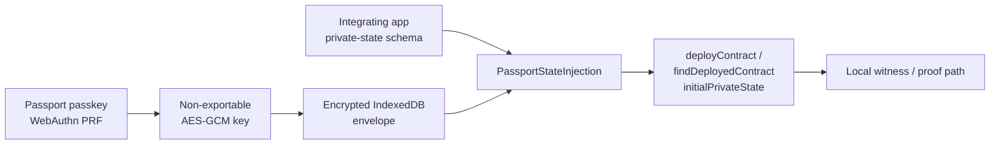

# Passport SDK Foundation

The initial Passport SDK solves one boundary only: securely persist and inject
application-owned private state into a Midnight contract join/deploy flow.
It does not own a wallet seed, act as a cross-chain bridge, or export witness
material.

## Packages and boundaries

| Surface | Role |
|---|---|
| `sdk/` | Encrypted private-state storage, WebAuthn PRF unlock, and typed injection helper. |
| `examples/passport-demo/` | Dynamic embedded-wallet validation and Passport UX reference. |
| `experiments/account-custody-prototype/` | Localnet-only proof of C1/C4 concepts. Not an SDK dependency. |

## Integration

```ts
import {
  EncryptedPassportPrivateStateStore,
  IndexedDbPassportEncryptedRecordStore,
  PassportStateInjection,
  WebAuthnPrfKeyProvider,
} from '@midnight-ntwrk/passport-sdk';

const scope = {
  appId: 'com.example.credit-app',
  accountId: passportAccountAddress,
};

const stateStore = new EncryptedPassportPrivateStateStore(
  new IndexedDbPassportEncryptedRecordStore(),
  new WebAuthnPrfKeyProvider(passkeyReference),
);

const { privateState } = await PassportStateInjection({
  store: stateStore,
  scope,
  initialPrivateState: appProvidedPrivateState,
});

await findDeployedContract(providers, {
  contractAddress,
  compiledContract,
  privateStateId: 'credit-scorer-private-state',
  initialPrivateState: privateState,
});
```

`PassportStateInjection` returns decrypted state after the configured key
provider unlocks it. The WebAuthn provider requires an explicit user gesture,
then may reuse its non-exportable key for one logical operation for at most 30
seconds. Integrations call `lock()` when that operation ends.

## Security rules

- A WebAuthn PRF output is immediately derived into a non-exportable AES-GCM
  key. The directly held output buffer is overwritten after derivation on a
  best-effort basis; JavaScript cannot guarantee complete memory zeroisation.
- The private-state object store contains only versioned ciphertext, IV,
  timestamp, and a hashed storage key. The demo's separate public-profile store
  contains account linkage and public deployment metadata in plaintext.
- AES-GCM additional authenticated data binds each record to its `appId` and
  `accountId`; copied ciphertext cannot decrypt under another scope.
- No SDK method exports, logs, syncs, or writes private state to
  `localStorage`. Cloud sync is intentionally absent from this release.
- `WebAuthnPrfKeyProvider` is browser-only. Native secure-store adapters are a
  separate platform implementation, not a browser fallback.

## Architecture



See the [architecture](architecture.md) and [roadmap](roadmap.md) before
adding a new SDK module.

## Related docs

- [Architecture](architecture.md)
- [Implementation roadmap](roadmap.md)
- [Why Passport cannot currently use only Dynamic](why-passport-needs-a-passkey-with-dynamic.md)
- [Dynamic capability matrix](dynamic-capability-matrix.md)
- [Client demo runbook](client-demo-runbook.md)
- [PWA feasibility report](pwa-feasibility-report.md)
- [Live validation log](validation-log.md)
- [External blockers](blockers.md)
