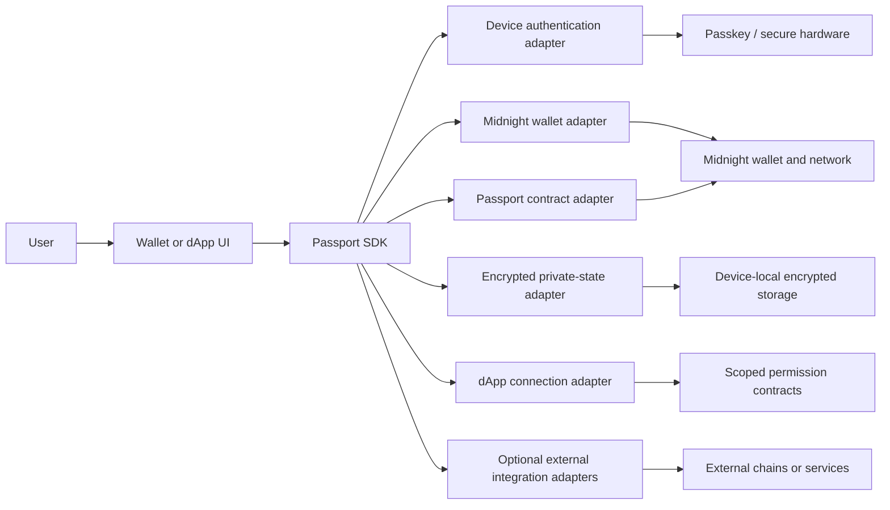
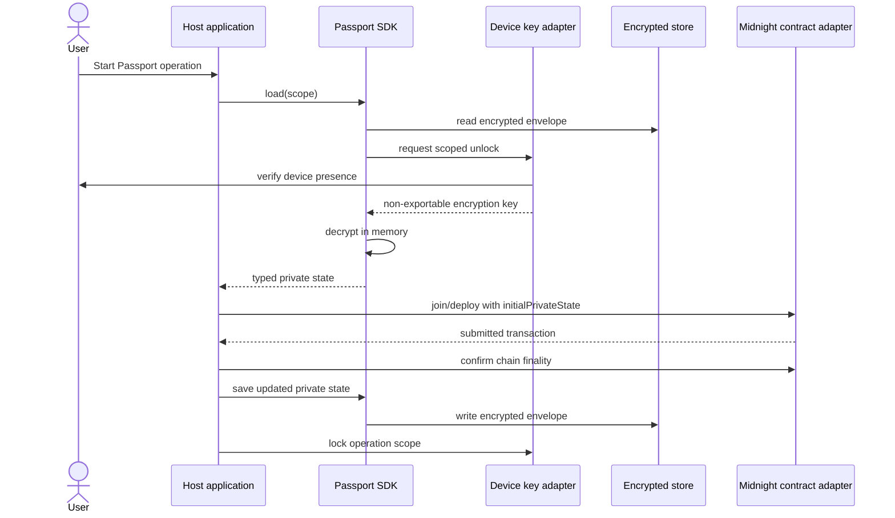

# Midnight Passport SDK Architecture

**Status:** Draft foundation

## Purpose

The Midnight Passport SDK is a headless TypeScript library that lets wallets
and dApps create, discover, unlock, and operate a Passport account. The SDK is
the reusable product surface. Any Passport portal or reference demo is one
consumer of that surface, not the owner of account logic.

The architecture starts with the narrowest security-critical capability:
private-state storage and controlled state injection. Account deployment,
wallet access, permissions, identity, recovery, and external settlement are
added as independent modules behind typed boundaries.

## Design goals

1. **Headless by default.** The SDK has no React dependency and renders no UI.
2. **Provider independent.** Wallet and authentication providers implement
   adapters; no provider becomes part of the Passport trust root by accident.
3. **Local secret custody.** Witnesses and decrypted private state do not cross
   a network boundary or enter general-purpose browser storage.
4. **Chain as authority.** Account, permission, identity, and transaction
   status are confirmed from Midnight state, not inferred from UI progress.
5. **Composable modules.** An integrator can adopt storage, account, wallet,
   permissions, or recovery features independently.
6. **Honest capability reporting.** Unsupported or dependency-gated features
   return a typed blocked state instead of a simulated success.
7. **Small stable surface.** Public APIs describe Passport concepts and hide
   provider-specific SDK objects behind adapters.

## System context



The dependency direction is one way: host applications import the SDK; the SDK
never imports a host UI. Provider packages may import SDK adapter types, but
core modules do not import provider packages.

## Layer model

| Layer | Responsibility | Must not do |
|---|---|---|
| Host application | User journeys, consent screens, accessibility, visual state | Reimplement cryptography or persist witnesses |
| Passport facade | Coordinates account lifecycle and returns typed results | Hide blocked capabilities or invent chain finality |
| Domain modules | Private state, account, assets, permissions, identity, recovery | Import React or provider-specific UI objects |
| Adapters | WebAuthn, IndexedDB, Midnight wallet, contracts, transport | Expand authority beyond the adapter contract |
| Midnight network | Authoritative account, asset, grant, identity, and transaction state | Depend on host application storage |

## Module boundaries

The target package layout is organized by capability. Initial files may remain
flat while the API is small; modules move into directories when a second
implementation or platform adapter makes that boundary valuable.

```text
sdk/
  src/
    core/             scopes, result types, errors, versioning
    private-state/    encrypted storage and state injection (C16, C7)
    account/          C1 deployment, discovery, and session lifecycle
    wallet/           address surfaces, balances, DUST, signing (C4)
    permissions/      scoped grants and dApp connections (C10, C11, C23)
    identity/         name resolution and account binding (C2, C3)
    recovery/         device loss and account recovery (C13, C14)
    adapters/         browser, native, wallet-provider, contract, transport
    index.ts          deliberate public exports only
  test/
  README.md
```

### Core

Core defines stable identifiers, capability states, errors, operation results,
and version negotiation. It contains no platform API calls. All other modules
depend on core; core depends on none of them.

### Private state

Private state owns encrypted persistence and the point where typed state is
made available to a Midnight join or deploy operation. The integrating app owns
its private-state schema. Passport owns scope isolation, envelope encryption,
storage lifecycle, and unlock policy.

The implemented foundation exposes:

- `PassportStateScope`
- `PassportPrivateStateStore`
- `PassportStateKeyProvider`
- `EncryptedPassportPrivateStateStore`
- `IndexedDbPassportEncryptedRecordStore`
- `MemoryPassportEncryptedRecordStore`
- `WebAuthnPrfKeyProvider`
- `PassportStateInjection`
- `joinWithPassportState`

### Account

Account will expose C1 deployment, discovery, version compatibility, session
restoration, and transaction lifecycle. It receives a contract adapter and a
private-state provider. It never assumes that wallet authentication alone can
produce the private witness required by a Compact circuit.

### Wallet

Wallet normalizes the three Midnight surfaces: unshielded, shielded, and DUST.
It exposes balances, signing capabilities, network identity, synchronization
state, and supported transfer operations through provider-neutral types.

### Permissions and connection

Permissions maps dApp requests to explicit scoped grants. The protocol-facing
module parses and validates requests; contract enforcement remains on-chain.
UI consent is supplied by the host application through callbacks or events.

### Identity and recovery

Identity resolves a human-readable account name to an authoritative contract
binding. Recovery manages device replacement and total-loss flows without
mixing social login with cryptographic recovery. Both modules remain separate
from the first storage release until their contract semantics are stable.

### External integrations

Cross-chain settlement, MPC, indexers, relays, and other services sit behind
capability adapters. An adapter reports `ready`, `degraded`, or `blocked` with
machine-readable requirements. The core release does not depend on any one of
these services to create or operate a Passport account.

## Trust and data boundaries

| State | Owner | Persistence | Exposure |
|---|---|---|---|
| Passkey private key | Platform authenticator | Authenticator-controlled | Never available to SDK code |
| PRF output | Passport key adapter | Memory for derivation only | Never logged, returned, or persisted |
| Derived encryption key | Passport key adapter | Non-exportable memory object | Private-state store only |
| App private state / witnesses | Integrating app + Passport operation | Memory while unlocked | Contract/proof boundary only |
| Encrypted state envelope | Passport private-state store | IndexedDB or injected encrypted store | Safe to persist; not self-describing plaintext |
| Passkey credential reference | Host public profile store | Device-local public metadata | May be stored; is not secret key material |
| Account contract, grants, identity | Midnight contracts | Midnight ledger | Public or shielded according to contract design |
| Wallet addresses and balances | Wallet provider + Midnight | Provider cache and chain | Returned only with user-approved wallet access |
| UI navigation and presentation | Host application | Ephemeral unless explicitly public | Never authoritative |

Authentication, wallet access, and Passport authority are distinct:

- A login session identifies a user to an application.
- A wallet adapter exposes wallet-native capabilities and Midnight addresses.
- A Passport device key unlocks encrypted private state and authorizes the
  witness path selected by the Passport account contract.

An adapter may implement more than one role, but the SDK does not treat one
role as proof of another without an explicit, validated capability contract.

## Private-state lifecycle



The application must not show an operation as complete at transaction
submission. Completion requires the contract adapter to confirm the expected
chain state or a final transaction receipt.

## Scope and encryption model

Each encrypted record is addressed by:

```ts
interface PassportStateScope {
  appId: string;
  accountId: string;
}
```

The SDK hashes a domain-separated scope to produce the record key. The same
scope is included as AES-GCM additional authenticated data. Copying a record to
another application or account scope therefore fails authentication.

Envelope versions are explicit. A future version adds a migration path instead
of silently interpreting old ciphertext. Unsupported versions fail closed and
leave the source record unchanged.

## Public API rules

1. Export interfaces and constructors intentionally from `src/index.ts`.
2. Do not expose provider SDK objects from a Passport domain result.
3. Use discriminated results for capability and transaction state.
4. Use structured error codes; messages are for developers, not branching.
5. Require an explicit scope for every private-state operation.
6. Require a user gesture for unlock, signing, grants, and recovery approval.
7. Keep experimental adapters under an experimental export until validated.
8. Never mark a submitted transaction as confirmed without chain evidence.

The target error taxonomy includes `USER_CANCELLED`, `KEY_UNAVAILABLE`,
`PRF_UNSUPPORTED`, `DECRYPT_FAILED`, `STATE_VERSION_UNSUPPORTED`,
`WALLET_UNAVAILABLE`, `NETWORK_MISMATCH`, `CONTRACT_NOT_FOUND`,
`TRANSACTION_REJECTED`, and `EXTERNAL_DEPENDENCY_BLOCKED`.

## Platform strategy

The first release targets modern browsers:

- WebAuthn PRF for a device-bound wrapping key;
- IndexedDB for encrypted envelopes;
- Web Crypto for HKDF and AES-GCM.

Native applications implement the same key-provider and record-store
interfaces using platform secure storage. The browser implementation is not a
fallback for native. Cloud synchronization is excluded until recovery,
rotation, revocation, and encrypted-envelope portability are specified.

## Testing and release gates

| Gate | Evidence required |
|---|---|
| Unit | Scope isolation, encryption round-trip, malformed envelope, wrong key, cancellation, version rejection |
| Browser | Real passkey enrollment/unlock, IndexedDB persistence, reload, account switch, origin mismatch |
| Contract localnet | C1 deploy/join, witness injection, operation finality, private-state loss behavior |
| Adapter conformance | Address surfaces, signing, network checks, capability reporting, pending transaction recovery |
| Security | No plaintext in persisted records/logs, dependency review, threat model, external audit before value-at-risk release |
| Compatibility | Supported browser/platform matrix and envelope migration fixtures |

No demo path is promoted to an SDK guarantee until it passes the corresponding
gate with a real provider and real chain state.

## Related design components

- [C1 account-custody contract](../plans/components/C1-account-custody-contract.md)
- [C4 asset-custody model](../plans/components/C4-asset-custody-model.md)
- [C7 witness handling](../plans/components/C7-witness-handling.md)
- [C16 wallet local storage](../plans/components/C16-wallet-local-storage.md)
- [C23 dApp connection protocol](../plans/components/C23-dapp-connection-protocol.md)
- [C25 cross-chain integration interface](../plans/components/C25-cross-chain-integration-interface.md)

Implementation order and exit criteria are tracked in the
[SDK roadmap](roadmap.md).
