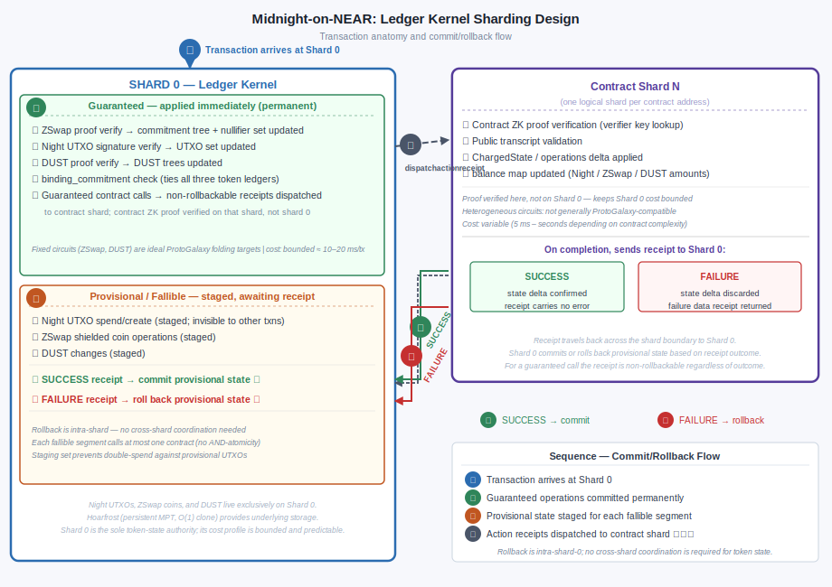
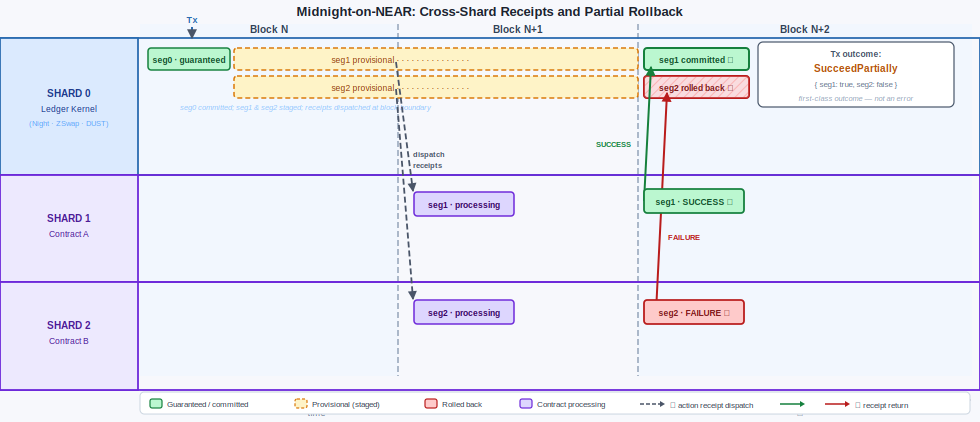

# 👱🤖 Midnight-on-NEAR: Ledger-Kernel Sharding Design

**Scope:** Speculative architectural design for mapping Midnight's transaction and intent model onto NEAR's sharded account/receipt model, using a dedicated shard 0 as the ledger kernel and shards 1–N for contract state. This is a design exploration, not an implementation proposal; all workload figures are order-of-magnitude estimates.

> ❓🤖 **SCRUTINY** — workload figures are derived from parameters in companion assessments, not from benchmarks of a NEAR-based implementation.

---

## 1. Transaction Anatomy Mapped to Shards

### 1.1 Recap: `StandardTransaction` structure

```
StandardTransaction
├── guaranteed_coins        ZswapOffer (transaction-level, guaranteed)
├── fallible_coins[N]       ZswapOffer (per-segment, fallible)
└── intents[N]: Intent
    ├── guaranteed_unshielded_offer   Night UTXO spend/create (guaranteed)
    ├── fallible_unshielded_offer     Night UTXO spend/create (fallible)
    ├── dust_actions                  DUST fee payment (guaranteed)
    ├── actions[]                     ContractAction array (both phases)
    └── binding_commitment            Pedersen binding (all three ledgers)
```

Segment 0 is not a separate intent — it is the **aggregate** of every intent's guaranteed portions plus `guaranteed_coins`.

### 1.2 Shard assignment by field

| Transaction field | Phase | Shard | Notes |
|---|---|---|---|
| `guaranteed_coins` (ZSwap) | Guaranteed | **Shard 0** | Commitment tree + nullifier set on shard 0 |
| `guaranteed_unshielded_offer` (Night) | Guaranteed | **Shard 0** | UTXO set on shard 0 |
| `dust_actions` | Guaranteed | **Shard 0** | DUST trees on shard 0 |
| `actions[]` — guaranteed contract calls | Guaranteed | **Shard 0 → Shard N** | Shard 0 dispatches non-rollbackable receipt; **contract ZK proof verified on shard N** |
| `fallible_coins[N]` (ZSwap) | Fallible | **Shard 0** (provisional) | ZSwap state on shard 0; held in provisional staging until segment outcome known |
| `fallible_unshielded_offer` (Night) | Fallible | **Shard 0** (provisional) | UTXO provisional until receipt returns |
| `actions[]` — fallible contract calls | Fallible | **Shard 0 → Shard N** | Shard 0 dispatches rollbackable receipt; **contract ZK proof verified on shard N**; awaits result before committing provisional token state |

### 1.3 Shard 0 is the sole state authority for all token flows

All three ledger-kernel token types — Night UTXOs, ZSwap shielded coins, DUST — live exclusively on shard 0. Contract shards hold **only** contract state (`ChargedState`, `operations`, `balance` map). This means:

- The provisional-state problem for fallible token operations is **intra-shard** on shard 0, not cross-shard. Shard 0 can stage provisional state in memory/staging and commit or roll back atomically once all receipts return.
- Contract shards never directly manipulate the commitment tree or nullifier set. Any transfer of value to/from a contract (e.g., updating `ContractState.balance`) is effected by a receipt from shard 0 to shard N carrying the updated balance value — a receipt that always succeeds (balance update is unconditional once token operations are confirmed).

### 1.4 Shielded contract-owned coins: always cross-shard

When a ZSwap output carries `contract_address: Some(addr)`, both shard 0 (commitment tree insertion) and shard N (balance map update) must be updated. Shard 0 always leads: it inserts the commitment first, then sends a guaranteed receipt to shard N to update the balance map. The receipt cannot fail because a balance map increment is unconditional.

---

## 2. Rollback and Provisional State

### 2.1 Rollback is always intra-shard-0 for token operations

Because all token state is on shard 0, provisional management for fallible segments requires no cross-shard coordination:

```
Transaction arrives at shard 0
    ├── Apply guaranteed operations immediately (permanent)
    ├── Stage provisional Night UTXO / ZSwap / DUST changes for each fallible segment
    ├── Dispatch action receipts to contract shards
    └── On receipt return:
        ├── SUCCESS → commit provisional state for that segment
        └── FAILURE → roll back provisional state for that segment
```



A segment's provisional Night UTXO / ZSwap nullifiers are held in a staging set, invisible to subsequent transactions until committed. Any incoming transaction that attempts to reference a UTXO in the staging set is rejected (standard double-spend prevention, now applied to provisional state).

### 2.2 Rollback scenarios

| Scenario | Shard 0 action | Shard N action |
|---|---|---|
| **Fallible contract call fails** | Roll back provisional Night/ZSwap/DUST state for segment N | Roll back contract state delta for segment N; send failure data receipt to shard 0 |
| **Guaranteed contract ZK proof invalid** | Abort entire transaction; roll back all provisional state | Reject receipt; send rejection notification to shard 0 |
| **Fallible ZSwap proof invalid** (submitted with invalid proof) | Reject transaction at submission (shard 0 validates all proofs on receipt) | Not reached |
| **Receipt timeout / shard N unreachable** | Roll back provisional state after timeout; mark segment failed | Depends on NEAR liveness guarantees; receipt is eventually processed or acknowledged lost |
| **Sequencing violation** (two segments call same contract out of order) | Shard N enforces per-transaction receipt ordering; second receipt rejected if guaranteed receipt has not preceded it | Reject out-of-order receipt; send failure notification |

### 2.3 The guaranteed contract call edge case

A guaranteed contract call produces a non-rollbackable receipt. If shard N rejects this receipt (ZK proof invalid, contract logic error), the transaction is treated as entirely invalid — not as a partial failure. This should not occur in practice with correctly generated client-side proofs, but the validation path must be defined:

- Shard N rejects receipt → sends hard-abort notification to shard 0
- Shard 0 rolls back ALL operations, provisional and committed (including the guaranteed segment's Night/ZSwap/DUST changes)
- The transaction is discarded from the mempool

This is the one case that requires guaranteed-state rollback on shard 0 and represents a protocol invariant violation.

### 2.4 Abstract ledger semantics: comparison with current Midnight

**Partial success is first-class in current Midnight.** `SucceedPartially { segment_success: Map<u16, bool> }` is an explicit, designed outcome. A transaction where segment 0 succeeds and segment 2 fails is valid and committed to the ledger — this is normal intended behaviour for multi-party and intent-based transactions, not an edge case. Midnight transactions are *not* atomic in any conventional sense.

**In current Midnight, provisional state is implicit.** The `apply` function runs all segments sequentially to completion before the resulting `LedgerState` is written back to storage. The caller only ever sees the fully resolved state; provisional state is working memory inside `apply` and never appears in the ledger. All segment outcomes are determined synchronously within a single block.

**In Midnight-on-NEAR, the same suppression principle applies, but its scope depends on receipt timing:**

| Property | Current Midnight | Midnight-on-NEAR — same-block receipts | Midnight-on-NEAR — cross-block receipts |
|---|---|---|---|
| Segment 0 | all-or-nothing; failure rejects whole tx | identical | identical |
| Segments 1…N | each independently succeeds or fails; `SucceedPartially` is normal | identical | identical |
| When outcomes are known | synchronously, within `apply`, single block | same | settlement lag of 1+ blocks per cross-shard hop |
| Provisional state visible to users? | never — implicit, internal to `apply` | never — same-block resolution | only if exposed; suppress-until-committed is the matching design |
| Abstract state structure | Night UTXOs + ZSwap + DUST + contract state | identical | identical (structure unchanged; latency added for fallible outputs) |

If receipts are resolved within the same block, the abstract ledger semantics are identical to current Midnight. If receipts span block boundaries, suppressing provisional state from the user-visible ledger is the correct approach to preserve matching semantics: fallible outputs simply carry a settlement lag of one or more blocks before they appear in the ledger, whereas guaranteed outputs remain immediately visible. This is a natural projection of the existing guaranteed/fallible distinction from circuit-level (where it lives today) to ledger-level.

The diagram below illustrates a concrete two-transaction scenario with cross-block receipts and a partial rollback:



---

## 3. Guaranteed vs Fallible in the Receipt Model

### 3.1 Receipt type mapping

| Midnight concept | NEAR receipt type | Semantics |
|---|---|---|
| Guaranteed contract call | Non-refundable action receipt | Commits on shard N unconditionally; hard-abort if proof invalid |
| Fallible contract call | Refundable action receipt | Commits on success; sends failure data receipt on failure |
| Balance map update (contract receives tokens) | Guaranteed action receipt | Always succeeds; no failure path |
| Failure notification | Data receipt (shard N → shard 0) | Triggers provisional-state rollback on shard 0 |
| Segment outcome acknowledgement | Data receipt (shard N → shard 0) | Triggers provisional-state commit on shard 0 |

### 3.2 Per-segment independence is preserved

Midnight's invariant — each segment balances independently — maps naturally onto the receipt model:

- Segment 0's token operations are committed on shard 0 before any fallible receipt is dispatched.
- Each fallible segment's token operations are staged separately on shard 0 and committed/rolled back independently when that segment's receipt returns.
- Segments do not share provisional state: segment 1 rolling back does not affect segment 2's provisional state.

### 3.3 The sequencing constraint across segments

Midnight spec: *"if two segments call the same contract, one must be purely guaranteed and the other purely fallible; transitivity is enforced across the full call graph."*

In the receipt model, shard N enforces this by tagging each incoming receipt with its `(transaction_id, segment_id, guaranteed_flag)`. For a given `transaction_id`, shard N processes:
1. Guaranteed receipt first (if present) — commits immediately
2. Fallible receipt second (after guaranteed is committed) — commits or rolls back

This ordering is achievable with NEAR's local receipt queue but requires that shard 0 dispatch guaranteed receipts before fallible receipts for the same contract within the same transaction.

---

## 4. Workload Estimate: Shard 0 vs Contract Shards

### 4.1 Shard 0 per transaction

| Operation | Cost estimate | Parallelisable? |
|---|---|---|
| ZSwap proof verification (guaranteed) | 5–10 ms (BLS12-381 pairing) | Yes — independent of DUST/Night |
| ZSwap proof verification (per fallible segment) | 5–10 ms each | Yes — segments independent |
| DUST proof verification | 3–5 ms (Poseidon-based, cheaper) | Yes |
| Night UTXO Schnorr verification | ~0.1 ms per input | Yes |
| Commitment tree insertions (ZSwap) | ~1 ms (O(outputs) × log-depth hash) | Partially (sequential tree updates) |
| Nullifier set insertions | ~0.1 ms (hash map, O(inputs)) | Yes |
| DUST trie operations | ~0.5 ms | Yes |
| Night UTXO trie read/write | ~1 ms (O(inputs + outputs)) | Yes |
| Provisional state staging | ~0.1 ms per fallible segment | Yes |
| Receipt dispatch | ~0.1 ms per unique contract shard | Yes |

**Shard 0 total (typical single-segment transaction):** ~10–20 ms dominated by ZK proof verification.

**Sustained throughput (shard 0, with parallel proof verification):**
- Single core: ~5–10 TPS
- 8-core parallel verifier (rayon/GPU offload): ~40–80 TPS
- 32-core: ~160–320 TPS

Shard 0 is the bottleneck for ZK-bearing transactions at high TPS. Its throughput ceiling is determined by proof verification hardware, not by trie I/O (which is fast relative to pairing operations).

> ❓🤖 **SCRUTINY** — these estimates use the ~5–10 ms BLS12-381 KZG pairing cost from `throughput-constraint-comparison.md`. Actual figures for a specific ZSwap circuit on target hardware require benchmarking.

### 4.2 Contract shard per receipt

Contract ZK proofs are verified on the contract's shard (shard N), not on shard 0. This is a deliberate design choice: it keeps shard 0's cost profile bounded and predictable (see §4.4) and distributes the verification workload across the shard space. Shard N must therefore hold the contract's verifying key — stored as part of `ContractState.operations` and replicated to all shard N validators.

| Operation | Cost estimate | Notes |
|---|---|---|
| Contract ZK proof verification | 5 ms – seconds | **Verified on shard N.** Depends entirely on circuit complexity; simple state updates cheap, complex multi-step circuits expensive |
| Public transcript application (state delta) | 0.5–2 ms (O(state_delta_size) trie writes) | Not re-execution — validators only apply the delta |
| Verifier key lookup | ~0.1 ms | Small, cached per contract |
| Return receipt construction | ~0.1 ms | Only on failure or balance update |

**Key observation:** contract shard workload is circuit-complexity–bound, not network-bound. Simple contracts (small circuits) are fast; complex contracts are slow. This distributes naturally: heavy contracts land on lightly loaded shards if contract addresses hash evenly across the shard space.

### 4.3 Workload balance summary

| Workload type | Lives on | Scales with | Bottleneck |
|---|---|---|---|
| ZK token proof verification | Shard 0 | TPS × proof cost | Pairing throughput (hardware) |
| UTXO/nullifier/commitment trie I/O | Shard 0 | TPS × trie depth | RocksDB/Hoarfrost I/O |
| Contract state I/O | Shard N | TPS × state delta × contracts | Shard N trie I/O |
| Contract ZK proof verification | Shard N | TPS × contract circuit complexity | Pairing throughput (per shard) |
| Receipt routing | Network | TPS × cross-shard messages | Network bandwidth |

Shard 0 becomes the TPS ceiling if the global commitment tree and nullifier set cannot be updated fast enough. The NEAR flat-storage pattern (noted in `modularity-comparison.md`) would reduce trie traversal cost for hot nullifier-set reads, which is the I/O-bound component.

### 4.4 Cost profile asymmetry

The two shard types have qualitatively different cost profiles, and this asymmetry is intentional.

**Shard 0: bounded and predictable.** Every ledger-kernel operation uses a fixed circuit: the ZSwap spend/output circuit, the DUST circuit, and Schnorr signature verification for Night UTXOs. These circuits do not vary with which contracts are called or how complex those contracts are. The per-transaction cost on shard 0 depends only on the number of ZSwap inputs/outputs and DUST spends — quantities bounded by the transaction size limit. The variation is narrow; hardware capacity can be provisioned reliably.

**Contract shards: wide and variable.** Circuit complexity varies by orders of magnitude across contracts and across contract versions over time. A simple counter-increment circuit takes milliseconds; a privacy-preserving multi-party computation or a complex AMM verification circuit may take seconds or longer. State delta size varies similarly. Shard N validators face workloads that depend on which contracts happen to hash to their shard and how those contracts evolve. This matches NEAR's existing validator model, where load balancing and dynamic resharding are already necessary.

Keeping contract ZK proof verification on shard N (rather than shard 0) is the mechanism that preserves shard 0's predictable cost profile. If contract proofs were verified on shard 0, shard 0 would inherit the full variability of the contract ecosystem.

### 4.5 ProtoGalaxy compatibility

ProtoGalaxy (and IVC folding schemes generally) work by accumulating *k* instances of the **same circuit** into a single proof whose verification cost is roughly that of verifying one instance. The requirement is circuit uniformity: all folded instances must share the same constraint system and verifying key.

**Shard 0 is highly compatible with ProtoGalaxy folding.** Every ZSwap spend in every transaction uses the same ZSwap circuit; every DUST spend uses the same DUST circuit. A block containing 100 ZSwap transactions yields 100 instances of the same circuit — a natural target for 100× folding. This is precisely the scaling lever identified in `throughput-hypotheses.md` as the critical path to 500+ TPS: folding reduces the per-transaction ZK cost on shard 0 without any changes to the transaction structure or user-facing protocol.

**Contract shards are not generally compatible with ProtoGalaxy folding.** Each deployed contract has its own circuit and verifying key. A block processed by shard N may contain receipts from ten different contracts, each using a different circuit — these cannot be folded together. The exception is a high-volume contract where many users call the same entry point in the same block: those instances could be folded. But this is a special case rather than the general one, and it requires the aggregator to detect and group uniform instances at block-building time.

The sharding design therefore concentrates the folding-friendly operations (fixed-circuit ledger proofs) on the shard most able to benefit from ProtoGalaxy, while accepting that the heterogeneous contract layer scales differently — horizontally across more shards rather than vertically through proof compression.

---

## 5. Intents and Atomic Operations as Receipts

### 5.1 The mismatch: one intent, potentially many shards

A single intent (`Intent<…>`) can contain `actions: Array<ContractAction>` targeting multiple contracts on different shards. A NEAR receipt targets exactly one account (one shard). The mapping is therefore:

> **One NEAR receipt per `(contract_address, segment_id)` pair**, not per intent.

An intent calling two contracts in its fallible portion produces two receipts to two shards. Both must succeed for the segment to commit.

### 5.2 Receipt topology for common use cases

**Simple single-user contract call (segment 0 only):**
```
Client → Shard 0: transaction (ZK proofs, DUST, Night UTXO)
Shard 0 → Shard N: guaranteed action receipt (contract call)
Shard N → Shard 0: acknowledgement (optional; success assumed unless abort)
```
Cross-shard latency: 1 receipt hop = 1 block delay (if different shards).
Same-shard: 0 additional latency (local receipt, same block).

**DEX / AMM with slippage guard (segment 0 fee + segment 1 swap):**
```
Client → Shard 0: transaction
Shard 0: commit guaranteed DUST fee immediately
Shard 0 → Shard M: guaranteed receipt (fee coordination, if any)
Shard 0 → Shard N: fallible receipt (swap contract)
  ├── SUCCESS: Shard N → Shard 0: commit provisional ZSwap state for segment 1
  └── FAILURE: Shard N → Shard 0: roll back provisional ZSwap state for segment 1
```

**Multi-party intent-bundled (solver pattern):**
```
Client → Shard 0: transaction (N intents, N fallible segments)
Shard 0 → Shard A: fallible receipt (solver 1)
Shard 0 → Shard B: fallible receipt (solver 2)
...
Each shard returns success/failure independently.
Shard 0 commits/rolls back each segment's provisional token state independently.
```

### 5.3 Atomicity properties

| Scope | Atomic? | Mechanism |
|---|---|---|
| Shard 0 guaranteed operations | ✅ Yes | Single shard, committed in one block |
| One fallible segment, one contract shard | ✅ Yes | Single receipt, atomic commit or rollback |
| One fallible segment, multiple contract shards | ⚠️ Partial | Each receipt atomic; cross-shard AND-atomicity requires callback coordination on shard 0 |
| Entire transaction across all segments | ❌ No | By design: partial success (`SucceedPartially`) is a valid outcome |
| Guaranteed + fallible together | ❌ No | By design: guaranteed commits before fallible resolves |

The "one fallible segment, multiple contract shards" case is the only non-trivially-atomic case. Shard 0 can enforce AND-semantics by staging the segment's provisional token state until **all** receipts for that segment return success. If any receipt fails, shard 0 rolls back the token state and sends compensating receipts to shards that succeeded (asking them to reverse their state delta). This compensating receipt is the one case that requires a rollback on a contract shard — and it requires the contract to support a "reverse delta" operation, which is not part of current Midnight's Kachina model.

### 5.4 Design choice: avoid AND-atomicity across shards

The cleanest design avoids multi-shard fallible segments entirely by **restricting each fallible segment to a single contract**. This is not a constraint in current Midnight but would be a design rule for this sharding model:

> Each fallible segment calls at most one contract (on one shard). Multi-contract interactions use chained receipts (the output of one contract's receipt triggers the next), preserving per-receipt atomicity without requiring compensating rollback.

This is consistent with NEAR's programming model (callbacks chain receipts) and avoids the compensating-rollback complexity entirely.

---

## 6. Open Questions

- **Same-shard transaction routing**: Can clients choose their submission shard to collocate their transaction with the contract shard, eliminating the cross-shard receipt hop for simple calls? NEAR's account model normally handles this by routing based on account ID hash.
- **Provisional state and mempool ordering**: How does shard 0 handle two transactions in the mempool that each provisionally spend the same UTXO? Standard first-confirmed-wins, but the provisional-state window needs bounded duration.
- **NIGHT in `ContractState.balance`**: As noted in the ledger notes analysis, whether NIGHT (as a ledger token) can appear in the contract balance map is unclear from current documentation. If it can, then NIGHT flows between the UTXO set (shard 0) and contract balance map (shard N) via the same guaranteed receipt mechanism as ZSwap contract-owned coins.

---

## Sources

- [midnight-ledger-notes (internal)](./midnight-ledger-notes.md) — intent and segment structure, use-case table, execution layout diagram
- [midnight-to-near-mapping (internal)](../assessments/midnight-to-near-mapping.md) — account mapping options A–H
- [throughput-constraint-comparison (internal)](../assessments/throughput-constraint-comparison.md) — ZK proof verification cost parameters
- [modularity-comparison (internal)](../assessments/modularity-comparison.md) — flat storage improvement, Hoarfrost portability constraints
- [near-scheduling (internal)](../assessments/near-scheduling.md) — NEAR receipt routing and cross-shard latency
- [NEAR data flow documentation](https://docs.near.org/concepts/data-flow/near-data-flow) — cross-shard receipt mechanics
