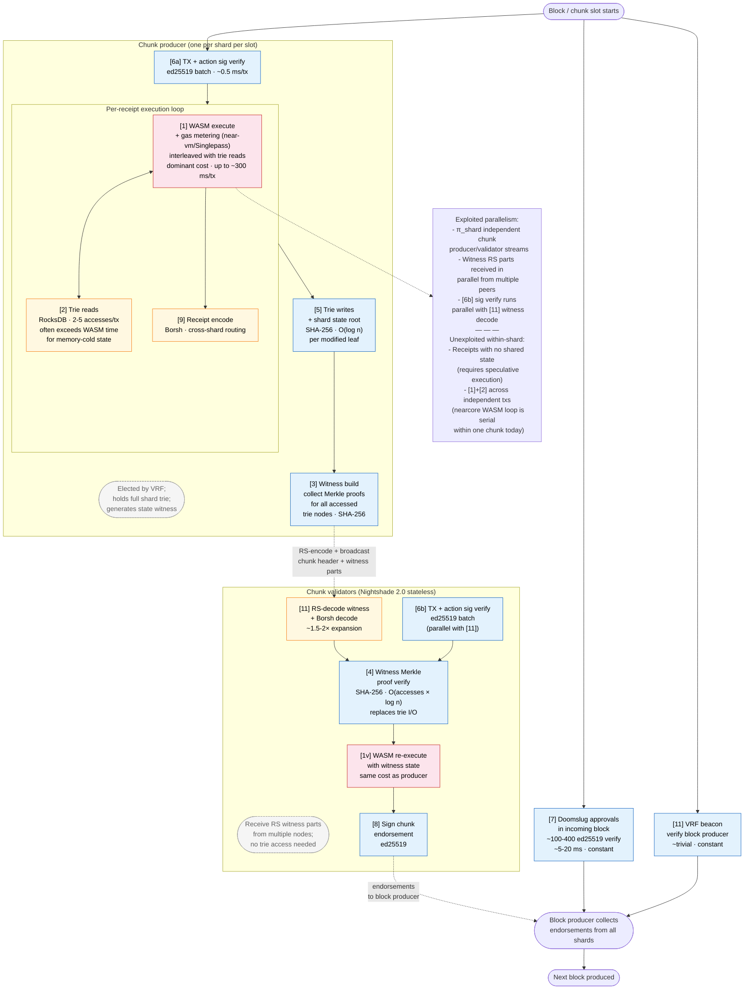
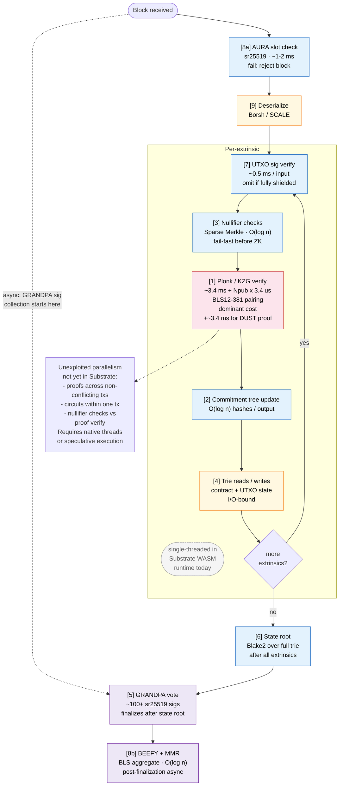

# 👱🤖 Throughput Constraints: NEAR Protocol vs. Midnight

**Scope:** This document analyses the architectural and implementation constraints on throughput for NEAR Protocol and Midnight using four distinct metrics and two derived ratios, and compares them. It is intended to inform the three-option evaluation framework by identifying the structural differences between the two chains' scaling models and their implications for a 500+ TPS ZK workload.

> [!NOTE]
> 
> ❓🤖**SCRUTINY — estimates require verification before use in decisions.** The quantitative figures in this document (TPS ceilings, byte rates, $\rho_\beta$ values, BB/s ranges) are derived from a combination of published benchmarks, protocol parameter research, and LLM-assisted analytical reasoning. Several figures were already revised once following cross-checking against nearcore release notes and the 1M TPS benchmark methodology. Further corrections are likely. Do not treat any number here as a measured result; treat it as an order-of-magnitude estimate pending instrumented validation.

---

## 0. Throughput Metrics

Throughput is not a single number. A chain can be fast at moving bytes while being slow at executing computation, or vice versa. Four primary metrics, two derived ratios, and two contextual measures are tracked throughout this document because they have different binding constraints and different implications for application design.

### 0.1 Primary Metrics

**$\beta_\text{txs}$ — Transaction-bytes per second (T-B/s)**
The rate at which actual transaction payload bytes reach the ledger. This is the "useful" throughput from an application perspective — the bytes carrying user-authored state transitions. $\beta_\text{txs}$ excludes all block infrastructure overhead: headers, signatures, proofs of consensus, and any protocol-internal data.

**$\beta_\text{blk}$ — Block-bytes per second (BB/s)**
The total rate of block data that participants must store and propagate, including all overhead: block and chunk headers, consensus signatures, VRF proofs, erasure-coding parity shards, cross-shard receipts, state witnesses, and finality justifications. $\beta_\text{blk} \geq \beta_\text{txs}$ always; a high ratio indicates that protocol overhead dominates bandwidth and storage requirements.

**$\gamma_\text{txs}$ — Per-transaction compute-milliseconds per second (T-ms/s)**
The rate at which work that scales explicitly with transaction count is performed by validators, measured as total execution time (in milliseconds) per second of wall-clock time. This includes all operations whose aggregate cost grows proportionally with TPS: WASM contract execution, ZK proof verification, digital signature checks, nullifier set lookups, and commitment tree updates. $\gamma_\text{txs} = 1000$ ms/s means one full CPU core is consumed by per-transaction work.

**$\gamma_\text{blk}$ — Block-level processing-milliseconds per second (BL-ms/s)**
The rate at which work that does **not** scale with transaction count is performed, measured as total processing time (in milliseconds) per second of wall-clock time. This includes: consensus authority checks (AURA slot verification, GRANDPA finality signatures, BEEFY commitments), state and extrinsic root hashing, and MMR updates. $\gamma_\text{blk}$ is approximately constant regardless of TPS, representing the fixed overhead floor of block production and verification.

### 0.2 Derived Ratios

**$\rho_\beta = \beta_\text{txs} / \beta_\text{blk}$ — Transaction payload fraction**
The fraction of block data occupied by actual transaction bytes. $0 < \rho_\beta \leq 1$; higher is better, indicating that most of the bandwidth cost is carrying user data rather than protocol overhead. A value of $\rho_\beta = 0.10$ means only 10% of what validators propagate and store is transaction payload.

**$\rho_\gamma = \gamma_\text{txs} / \gamma_\text{blk}$ — Per-transaction/block compute ratio**
The ratio of per-transaction compute to block-level fixed overhead. A high $\rho_\gamma$ means most node compute scales with transaction count; a low $\rho_\gamma$ means most compute is constant protocol overhead regardless of TPS. Unlike $\rho_\beta$, this ratio is not bounded by 1 — $\rho_\gamma > 1$ means per-transaction work already exceeds fixed block overhead at the observed TPS. Used here as a casual indicator of the relative weight of the two compute categories.

### 0.3 Contextual Measures

**$\Delta_\text{idle}$ — Network idle time (ms/s)**
The time per second that a validator node spends waiting on network I/O — blocked because the next block, chunk, or state witness has not yet arrived — rather than computing. Measured in ms/s for consistency with the $\gamma$ metrics. $\Delta_\text{idle}$ is the empirically observable complement of active computation: the three quantities $\gamma_\text{txs}$, $\gamma_\text{blk}$, and $\Delta_\text{idle}$ sum to approximately the slot budget. A high $\Delta_\text{idle}$ indicates the node is network-bound rather than compute-bound, and represents time that cannot be recovered by faster hardware alone.

**$\pi_\text{shard}$ — Shard parallelism (dimensionless)**
The number of independent compute streams executing in parallel across the network, each carrying its own $\beta_\text{txs}$, $\gamma_\text{txs}$, and $\gamma_\text{blk}$ budget. For single-chain protocols $\pi_\text{shard} = 1$; for sharded protocols aggregate throughput scales as $\pi_\text{shard} \times$ per-shard capacity. Node-level parallelism within a single shard (e.g. multi-core proof verification) can be captured by a separate $\pi_\text{core}$ factor if needed; for the purposes of this document $\pi_\text{shard}$ suffices.

### 0.4 Relationships and Constraints

These metrics are not independent:

$$\beta_\text{blk} \geq \beta_\text{txs} \quad \Leftrightarrow \quad \rho_\beta \leq 1$$

$$\gamma_\text{txs} + \gamma_\text{blk} + \Delta_\text{idle} \leq \frac{1000\ \text{ms}}{T_\text{block}} \quad \text{(compute and idle time fit within the slot budget)}$$

$$\beta_\text{txs} \leq \frac{(B_\text{max} - B_\text{overhead}) \times \pi_\text{shard}}{T_\text{block}}$$

The binding constraint on $\beta_\text{txs}$ can be either: the block byte budget, or the $\gamma_\text{txs}$ ceiling (the compute budget remaining after subtracting the constant $\gamma_\text{blk}$ floor). Because $\gamma_\text{blk}$ is approximately constant, the available per-transaction compute budget is $\text{slot budget} - \gamma_\text{blk}$; increasing TPS increases $\gamma_\text{txs}$ until this headroom is exhausted. $\Delta_\text{idle}$ does not directly cap $\beta_\text{txs}$ but reduces the compute budget available to both $\gamma_\text{txs}$ and $\gamma_\text{blk}$, and is the key indicator of whether a bottleneck is network- or compute-bound.

### 0.5 Architectural Preview

The sharpest contrast between NEAR and Midnight sits in the $\gamma_\text{txs}$, $\rho_\gamma$, and $\pi_\text{shard}$ rows:

| Metric | NEAR | Midnight |
|---|---|---|
| **$\beta_\text{txs}$** | Per-shard chunk payload × $\pi_\text{shard}$ / chunk time | Block payload / block time ($\pi_\text{shard} = 1$) |
| **$\beta_\text{blk}$** | Significantly > $\beta_\text{txs}$: erasure coding, cross-shard receipts, state witnesses | Modestly > $\beta_\text{txs}$: headers, GRANDPA justifications, BEEFY proofs |
| **$\rho_\beta$** | ~0.12–0.33 (overhead-heavy) | ~0.94–0.97 (payload-efficient) |
| **$\gamma_\text{txs}$** | ~1,000 ms/s per shard (gas budget = direct proxy for all per-tx work) | Dominated by ZK proof verification (~3.43 ms/tx; scales with TPS); also ZSwap ops, sig checks (see §2.2) |
| **$\gamma_\text{blk}$** | Validator set management, chunk endorsements, block aggregation; approximately constant per block | Consensus fixed overhead only: AURA, GRANDPA, BEEFY, state root (~5 ms/s constant; see §2.3) |
| **$\rho_\gamma$** | >> 1 at full gas saturation ($\gamma_\text{txs} \gg \gamma_\text{blk}$); workload-dependent | ~2 at current 3.3 TPS; rises linearly with TPS (ratio exceeds 1 even at low load) |
| **$\Delta_\text{idle}$** | Structurally elevated: chunk validators wait for state witnesses after header arrives | Driven by raw block propagation latency; lower structural floor |
| **$\pi_\text{shard}$** | 9 (mainnet), 70 (Dec 2025 benchmark); scales horizontally | 1 (single chain); no horizontal lever |

The sharpest contrast sits in the $\gamma_\text{blk}$ structure. On NEAR, $\gamma_\text{blk}$ is a small constant overhead per shard — the gas model already captures all per-transaction work in $\gamma_\text{txs}$. On Midnight, $\gamma_\text{blk}$ is similarly a small constant (AURA, GRANDPA, BEEFY, state root; ~5 ms/s), but $\gamma_\text{txs}$ is dominated by Plonk/KZG proof verification: ~3.43 ms per transaction, which at current 3.3 TPS gives $\rho_\gamma \approx 2$ — per-transaction work already exceeds fixed block overhead at low load. The Kachina/rehearsal model (see [midnight-architecture.md](../background/midnight-architecture.md)) means validators never re-execute WASM contract logic; they verify ZK proofs instead. This replaces Turing-complete re-execution with a fixed-cost cryptographic operation, but that cost is still a per-transaction $\gamma_\text{txs}$ charge, not a free operation.

---

## 1. NEAR Protocol

### 1.1 Per-Shard Chunk: $\beta_\text{txs}$ and $\gamma_\text{txs}$ Limits

Each shard chunk has two independent limits that cap different metrics:

**Bandwidth ceiling → $\beta_\text{txs}$**

- nearcore 2.0.0 sets a **1.5 MB per-transaction size limit** and a **4 MB cross-shard bandwidth cap** across two consecutive chunks (≈ 2 MB of transaction bytes per chunk on average); the December 2025 1M TPS benchmark empirically saturated each chunk at ~2 MB of token-transfer data
- At 2 MB/chunk × 9 shards ÷ 1 s, the $\beta_\text{txs}$ ceiling is **~18 MB/s** regardless of transaction type once the byte budget is saturated
- This is the **binding $\beta_\text{txs}$ constraint for large transactions** (e.g., ZK proofs at 5–15 KB): the number of transactions per chunk falls proportionally, but the byte ceiling remains ~2 MB

**Compute ceiling → $\gamma_\text{txs}$**

- 1 TGas ≈ 1 ms of contract execution (1 TGas = 10¹² gas units)
- Maximum gas per transaction: 300 TGas (~300 ms of SC execution)
- Chunk gas budget: ~1,000 TGas/s → $\gamma_\text{txs} \approx 1000$ ms/s per shard
- Consequence: a max-gas transaction allows only 3–4 transactions per chunk; a simple token transfer (≈1–5 TGas) allows hundreds
- With 9 shards, aggregate $\gamma_\text{txs} \approx 9000$ ms/s (nine parallel CPU cores of contract execution)

**Which $\beta_\text{txs}$ limit binds?**

| Transaction type | Binding $\beta_\text{txs}$ limit |
|---|---|
| Small, compute-heavy (smart contracts) | Gas / $\gamma_\text{txs}$ ceiling |
| Large, data-heavy (ZK proofs, blobs) | Chunk byte size |
| Crossover point | Approx. a few KB per transaction |

### 1.2 Shard Count: Multiplier Across All Metrics

- Each shard runs an independent chunk producer; $\beta_\text{txs}$, $\beta_\text{blk}$, and $\gamma_\text{txs}$ all scale approximately linearly with $\pi_\text{shard}$
- Mainnet (Nightshade 2.0): $\pi_\text{shard} = 9$
- December 2025 benchmark: $\pi_\text{shard} = 70$, ~1M TPS (token transfers only)
- Dynamic resharding is designed in but not yet deployed at scale
- **Architectural cap**: $\pi_\text{shard}$ is bounded by the ability to rotate the validator set (~300 nodes) across shards while maintaining a statistically secure random subset per shard. Hundreds of shards are theoretically possible; thousands are not.

### 1.3 Block and Chunk Time: Consensus Latency Floor

- Block production: ~1 second; chunk slot: ~600 ms
- Finality (Doomslug + finality gadget): ~1.2 seconds
- Floor is set by network round-trip time for the validator set (~200–400 ms global median); cannot be reduced below this without sacrificing decentralisation
- **Cross-shard receipts**: each cross-shard interaction requires one additional block (~1 second) of latency, one receipt carried in the destination chunk (adding to $\beta_\text{txs}$), and one refund receipt returning (adding again). DApps spanning multiple shards amplify both latency and $\beta_\text{blk}$ non-trivially.

### 1.4 Block Overhead: $\rho_\beta$ Is Workload-Dependent

NEAR's $\beta_\text{blk}$ exceeds $\beta_\text{txs}$ by a factor that varies substantially with workload. The overhead sources in descending order of typical magnitude:

- **State witnesses** (primary driver, Nightshade 2.0 stateless validation): distributed *separately* from the chunk body via Reed-Solomon erasure coding. Each witness is a set of Merkle proofs for every trie node accessed by the chunk's transactions. For token-transfer workloads (~8,000 transfers/chunk, each touching 2–3 accounts), witness data is ~1–2 KB per transfer — roughly 8–16 MB of witness data per 2 MB chunk, making $\beta_\text{blk} \approx 5$–$9 \times \beta_\text{txs}$. For ZK transaction workloads (~200 txs/chunk, each touching a small commitment set), witness data is proportionally far smaller — roughly 0.2–1× the transaction bytes — making $\beta_\text{blk}$ only modestly above $\beta_\text{txs}$.
- **Erasure coding of witnesses**: the witness data itself is Reed-Solomon encoded before propagation (~1.5× expansion), adding to the total validators must receive
- **Cross-shard receipts**: a transaction crossing a shard boundary generates at least two additional receipts (delivery + gas refund), each carried in chunk data; high cross-shard workloads amplify both $\beta_\text{blk}$ and latency
- **Chunk and block headers**: ~200–500 bytes per chunk header × 9 shards + block header; minor in absolute terms

$\rho_\beta$ is therefore strongly workload-dependent:
- **Token transfers**: $\rho_\beta \approx 0.10$–$0.15$ (state witness data dominates, ~6–9× transaction bytes)
- **ZK transactions**: $\rho_\beta \approx 0.40$–$0.60$ (few large transactions → small total witness footprint)

This has direct implications for validator bandwidth and storage: a node processing token-transfer traffic pays ~7–10× more in $\beta_\text{blk}$ than a node processing the same $\beta_\text{txs}$ of ZK transactions.

### 1.5 Trie I/O: $\gamma_\text{txs}$ Bottleneck for Chunk Producers

- State is a Merkle Patricia Trie partitioned across shards, stored in RocksDB
- Every transaction requires trie reads (proof of current state) and writes (updated root)
- Random-access RocksDB operations do not scale well as per-shard state grows
- For **chunk producers** (nodes that actually execute transactions), trie I/O is a major component of $\gamma_\text{txs}$ — it is often the dominant cost, exceeding WASM execution time for memory-cold state
- For **chunk validators** under Nightshade 2.0 stateless validation, trie I/O is replaced by witness Merkle proof verification, which reduces $\gamma_\text{txs}$ for validators but increases $\beta_\text{blk}$ (see §1.4)
- State rent (1 NEAR / 100 KB) limits per-account state growth but not aggregate network-wide trie depth

### 1.6 Validator Bandwidth and Gas Metering

- Chunk data must reach chunk validators before the next block slot; propagation raises $\Delta_\text{idle}$ and cannot be parallelised away
- At very high shard counts, validators assigned to multiple shards face proportionally higher bandwidth demands
- nearcore uses the `near-vm` runtime (a Wasmer 2.x fork with the Singlepass compiler backend), running WASM without LLVM optimisation; Singlepass compiles deterministically in a single pass to prevent JIT-bomb attacks but achieves lower throughput than LLVM for compute-heavy workloads; each host function call (state read/write, cross-contract call) incurs metering overhead that does not appear in $\beta_\text{txs}$ but consumes a fixed fraction of the $\gamma_\text{txs}$ budget not available to application logic

### 1.7 NEAR Quantified Estimates

| Workload | $\beta_\text{txs}$ (9 shards) | $\beta_\text{blk}$ est. (9 shards) | $\rho_\beta$ | $\gamma_\text{txs}$ (aggregate 9 shards) | $\gamma_\text{blk}$ per node |
|---|---|---|---|---|---|
| Token transfer (~250 bytes, ~72K TPS) | ~18 MB/s | ~110–160 MB/s | ~0.10–0.15 | ~9,000 ms/s (gas-bound) | Low |
| ZK transaction (~10 KB, ~1,800 TPS) | ~18 MB/s | ~35–50 MB/s | ~0.40–0.60 | ~200 ms/s (bandwidth-bound) | Moderate |
| Compute-bound (max gas) | ~7–9 KB/s | ~20–50 KB/s | ~0.15–0.45 | ~9,000 ms/s (gas-bound) | Low |

The 1M TPS benchmark ($\pi_\text{shard} = 70$, 600 ms blocks, token transfers only) empirically implies ~3.57 MB of transaction bytes per chunk — higher than the nearcore 2.0.0 limit of ~2 MB/chunk. At $\pi_\text{shard} = 9$ the standard 2 MB limit gives ~72,000 TPS for token transfers and ~1,800 TPS for 10 KB ZK transactions; both reach the same ~18 MB/s $\beta_\text{txs}$ ceiling. The binding $\beta_\text{txs}$ constraint shifts from the $\gamma_\text{txs}$ (gas) ceiling to the chunk byte ceiling as transaction size grows.

### 1.8 Validator CPU Cost Breakdown

❓🤖 **SCRUTINY** — the cost structure below is inferred from the NEAR node architecture documentation ([near-node-architecture-summary.md](../background/near-node-architecture-summary.md)), Nightshade 2.0 design (NEP-0509), and nearcore codebase knowledge. Relative costs are order-of-magnitude estimates not validated against profiling traces.

NEAR's fee model is a single-dimensional gas budget per chunk (§1.1), which already proxies all per-transaction CPU work as $\gamma_\text{txs}$. This section makes the internal cost structure explicit, with particular attention to the **chunk producer vs. chunk validator split** introduced by Nightshade 2.0 stateless validation.

**Block-level consensus** (constant per block, all validator nodes)

| Operation | Algorithm | Notes |
|---|---|---|
| Block header signature verify | ed25519 | Block producer signs the block header; validators verify on receipt |
| Doomslug approval message handling | ed25519 | ~100–400 approval messages per block, one per validator; block producer verifies sigs to establish quorum; all validators send and track approvals |
| Chunk endorsement aggregation | ed25519 batch | Block producer collects one signed endorsement per shard per chunk validator; included in block as proof of chunk availability |
| Block hash | SHA-256 | Over header fields; trivial |
| VRF proof verify (block producer election) | VRF (ed25519) | Produces randomness for chunk producer assignment; one VRF per block producer; verified by all nodes |
| Epoch boundary: validator rotation | Stake-weighted VRF | Infrequent (~every 12 h); expensive single event — stake re-ranking and shard assignment for the full validator set |

**Per-chunk: chunk producer** (scales with TPS; highest-cost validator role)

The chunk producer executes all transactions for its assigned shard and builds the state witness used by chunk validators.

| Operation | Algorithm | Notes |
|---|---|---|
| Transaction + action sig verify | ed25519 (batch) | One per transaction; can be batched across the chunk |
| WASM execution + gas metering | near-vm (Singlepass) | Dominant $\gamma_\text{txs}$ contributor; Singlepass-compiled, deterministic but lower throughput than LLVM for compute-heavy workloads; each host function call (state read/write, cross-contract call) incurs metering bookkeeping |
| Trie reads (RocksDB) | — | Non-cryptographic I/O; 2–5 random RocksDB lookups per transaction for hot contracts; can exceed WASM time for cold / large state |
| Trie writes + shard state root | SHA-256 | O(log n) hashes per modified trie leaf; produces the new state root committed to the chunk header |
| State witness generation | SHA-256 | Collect all trie nodes accessed during execution plus their Merkle sibling paths; witness size ≈ 1–2 KB × number of state accesses; dominates $\beta_\text{blk}$ for token-transfer workloads (§1.4) |
| Receipt routing + Borsh encode | — | Outgoing cross-shard receipts serialized and queued; inbound receipts decoded and dispatched; cost scales with cross-shard activity |

**Per-chunk: chunk validator** (Nightshade 2.0 stateless validation; replaces trie I/O with witness verification)

Chunk validators receive the chunk header and a state witness distributed via Reed-Solomon erasure coding. They re-execute transactions without accessing RocksDB.

| Operation | Algorithm | Notes |
|---|---|---|
| Reed-Solomon decode + Borsh decode | RS (non-cryptographic) | Reconstruct witness from ≥1/3 of RS-encoded parts; ~1.5–2× expansion factor in total distributed data |
| Witness Merkle proof verify | SHA-256 | Verify each trie node in witness against the pre-state root in the chunk header; O(accessed nodes × log n) hashes; replaces trie I/O |
| Transaction + action sig verify | ed25519 (batch) | Same as chunk producer; chunk validators independently verify all signatures |
| WASM re-execution (with witness state) | near-vm (Singlepass) | Re-execute all transactions using state values from the witness; same cost as chunk producer; verifies that the chunk producer's claimed output state root is correct |
| Chunk endorsement signing | ed25519 | One signature per validator per chunk, sent to the block producer |

**CPU cost hierarchy**

| Rank | Operation | Type | Who pays | Scales with |
|---|---|---|---|---|
| 1 | WASM execution + gas metering | Non-cryptographic compute | Chunk producer + validator | TPS (gas budget = direct proxy) |
| 2 | Trie reads (RocksDB random access) | Non-cryptographic I/O | Chunk producer only | TPS × state accesses/tx |
| 3 | State witness generation (Merkle proof collection) | Cryptographic (SHA-256) | Chunk producer only | TPS × state accesses/tx |
| 4 | Witness Merkle proof verification | Cryptographic (SHA-256) | Chunk validator only | TPS × state accesses/tx (replaces [2] + [3]) |
| 5 | Trie writes + shard state root | Cryptographic (SHA-256) | Chunk producer only | TPS × state modifications/tx |
| 6 | Transaction signature verification | Cryptographic (ed25519) | Chunk producer + validator | TPS |
| 7 | Doomslug approval message handling | Cryptographic (ed25519) | Block producer + all validators | ~constant per block (~100–400 sigs) |
| 8 | Chunk endorsement signing + aggregation | Cryptographic (ed25519) | Chunk validators + block producer | ~constant per chunk |
| 9 | Reed-Solomon encode/decode (witness distribution) | Non-cryptographic compute | All validators | ~constant per chunk (∝ witness size) |
| 10 | Receipt routing + Borsh encode/decode | Non-cryptographic | Chunk producer | Cross-shard TPS |
| 11 | VRF proof generation/verification | Cryptographic (VRF/ed25519) | Block/chunk producers | ~constant per epoch boundary |

Two structural choices produce this cost profile. First, WASM re-execution by both chunk producers and chunk validators means $\gamma_\text{txs}$ is paid twice per chunk — once by the producer and once distributed across the validator committee. There is no ZK proof that lets validators skip re-execution; correctness is established by majority agreement among independently re-executing validators. Second, the Nightshade 2.0 producer/validator split outsources the trie I/O burden from validators to bandwidth: validators pay witness Merkle proof verification (rank 4) instead of RocksDB access (rank 2 + 3), with the witness data (~6–9× the transaction bytes for token transfers) added to $\beta_\text{blk}$ as a direct consequence.

⚠️ **RISK — cross-shard receipt amplification**: A transaction crossing a shard boundary generates at least two receipts (delivery + gas refund), each processed in a subsequent chunk for the destination shard. DApps with deep cross-contract call trees spanning shards can generate receipt storms that consume a disproportionate share of the $\gamma_\text{txs}$ budget across multiple subsequent chunks, multiplying both latency and effective $\gamma_\text{txs}$ load beyond what simple TPS figures suggest.

### 1.9 Sequencing and Parallelism

❓🤖 **SCRUTINY** — the sequencing structure below is inferred from the Nightshade 2.0 design (NEP-0509) and NEAR node architecture documentation; it has not been validated against nearcore profiling traces or the actual node implementation.

The diagram maps the eleven cost-hierarchy operations (numbers in brackets) from §1.8 onto a sequencing graph for a single shard's chunk slot (~600 ms). **$\pi_\text{shard}$ independent copies of this graph run in parallel across all shards** — the per-shard diagram applies equally to each, and that shard-level parallelism is NEAR's primary scaling lever. Within each shard, the chunk producer and chunk validators execute concurrently; the block producer collects endorsements from all shards.



**Key observations:**

**NEAR has structural shard-level parallelism; Midnight does not.** The entire diagram above — chunk production, chunk validation, and endorsement flow — runs $\pi_\text{shard}$ times simultaneously, one independent copy per shard. This is NEAR's primary $\gamma_\text{txs}$ scaling lever. Within a shard, transaction processing is still largely serial (one receipt queue processed sequentially), but adding shards adds proportional capacity.

**Both producers and validators execute WASM ([1] and [1v]).** Unlike Midnight, where validators verify a ZK proof instead of re-executing, NEAR's correctness model requires re-execution by the validator committee. $\gamma_\text{txs}$ is therefore paid twice per chunk across the two roles — once by the producer building the chunk, and once distributed across chunk validators checking it. The Singlepass compilation (`near-vm`) means both sides run WASM at deterministic but sub-LLVM speed; for compute-heavy workloads such as ZK verifiers, this overhead is non-trivial. The fundamental double-execution cost remains.

**Nightshade 2.0 replaces trie I/O with witness verification for validators.** Operation [2] (trie reads from RocksDB) is the most I/O-constrained step for chunk producers and can exceed WASM time when state is memory-cold. Chunk validators replace [2]+[3] entirely with [4] (witness Merkle proof verification) — no RocksDB access, only SHA-256 hash chains against the witness. This reduces validator I/O at the cost of larger $\beta_\text{blk}$ (witnesses are 6–9× transaction bytes for token-transfer workloads; see §1.4).

**Trie reads and WASM execution are interleaved, not sequential.** WASM execution calls state-read host functions mid-execution; those trigger trie lookups that pause the WASM runner until the RocksDB read returns. The `<-->` double arrow in the diagram reflects this coupling: [1] and [2] are not independent steps but a single interleaved loop over state accesses within one receipt's execution. This makes it much harder to parallelise individual receipts within a shard compared to Midnight's proof-verify steps (which are logically independent per transaction).

**No ZK proofs anywhere in the pipeline.** Validity is established by majority agreement among independently re-executing validators, not by a cryptographic proof. This is structurally simpler to implement and avoids pairing-based computation, but it means the protocol cannot offer client-verifiable proofs of correct execution without a separate proof system layered on top.

**Witness availability is a critical path dependency.** Chunk validators cannot begin [4] or [1v] until they have received enough RS-encoded witness parts to reconstruct the full witness. Witness propagation latency directly contributes to $\Delta_\text{idle}$ for validators and is the key reason NEAR's $\Delta_\text{idle}$ is structurally higher than Midnight's (§3.1).

---

## 2. Midnight

### 2.1 $\beta_\text{txs}$: Block Size as the Binding Constraint

From the Midnight ledger cost model (`cost-model.md` in the [ledger spec](https://github.com/midnightntwrk/midnight-ledger/tree/main/spec)):

| Resource | Limit per block |
|---|---|
| Block size | 200,000 bytes (200 KB) |
| Compute budget (single-threaded) | 1 second |
| Proof verification | ~3.4 ms constant + ~3.4 μs/public input |

At a ~6-second AURA slot time:
- **$\beta_\text{txs}$ ceiling (block size)**: 200 KB ÷ ~10 KB per ZK transaction → ~20 txs/block → ~3.3 TPS → **$\beta_\text{txs} \approx 33$ KB/s**
- **$\gamma_\text{txs}$ ceiling (compute budget)**: 1,000 ms ÷ 3.4 ms/proof ≈ 294 proofs/block → ~49 TPS → $\beta_\text{txs} \approx 490$ KB/s (not binding at current block size)

**Block size is the binding $\beta_\text{txs}$ constraint.** This matches the diagnosis in [midnight-vs-near-tps.md](midnight-vs-near-tps.md): the bottleneck is block size, not the consensus protocol.

### 2.2 $\gamma_\text{txs}$: Per-Transaction Compute Is Dominated by ZK Proof Verification

Under the metric definitions in §0.1, $\gamma_\text{txs}$ captures all work whose aggregate cost scales with transaction count. Midnight's Kachina/rehearsal architecture means validators never re-execute WASM contract logic — contract execution happens entirely client-side during the rehearsal phase. There is no gas metering, no WASM sandbox, and no per-instruction execution overhead on the validator side. The per-transaction validator cost is instead almost entirely cryptographic:

- **Plonk/KZG proof verification** (dominant contributor): ~3.4 ms constant + ~3.4 μs/public input per proof, where the constant term covers a BLS12-381 pairing check and the per-input term covers Fiat–Shamir transcript hashing. ❓🤖 **SCRUTINY** (assumes $N_\text{pub} = 10$ public inputs per transaction): $\gamma_\text{txs}^\text{proof} \approx \text{TPS} \times (3.4\ \text{ms} + 10 \times 3.4\ \mu\text{s}) \approx \text{TPS} \times 3.43\ \text{ms}$. At current 3.3 TPS: ~11 ms/s; at the proof-verification ceiling (~49 TPS): ~168 ms/s ≈ 100% of the 167 ms/s slot budget.
- **DUST fee proof** (adds ~3.4 ms per transaction): every transaction paying fees in DUST incurs a second Plonk/KZG verification for the shielded DUST ZSwap spend. The effective per-transaction cost with DUST is ~6.86 ms. ❓🤖 **SCRUTINY**: $\gamma_\text{txs} \approx \text{TPS} \times 6.86\ \text{ms}$ for transactions with DUST fees; the proof-verification ceiling drops to ~24 TPS in this case.
- **ZSwap nullifier set checks** (secondary): O(log n) Poseidon/Blake2 hashes per shielded input; fast relative to ZK verification but non-zero and I/O-bound.
- **ZSwap commitment tree updates** (secondary): O(log n) hashes per shielded output.
- **Public UTXO signature verification**: sr25519/ed25519, one per unshielded input (~0.1–0.5 ms each); absent for fully shielded transactions.

The asymmetry with NEAR remains real but is now properly characterised: Midnight has no Turing-complete re-execution cost and no gas metering, but proof verification replaces it with a fixed-cost per-proof cryptographic operation that still scales linearly with TPS. Proof generation remains expensive client-side (seconds to minutes per transaction); the validator pays only for verification.

### 2.3 $\gamma_\text{blk}$: Block-Level Fixed Overhead

Under the metric definitions in §0.1, $\gamma_\text{blk}$ captures work that does not scale with transaction count. For Midnight, this is the set of consensus and bookkeeping operations that run once per block regardless of how many transactions it contains:

- **AURA slot authority check**: ~1–2 ms per block (sr25519 signature verification proving the block producer's right to this slot)
- **GRANDPA finality signatures**: ~1–5 ms per finality round, covering ~100+ sr25519 batch verifications; amortized over the blocks each round finalizes
- **State root computation**: Blake2 over the full Merkle-Patricia Trie after all extrinsics are applied; cost grows with trie depth but is bounded by total state entries (not transaction count per block)
- **Extrinsic root**: Blake2 Merkle root over the extrinsics list — O(n) hashes where n is the number of extrinsics; minor cost
- **BEEFY commitments + MMR append**: O(log n) hashes per block; approximately constant
- **Block header hash**: trivial

Total: approximately **3–8 ms per block** (~0.5–1.3 ms/s at a 6 s slot), a small fraction of the 167 ms/s slot budget. $\gamma_\text{blk}$ is dominated by GRANDPA when many signatures are batched, and by state root when the trie is large and deep, but neither approaches the per-transaction proof-verification cost in §2.2.

The 1,000 ms per-block compute budget (§2.1) is the **total compute budget** covering both $\gamma_\text{txs}$ and $\gamma_\text{blk}$. The available $\gamma_\text{txs}$ budget is approximately 167 ms/s minus $\gamma_\text{blk}$ (~5–8 ms/s constant), leaving ~159–162 ms/s for per-transaction work — consistent with the ~49 TPS proof-verification ceiling derived in §2.1.

**Proof granularity — per-transaction, not per-block (current deployment).** Each transaction carries its own ZK proof, one per circuit invocation (`ContractCall`) plus one for the ZSwap offer. The `proof_verify` call is therefore made once per proof per extrinsic, and $\gamma_\text{txs}$ scales linearly with TPS. The `midnight-aggregator` crate exists as an optional toolkit for folding many inner proofs into a single aggregated proof, and the proof-generation flow in `midnight-architecture.md` shows aggregation as an explicit branch ("Optional aggregation?"). In the current production deployment this branch is not taken by default. Full block-level aggregation — all transactions reduced to one proof verified once per block — is the theoretical end state: it would make $\gamma_\text{txs}^\text{proof}$ approximately constant regardless of TPS (effectively collapsing it into $\gamma_\text{blk}$), shifting the binding constraint entirely to $\beta_\text{txs}$. ProtoGalaxy k-folding (referenced in §2.6) is the mechanism for moving toward that end state incrementally.

### 2.4 $\rho_\beta$: Block Overhead Is Modest

Unlike NEAR, Midnight's single-chain architecture has high $\rho_\beta$ (low overhead):

- **No erasure coding**: single-chain blocks are replicated whole to all validators; no parity expansion
- **No cross-shard receipts**: all accounts are on the same chain; no receipt routing overhead
- **No state witnesses**: full nodes maintain the complete trie and verify directly
- **Headers and consensus overhead**: block header (~500 bytes), AURA seal (~64 bytes), GRANDPA justification (~2–4 KB per finalized block for ~100 validators), BEEFY/MMR commitment (~100–200 bytes)
- **SCALE encoding**: minor per-extrinsic overhead (~5–10 bytes)

For a 200 KB block of transaction data, total overhead is roughly 5–7 KB, giving $\rho_\beta \approx 0.97$. Midnight's single-chain design is significantly more bandwidth-efficient per transaction byte than NEAR's sharded design ($\rho_\beta \approx 0.10$–$0.15$ for token transfers; $\rho_\beta \approx 0.40$–$0.60$ for ZK transactions — see §1.4). The tradeoff is the absence of horizontal scaling.

### 2.5 No Sharding: Single-Chain Architecture

- Midnight is a single-chain Substrate node; all transactions compete for the same 200 KB block
- There is no shard multiplier available for $\beta_\text{txs}$, $\beta_\text{blk}$, or $\gamma_\text{txs}$
- Adding sharding to Substrate would require fundamental changes to the runtime model, state trie partitioning, and cross-shard receipt routing — none of which are on the current Midnight roadmap

### 2.6 Paths to Higher $\beta_\text{txs}$

Three levers are available within or adjacent to the existing architecture:

1. **Block size increase**: a 25× increase (200 KB → 5 MB) yields ~80 TPS ($\beta_\text{txs} \approx 800$ KB/s) before block propagation becomes the new $\beta_\text{blk}$ limit; $\rho_\beta$ remains near 1 but $\gamma_\text{txs}$ rises proportionally — at ~49 TPS the proof-verification ceiling is reached and $\gamma_\text{txs}$ saturates the compute budget (see §2.2). Note: the $\Delta_\text{diff}$ estimates for large blocks assume validators are configured with the kernel TCP parameters discussed in Appendix A; without `tcp_slow_start_after_idle = 0` and 8 MB socket buffers, the effective diffusion time at 5 MB is substantially higher than the theoretical estimate.
2. **ZK proof folding** (ProtoGalaxy k-folding, referenced in the NearFall Technical Specification): folding k proofs reduces per-transaction on-chain proof size by ~k×, relaxing the $\beta_\text{txs}$ byte constraint proportionally; also reduces $\gamma_\text{txs}$ by ~k× (each folded bundle requires only one Plonk/KZG verification shared across k transactions), removing the compute ceiling as well
3. **L2 rollup**: batches many transactions into a single L1 block entry, decoupling L2 $\beta_\text{txs}$ from L1 block size entirely (Paima rollup sequencer is one concrete candidate — see [paima-on-midnight.md](paima-on-midnight.md))

The combination of (1) + (2) likely reaches 500+ TPS without changing the consensus architecture.

### 2.7 Midnight Quantified Estimates

| Lever | $\beta_\text{txs}$ | $\beta_\text{blk}$ est. | $\rho_\beta$ | $\gamma_\text{txs}$ | $\gamma_\text{blk}$ |
|---|---|---|---|---|---|
| Current (200 KB blocks, 6s slot) | ~33 KB/s | ~35 KB/s | ~0.97 | ❓🤖 ~11 ms/s (~3.3 TPS × 3.43 ms/tx; ~7% of slot budget) | ~5 ms/s (AURA + GRANDPA + state root; ~3% of slot budget) |
| Larger blocks only (5 MB) | ❓🤖 ~490 KB/s | ❓🤖 ~530 KB/s | ~0.93 | ❓🤖 ~168 ms/s; $\gamma_\text{txs}$ ceiling binds at ~49 TPS; byte ceiling alone would allow ~833 KB/s | ~5 ms/s |
| Larger blocks + 10× folding (5 MB) | ❓🤖 ~8.3 MB/s (logical β_txs ceiling; ~833 KB/s actual) | ❓🤖 ~9.2 MB/s | ~0.90 | ❓🤖 ~285 ms/s at β_txs ceiling (83.3 bundles/s × 3.43 ms/bundle ≡ 833 logical TPS × 0.343 ms/tx; **~171% of the 167 ms/s 6-second slot budget** — exceeds compute ceiling); **γ_txs binds at ~472 logical TPS** (162 ms/s ÷ 0.343 ms/tx); β_txs ceiling of 833 logical TPS reachable only with slot time ≤ ~3.5 s or multi-core verification | ~5 ms/s |
| L2 rollup | L1-decoupled | L1-decoupled | — | Low (only settlement TPS) | ~5 ms/s |

### 2.8 Validator CPU Cost Breakdown

Midnight's fee model is multi-dimensional ([midnight-architecture.md](../background/midnight-architecture.md)): CPU time (proof verification and execution), I/O read time (state lookups and Merkle proofs), block bytes, storage writes, and **churn** (nullifiers and commitments generated per block). The sections below catalog the major CPU contributors on a validator node. The $\gamma_\text{blk}$ metric in §2.3 is the aggregate of all these; this section makes the internal structure explicit.

**Block-level consensus** (constant per block, ~constant CPU regardless of TPS)

| Operation | Algorithm | Notes |
|---|---|---|
| AURA slot authority check | sr25519 VRF / signature | Block producer proves right to produce this slot |
| GRANDPA vote signature batch | sr25519 batch verify | ~100+ sig checks per finality round; amortized over many blocks |
| BEEFY signed commitment | BLS aggregate or sr25519 | Per BEEFY round; for light-client / relayer support |
| Block header hash | Blake2 | Over header fields |
| Extrinsic root | Blake2 Merkle root | O(n) hashes over n transactions |
| State root recompute | Blake2 over Merkle-Patricia Trie | After all extrinsics applied; dominant trie cost per block |
| MMR append | Blake2 O(log n) | Appends block hash to Merkle Mountain Range for BEEFY proofs |

**Per-transaction: ZK proof verification** (dominant $\gamma_\text{txs}$ contributor; scales with TPS)

Each transaction carries one Plonk/KZG proof per circuit invocation. The `proof_verify(public_inputs: u64)` entry in `cost-model.md` captures the full cost (~3.4 ms constant + ~3.4 μs/public input). The constant term covers a pairing check on BLS12-381 (multi-scalar multiplication + ate pairing); the per-input term covers Fiat–Shamir transcript hashing and public input incorporation. A transaction with multiple contract call circuits carries multiple proofs, each billed separately.

**Per-transaction: ZSwap shielded layer** (secondary $\gamma_\text{txs}$ contributor)

ZSwap is Midnight's Zerocash-derived multi-asset privacy layer. For each shielded transaction the validator must:

- *Nullifier set check* (one per shielded input): look up the nullifier in a Sparse Merkle Tree and verify it has not been seen before; O(log n) Poseidon or Blake2 hashes at the current tree depth (~32 levels). Prevents double-spends.
- *Commitment tree insertion* (one per shielded output): append the new coin commitment to the incremental Merkle tree; O(log n) hashes. Produces a new tree root that becomes part of the next block's state.
- *Balance tag check*: verify that shielded inputs = shielded outputs + fee for each token type (the binding randomness / balance proof is covered by the ZK proof itself, but the host must verify the resulting binding equation holds).

These are trie operations backed by Hoarfrost (Midnight's content-addressed state store) and are I/O-bound as well as CPU-bound.

**Per-transaction: contract state application** (no WASM re-execution; non-trivial non-cryptographic cost; scales with TPS)

Validators do not re-execute contract logic. They receive the public transcript and apply it:

- Borsh-decode public transcript (the structured state delta)
- Read current contract state from Hoarfrost trie (O(log n) lookups)
- Apply transcript delta: field writes, map insertions/deletions, counter updates
- Recompute contract state root (Blake2 over updated trie nodes)
- Route `ContractCalls` list (check address exists, dispatch to pallet)
- Handle committed message passing between contracts (read/write commitment queue)

This is CPU-light and I/O-heavy relative to ZK proof verification.

**Per-transaction: public UTXOs** (cheapest transaction path)

For unshielded (public) UTXO transactions:

- Signature verification: sr25519 or ed25519, one per unshielded input (~0.1–0.5 ms each)
- UTXO set membership check: O(log n) trie lookup per input to verify the UTXO exists and is unspent
- Write new output UTXOs and tombstone spent inputs in trie

This path carries no ZK proof cost and is close to a standard UTXO chain in CPU profile.

**DUST fee operations** (adds one full ZSwap round trip per transaction)

DUST is itself a shielded ZSwap coin — spending DUST to pay fees incurs the full ZSwap cryptographic cost a second time on top of the main transaction payload:

- One additional Plonk/KZG proof verification for the DUST spend (~3.4 ms)
- One nullifier check for the DUST coin being consumed
- One commitment tree insertion for any DUST change output

Additionally, DUST generation (triggered by cNIGHT registration observed from Cardano via the mainchain follower) writes a new commitment to the DUST tree — a low-frequency trie write at the block level, not per-transaction.

**CPU cost hierarchy**

| Rank | Operation | Type | Scales with |
|---|---|---|---|
| 1 | Plonk/KZG proof verification | Cryptographic | TPS × proofs/tx |
| 2 | ZSwap commitment tree updates | Cryptographic (hash-based) | TPS × shielded outputs/tx |
| 3 | ZSwap nullifier set checks | Cryptographic (hash-based) | TPS × shielded inputs/tx |
| 4 | Trie reads/writes (contract + UTXO state) | Non-cryptographic I/O | TPS × state accesses/tx |
| 5 | GRANDPA signature batch | Cryptographic | ~constant per finality round |
| 6 | Block state root (trie hash) | Cryptographic | Transactions per block |
| 7 | Public UTXO signature verification | Cryptographic | Unshielded inputs/tx |
| 8 | AURA slot check + BEEFY/MMR | Cryptographic | ~constant per block |
| 9 | Borsh/SCALE serialization | Non-cryptographic | Transaction bytes |

Two design choices produce this profile. First, proof verification (rank 1) replaces smart contract re-execution: validators pay ~3.4 ms per circuit regardless of contract complexity but pay nothing for Turing-complete instruction execution — this cost appears in $\gamma_\text{txs}$ (per-transaction compute), not in $\gamma_\text{blk}$ (fixed block overhead). Second, DUST doubles the ZSwap cryptographic cost: every fee payment is itself a shielded ZSwap operation, so each transaction drives two nullifier checks and two commitment tree insertions beyond its main ZSwap payload.

⚠️ **RISK — churn budget interaction**: The cost model's "churn" dimension (nullifiers and commitments generated per block) implies a per-block budget on state growth rate, distinct from the CPU budget ($\gamma_\text{blk}$) and the byte budget ($\beta_\text{txs}$). Each shielded transaction generates at least two nullifiers (main input + DUST input) and two commitment insertions (main output + DUST change). At high shielded-transaction rates the churn budget may become binding before either the proof-verification CPU ceiling (~49 TPS) or the current block-size ceiling (~3 TPS). This interaction is not yet modeled in the metric framework above. ❓ SCRUTINY: the specific churn limits are not yet confirmed from `cost-model.md`.

### 2.9 Sequencing and Parallelism

❓🤖 **SCRUTINY** — the sequencing and parallelism structure below is inferred from the Substrate runtime model and Midnight architecture documentation; it has not been validated against profiling traces or the actual node codebase.

The diagram maps the nine cost-hierarchy operations (numbers in brackets) from §2.8 onto a sequencing graph. Solid arrows are data dependencies (must be sequential). Dotted arrows are either async/parallel relationships or potential parallelism not yet exploited.



**Key observations:**

**Consensus ops run on separate threads.** AURA (slot check), GRANDPA (finality voting), and BEEFY/MMR are consensus-layer operations that run alongside block execution rather than inside it. They contribute to $\gamma_\text{blk}$ but do not block — and are not blocked by — the per-extrinsic loop. GRANDPA's signature-collection phase begins as soon as the block arrives; the finality vote itself requires the state root (produced after all extrinsics run) before it can proceed.

**The diagram reflects the current per-transaction proof structure.** Each extrinsic carries its own ZK proof (one per circuit call); `proof_verify` is called once per proof inside the loop. If block-level proof aggregation were active — all transactions folded into a single proof verified once after the loop — node [1] would move outside the subgraph entirely and become a near-constant $\gamma_\text{blk}$ cost independent of TPS. The `midnight-aggregator` crate provides this capability optionally; ProtoGalaxy k-folding (§2.6) is the incremental path toward it.

**Within the per-extrinsic loop, all five steps are data-dependent.** Nullifier checks (3) must precede proof verification (1) as a fail-fast filter — a rejected nullifier avoids ~3.4 ms of ZK work for free. Commitment updates (2) cannot begin until the proof is accepted; trie writes (4) need the verified new state from (2). There is no step in the inner loop that can safely be skipped or reordered.

**The Substrate WASM runtime is the parallelism constraint, not the cryptography.** Substrate's `execute_block` processes extrinsics serially inside a single-threaded WASM sandbox. Transactions with no shared state (different nullifiers, different contract addresses) are logically independent and could be parallelised — but the runtime model does not expose this. Extracting proof verification into native parallel threads, or adopting a speculative execution model (execute in parallel, roll back on conflict), would require significant runtime changes or a move away from the Substrate WASM execution model.

**The three most valuable parallelism opportunities, in order:**
1. Proof verification across independent transactions — highest value because (1) is the dominant cost and independent transactions share no state
2. Multiple circuit proofs within a single transaction — proofs for different `CriticalSections` calls are independent of each other
3. Nullifier lookups concurrent with proof verification — nullifier checks are read-only trie accesses that do not affect proof verification; running them in parallel could overlap the I/O wait with ZK compute

**DUST doubles the cryptographic load invisibly.** The DUST fee payment is a shielded ZSwap coin embedded within the transaction kernel, not a separate extrinsic. Every transaction that pays fees passes through the (1) → (2) → (3) path twice without any indication of this in the extrinsic count. This makes the per-transaction $\gamma_\text{txs}$ estimate sensitive to the DUST model: transactions with no DUST component (if that is possible) would cost ~3.4 ms less.

---

## 3. Comparative Analysis

### 3.1 Constraint Structure Across All Metrics

| Metric | Midnight | NEAR |
|---|---|---|
| **$\beta_\text{txs}$** | Block size (single 200 KB limit, 6s slot) | Chunk size × shard count / chunk time |
| **$\beta_\text{blk}$** | Modest overhead; single-chain replication | High overhead; erasure coding, receipts, witnesses |
| **$\rho_\beta$** | ~0.97 (payload-efficient) | ~0.10–0.15 (token transfers); ~0.40–0.60 (ZK txs) |
| **$\gamma_\text{txs}$** | Dominated by ZK proof verification (~3.43–6.86 ms/tx incl. DUST; scales with TPS; see §2.2) | ~1,000 ms/s per shard (gas = direct proxy for all per-tx work) |
| **$\gamma_\text{blk}$** | Consensus fixed overhead only: AURA, GRANDPA, BEEFY, state root (~5 ms/s constant; see §2.3) | Validator set management, chunk endorsements, block aggregation; approximately constant per block |
| **$\rho_\gamma$** | ~2 at current 3.3 TPS; rises linearly with TPS (ratio > 1 even at low load) | >> 1 at full gas saturation ($\gamma_\text{txs} = 1{,}000$ ms/s $\gg$ $\gamma_\text{blk}$); workload-dependent |
| **Scaling model** | Vertical (larger blocks, proof folding) | Horizontal (add shards) |
| **Cross-tx coupling** | All transactions compete for same block | Transactions are shard-isolated |
| **ZK-native** | Yes — proofs are first-class ledger objects | No — ZK verification is a WASM smart contract call |
| **Cross-shard latency** | N/A (single chain) | +1 block per shard boundary |

### 3.2 Capacity for ZK-Sized Transactions

The table below asks a specific question: *given a workload of 10 KB transactions, what throughput ceiling does each chain face?* On Midnight these are native ZK proofs processed by the protocol's built-in verifier. On NEAR they would be opaque 10 KB blobs; ZK verification would have to be implemented as a WASM smart contract, consuming $\gamma_\text{txs}$ (gas) budget in addition to chunk byte space — so the NEAR TPS figures below are **byte-ceiling upper bounds**, not achievable ZK-verification throughput. The $\gamma_\text{txs}$ row captures the additional gas load; the binding constraint may shift from byte-limited to gas-limited depending on WASM verifier cost.

For 10 KB transactions on each chain:

| Dimension | Midnight (current) | Midnight (folding + 5 MB blocks) | NEAR (9 shards) | NEAR (70 shards) |
|---|---|---|---|---|
| Est. TPS | ~3 | ❓🤖 ~472 (γ_txs-limited at 6 s slot); ~833 ceiling if slot ≤ 3.5 s or multi-core | ~1,800 | ~14,000 |
| $\beta_\text{txs}$ | ~33 KB/s | ❓🤖 ~8 MB/s (logical; β_txs ceiling at ~833 logical TPS); ~472 KB/s achievable at γ_txs ceiling | ~18 MB/s | ~140 MB/s |
| $\beta_\text{blk}$ est. | ~35 KB/s | ~9 MB/s | ~35–50 MB/s | ~280–400 MB/s |
| $\rho_\beta$ | ~0.97 | ~0.90 | ~0.40–0.60 | ~0.40–0.60 |
| $\gamma_\text{txs}$ | ❓🤖 ~11 ms/s (aggregate) | ❓🤖 ~162 ms/s at γ_txs ceiling (~472 logical TPS); ~285 ms/s at β_txs ceiling (exceeds 6 s slot budget) | ~200 ms/s (aggregate upper bound) | ~1,500 ms/s (aggregate upper bound) |
| $\rho_\gamma$ | ~2 ($\gamma_\text{txs} > \gamma_\text{blk}$) | ❓🤖 ~32 at γ_txs ceiling (162 ms/s ÷ 5 ms/s) | Low (bandwidth-bound) | Low (bandwidth-bound) |
| Binding constraint | $\beta_\text{txs}$: block size (200 KB) | $\gamma_\text{txs}$: proof-verification ceiling at 6 s slot; $\beta_\text{txs}$ binds only if slot ≤ 3.5 s or multi-core | $\beta_\text{txs}$: ~2 MB/chunk byte limit | $\beta_\text{txs}$: ~2 MB/chunk byte limit |
| ZK-native | Yes | Yes | No (embedding required) | No (embedding required) |

### 3.3 Key Structural Asymmetries

**$\beta_\text{txs}$**: NEAR's throughput scales approximately linearly with shard count; Midnight's single-chain architecture has no equivalent lever. Sharding Substrate would be an architectural replacement, not an incremental upgrade.

**$\rho_\beta$**: Midnight's $\rho_\beta \approx 0.97$ is consistently high because it carries no state witnesses and no cross-shard receipts. NEAR's $\rho_\beta$ is workload-dependent: ~0.10–0.15 for token-transfer traffic (state witnesses dominate, roughly 6–9× the transaction bytes) and ~0.40–0.60 for ZK transaction traffic (fewer transactions per chunk means proportionally less total witness data). The gap is real but narrower for ZK workloads than the headline NEAR overhead figures suggest.

**$\gamma_\text{txs}$ and $\rho_\gamma$**: Both chains have non-zero $\gamma_\text{txs}$ under the metric definitions in §0.1. On Midnight, $\gamma_\text{txs}$ is dominated by Plonk/KZG proof verification natively in the protocol (~3.43 ms/tx); at current 3.3 TPS, $\rho_\gamma \approx 2$, already exceeding the constant block overhead at low load. On NEAR, the gas model is the direct proxy for $\gamma_\text{txs}$ across all per-transaction work; $\gamma_\text{blk}$ is a smaller constant component, giving $\rho_\gamma \gg 1$ at full gas saturation. The structural asymmetry that remains: NEAR's ZK verification must be implemented as a WASM smart contract consuming the $\gamma_\text{txs}$ gas budget, competing with the chunk gas ceiling ($\gamma_\text{txs}$ limit). Midnight's ZK verification is natively budgeted as part of the total per-transaction compute, with no WASM interpretation overhead. This means NEAR's effective ZK $\beta_\text{txs}$ may be further constrained by the $\gamma_\text{txs}$ gas ceiling consumed per ZK verification — the gas cost of running a ZK verifier in WASM is non-trivial and may make the $\gamma_\text{txs}$ ceiling (not the byte ceiling) the binding limit for NEAR ZK workloads.

**$\gamma_\text{blk}$**: Both chains use approximately 1 second of compute budget per block period. Midnight's $\gamma_\text{blk}$ (~5 ms/s) is a small constant consensus floor; the rest of the budget is consumed by per-transaction $\gamma_\text{txs}$ (ZK proof verification). NEAR's $\gamma_\text{blk}$ is similarly a small constant, with the bulk of per-block compute captured by $\gamma_\text{txs}$ (gas). Both chains have $\rho_\gamma \gg 1$ at any significant TPS, meaning per-transaction work dominates fixed overhead.

### 3.4 The 500+ TPS Question

For the NEARFall context (targeting 500+ TPS on a Midnight-style ZK workload):

- **Midnight path**: block size increase + ZK proof folding. Achievable within the existing Substrate architecture. The combination of 5 MB blocks and 10× ProtoGalaxy folding sets a β_txs ceiling of ~833 logical TPS, but at a 6-second slot $\gamma_\text{txs}$ at that ceiling is ~285 ms/s (83.3 bundles/s × 3.43 ms/bundle), which **exceeds** the 167 ms/s single-core slot budget. The γ_txs ceiling constrains achievable TPS to **~472 logical TPS** (162 ms/s ÷ 0.343 ms/tx) at 6-second slots; ~800+ TPS requires reducing the slot time below ~3.5 s or enabling multi-core proof verification. ❓🤖 **SCRUTINY**: an earlier version of this paragraph cited "~28 ms/s at ~83 TPS with 10× folding" — a unit error that applied the per-logical-tx cost (0.343 ms/tx) to the bundle rate (83.3 bundles/s) rather than the logical TPS (833 txs/s), understating γ_txs by 10×. $\rho_\beta$ stays high.
- **NEAR path**: ~1,800 TPS at 9 shards ($\beta_\text{txs}$ ceiling ~18 MB/s, derived from the empirical ~2 MB/chunk limit). However, this is the byte-bound ceiling assuming ZK verification is implemented as a low-gas precompile or host function. If ZK verification is implemented as a WASM contract consuming significant $\gamma_\text{txs}$ budget, the gas ceiling binds first and actual TPS falls well below 1,800. This is a non-trivial engineering problem distinct from the $\beta_\text{txs}$ question.

🧪 **HYPOTHESIS**: Midnight's $\beta_\text{txs}$ ceiling is well-modelled as

$$\beta_\text{txs} = \frac{B_\text{block}}{T_\text{block}} \cdot \rho_\beta \cdot k_\text{fold}$$

where $B_\text{block}$ is block size, $T_\text{block}$ is block time, $\rho_\beta$ accounts for overhead, and $k_\text{fold}$ is the folding multiplier. Validating this model against actual Midnight ledger measurements (see [midnight-vs-near-tps.md](midnight-vs-near-tps.md)) is a concrete near-term experiment.

---

## Appendix A: Kernel TCP Parameter Tuning for Validator Nodes

The $\Delta_\text{diff}$ estimates throughout this document assume that validator TCP connections are already at full congestion window (`cwnd`) when block transmission begins. This assumption holds only if the node's kernel is configured correctly. The default Linux TCP stack is optimised for sustained flows; it systematically under-performs for blockchain gossip, which is structurally bursty: validator connections are idle for most of each slot duration, then must transmit a full block as fast as possible. The settings below — drawn from NEAR's validator recommendations ([`near-kernel-params.sh`](../experiments/near-exploration/near-kernel-params.sh)) — address this and apply to any proof-of-stake validator node, including Midnight.

### A.1 The Root Cause: TCP Slow Start After Idle

```
net.ipv4.tcp_slow_start_after_idle = 0
```

**Default behaviour (value = 1).** When a TCP connection is idle for longer than one retransmission timeout (~200 ms on a well-tuned path), the kernel resets `cwnd` to its initial value (~10 segments ≈ 14.6 KB). On the next burst — the start of the next block — the connection re-ramps from 14.6 KB via slow start, doubling throughput each RTT until the steady-state `cwnd` is re-established.

**Impact on block propagation.** For a 100 ms cross-continental RTT:

| Congestion window after idle reset | RTTs to reach 1 MB cwnd | Added $\Delta_\text{diff}$ |
|---|---|---|
| 14.6 KB (initial, default) | ~7 RTTs | ~700 ms |
| Full steady-state cwnd (tuned) | 0 | 0 ms |

At 200 KB (current Midnight block size) the slow-start penalty is largely absorbed by the ample 6 s slot. At 5 MB blocks, 700 ms of ramp-up on top of ~400 ms of raw transmission time pushes $\Delta_\text{diff}$ to over 1 s — more than half of a 2 s slot, and a significant fraction even of a 3 s slot. **Setting `tcp_slow_start_after_idle = 0` prevents the `cwnd` reset and is a prerequisite for the $\Delta_\text{diff}$ estimates in this document to be valid at larger block sizes.** It should be applied to Midnight validators immediately, regardless of whether block size changes are planned.

### A.2 BBR Congestion Control + FQ Queuing Discipline

```
net.ipv4.tcp_congestion_control = bbr
net.core.default_qdisc          = fq
```

These two settings must be applied together. Classical Linux algorithms (CUBIC, Reno) back off aggressively on *any* packet loss, even loss caused by router bufferbloat rather than true link saturation. BBR (Google, 2016) instead maintains a model of the path's bottleneck bandwidth and RTT, keeping the pipe filled without treating loss as the sole congestion signal. On global inter-validator paths with variable buffering, BBR achieves 10–30% higher sustained throughput than CUBIC on the same hardware.

`fq` (Fair Queue) is required alongside BBR because BBR works by *pacing* packets — spreading them evenly rather than bursting a full `cwnd` at once. FQ enforces this pacing at the outgoing NIC queue. Without FQ, packets are burst-transmitted at line rate regardless of BBR's pacing decisions, causing BBR's bandwidth estimate to degrade. These settings benefit Midnight validators at any block size and have no downside.

### A.3 Socket Buffer Sizes

```
net.core.rmem_max = 8388608           # 8 MB maximum receive buffer per socket
net.core.wmem_max = 8388608           # 8 MB maximum send buffer per socket
net.ipv4.tcp_rmem = "4096 87380 8388608"   # min / default / max auto-tuned receive buffer
net.ipv4.tcp_wmem = "4096 16384 8388608"   # min / default / max auto-tuned send buffer
```

These set the kernel ceiling on per-socket buffer sizes and the auto-tuning range. The bandwidth-delay product (BDP) for a 1 Gbps link at 100 ms RTT is ~12.5 MB; a socket buffer smaller than the BDP prevents the kernel from keeping the pipe full. The Linux default cap is ~212 KB — adequate for small blocks, a hard bottleneck for large ones.

| Midnight block size | BDP fill requirement (1 Gbps, 100 ms RTT) | Default 212 KB buffer sufficient? |
|---|---|---|
| 200 KB (current) | Block transmits in ~1.6 ms; buffer rarely fills | Yes |
| 1 MB | Buffer fills within 1–2 ms of transmission start | Marginal |
| 5 MB | Buffer fills immediately; backpressure extends $\Delta_\text{diff}$ | **No — 8 MB needed** |

At 5 MB blocks, the 8 MB buffer setting from the NEAR script should be adopted. It is not necessary at current Midnight block sizes but should be treated as a pre-deployment prerequisite for any block size increase above ~1 MB.

### A.4 Remaining Parameters

```
net.ipv4.tcp_mtu_probing       = 1
net.ipv4.tcp_max_syn_backlog   = 8096
```

`tcp_mtu_probing = 1` enables detection of and recovery from TCP blackholes — routers that silently drop oversized packets without sending ICMP "fragmentation needed" responses. This is a robustness measure with no performance downside, relevant at all block sizes.

`tcp_max_syn_backlog = 8096` increases the maximum number of half-open connections. The default (512–1024) can be exhausted when a large validator set reconnects simultaneously after a chain upgrade or network partition, causing SYN drops and delayed reconnection. Raising this reduces recovery time after network events.

### A.5 Additional Parameters Not in the NEAR Script

These are relevant to Midnight's storage-heavy runtime (Hoarfrost/RocksDB-backed state trie) and not needed for NEAR's stateless validator model.

| Parameter | Suggested value | Reason |
|---|---|---|
| `vm.swappiness` | 1–10 | Prevents the kernel from evicting the RocksDB/Hoarfrost block cache to swap; swap eviction causes multi-second trie I/O latency spikes during block execution |
| `vm.dirty_ratio` | 10–20 | Limits dirty page accumulation; prevents burst write-back flushes that compete with trie writes for I/O bandwidth |
| `net.core.netdev_max_backlog` | 5000–10000 | Increases the kernel's NIC receive queue depth; prevents packet drops under burst ingress at high block sizes |
| `fs.file-max` + `ulimit -n` | 65536+ | Substrate nodes open many file descriptors (RocksDB SST files, peer sockets); the default 1024 limit triggers `EMFILE` errors under load |

### A.6 Summary: Apply Now vs. Apply at Larger Block Sizes

The "Scope" column indicates how the setting is applied in a Docker deployment. `--sysctl` settings are network-namespace-aware and can be specified in `docker run` or `docker-compose` without host changes; they take effect only at container start, not dynamically inside the container. "Host root (`sysctl.d`)" settings are global kernel parameters that must be written to `/etc/sysctl.d/` on the host machine (or equivalent) and are unaffected by anything inside the container.

| Setting | Apply to Midnight now? | Apply at 5 MB blocks? | Scope |
|---|---|---|---|
| `tcp_slow_start_after_idle = 0` | **Yes — immediately** | Yes | Docker `--sysctl` |
| `tcp_congestion_control = bbr` | **Yes — immediately** | Yes | Docker `--sysctl` |
| `default_qdisc = fq` | **Yes — immediately** | Yes | Docker `--sysctl` (Linux ≥ 4.18) |
| `tcp_mtu_probing = 1` | Yes (hygiene) | Yes | Docker `--sysctl` |
| `tcp_max_syn_backlog = 8096` | Yes (hygiene) | Yes | Docker `--sysctl` |
| `tcp_rmem` / `tcp_wmem` max = 8 MB (auto-tuning ceiling) | Not required yet | **Yes — prerequisite** | Docker `--sysctl` (Linux ≥ 4.15) |
| `rmem_max` / `wmem_max` = 8 MB (application buffer ceiling) | Not required yet | Yes — if node calls `setsockopt` explicitly | **Host root (`sysctl.d`)** |
| `vm.swappiness = 1–10` | Yes (trie I/O stability) | Yes | **Host root (`sysctl.d`)** |
| `vm.dirty_ratio = 10–20` | Yes (trie I/O stability) | Yes | **Host root (`sysctl.d`)** |
| `net.core.netdev_max_backlog` increase | Yes (hygiene) | Yes | **Host root (`sysctl.d`)** |
| `fs.file-max` increase | Yes (operational) | Yes | **Host root (`sysctl.d`)** |
| `ulimit -n` (open file descriptors) | Yes (operational) | Yes | Docker `--ulimit nofile=65536:65536` |

---

## Sources

- [Midnight ledger cost model — cost-model.md](https://github.com/midnightntwrk/midnight-ledger/blob/main/spec/cost-model.md)
- [nearcore 2.0.0 release notes — chunk size limits](https://github.com/near/nearcore/releases/tag/2.0.0)
- [NEAR NEP-0509: Stateless Validation](https://github.com/near/NEPs/blob/master/neps/nep-0509.md)
- [NEAR 1M TPS benchmark](https://cryptobriefing.com/near-protocol-1-million-tps-milestone/)
- [NEAR Protocol statistics 2026](https://coinlaw.io/near-protocol-statistics/)
- [NEAR 1M TPS detail](https://bitcoinethereumnews.com/tech/near-protocol-achieves-1-million-transactions-per-second-in-major-scalability-milestone/)
- [ZK rollup performance bottlenecks](https://arxiv.org/html/2503.22709v1)
- [near-node-architecture-summary.md](../background/near-node-architecture-summary.md) (internal)
- [midnight-architecture.md](../background/midnight-architecture.md) (internal) — primary source for §2.8 CPU breakdown
- [midnight-vs-near-tps.md](midnight-vs-near-tps.md) (this repository)
- [paima-on-midnight.md](paima-on-midnight.md) (this repository)
- [near-kernel-params.sh](../experiments/near-exploration/near-kernel-params.sh) (this repository) — source for Appendix A kernel parameter analysis

---

## Afterword: Quality Scrutiny

### 1. Sources Correspond to Retrievable URLs

The document has a `## Sources` section with 12 entries. Spot-checks:

- **Midnight cost model (`cost-model.md`)** — ✅ Accessible. Block size 200 KB, compute budget 1 s, proof verification ~3.4 ms + ~3.4 μs/input all confirmed verbatim.
- **nearcore 2.0.0 release notes** — ✅ Accessible. Both the 1.5 MB per-transaction limit and the 4 MB cross-two-chunk bandwidth cap confirmed exactly.
- **NEP-0509 (Stateless Validation)** — ✅ Accessible. Witness distribution via Reed-Solomon erasure coding confirmed; target witness size is ~16 MiB; formal name is "Stateless Validation Stage 0" not "Nightshade 2.0."
- **NEAR 1M TPS benchmark sources** (cryptobriefing.com, bitcoinethereumnews.com) — ✅ Accessible. Neither article provides per-chunk byte figures, transaction data sizes, or chunk saturation measurements — see §3.
- **`coinlaw.io/near-protocol-statistics/`** — ❓ Previously noted in this repository as a page whose numerical content could not be reliably extracted. Block time and finality figures require an independent source; see §3.
- **Appendix A kernel parameters** — ✅ The `near-kernel-params.sh` experiment file is confirmed to set all parameters described: `tcp_slow_start_after_idle=0`, `tcp_congestion_control=bbr`, `default_qdisc=fq`, 8 MB socket buffers, `tcp_mtu_probing=1`, `tcp_max_syn_backlog=8096`.

### 2. Internal Consistency

The document's metric framework (β, γ, ρ, π) is rigorously defined in §0 and applied consistently throughout. The binding-constraint analysis (block size binds for Midnight; byte ceiling vs gas ceiling for NEAR) is self-consistent and the quantitative derivations follow from the stated parameters.

One internal inconsistency: **§1.3 states "Block production: ~1 second; chunk slot: ~600 ms"** as if these are two different timings, but in Nightshade 2.0 the block production period and chunk slot period are the same (600 ms). The rest of the document (§1.7, tables, and the 1M TPS benchmark discussion) uses 600 ms correctly. The "~1 second" block production figure appears to be a legacy pre-Nightshade 2.0 figure that was not updated when the 600 ms figure was added.

A second consistency issue: §1.7 claims the 1M TPS benchmark "empirically implies ~3.57 MB of transaction bytes per chunk — **higher than the nearcore 2.0.0 limit of ~2 MB/chunk**." The document itself acknowledges this contradiction but does not resolve it. If the protocol limit is 4 MB across two consecutive chunks (~2 MB per chunk average), and the benchmark is claimed to exceed that limit, either the limit was relaxed for the benchmark, the 250-byte/tx size assumption is wrong, or the implied calculation is not a reliable benchmark figure. This unresolved tension is flagged in the document's own inline SCRUTINY note.

### 3. Accuracy Against Sources

- **Midnight cost model (200 KB, 1 s budget, 3.4 ms + 3.4 μs/input)** — ✅ All three figures confirmed verbatim from `cost-model.md`.

- **"1 TGas ≈ 1 ms of contract execution"** — ✅ Confirmed. The NEAR Nomicon states the gas limit of 10¹⁵ gas per second on minimum validator hardware, giving 1 TGas (10¹² gas) = 1 ms. Confirmed also in `background/near-node-architecture-summary.md`.

- **"Maximum gas per transaction: 300 TGas"** — ✅ Confirmed for the nearcore 2.0.0 era. ⚠️ **Currency note:** the nearcore 2.11.0-rc.1 release candidate (March 2026) raises this limit to **1 PGas (1,000 TGas)**. If this limit is removed, the current analysis of ZK verification gas costs (which treats 300 TGas as a blocker) requires revisiting. The 300 TGas figure is correct for the document's historical timeframe but is actively being superseded.

- **"Chunk gas budget: ~1,000 TGas/s"** — ✅ Confirmed. The genesis config constant `gas_limit = 1,000,000,000,000,000` = 1,000 TGas per chunk; with 600 ms blocks this is ~1,667 TGas/s, but the document's formulation as "1,000 TGas/s per shard" is the standard framing used in NEAR's own documentation.

- **"~2 MB of token-transfer data per chunk" (empirical benchmark saturation)** — ⚠️ **Not empirical.** Neither cited benchmark article provides per-chunk byte measurements. The 2 MB/chunk figure is derived from the nearcore 2.0.0 protocol limit (4 MB rolling cap across two consecutive chunks), not from measured benchmark data. The document itself acknowledges this gap at line 84–86 but presents the derivation as "empirically saturated," which overstates confidence. The correct characterisation is: *the protocol limit implies at most ~2 MB of transaction bytes per chunk; whether the benchmark reached this ceiling is unconfirmed.*

- **"Wasmer engine with JIT compilation (LLVM backend)"** — 🛑 **Incorrect; corrected above.** This claim appeared four times in the document (§1.6, §1.8 chunk producer table, §1.8 chunk validator table, §1.9 key observations) and has been corrected to `near-vm (Singlepass)`. The production NEAR WASM runtime is **`near-vm`**, a Wasmer 2.x fork that uses the **Singlepass compiler backend**, not LLVM. Confirmed by: the `wasmer-compiler-singlepass-near` and `near-vm-compiler-singlepass` crates; the nearcore architecture guide ("currently we use near-vm in production"); the Hacken 2023 nearcore security audit (which found a low-severity issue in the singlepass compiler); and NEAR's own contributions to Wasmer 2.2 specifically for the Singlepass backend. Singlepass is a single-pass assembly generator with no LLVM optimization — it compiles fast and deterministically (preventing JIT-bomb attacks) but achieves lower runtime throughput than LLVM-compiled code for compute-heavy workloads. The corrected text notes that the Singlepass overhead is non-trivial for compute-heavy workloads such as ZK verifiers.

- **NEAR block time: "~1 second" vs "~600 ms"** — ⚠️ Mixed. The official Nightshade 2.0 figures confirmed by the NEAR blog post are **600 ms blocks and 1.2 s finality**. The "~1 second" block production language in §1.3 reflects the pre-Nightshade 2.0 (pre-September 2023) timing and should read "~600 ms." The quantitative tables elsewhere in the document correctly use 600 ms. The legacy "~1 second" in §1.3 creates a confusing inconsistency for readers.

- **"~100–400 approval messages per block, one per validator"** — ⚠️ The framing conflates two distinct mechanisms. Doomslug **block approvals** come from the top-100 block producers only; the true range is ~67–100 per block (2/3 quorum to full set). **Chunk endorsements** come from the broader ~431 active validators (Nearblocks data). The upper bound of 400 is numerically close to the actual 431 but is attributed to block approvals when it actually represents chunk endorsements.

- **"~300 nodes" validator set** — ✅ Confirmed. The protocol parameter `default_num_chunk_validator_seats = 300` matches; the live figure (~431 total validators) exceeds this but the 300-node figure is accurate for the chunk validator seat count that determines minimum hardware requirements.

- **Kernel parameter recommendations (Appendix A)** — ✅ All confirmed in `near-kernel-params.sh`. The TCP parameter descriptions and recommendations are accurate.

### 4. Areas of Greatest Uncertainty

1. **Singlepass vs LLVM performance gap for ZK workloads.** The WASM runtime correction (Singlepass, not LLVM) is the most consequential accuracy issue. The document's assessment that NEAR's ZK verification "may make the γ_txs ceiling... the binding limit" is correct in direction, but the Singlepass overhead makes this problem quantitatively worse than an LLVM baseline would imply. How much worse is unknown without benchmarking a ZK verifier on nearcore's Singlepass runtime. A 2–5× WASM overhead versus native code is a common estimate for Singlepass on cryptographic operations, but this is not verified for Plonk/KZG specifically.

2. **The 300 TGas per-transaction limit change.** The limit is being raised from 300 TGas to 1 PGas in nearcore 2.11.0-rc.1. If ratified, the current analysis of ZK proof verification as a near-blocker (using most of the 300 TGas budget) becomes materially different. The document should note this as a near-term change to monitor.

3. **Per-chunk byte figures for the 1M TPS benchmark.** No cited source provides the actual bytes-per-chunk measured during the December 2025 benchmark. The document derives ~3.57 MB/chunk from assumed parameters, then notes this exceeds the ~2 MB protocol limit — but neither the assumed 250-byte/tx figure nor the 70-shard count nor the 600 ms block time is independently confirmed from the benchmark sources, only from secondary reporting. The document's own inline SCRUTINY markers accurately flag this, but the quantitative tables treat the derived figures as if they were measured values.

4. **NEAR mainnet shard count.** The document uses π_shard = 9 throughout for mainnet estimates. This figure has been noted as uncertain in the `midnight-vs-near-tps.md` Afterword (the actual count may be 4–6 depending on Nightshade 2.0 deployment state). All NEAR TPS estimates scale proportionally with π_shard.

5. **Witness size estimates (~1–2 KB per transfer → ~8–16 MB per chunk).** These are stated as estimates in §1.4 but are not directly sourced to the NEP-0509 spec or nearcore benchmarks. The NEP-0509 document provides sub-limits on total witness size (~16 MiB target maximum), which is consistent with, but does not confirm, the per-transfer size estimate.

### 5. Robustness of Primary Conclusions

1. *Midnight's binding constraint is block size (200 KB), not compute.* **Robust.** Directly verified from `cost-model.md`; arithmetic is internally consistent.

2. *NEAR's binding constraint for ZK workloads shifts from byte ceiling to gas ceiling.* **Robust in direction, uncertain in magnitude.** The qualitative conclusion (ZK verification consumes gas disproportionate to its byte cost) is correct. The Singlepass correction (§3 above) makes this problem worse than the document implies, strengthening rather than weakening the conclusion. The exact gas cost of a Plonk/KZG verifier on Singlepass WASM remains unquantified.

3. *NEAR's TPS scales approximately linearly with shard count; Midnight has no horizontal lever.* **Robust.** Architectural conclusion unaffected by the numerical uncertainties.

4. *The combination of 5 MB blocks and 10× ProtoGalaxy folding reaches ~472 logical TPS for Midnight at 6-second slots.* **Moderately robust.** Arithmetic is internally consistent given the cost model parameters. Preconditions (ProtoGalaxy BLOCKER, slot time reduction required for >472 TPS) are correctly noted. The ProtoGalaxy author attribution error ("Pearson et al.") noted in the companion `substrate-throughput-techniques.md` Afterword applies here too (the document cites "the NearFall Technical Specification" for ProtoGalaxy rather than the paper directly, so no incorrect attribution appears in this document).

5. *NEAR WASM execution runs "at near-native speed."* **Overstated.** The Singlepass compiler achieves lower runtime throughput than LLVM for compute-heavy workloads. "Near-native" is Wasmer's characterisation of its LLVM backend; it does not apply to Singlepass. This affects §1.8–1.9 and §3.4 where the compute analysis assumes LLVM-level execution speed.

6. *Appendix A kernel parameter recommendations are accurate and drawn from the NEAR validator script.* **Robust.** All parameters confirmed in the actual script file.
