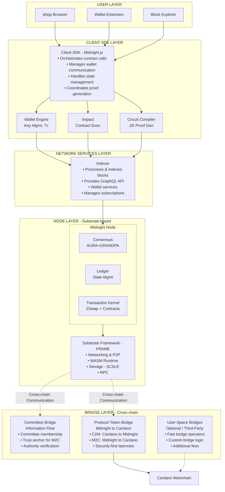
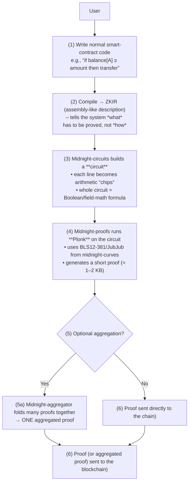
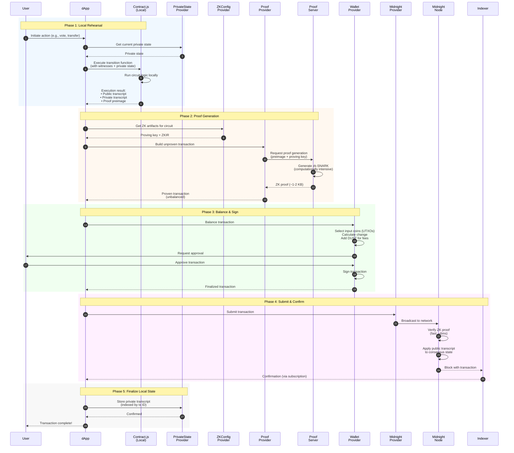
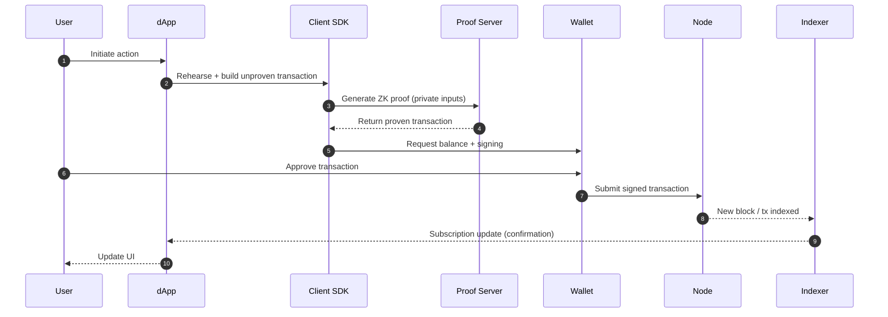
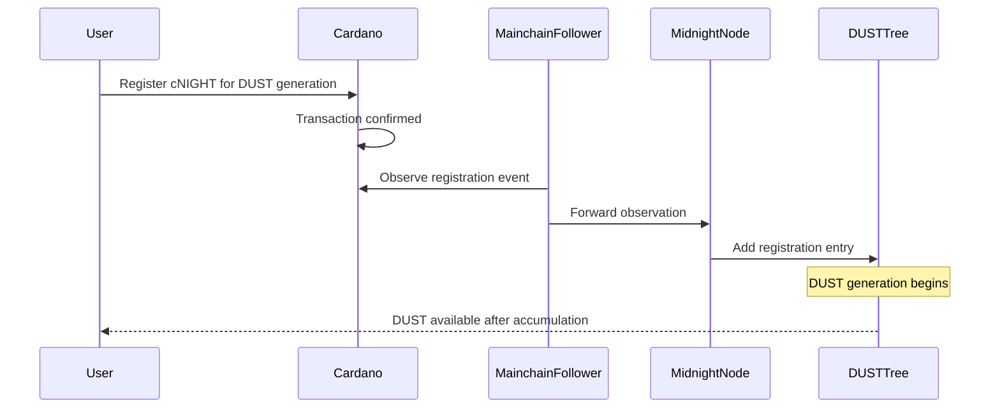

# Midnight Architecture Summary

> **Audience**: New developers onboarding to the Midnight platform  
> **Purpose**: High-level architectural overview with standard blockchain terminology

## What is Midnight?

Midnight is a **data protection blockchain platform** designed to enable confidential smart contracts with selective disclosure capabilities. Unlike traditional blockchains where all data is public, or privacy-focused chains where everything is hidden, Midnight enables **selective disclosure**—the ability to prove facts about data without revealing the data itself. This addresses the fundamental challenge of using distributed ledgers while maintaining privacy required for sensitive data, particularly in regulated industries like healthcare, finance, and government services.

The platform combines:

- **Substrate framework** as the foundational blockchain infrastructure (partner chain to Cardano)
- **Zero-knowledge proofs (ZK proofs)** for privacy preservation using zk-SNARKs
- **Smart contracts** with distinct public (on-chain) and private (off-chain) state
- **Native multi-token support** via a system called ZSwap for shielded transactions
- **A novel programming model** (Compact) for writing privacy-preserving contracts
- **Dual-token system** (NIGHT for governance/consensus, DUST for transaction fees)

### Built on Substrate

Midnight is built on **Substrate**, the modular blockchain framework from Parity Technologies (also used by Polkadot). This provides:

- Battle-tested networking and peer-to-peer communication
- WASM-based runtime for upgradability
- FRAME pallets for modular functionality
- Proven consensus mechanisms
- SCALE encoding at the storage layer

## Architecture Overview



## Core Components

### 1. Consensus Layer (AURA + GRANDPA)

Midnight uses Substrate's proven consensus mechanisms, operated by **Cardano Stake Pool Operators (SPOs)** who provide an actively validated service to Midnight.

#### Validator Model: Cardano SPOs as Midnight Validators

Midnight's validator set consists of **Cardano SPOs** who opt in to operate Midnight nodes as an additional service. This model is conceptually similar to **EigenLayer's restaking** approach:

| Aspect | Description |
|--------|-------------|
| **Validator Identity** | Cardano SPOs register to validate Midnight |
| **Security Derivation** | Leverages existing Cardano stake weight |
| **Block Production Rights** | Proportional to SPO's Cardano stake |
| **Economic Security** | SPO stake on Cardano secures Midnight operations |
| **Service Model** | Actively Validated Service (AVS) pattern |

**How it works:**

- SPOs register their Midnight node credentials on Cardano
- Block production slots are assigned proportionally to registered stake
- SPOs with more delegated ADA have higher probability of producing Midnight blocks
- This extends Cardano's economic security to Midnight without requiring separate stake

**Benefits of the SPO model:**

- **Inherited security**: Midnight inherits Cardano's $10B+ staked security
- **No cold-start problem**: Leverages existing, battle-tested validator infrastructure
- **Aligned incentives**: SPOs earn additional revenue from Midnight while their delegators benefit
- **Decentralization**: Cardano's ~3,000+ SPOs provide a large potential validator pool

#### Block Production: AURA (Authority Round)

- **Slot-based** block production with registered SPO validators
- Block production probability proportional to SPO's Cardano stake weight
- Provides predictable block times

#### Finality: GRANDPA (GHOST-based Recursive ANcestor Deriving Prefix Agreement)

- **Byzantine Fault Tolerant** finality gadget
- Finalizes chains of blocks rather than individual blocks (more efficient)
- Provides **deterministic finality** (once finalized, blocks cannot be reverted)
- Tolerates up to 1/3 Byzantine validators

This hybrid approach separates block production from finality, allowing for:

- Fast block production (AURA)
- Robust, efficient finality (GRANDPA)
- Resilience to network partitions

#### Bridging Proofs: BEEFY + MMR (implementation detail)

In the current Substrate-based node implementation, **BEEFY** and **MMR** components also appear alongside AURA+GRANDPA. These are commonly used to produce succinct, verifiable proofs of chain state/finality for relayers and cross-chain integrations. Conceptually:

- **BEEFY** provides signed commitments suitable for light clients / relayers
- **MMR (Merkle Mountain Range)** supports compact inclusion proofs over historical items

This does **not** replace AURA+GRANDPA; it complements them for interoperability.

### 2. Ledger & State Management

The ledger maintains the canonical state of the blockchain using **Persistent Merkle-Patricia Tries** stored in a content-addressed data store. Key features:

| Feature | Description |
|---------|-------------|
| **O(1) Cloning** | Efficient state snapshots for forks and rollbacks |
| **O(log n) Lookups** | Fast state queries and modifications |
| **Inclusion Proofs** | Cryptographic proofs that data exists in state |
| **Reference Counting** | Automatic cleanup of unused state data |

The state storage system is called **Hoarfrost** and enables:

- Contract state persistence
- Commitment trees for shielded transactions
- Nullifier sets to prevent double-spending

#### Hybrid Ledger Architecture

Midnight implements a **hybrid ledger model** that combines UTXO and account-based architectures, giving developers flexibility to choose the right model for their use case:

**Two Token Categories:**

- **Ledger Tokens**: Native UTXO-based tokens managed by the core protocol (e.g., NIGHT). Maximum efficiency, native privacy support, parallel transaction processing.
- **Contract Tokens**: Account-based tokens within Compact smart contracts (similar to ERC-20). Programmable logic, complex state management, familiar patterns.

**Privacy Options:**

Both categories support **shielded** (private) and **unshielded** (transparent) variants, creating four distinct token types. This enables "rational privacy"—selective disclosure where users choose when to be private rather than enforced anonymity.

**State Structure:**

- **ZswapChainState**: Manages shielded tokens and zero-knowledge commitments
- **ContractState**: Maps contract addresses to their account-based state
- **UTXO State**: Tracks unshielded UTXOs with ownership and value
- **Merkle Trees**: For coin commitments, DUST generation, and nullifier tracking

See [Appendix: Midnight's Ledger Architecture](#appendix-midnights-ledger-architecture) for detailed explanation of the token model and use cases.

#### Ledger host API and versioning (implementation detail)

In the Substrate node, the runtime interacts with the ledger via a **host API** (a bridge between the WASM runtime and native code). The ledger interface is **versioned**, allowing the node to select the active ledger implementation/version at build time.

### 3. Transaction Kernel

The **Transaction Kernel** is the heart of Midnight's execution model, handling:

- **Native currency (DUST)** management
- **ZSwap transactions** for privacy-preserving value transfers
- **Smart contract interactions** through the Impact interpreter
- **Contract-to-contract communication** with committed message passing

#### Transaction Structure

A Midnight transaction consists of:

```
Transaction
├── ZSwapOffer (shielded inputs/outputs)
│   ├── ZSwapInputs (nullifiers + proofs)
│   ├── ZSwapOutputs (commitments + proofs)
│   └── Balance mapping (token type → value)
├── CriticalSections (contract calls)
│   ├── ContractCalls (address + transcript + proof)
│   └── ContractDeploys
└── BindingRandomness
```

#### System transactions (implementation detail)

In addition to user-submitted transactions, the node also supports **system transactions** that are applied to the ledger with elevated privileges (intended for protocol/system maintenance flows). These are expected to be initiated by governance / root authority mechanisms.

### 4. ZSwap: Native Token System

**ZSwap** is Midnight's multi-asset privacy layer, inspired by Zcash's shielded transactions but extended for:

- **Multiple token types** (native tokens via "colored coins")
- **Contract-owned coins** (smart contracts can hold value)
- **User-defined tokens** (minted by contracts using their address hash)
- **DUST management** (fee resource uses ZSwap commitment/nullifier infrastructure)

Key concepts:

| Term | Definition |
|------|------------|
| **Coin** | A shielded UTXO with a type and value |
| **DUST** | Shielded, renewable network resource for transaction fees (generated from registered NIGHT; see [DUST Appendix](#appendix-deep-dive-into-dust)) |
| **Commitment** | Cryptographic hash hiding a coin's details |
| **Nullifier** | Unique identifier revealed when spending to prevent double-spend |
| **Merkle Tree** | Data structure proving coin existence without revealing details |

### 5. Smart Contracts: The Kachina Model

Midnight implements the **Kachina** programming model, which uniquely separates:

- **Public State**: On-chain, visible to all observers
- **Private State**: Off-chain, known only to the contract participant

#### How Contract Execution Works

1. **Rehearsal**: Client calls a transition function locally, generating:
   - Public transcript (what will go on-chain)
   - Private transcript (stored locally, indexed by transaction ID)
   - ZK proof that execution was valid

2. **Submission**: Transaction with public transcript + proof is submitted to the network

3. **Verification**: Nodes verify the proof without seeing private data

4. **Application**: When the transaction is confirmed:
   - Public transcript is applied to consensus state
   - Client applies private transcript to local state

This enables powerful privacy guarantees while maintaining verifiability.

### 6. Zero-Knowledge Proof System

Midnight‑ZK turns any program you’d normally run inside a smart contract into a tiny, verifiable certificate that the blockchain can check in microseconds, letting you keep computation off‑chain while still getting on‑chain security.

| Layer | What lives there | Why it matters |
|-----|------------|--------|
| (1)) Cryptographic Foundations	| Elliptic curves (BLS12‑381, JubJub) + polynomial commitments (KZG) | These give us the math tricks that let one tiny proof convince anyone else of a huge amount of work without revealing any secrets.
| (2) Proof Engine | Plonk (a SNARK‑style proving system) built on top of the curves above; includes recursion and aggregation tools | This is the “engine” that takes a description of a computation, runs it off‑chain, and spits out a compact proof that can be verified in a few hundred CPU cycles.
| (3) Application Glue | Circuit library, ZKIR parser, aggregator + smart‑contract interface | These turn ordinary program code (e.g., “transfer 10 tokens if balance≥X”) into the low‑level arithmetic that Plonk can chew, and then hook the proof back into the blockchain so the contract can trust the result.



#### Proof system implementation (midnight-zk) (implementation detail)

The `midnight-zk` codebase provides the core Rust implementation used for proving and circuit construction:

- **`midnight-curves`**: curve implementations used by the proof stack, including **BLS12-381** (via `blst` on supported architectures) and **JubJub**.
- **`midnight-proofs`**: a **Plonk** proving system using **KZG** polynomial commitments. It exposes a generic polynomial-commitment abstraction and includes features used for scalable proof composition:
   - **Committed instances** (an aPLONK-style variant) to support committing to instance data in ways that simplify recursion/aggregation workflows.
   - Optional **Fiat–Shamir challenge truncation** (to 128 bits) to reduce in-circuit scalar multiplication costs for recursive verification.
- **`midnight-circuits`**: a circuit toolkit (“standard library”) with reusable chips (field/curve arithmetic, hashing, membership checks, etc.) and an **in-circuit verifier gadget** for verifying Plonk proofs inside other circuits (proof recursion).
- **`midnight-aggregator`**: a toolkit for proof aggregation that produces an aggregation proof attesting to the validity of verifying many inner proofs (reducing verification overhead to a single proof).
- **`midnight-zkir`**: parser/tooling for **ZKIR**, a circuit intermediate representation expressed as an instruction program. It supports both off-circuit execution (e.g., deriving public inputs) and in-circuit enforcement of the same relation.

In the Substrate node codebase, proving/verification logic is primarily encapsulated in ledger dependency crates (e.g., the ledger/ZSwap libraries). The proof system switched to BLS12-381 in version 4.0.0.

#### What the blockchain does next

The heavy lifting (executing the full program) happens off‑chain; the chain only sees a small, cryptographically‑sound attestation that “the work was done correctly”. When a transaction is submitted:

1. *Verifier contract / pre‑compile:* A tiny on‑chain verifier (often just a few lines of Solidity/Rust) runs the Plonk verification algorithm using the public inputs you supplied (e.g., “the hash of the new state”). Because the proof is only ~1 KB, this verification costs a handful of gas/compute cycles – far cheaper than re‑running the whole program.
2. *State transition:* If the proof checks out, the contract updates its storage (balances, NFTs, etc.) exactly as if the original computation had been executed on‑chain. Otherwise the transaction is rejected.
3. *Block‑inclusion:* The proof is attached as a normal transaction payload.

#### Switch to BLS from Pluto/Eris

Midnight's proof system has transitioned from **Pluto/Eris** to **BLS12-381** curves with **Halo 2** using **KZG commitments**:

| Choice        | Rationale                                                       |
| ------------- | --------------------------------------------------------------- |
| **Halo 2**    | Plonk-based SNARK with recursive proof support, universal setup |
| **BLS12-381** | Industry-standard pairing-friendly curve, better performance    |
| **KZG**       | Faster verification (6ms vs 12ms), smaller proofs (5KB vs 6KB)  |

**Rationale**

The BLS12-381 migration provides better performance, uses standardized cryptography, and reduces architectural complexity while maintaining the security guarantees needed for privacy-preserving transactions.

| Factor | Pluto-Eris | BLS12-381 |
|--------|------------|--------|
| **Trusted Setup** | Requires custom ceremony | Existing standardized setup |
| **Cryptography** | Non-standard | Standard, well-tested |
| **Verification Time** | 12ms per proof | 6ms per proof |
| **Proof Size** | 6KB per proof | 5KB per proof |
| **Maintenance** | High complexity | Lower complexity |
| **Recursion** | Smaller circuits, higher CPU | Larger circuits, lower CPU |

## Developer-Facing Components

### Proof Server

The **Proof Server** is a critical component for generating zero-knowledge proofs locally before submitting transactions to the network:

**Architecture**:

- Runs as a standalone service (default port 6300)
- Can be deployed locally, on trusted infrastructure, or in cloud environments
- Communicates with dApps and wallet extensions to generate proofs
- Handles cryptographic material and circuit execution

**Key Responsibilities**:

- Generates ZK-SNARKs for transaction validation
- Processes proof data (inputs, outputs, public/private transcripts)
- Fetches cryptographic key material for proof generation
- Turns transactions with proof preimages into fully proven transactions

**Privacy Considerations**:

- Receives private data including token ownership details and private contract state
- Should only be accessed locally or over encrypted channels to trusted infrastructure
- Users maintain control over their private data during proof generation

**Deployment Options**:

- **Local**: Run on developer's machine for maximum privacy
- **Trusted Server**: Deploy on controlled infrastructure with encrypted access
- **Containerized**: Available as Docker image for easy deployment

The proof server enables Midnight's light-client model where computationally intensive ZK proof generation happens off-chain, while verification on-chain remains fast and efficient.

### Client SDK (Midnight.js)

**Midnight.js** is a TypeScript-based application development framework for the Midnight blockchain. Similar to [Web3.js](https://web3js.org/) for Ethereum or [polkadot.js](https://polkadot.js.org/) for Polkadot, it provides utilities for:

- Creating and submitting transactions
- Interacting with wallets
- Querying for block and contract state information
- Subscribing to chain events

Because of the privacy-preserving properties of the Midnight system, Midnight.js also contains several **unique utilities**:

- Executing smart contracts locally ("rehearsal")
- Incorporating private state into contract execution
- Persisting, querying, and updating private state
- Creating and verifying zero-knowledge proofs

Midnight.js **orchestrates all required interactions** among the various Midnight system APIs needed to create and submit a transaction to the blockchain. These APIs include an indexer, a proof server, a private state store, a Midnight node, a wallet, the ledger, the Compact contract runtime, and a cryptographic artifact repository.

#### Contract Integration

When a developer compiles a Compact smart contract with `compactc`, they obtain two files:

**1. JavaScript Executable (`contract.js`)**

Contains:

- The execution logic for each circuit in the source contract
- Logic for constructing the contract's initial state
- Utilities for converting on-chain contract state into a JavaScript representation

Midnight.js uses this file at runtime to execute circuits locally. The circuit execution results are then used to create transactions.

**2. TypeScript Declaration File (`contract.d.ts`)**

Contains:

- A type definition for the contract, named `Contract`
- A type definition for any circuits defined within the contract
- A type definition for all required witnesses, named `Witnesses`
- A type definition for the contract's on-chain state, named `Ledger`

Midnight.js uses the TypeScript declaration file at compile time to ensure the contract is consumed in a **type-safe manner**. Circuit argument and return types are inferred from the declaration file and used as generic constraints throughout the SDK.

```
compactc mycontract.compact
    │
    ├──► contract/index.cjs      (JavaScript executable for local rehearsal)
    ├──► contract/index.d.cts    (TypeScript declarations for type safety)
    └──► managed/
         ├── <circuit>.zkir      (ZKIR for each circuit)
         ├── <circuit>.pk        (Proving key)
         └── <circuit>.vk        (Verifying key)
```

#### Witnesses and Private State

If the Compact source code includes `witness` declarations, the generated TypeScript declaration file defines a `Witnesses` type as a non-empty object with a generic type parameter `PS`, representing the **private state** that witnesses modify during circuit execution.

**Witnesses** are private computations performed only on the end user's device. The name and type signature of a witness is declared in Compact source; the application developer provides a TypeScript implementation of that witness to use for circuit execution.

```typescript
// Example: Witness implementation for a voting contract
const witnesses: Witnesses<PrivateState> = {
  // This witness checks local state and returns a vote eligibility proof
  getVoterEligibility: (privateState) => {
    // Private computation - never leaves user's device
    return privateState.registrationProof;
  }
};
```

The user must supply an implementation of `Witnesses` to a `Contract` to execute a circuit.

#### The Rehearsal Model

**Rehearsal** is the critical concept that makes Midnight's privacy model work. Unlike traditional blockchains where smart contracts execute on-chain, Midnight contracts execute **locally first**:

1. **Local Execution**: The dApp calls a contract transition function using the JavaScript executable
2. **Dual Transcript Generation**: 
   - **Public transcript**: What will go on-chain (state changes, commitments)
   - **Private transcript**: Stored locally, indexed by transaction ID
3. **Proof Generation**: A ZK proof is generated proving the execution was valid
4. **On-chain Verification**: Nodes verify the proof without seeing private data
5. **State Application**: 
   - Public transcript is applied to consensus state
   - Client applies private transcript to local state

This model ensures that private data never leaves the user's device while still maintaining verifiable correctness.

#### Transaction Flow Diagram

The following diagram shows the complete flow of a transaction from user action to on-chain confirmation:



**Key Privacy Properties:**

- **Phase 1**: Private state and witness computations never leave the user's device
- **Phase 2**: The proof server receives proof preimages but cannot reconstruct private data
- **Phase 3**: Wallet sees coin ownership but not contract private state
- **Phase 4**: Nodes verify proofs without seeing what was proven
- **Phase 5**: Private transcript is stored locally, never broadcast

#### Provider Architecture

Midnight.js is intentionally **modular** and **isomorphic** (works in both browser and Node.js environments). Rather than hard-wiring network dependencies, it composes a dApp stack from interchangeable "providers" that correspond to standard blockchain services:

| Provider | Responsibility | Default Implementation |
|----------|---------------|------------------------|
| **PublicDataProvider** | Reads public chain data via indexer | GraphQL client with subscriptions |
| **PrivateStateProvider** | Persists private state client-side | LevelDB-based store |
| **ZKConfigProvider** | Retrieves proving/verifying keys and ZKIR | Filesystem (Node) or HTTP(S) (browser) |
| **ProofProvider** | Generates ZK proofs via proof server | HTTP client to proof server |
| **WalletProvider** | Balances transactions, manages coin selection | Wallet connector API |
| **MidnightProvider** | Submits finalized transactions to the network | Node RPC or wallet API |

This split reflects the actual privacy-preserving transaction pipeline:

1. **Local rehearsal**: Execute the contract transition locally using the same execution semantics as the chain runtime (so results are replayable on-chain).
2. **Build unproven transaction**: Construct the transaction payload from rehearsal outputs.
3. **Prove**: Generate a zk-SNARK using the proof server + proving artifacts.
4. **Balance + sign**: Let the wallet select inputs/outputs, pay fees, and attach signatures.
5. **Submit**: Broadcast to the network and track finality via indexer/node.

#### Package Structure

Midnight.js is organized as a monorepo with the following packages:

| Package | Purpose |
|---------|---------|
| `@midnight-ntwrk/midnight-js-types` | Common types and provider interfaces |
| `@midnight-ntwrk/midnight-js-contracts` | Contract interaction utilities |
| `@midnight-ntwrk/midnight-js-indexer-public-data-provider` | Indexer client (GraphQL) |
| `@midnight-ntwrk/midnight-js-node-zk-config-provider` | Filesystem-based ZK artifact retrieval |
| `@midnight-ntwrk/midnight-js-fetch-zk-config-provider` | HTTP-based ZK artifact retrieval |
| `@midnight-ntwrk/midnight-js-http-client-proof-provider` | Proof server client |
| `@midnight-ntwrk/midnight-js-level-private-state-provider` | LevelDB private state store |
| `@midnight-ntwrk/midnight-js-network-id` | Network configuration utilities |
| `@midnight-ntwrk/compact-runtime` | Utilities used by contract executables |
| `@midnight-ntwrk/dapp-connector-api` | Wallet connection protocol |

#### Type Safety Design Goals

Midnight.js emphasizes **compile-time type safety** to catch errors early:

- Preserves contract circuit argument/return types throughout the data model
- Uses type inference (`infer`) instead of requiring manual generic parameters
- Employs **branded types** to distinguish domain concepts (e.g., `HexString` vs `string`)
- Minimizes use of `any` to maximize autocompletion and IDE support
- Allows users to provide custom provider implementations while maintaining type safety

#### Security Considerations

> **Note**: The default `PrivateStateProvider` based on LevelDB does **not** encrypt data at rest. Production applications should treat local private state as sensitive and apply appropriate OS/keychain/HSM-backed protection. This is a known limitation being addressed.

### Compact: The Smart Contract Language

**Compact** is a TypeScript-inspired language for writing Midnight smart contracts. Key features:

- Explicit public/private state separation
- Generic types using angle brackets (`Foo<Bar, Baz>`)
- Bounded unsigned integers (`Uint<0..99>`)
- Built-in `map` and `fold` operations for vectors

Example concepts:
```typescript
// Transition functions define state changes
// Circuits define ZK-provable computations
// Witnesses provide private inputs
```

#### Contract artifacts and local execution (implementation detail)

From a dApp developer’s perspective, deploying/using a privacy-preserving contract involves **two runtimes**:

- A **client-side executable** (generated by the contract compiler) that runs locally to produce the data needed for proof generation.
- An **on-chain verification target** (represented by verification material) that validators use to check the proof and apply the resulting state transition.

Practically, the compiler emits a JavaScript executable used for local rehearsal plus TypeScript declaration files used for type-safe consumption of the contract API in the dApp.

### Wallet Architecture

The wallet system has multiple layers:

```
┌─────────────────────────────────────────────┐
│           Wallet Browser Extension          │  ← User-facing
├─────────────────────────────────────────────┤
│              Wallet Engine                  │  ← Core library
│  • Key management & protection              │
│  • Transaction creation & signing           │
│  • Coin tracking (Merkle tree positions)    │
│  • ZK proof generation for spends           │
└─────────────────────────────────────────────┘
```

**Note on Wallet Backend:** The original architectural design included a separate "Wallet Backend" server component for blockchain scanning and transaction filtering. In the current production implementation, this functionality has been **consolidated into the Indexer's Wallet Indexer component** (see Indexer section below). Wallets connect to the Indexer using viewing keys to receive filtered transaction data, eliminating the need for a separate backend service.

### Indexer

The Indexer bridges the gap between raw blockchain data and application needs:

- **Ingests blocks** from nodes
- **Indexes** transactions, contracts, and wallet-relevant data, serving both general blockchain queries and wallet-specific transaction filtering:

- **Ingests blocks** from nodes
- **Indexes** transactions, contracts, and wallet-relevant data
- **Exposes GraphQL API** for queries and subscriptions
- **Supports** wallets, dApps, and block explorers
- **Provides wallet-specific filtering** through the Wallet Indexer component (consolidates functionality originally envisioned as a separate "Wallet Backend")

The current indexer implementation is a Rust-based, modular indexing stack that can run either as:

- **Standalone**: a single process embedding all indexer components with an in-process **SQLite** database.
- **Cloud / microservices**: separate services using **PostgreSQL** for storage and a **message broker** (NATS) for event distribution.

At a high level, it is split into three roles:

- **Chain Indexer (ingestion + transformation)**: connects to the node’s WebSocket RPC, follows the stream of **finalized blocks**, extracts blocks/transactions/contract actions, and persists them. It includes operational logic for reconnect/re-subscribe and for tolerating gaps/lag while keeping an ordered, gap-free block stream.
- **Wallet Indexer (wallet-centric indexing)**: derives “relevance” of transactions for a wallet using a **viewing key** model, persists wallet-relevant views, and emits events when a wallet has new relevant activity.
- **Indexer API (query + subscriptions)**: exposes **GraphQL** over HTTP for queries/mutations and **WebSocket** subscriptions for real-time updates. Includes wallet session management (`connect`/`disconnect` mutations with viewing keys) for secure, personalized transaction streams.

Two implementation details are especially useful for understanding how wallets sync efficiently:

- **Ledger-state snapshot channel**: the indexer maintains a compact representation of the shielded ledger state (e.g., for producing Merkle-tree update material used in client sync). Snapshots are persisted independently from the relational DB using a NATS JetStream **object store**.
- **Session-based wallet subscriptions**: the API exposes wallet session management (connect/disconnect) and uses a session identifier derived from a viewing key to scope wallet subscriptions. Sensitive data stored server-side is encrypted at rest using a configured symmetric key.

## Transaction Flow

Here's how a typical dApp transaction flows through the system:



## Fee Model

Midnight uses a **predictable fee model** based on **DUST**, a renewable network resource that fundamentally reimagines how blockchain transaction fees work.

### DUST: The Fee Resource

Unlike traditional blockchains where users spend tokens to pay for fees, Midnight introduces **DUST**—a shielded, non-transferable resource that regenerates over time from registered NIGHT holdings. This design creates a sustainable fee economy where holding NIGHT provides perpetual transaction capacity rather than a depletable balance.

DUST regenerates automatically over approximately seven days to reach full capacity. All DUST operations leverage zero-knowledge proofs, ensuring that fee payments remain private. Because DUST generation rates and costs are protocol-defined rather than market-driven, users benefit from predictable transaction costs without exposure to fee market volatility.

> **See [Appendix: Deep Dive into DUST](#appendix-deep-dive-into-dust)** for comprehensive coverage of DUST mechanics, generation rates, and implementation details.

### Multi-Dimensional Cost Model

Transaction costs in Midnight are calculated across multiple dimensions that reflect actual resource consumption. The model accounts for CPU time spent on proof verification and execution, I/O read time for state lookups and Merkle proofs, block usage measured in transaction bytes, storage writes for new state entries, and churn from nullifiers and commitments generated. This multi-dimensional approach ensures that fees accurately represent the computational and storage burden each transaction places on the network.

### Guaranteed vs. Fallible Execution

Midnight transactions are structured with **guaranteed** and **fallible** sections to protect users from total fee loss. The guaranteed section always executes and its fees are paid regardless of outcome, while the fallible section may fail with fees still consumed but exposure limited to that section alone. Users pay for both sections upfront when submitting a transaction.

This execution model prevents denial-of-service attacks by requiring payment for computation, eliminates unpredictable costs by establishing known upper bounds before submission, and protects users from losing all fees when only a portion of their transaction fails

## Security Properties

### Cryptographic Choices

| Component | Choice | Standard |
|-----------|--------|----------|
| **Runtime account signatures** | Substrate-supported schemes (commonly sr25519/ed25519/ecdsa); consensus authorities are scheme-specific (e.g., AURA uses sr25519) | Substrate ecosystem |
| **Address formats** | Bech32m for Midnight application-facing addresses (ADR); SS58 for Substrate account IDs | Cardano + Substrate ecosystems |
| **Serialization** | SCALE for Substrate runtime/storage; Borsh for Midnight-defined application types (ADR 0010) | Deterministic, compact |
| **Hashing** | Domain-separated | Prevents cross-context collisions |


## Partner-Chain / Cardano Integration (as implemented today)

Midnight is implemented as a **Substrate partner chain** with explicit integration points for **Cardano**.

### Observing Cardano-side events (cNIGHT → DUST)

The node includes a native-token observation flow that tracks Cardano-side registrations and UTXOs related to **cNIGHT** and the generation of **DUST**. At a high level:

- Cardano events are tracked using a “mainchain follower” data model (block/tx positions)
- The partner chain processes observed transactions with bounded per-block capacity
- Mappings are maintained from Cardano reward addresses to Midnight-related keys/ownership data

### Inherent-based governance synchronization

The node includes an observation mechanism that propagates **federated authority membership changes** from the main chain into the partner chain’s governance bodies (e.g., Council / Technical Committee). This is typically carried via **inherents** (unsigned, block-author-provided inputs) and results in automatic membership resets when changes are detected.

### Federated governance checkpoint for critical actions

The runtime includes a **federated governance** pallet that requires independent approvals from multiple on-chain authority bodies before dispatching a privileged call as **Root**. This acts as a cross-collective “all required bodies agree” checkpoint for high-impact operations.

### Contract Interaction Model

- **No re-entrancy**: Contracts cannot call back into callers
- **Committed message passing**: Contract-to-contract calls use commitments
- **Explicit coin objects**: Value transfers are explicit, not implicit

## Bridge Architecture and Token Flows

Midnight's bridging strategy distinguishes between **protocol-level bridges** (part of the core Midnight architecture) and **user-space bridges** (operated by third parties or the foundation).

### Protocol-Level Token Bridge (Midnight ↔ Cardano)

The bidirectional token bridge between Midnight and Cardano is a core protocol feature with distinct security profiles for each direction:

#### Cardano-to-Midnight (C2M) Bridge

- **Status**: Partial solution exists; currently considered too risky for initial launch
- **Risk profile**: Lower token-value risk compared to M2C direction
- **Security model**: Validates Cardano-side token locks before minting on Midnight
- **Implementation**: Observes Cardano events and processes them with bounded per-block capacity

#### Midnight-to-Cardano (M2C) Bridge

- **Status**: Development conditional on committee bridge completion
- **Risk profile**: High token-value risk; requires additional security infrastructure
- **Security model**: Depends on trusted committee attestation via the committee bridge
- **Phasing**: Intentionally decoupled from C2M bridge; will launch separately

#### Committee Bridge (Information Flow)

The committee bridge is **not a token bridge**—it's an information flow mechanism that enables Cardano to verify which Midnight committee has authority to sign bridge transactions. This trust anchor is a prerequisite for the M2C token bridge.

- **Function**: Propagates Midnight committee membership to Cardano
- **Purpose**: Establishes trust boundary for cross-chain operations
- **Implementation**: Separate from token bridge logic; prerequisite for M2C flows
- **Security role**: Enables Cardano to validate which committee signatures are authoritative

#### Security-First Design

The protocol bridge is designed with **significant latencies** to ensure absolute security. Token transfers will have extended finality periods (analogous to challenge periods in optimistic rollups) to allow detection and response to potential security violations.

**Rationale:**

- Prioritizes security over convenience for protocol-level infrastructure
- Provides time window for fraud detection and intervention
- Enables secure cross-chain value transfer without trusted intermediaries
- Creates opportunity for fast bridge operators (see below)

### User-Space Bridges

Beyond the protocol-level bridge, **third-party bridge operators** (including foundation partners) may build additional bridging infrastructure:

- **Scope**: Any token bridge beyond the protocol Midnight-Cardano bridge
- **Responsibility**: Wholly operated by the foundation, partners, or community
- **Midnight's role**: Provides smart contract primitives and security guarantees; does not operate user-space bridges
- **Governance**: Independent of core protocol; subject to operator policies

#### Fast Bridge Opportunity

The protocol bridge's security-oriented latency creates a business opportunity for **fast bridge operators**:

**Model:**

- Provide low-latency bridging by assuming risk during the protocol bridge's latency window
- Act as liquidity providers "on top of" the protocol bridge
- Offer immediate finality for users willing to pay additional fees

**Mechanism:**

- Operator fronts tokens on destination chain immediately
- Settles against protocol bridge once latency period completes
- Operator assumes exposure to potential protocol bridge reversals

**Economics:**

- Charge additional transfer fees for immediate finality
- Fee compensates for capital lockup and reversal risk
- Competitive market determines fee levels

**Example Flow:**

User wants to bridge 100 NIGHT from Midnight → Cardano:

1. User locks 100 NIGHT on Midnight (protocol bridge starts)
2. Fast bridge operator immediately releases 100 NIGHT on Cardano
3. User pays protocol fee + fast bridge premium
4. 24 hours later: protocol bridge completes, operator is reimbursed
5. If protocol bridge fails: operator absorbs loss

This model balances the protocol's need for security with users' desire for speed, creating a sustainable economic layer above the base protocol.

## Key Terminology

| Term | Definition |
|------|------------|
| **DUST** | Shielded, non-transferable, renewable network resource for transaction fees; generated from registered NIGHT over time (see [DUST Appendix](#appendix-deep-dive-into-dust)) |
| **NIGHT** | Native utility token for governance, consensus, and block rewards (24B supply); generates DUST when registered |
| **cNIGHT** | Cardano-side NIGHT token; registration of cNIGHT triggers DUST generation on Midnight via cross-chain observation |
| **SPECK** | Smallest unit of DUST (1 DUST = 10^15 SPECK); used for precise internal calculations |
| **ZSwap** | Privacy-preserving multi-token system based on Zerocash protocol |
| **Kachina** | Programming model for private smart contracts with UC-security framework |
| **Compact** | Smart contract programming language with TypeScript-like syntax |
| **Impact** | Interpreter for executing Compact contracts |
| **Abcird** | Low-level language compiled to ZK circuits |
| **Midnight.js** | TypeScript-based SDK for building dApps on Midnight; orchestrates contract execution, proofs, and wallet interactions |
| **Rehearsal** | Local execution of a contract transition to generate public/private transcripts before proof generation |
| **Witness** | Private computation performed only on the end user's device; declared in Compact, implemented in TypeScript |
| **Provider (Midnight.js)** | Pluggable interface for a specific service (e.g., PublicDataProvider, ProofProvider, WalletProvider) |
| **Proof Server** | Service for generating zero-knowledge proofs locally |
| **Proving Key** | Prover-side cryptographic material used to generate zk-SNARK proofs for a specific circuit |
| **Verifying Key** | Verifier-side cryptographic material used by validators to verify zk-SNARK proofs |
| **ZK Artifact Repository** | Distribution/storage location for proving/verifying keys and circuit artifacts required for proof generation |
| **ZKIR** | Circuit intermediate representation used to describe a relation/circuit as an instruction program |
| **Private State Store** | Client-side storage for application/private contract state not published on-chain |
| **Public Transcript** | The portion of contract execution results that goes on-chain |
| **Private Transcript** | The portion of contract execution results stored locally, indexed by transaction ID |
| **Selective Disclosure** | Ability to prove facts about data without revealing the data itself |
| **Rational Privacy** | Privacy as contextual, not absolute; balancing transparency and confidentiality |
| **Data Protection Blockchain** | Blockchain maintaining both public and private state |
| **Substrate** | Blockchain framework (from Parity/Polkadot ecosystem) |
| **AURA** | Block production consensus (Authority Round) |
| **GRANDPA** | Finality gadget (Byzantine fault tolerant) |
| **SPO (Stake Pool Operator)** | Cardano validator who operates a stake pool; SPOs can register to validate Midnight as an actively validated service |
| **AVS (Actively Validated Service)** | A service (like Midnight) that leverages existing stake from another network for economic security; similar to EigenLayer's model |
| **BEEFY** | Commitment gadget used for relayer/light-client friendly proofs |
| **MMR** | Merkle Mountain Range used for compact historical proofs |
| **FRAME** | Substrate's modular runtime framework |
| **Pallet** | Substrate module providing specific functionality |
| **Nullifier** | One-time identifier preventing double-spends |
| **Commitment** | Cryptographic hash hiding transaction details |
| **PCS (Polynomial Commitment Scheme)** | Commitment scheme for polynomials used by Plonk; KZG is the current PCS |
| **KZG** | Kate–Zaverucha–Goldberg polynomial commitments (pairing-based) |
| **Fiat–Shamir Transcript** | Hash-based transcript that makes an interactive proof non-interactive by deriving challenges |
| **Recursion** | Verifying a proof inside another proof (in-circuit verification) to compose proofs |
| **Proof Aggregation** | Combining multiple proofs into a single proof or accumulator to reduce verification cost |
| **Committed Instances** | Plonk extension where instance data is committed, improving recursion/aggregation ergonomics |
| **Viewing Key** | Read-only key material used to detect which shielded transactions/outputs are relevant to a wallet without spending authority |
| **Message Broker (Event Bus)** | Pub/sub infrastructure for distributing indexing events and feeding real-time subscriptions (e.g., NATS) |
| **GraphQL Subscriptions** | WebSocket-based server push for real-time streams (new blocks, contract actions, wallet updates) |
| **Transition Function** | Contract method that changes state |
| **Public Oracle** | On-chain queryable contract state |
| **Private Oracle** | Off-chain state known only to participant |
| **BLS12-381** | Pairing-friendly elliptic curve used in current proof system |
| **Halo 2** | Plonk-based SNARK system with recursive proof support |


## Getting Started

1. **Understand the Model**: Midnight's privacy model is fundamentally different from public blockchains. Start with the Kachina concepts of public vs. private state.

2. **Learn Compact**: The smart contract language is TypeScript-inspired but has unique features for ZK proofs.

3. **Use the Client SDK**: This is your primary interface for building dApps.

4. **Test with Devnets**: The repository includes devnet configurations for local development.


## Further Reading

- [Definitions](definitions.md) - Architectural terminology
- [ADRs](adrs/) - Architecture Decision Records explaining design choices
- [Proposals](proposals/) - In-progress design proposals
- [Components](components/) - Detailed component specifications
- [Example dApps](example-dapps/) - Reference implementations (e-voting, DAO)
- [APIs](apis-and-common-types/) - API specifications (GraphQL, transaction submission)

## Appendix: Deep Dive into ZKIR

### What is ZKIR?

**ZKIR (Zero-Knowledge Intermediate Representation)** is Midnight's circuit intermediate representation—essentially an "assembly language" for zero-knowledge proofs. It serves as the critical bridge between high-level Compact smart contracts and the low-level arithmetic circuits that get proven by the ZK proof system.

ZKIR is expressed as an **instruction program** (similar to assembly code) that describes zero-knowledge circuits in a portable, analyzable format.

### The Compilation Pipeline

```
Compact Source Code
    ↓ (compactc compiler)
ZKIR Instructions (JSON/Binary)
    ↓ (midnight-zkir parser)
Arithmetic Circuit (Plonk constraints)
    ↓ (midnight-proofs prover)
ZK Proof (~1-2 KB)
    ↓ (submitted to chain)
On-chain Verification
```

### ZKIR Version History

ZKIR has evolved through multiple versions, with each major version representing significant architectural changes.

#### ZKIR v2 (Current Production)

ZKIR v2 is the version currently deployed across Midnight's infrastructure. You'll see it referenced in all compiled contracts:

```json
{
  "version": { "major": 2, "minor": 0 },
  "instructions": [...]
}
```

**Characteristics:**

- **Unityped system**: Treats all values as native field elements
- **Linear execution**: No control flow (no conditionals or loops)
- **Simple operations**: Basic arithmetic, hashing, assertions
- **Limited type safety**: No distinction between field elements, booleans, or integers

**Limitations (driving v3 redesign):**

- No formal specification of syntax and semantics
- Cannot access full proof system functionality
- Only exposes subset of `ZkStdlib` operations
- Inefficiencies from treating everything as field elements
- No support for conditional logic in circuits

#### ZKIR v3 (Proposed/In Development)

ZKIR v3 is a comprehensive redesign addressing v2's limitations, documented in architecture proposals but **not yet implemented in production**.

**Major Enhancements:**

**1. Strong Static Type System**
```
Element(field)    // Field elements
Bit               // Boolean values
Byte              // Byte values  
BigUint           // Arbitrary-precision integers
Point(curve)      // Elliptic curve points
Vector(T)         // Generic vectors
```

Type system matches both Compact's types and the proof system's type tracking, eliminating redundant conversions.

**2. Control Flow with SSA**
```
if(condition) then {
  (result) <- GATE hash secret
} else {
  (result) <- GATE encrypt secret
} join {
  output <- phi(result, result)
}
```

Explicit phi (ϕ) nodes merge control paths while maintaining SSA form.

**3. Polymorphic Types**
```
(z) <- GATE add<T: Numeric> x y
```

Type constraints (like Rust traits) enable generic operations over any compatible type.

**4. Formal Specification**

- Complete grammar and typing rules
- Computational semantics (execution behavior)
- Circuit semantics (mapping to proof system)
- Well-defined relationship to Compact and proof system

**5. Full Proof System Access**

- Exposes entire `ZkStdlib` interface
- Support for all cryptographic primitives
- Matches proof system's generic trait parameters

**Version Comparison:**

| Feature | ZKIR v2 (Current) | ZKIR v3 (Proposed) |
|---------|-------------------|-------------------|
| **Type System** | Unityped (all field elements) | Strongly typed with polymorphism |
| **Control Flow** | None (linear only) | if/then/else with phi nodes |
| **Specification** | Informal | Formal syntax & semantics |
| **Proof System Coverage** | Limited subset | Full ZkStdlib access |
| **Extensibility** | Hardcoded operations | Modular gate system |
| **Type Safety** | Runtime only | Compile-time checking |
| **Optimization** | Limited | Enhanced with type info |

**Migration Timeline:**

ZKIR v3 remains in the design phase. The major version bump (2 → 3) reflects **breaking changes**:

- New syntax for control flow
- Different type encoding
- Incompatible instruction format
- No backward compatibility with v2 circuits

When v3 is implemented, it will require:

- Recompilation of all Compact contracts
- New proving/verifying keys
- Updated proof server implementation
- Changes to contract artifact distribution

**Current Status:** All production systems use ZKIR v2. The v3 proposals establish the direction for future evolution but are not yet scheduled for implementation.

### Why ZKIR Matters

**1. Abstraction Layer**

- Decouples Compact language design from the underlying proof system
- Allows independent evolution of the smart contract language and cryptographic backend
- Enables different frontend languages to target the same proof system

**2. Dual Execution Capability**

- **Off-circuit execution**: Runs ZKIR with actual witness values to derive public inputs (fast, for testing)
- **In-circuit execution**: Compiles to arithmetic constraints for proof generation (cryptographically secure)

**3. Optimization Target**

- Compiler can perform circuit-level optimizations on ZKIR
- Cost estimation before proof generation
- Dead code elimination and constant folding

**4. Portability & Tooling**

- ZKIR can be retargeted to different proof systems
- Analyzers and debuggers can work with readable ZKIR
- Formal verification tools can reason about ZKIR programs

### ZKIR Structure

#### JSON Format Example

```json
{
  "version": { "major": 3, "minor": 0 },
  "instructions": [
    { "op": {"load": "Native"}, "outputs": ["v0", "v1"] },
    { "op": {"load": "Bool"}, "outputs": ["b0"] },
    { "op": {"load": { "BigUint": 512 }}, "outputs": ["P", "Q"] },
    { "op": "mul", "inputs": ["P", "Q"], "outputs": ["N"] },
    { "op": "publish", "inputs": ["v0", "v1", "N"] },
    { "op": "add", "inputs": ["v0", "v1"], "outputs": ["z"] },
    { "op": "assert_equal", "inputs": ["z", "Native:-0x01"] }
  ]
}
```

This simple program:

1. Loads private witness values (native field elements, booleans, big integers)
2. Multiplies two 512-bit numbers P and Q to get N
3. Publishes v0, v1, and N as public inputs
4. Adds v0 and v1
5. Asserts the result equals -1

#### Instruction Anatomy

Each ZKIR instruction consists of:

| Component | Description | Example |
|-----------|-------------|---------|
| **operation** | The gate/operation to perform | `add`, `mul`, `poseidon`, `publish` |
| **inputs** | Named wires providing input values | `["P", "Q"]` |
| **outputs** | Named wires receiving results | `["N"]` |

### Key Characteristics

#### 1. Static Single Assignment (SSA) Form

- Each variable (wire) is assigned exactly once
- Creates an explicit data-flow graph
- Simplifies circuit analysis and optimization
- Makes dependencies clear and unambiguous

#### 2. Strongly Typed

Unlike many intermediate representations, ZKIR maintains **type information**:

**Base Types:**

- `Native` - Native field elements (Fq from BLS12-381)
- `Bool` - Boolean values
- `Bytes<n>` - Fixed-length byte arrays (e.g., `Bytes<32>` for hashes)
- `BigUint<bits>` - Arbitrary-precision integers (e.g., `BigUint<2048>` for RSA)

**Why Types Matter:**

- Enables type-directed code generation
- Prevents mixing incompatible values
- Supports better optimization
- Provides runtime safety checks

#### 3. Rich Operation Set

**Arithmetic Operations:**

- `add`, `sub`, `mul`, `neg` - basic field arithmetic
- `mod_exp` - modular exponentiation for large integers
- `inner_product` - vector dot product

**Cryptographic Primitives:**

- `poseidon` - Poseidon hash function (ZK-friendly)
- `sha256`, `sha512` - standard hash functions
- `affine_coordinates` - elliptic curve operations

**Type Operations:**

- `load` - load witness values by type
- `publish` - mark values as public inputs
- `from_bytes`, `into_bytes` - type conversions

**Logic & Assertions:**

- `assert_equal`, `assert_not_equal` - constraints
- `is_equal` - equality check returning boolean

### The midnight-zkir Crate

Understanding ZKIR Versions in Practice

When working with Midnight, you'll encounter ZKIR v2 in:

**Compiled Artifacts:**

```bash
$ compactc contract.compact --output ./managed/
# Generates managed/<circuit>.zkir with version marker
```

Each `.zkir` file starts with:

```json
{
  "version": { "major": 2, "minor": 0 },
  ...
}
```

**Version Checking:**

The `midnight-zkir` parser validates version compatibility:

```rust
let relation = ZkirRelation::read(zkir_json)?;
// Fails if version is incompatible
```

**Forward Compatibility:**

ZKIR follows semantic versioning:

- **Major version change** (2 → 3): Breaking changes, requires recompilation
- **Minor version change** (2.0 → 2.1): Backward-compatible additions
- **Patch version**: Bug fixes only

When ZKIR v3 eventually ships, you'll see:

```json
{
  "version": { "major": 3, "minor": 0 },
  "instructions": [
    // New syntax with control flow
  ]
}
``` witness computation
- **In-circuit parser**: Converts to arithmetic constraints for proving

**Cost Estimation:**
```rust
let cost = midnight_zk_stdlib::cost_model(&relation);
// Returns: number of advice columns, rows, circuit size
```

### ZKIR in the Transaction Flow

#### 1. Contract Compilation (Development Time)

```bash
$ compactc contract.compact --output ./managed/
# Generates:
#   - contract/index.cjs (JavaScript executable)
#   - managed/<circuit>.zkir (ZKIR for each circuit)
#   - managed/<circuit>.pk (Proving key)
#   - managed/<circuit>.vk (Verifying key)
```

#### 2. Client-Side Rehearsal (Runtime)

```typescript
// Client SDK fetches ZKIR artifact
const zkir = await zkConfigProvider.getZKIR(circuitId);

// Rehearse contract execution (Impact interpreter)
const { publicTranscript, privateTranscript } = 
    await contract.call(transitionFunction, args);

// Build unproven transaction
const unprovenTx = buildTransaction(publicTranscript);
```

#### 3. Proof Generation (Proof Server)

```rust
// Proof server receives ZKIR + witness
let relation = ZkirRelation::read(&zkir_json)?;
let circuit = MidnightCircuit::from_relation(&relation);

// Derive public inputs via off-circuit execution
let public_inputs = relation.public_inputs(witness.clone())?;

// Generate proof using in-circuit compilation
let proof = prove(&srs, &pk, &relation, &public_inputs, witness)?;
```

#### 4. On-Chain Verification

```rust
// Node verifies proof without re-executing circuit
let valid = verify(&vk, &public_inputs, &proof)?;

if valid {
    // Apply public transcript to contract state
    apply_transaction(transaction);
}
```

### ZKIR Version 3 (In Development)

The architecture proposals describe **ZKIR v3** with enhanced capabilities:

#### New Features

**1. Control Flow**

```
if(condition) then {
  (result) <- GATE hash value
} else {
  (result) <- GATE encrypt value  
} join {
  output <- phi(result, result)
}
```

**2. Explicit Phi Nodes**

- SSA form maintained across conditional branches
- Explicit join points for merging control flow
- Ensures each wire has single, unambiguous source

**3. Polymorphic Types**

```
// Generic operation working on any numeric type
(z) <- GATE add<T: Numeric> x y
```

**4. Formal Semantics**

- Specified syntax and type system
- Well-defined operational semantics
- Enables formal verification

#### Design Philosophy

**Separation of Concerns:**

- Program structure (control flow) handled orthogonally from arithmetic operations (gates)
- Type system defined independently from concrete gate set
- Allows easy extension with new types and operations

**Qualified Type Polymorphism:**

- Type class-like constraints (e.g., `T: Numeric`, `T: Hashable`)
- Operations defined abstractly over types satisfying properties
- Matches proof system's generic trait parameters

### Security & Performance Considerations

#### Type Safety

Type information prevents common errors:

- Mixing field elements with booleans
- Applying bitwise operations to non-integer types
- Incorrect byte array lengths

#### Arity Validation

Runtime checks ensure:

- Correct number of inputs to operations
- Matching output arity
- No undefined wire references

#### Cost Predictability

Before generating expensive proofs:
```rust
let cost = cost_model(&relation);
println!("Circuit will use {} rows", cost.num_rows);
println!("Proof size: ~{} KB", estimate_proof_size(cost));
```

#### Optimization Opportunities

ZKIR enables circuit-level optimizations:

- **Constant folding**: Evaluate operations on constants at compile time
- **Dead code elimination**: Remove unused computations
- **Common subexpression elimination**: Reuse computed values
- **Gate fusion**: Combine multiple operations into custom gates

### Practical Usage Example

```json
{
  "version": { "major": 3, "minor": 0 },
  "instructions": [
    // Load private witness (RSA factors)
    { "op": {"load": { "BigUint": 2048 }}, 
      "outputs": ["P", "Q"] },
    
    // Ensure factors are not 1 (prevent trivial factorization)
    { "op": "assert_not_equal", 
      "inputs": ["P", "BigUint:1"] },
    { "op": "assert_not_equal", 
      "inputs": ["Q", "BigUint:1"] },
    
    // Compute product
    { "op": "mul", 
      "inputs": ["P", "Q"], 
      "outputs": ["N"] },
    
    // Publish N as public input (the number to factor)
    { "op": "publish", 
      "inputs": ["N"] }
  ]
}
```

This ZKIR program proves knowledge of a non-trivial factorization of N without revealing P or Q—a fundamental application of zero-knowledge proofs.

### Integration with Midnight Components

**Compact Compiler (`compactc`):**

- Translates Compact → ZKIR
- Performs high-level optimizations
- Generates one ZKIR file per circuit

**Proof Server:**

- Parses ZKIR JSON
- Executes off-circuit for public inputs
- Compiles to Plonk circuit for proving

**ZK Configuration Provider:**

- Distributes ZKIR artifacts to clients
- Manages versioning of proving artifacts
- Supports both filesystem and HTTP(S) retrieval

**Client SDK:**

- References ZKIR by circuit ID
- Fetches ZKIR for proof generation
- Passes to proof provider with witness data

### Summary

ZKIR is the **linchpin of Midnight's zero-knowledge architecture**—it transforms readable smart contracts into provable cryptographic statements while maintaining:

- **Abstraction**: Clean separation between language and proof system
- **Analyzability**: Human-readable and tool-friendly format  
- **Performance**: Enables optimization and cost estimation
- **Flexibility**: Supports multiple execution modes and proof systems
- **Security**: Strong typing and runtime validation

Understanding ZKIR helps developers reason about the cost and security properties of their Compact contracts, making it an essential component of the Midnight developer experience.

---

## Appendix: Midnight's Ledger Architecture

### Overview: A Hybrid Approach

Midnight implements a unique **hybrid ledger architecture** that doesn't force developers to choose between UTXO and account-based models. Instead, it provides both, allowing you to select the optimal approach for each specific use case.

At its foundation, Midnight operates on a **UTXO model** (like Bitcoin and Cardano), which enables natural parallelism and privacy features. On top of this, Midnight adds a **smart contract layer** that supports **account-based patterns** (like Ethereum), enabling familiar programming models for complex state management.

### Token Categories

Midnight supports two fundamental categories of tokens:

#### 1. Ledger Tokens (UTXO-based)

Ledger tokens live directly on Midnight's blockchain, managed by the core protocol itself:

**Characteristics:**

- Exist as individual UTXOs (Unspent Transaction Outputs)
- Managed by Midnight's optimized UTXO engine
- Highest level of security and efficiency
- Don't require trusting smart contract code
- Enable natural parallel transaction processing

**Example:** NIGHT tokens (Midnight's native utility token) are unshielded ledger tokens.

#### 2. Contract Tokens (Account-based)

Contract tokens are created and managed by Compact smart contracts:

**Characteristics:**

- Use account-based patterns with balance mappings
- Similar to ERC-20 tokens on Ethereum
- Maintained within contract state
- Enable custom logic and complex distribution mechanisms
- Support interactions with other contracts

**Example:** A governance token with custom voting logic would be implemented as a contract token.

### The Four Token Types Matrix

When you combine token location (ledger vs. contract) with privacy properties (shielded vs. unshielded), you get four distinct possibilities:

| Token Type | Location | Privacy | Model | Key Characteristics | Example Use Cases |
|------------|----------|---------|-------|--------------------|-----------------|
| **Shielded Ledger Tokens** | Blockchain ledger | Private | UTXO | Native privacy, maximum efficiency, parallel processing | Private payments, confidential transfers |
| **Unshielded Ledger Tokens** | Blockchain ledger | Transparent | UTXO | Full transparency, high performance | NIGHT tokens, public treasuries, exchange listings |
| **Shielded Contract Tokens** | Smart contracts | Private | Account | Programmable privacy, custom logic | Private securities, confidential rewards |
| **Unshielded Contract Tokens** | Smart contracts | Transparent | Account | Full programmability, ERC-20 style | Governance tokens, public DeFi protocols |

### Understanding the Models

#### UTXO Model (Unspent Transaction Output)

The UTXO model treats tokens as discrete "coins" or "bills" with specific values and owners:

**How it works:**

```
// Alice sends 40 NIGHT to Bob
Transaction {
    inputs: [
        { value: 100, owner: Alice, id: "utxo_123" }  // Consumed entirely
    ],
    outputs: [
        { value: 40, owner: Bob },      // Payment to Bob
        { value: 60, owner: Alice }     // Change back to Alice
    ]
}
```

No balances are updated. Instead, the old UTXO is marked as spent and new UTXOs are created—just like using physical cash.

**Advantages:**

- **Natural parallelism**: Different UTXOs can be spent in parallel
- **Built-in privacy**: Each UTXO is independent and can be shielded individually
- **Efficient state management**: Only unspent outputs need tracking
- **Atomic operations**: Entire transaction succeeds or fails

#### Account Model

The account model maintains persistent balances that are updated in-place:

**How it works:**

```
// Alice sends 40 tokens to Bob
// Before: Alice = 100, Bob = 50
accounts[Alice].balance -= 40;
accounts[Bob].balance += 40;
// After: Alice = 60, Bob = 90
```

**Advantages:**

- **Familiar patterns**: Works like traditional banking
- **Complex state**: Easy to implement sophisticated logic
- **Programmability**: Natural fit for smart contracts
- **ERC-20 compatibility**: Standard token patterns

### Ledger State Structure

Midnight's ledger state consists of multiple components working together:

#### ZswapChainState

- Manages **shielded (private) tokens** using zero-knowledge commitments
- Maintains Merkle trees of coin commitments
- Tracks nullifiers to prevent double-spending
- Implements the ZSwap protocol for privacy-preserving transactions

#### ContractState Mapping

- Maps contract addresses to their **account-based state**
- Each contract maintains its own state independently
- Supports both public and private contract state
- Enables contract-to-contract interactions

#### UTXO State

- Tracks **unshielded UTXOs** with:
  - Owner address
  - Token type
  - Value (amount)
  - Intent hash (creation context)
  - Output index
  - Creation time
  - DUST generation registration

#### Merkle Trees

- **Coin Commitment Tree**: Proves existence of shielded coins
- **DUST Generation Tree**: Tracks DUST generation info
- **DUST Commitment Tree**: Manages DUST outputs
- **Nullifier Set**: Prevents double-spending of shielded coins

### Privacy: Rational, Not Absolute

Midnight offers **"rational privacy"**—selective disclosure rather than enforced anonymity:

**Granular Control:**
- Each UTXO is independent—shield some, leave others transparent
- Viewing keys enable read-only access to specific transactions
- Selective disclosure for compliance while maintaining privacy elsewhere
- Users choose when privacy matters

**Shielded Tokens:**
- Hide values and ownership using zero-knowledge proofs
- Prove validity without revealing transaction details
- Work at both ledger (UTXO) and contract (account) levels
- Enable private DeFi, confidential payments, and compliant privacy

**Unshielded Tokens:**
- Fully transparent for auditability
- Higher performance (no ZK proof overhead)
- Suitable for public treasuries, exchange listings, and transparent DeFi

### Choosing the Right Token Type

Use this framework to decide which token type fits your application:

#### Choose Ledger Tokens When:

- **High-volume payments**: Need maximum throughput and parallelism
- **Simple value transfer**: No complex logic required
- **Native privacy**: Want built-in shielding at the protocol level
- **Performance critical**: Need optimized, protocol-level execution
- **Examples**: Payment processors, remittance systems, private auctions

#### Choose Contract Tokens When:

- **Complex logic**: Need programmable behavior and custom rules
- **State management**: Require sophisticated state tracking
- **Contract interactions**: Tokens need to interact with other contracts
- **Familiar patterns**: Want ERC-20-style token implementation
- **Examples**: Governance tokens, DeFi protocols, gaming assets, securities

#### Hybrid Applications

Many applications benefit from using **both** token types:

**Example: Decentralized Exchange**

- Order book and market-making logic: **Contract tokens** (complex state)
- Actual token swaps: **Ledger tokens** (parallelism and optional privacy)
- Governance: **Contract tokens** (voting logic)
- Fee collection: **Ledger tokens** (efficiency)

This flexibility is what makes Midnight's architecture revolutionary—you're not locked into one model forever.

### Key Differences at a Glance

| Aspect | Ledger Tokens (UTXO) | Contract Tokens (Account) |
|--------|---------------------|-------------------------|
| **State Model** | Discrete coins (UTXOs) | Balance mappings |
| **Updates** | Create new outputs, mark old as spent | Modify balances in-place |
| **Parallelism** | High (independent UTXOs) | Limited (shared account state) |
| **Privacy** | Native shielding per UTXO | Programmable via contract logic |
| **Complexity** | Simple transfers | Complex programmable logic |
| **Performance** | Maximum (protocol-level) | Good (contract execution) |
| **Use Case** | Payments, simple value transfer | DeFi, governance, gaming |
| **Example** | NIGHT token | Custom ERC-20-style tokens |

### Technical Implementation Notes

#### UTXO Processing

- Transactions consume input UTXOs entirely and create new output UTXOs
- Nullifiers prevent double-spending even with hidden values
- Merkle inclusion proofs verify UTXO existence without revealing details
- Parallel validation possible since UTXOs are independent

#### Contract Token State

- Maintained within ContractState as part of ledger state
- Updated through contract transition functions
- Can be public (on-chain) or private (off-chain with ZK proofs)
- Follows account-based semantics (balance updates)

#### Cross-Type Interactions

- Ledger tokens can be transferred into contracts
- Contracts can hold and transfer ledger tokens
- Contract tokens can reference ledger token balances
- Atomic transactions can involve both token types

### Security and Compliance

**Viewing Keys:**

- Read-only keys that allow detection of relevant shielded transactions
- Enable compliance without compromising privacy for unrelated transactions
- Work for both ledger and contract tokens
- Selectively shareable for regulatory requirements

**Nullifier Sets:**

- Prevent double-spending of shielded coins
- Work even when values and owners are hidden
- Provide same security as transparent systems
- Maintained separately for different token types

**Deterministic Finality:**

- Both UTXO and account-based tokens benefit from GRANDPA finality
- No reorganizations after finalization
- Strong guarantees for high-value transactions
- Consistent across all token types

### Summary

Midnight's hybrid ledger architecture provides unprecedented flexibility:

1. **Foundation**: UTXO model for parallelism and privacy
2. **Extension**: Account-based smart contracts for programmability
3. **Privacy Options**: Both shielded and unshielded variants
4. **Four Token Types**: Choose based on your specific needs
5. **Best of Both**: Use UTXO for efficiency, accounts for complexity
6. **Rational Privacy**: Selective disclosure, not enforced anonymity
7. **Production Ready**: UTXO-based ledger tokens (like NIGHT) are live today

This architecture solves the fundamental tension between privacy and programmability, giving developers the tools to build applications that were previously impossible on other blockchain platforms.

---

## Appendix: Deep Dive into DUST

### What is DUST?

**DUST** is Midnight's native network resource used exclusively for paying transaction fees. Unlike traditional cryptocurrency fee tokens, DUST cannot be transferred, traded, or held as a conventional balance—it exists solely to pay for network operations. All DUST operations use zero-knowledge proofs, making fee payments private by default. The resource regenerates continuously over time from registered NIGHT holdings, and once generated, it cannot be converted back to NIGHT.

This design represents a fundamental innovation in blockchain fee economics. By creating a non-transferable, renewable fee resource, Midnight decouples the speculative value of its native token (NIGHT) from the operational costs of using the network. Users who hold NIGHT gain perpetual access to network resources rather than watching their fee tokens deplete with each transaction.

### The NIGHT → DUST Relationship

#### Registration Flow

To generate DUST, users must **explicitly register** their NIGHT tokens through a cross-chain operation. The registration occurs on the Cardano side using cNIGHT (the Cardano representation of NIGHT), and Midnight's mainchain follower observes this event to begin DUST generation.

```
NIGHT (Cardano) → Registration → DUST Generation (Midnight)
     cNIGHT    →    Bridge     →    Renewable Fee Resource
```

Only registered NIGHT generates DUST—simply holding the tokens is not sufficient. Once registered, the same NIGHT tokens continue generating DUST indefinitely as long as they remain in registered status. Users retain the ability to unregister their NIGHT at any time, which stops further DUST generation while providing a grace period to use any accumulated DUST.

#### Why This Design?

| Traditional Model | Midnight's DUST Model |
|------------------|----------------------|
| Pay fees by burning tokens | Pay fees by consuming a renewable resource |
| Fee costs fluctuate with token price | Fee costs are predictable and stable |
| Holding tokens = speculation exposure | Holding NIGHT = perpetual fee capacity |
| One-time use of fee tokens | Continuous value from same holdings |

### DUST Generation Mechanics

#### The Mathematics

DUST generation follows a **continuous decay model** similar to radioactive decay:

$$\text{DUST}(t) = \text{Capacity} \times (1 - e^{-\lambda t})$$

Where:
- **Capacity** = Maximum DUST per registered NIGHT (currently 5 DUST per NIGHT)
- **λ** = Decay rate constant (8,267 SPECK/STAR per second)
- **t** = Time since last transaction or registration

#### Unit System

DUST uses a hierarchical unit system for precision:

| Unit | Relation | Typical Use |
|------|----------|-------------|
| **DUST** | Base display unit | User-facing balances |
| **SPECK** | 1 DUST = 10^15 SPECK | Internal calculations |
| **STAR** | Corresponds to NIGHT units | Generation ratio basis |

The initial network configuration establishes a generation rate of 8,267 SPECK per STAR per second, with a maximum capacity of 5 × 10^9 SPECK per STAR (equivalent to 5 DUST per NIGHT). Starting from zero, it takes approximately seven days to reach full capacity. When a user deregisters their NIGHT, a three-hour grace period allows them to continue using any accumulated DUST before it becomes invalid.

#### Generation Example

```
User registers 1,000 NIGHT on Day 0:
├── Day 0: 0 DUST available
├── Day 1: ~714 DUST generated
├── Day 3: ~1,785 DUST generated  
├── Day 7: ~4,975 DUST generated (approaching cap)
└── Day 14+: ~5,000 DUST (at capacity)

After spending 2,000 DUST:
├── Remaining: ~3,000 DUST
├── Regeneration begins immediately
└── Returns to 5,000 DUST cap over ~7 days
```

### How DUST Works: Three Perspectives

#### From the User's Perspective

Getting started with DUST involves acquiring cNIGHT tokens on Cardano and then registering them for DUST generation through a cross-chain transaction. After registration, users wait for DUST to accumulate—approximately seven days to reach full capacity—before they can use it to pay for Midnight transactions.

The ongoing experience is largely passive. Users can check their DUST balance in their wallet before initiating transactions, but DUST regenerates automatically without any required action. Registering more NIGHT increases maximum DUST capacity proportionally. For users planning large operations or multiple transactions, awareness of current DUST levels helps with timing, though the renewable nature means temporary shortfalls resolve themselves over time.

**What Users See:**
```
Wallet Display:
├── NIGHT Balance: 10,000 NIGHT (registered)
├── DUST Capacity: 50,000 DUST maximum
├── Current DUST: 47,523 DUST available
└── Regeneration: +285 DUST/hour
```

#### From the Wallet's Perspective

Wallets bear significant responsibility in the DUST system. They must track DUST state by monitoring commitment trees and nullifier sets, calculate current availability based on elapsed time since last usage, generate zero-knowledge proofs for DUST consumption, and perform coin selection to choose optimal DUST inputs for each transaction.

**Implementation Details:**

```typescript
// Wallet queries indexer for DUST generation status
const dustStatus = await indexer.dustGenerationStatus({
  cardanoRewardAddress: user.stakeKey
});

// Returns:
// - registered: boolean
// - nightBalance: amount of registered NIGHT
// - generationRate: current SPECK/second rate
// - currentCapacity: available DUST right now
// - dustAddress: Midnight address receiving DUST
```

When checking a balance, the wallet queries the indexer and calculates time-based generation to determine current DUST availability. Preparing a transaction involves selecting appropriate DUST inputs and computing the nullifiers that will mark them as spent. The wallet then generates a ZK proof demonstrating valid DUST consumption before submitting the transaction with the proof included in the bundle. After submission, the wallet updates its local state to track new commitments and spent nullifiers.

Wallets use viewing keys to identify which DUST outputs belong to their user. These viewing keys enable balance queries without granting spending authority, and the indexer uses them to filter transaction data so wallets receive only relevant information.

#### From the Node's Perspective

Nodes handle DUST at the protocol level through several interconnected responsibilities. They observe Cardano through the mainchain follower component, watching for cNIGHT registration events. When registrations occur, nodes process them by updating the DUST generation trees. During transaction validation, nodes verify that DUST proofs are cryptographically valid and that nullifiers haven't been used before (preventing double-spending). They maintain the commitment trees and nullifier sets that form the backbone of DUST state, and they apply the multi-dimensional cost model to calculate and enforce appropriate transaction costs.

**Mainchain Follower Flow:**

```
Cardano Block → Mainchain Follower → Registration Event
                      ↓
              Partner Chain Node
                      ↓
         DUST Generation Tree Update
                      ↓
            User Can Generate DUST
```

**Transaction Validation:**

When a node receives a transaction with DUST:

1. **Verify ZK Proof**: Confirm DUST consumption proof is valid
2. **Check Nullifiers**: Ensure DUST hasn't been double-spent
3. **Validate Amount**: Confirm DUST covers transaction cost
4. **Apply Cost Model**: Calculate multi-dimensional costs
5. **Update State**: Add nullifiers, update commitment trees

**State Structures Maintained:**

| Structure | Purpose |
|-----------|---------|
| **DUST Generation Tree** | Track registered NIGHT and generation rates |
| **DUST Commitment Tree** | Store shielded DUST output commitments |
| **Nullifier Set** | Prevent double-spending of DUST |
| **Observation Queue** | Buffer Cardano events for processing |

### The Multi-Dimensional Cost Model

DUST fees account for more than just computation—Midnight employs a sophisticated multi-dimensional cost model that captures the true resource consumption of each transaction.

#### Cost Dimensions

The model measures five distinct dimensions of resource usage. CPU time reflects the computational effort validators expend on proof verification and transaction execution. I/O read time accounts for state lookups and Merkle proof traversals that impose storage access costs. Block usage measures the raw size of the transaction in bytes, reflecting the scarcity of block space. Storage writes track new state entries created by the transaction, which impose long-term storage costs on the network. Finally, churn measures the nullifiers and commitments generated, which affect ongoing state management overhead.

#### Cost Calculation

Each transaction's cost is computed as:

$$\text{Total Cost} = \sum_{d \in \text{dimensions}} w_d \times \text{usage}_d$$

Where $w_d$ is the weight for dimension $d$, calibrated to reflect actual resource costs.

The cost model integrates with Midnight's guaranteed and fallible execution model. The guaranteed section of a transaction always executes with fees paid regardless of outcome, while the fallible section may fail with fees consumed but exposure limited to that portion. Users pay for both sections when submitting the transaction, and a failed fallible section forfeits its fees without affecting the guaranteed section's execution.

### DUST and ZSwap Integration

DUST is implemented using the same **ZSwap** infrastructure that powers Midnight's other shielded tokens. The Commitment Tree stores hashed DUST outputs, while the Nullifier Set tracks spent DUST to prevent double-spending. Zero-knowledge proofs demonstrate valid DUST generation and consumption without revealing sensitive details. Viewing keys enable wallets to identify which DUST outputs belong to their users.

#### Key Difference from Tokens

While DUST uses ZSwap infrastructure, it differs fundamentally from regular ZSwap coins. DUST has a generation mechanism that creates new resources over time based on registered NIGHT holdings, whereas tokens are created through explicit minting operations. DUST cannot be transferred between parties—it can only be consumed to pay transaction fees. Each registered NIGHT establishes a capacity cap that limits maximum DUST accumulation. Finally, DUST follows decay and regeneration dynamics that continuously replenish consumed resources, unlike tokens which remain at fixed quantities until explicitly moved or burned.

### Cross-Chain Registration Details

#### The Registration Process



#### Observation Mechanics

The mainchain follower is a Substrate component that continuously tracks Cardano blocks, watching for events relevant to DUST generation. To prevent overwhelming the network, the system implements bounded processing that limits the number of registrations processed in each Midnight block. The follower watches for three types of events: new registrations that begin DUST generation, deregistrations that stop it (with grace period), and balance changes to existing registered NIGHT holdings. Importantly, the system waits for Cardano finality before processing any observed events, ensuring that only confirmed Cardano state affects Midnight's DUST generation.

### Security Considerations

#### Privacy Guarantees

DUST maintains strong privacy properties throughout its lifecycle. Balances are never revealed on-chain—the shielded nature of DUST means that observers cannot determine how much DUST any particular user holds. When users spend DUST, the zero-knowledge proofs demonstrate valid consumption without revealing how much remains in their account. Generation rates remain private since only the user knows their registered NIGHT amount. Even transaction fees don't leak information about DUST holdings, as the proof system ensures that fee payment reveals nothing beyond the fact that sufficient DUST existed to cover the cost.

#### Attack Mitigations

The DUST system incorporates several mitigations against potential attacks. DUST grinding attacks—where adversaries attempt to exhaust network resources through many small transactions—are deterred by minimum fee thresholds and carefully calibrated cost model weights. Double-spend attempts are prevented through nullifier tracking combined with zero-knowledge proofs that cryptographically bind each DUST output to a single spend. Registration spam that could overwhelm the observation mechanism is controlled through bounded per-block processing of Cardano events. Finally, fee manipulation is impossible because the cost model is fixed at the protocol level rather than determined by a competitive fee market.

#### Grace Period

When a user deregisters their NIGHT, DUST doesn't immediately become unusable. The system provides a three-hour grace period during which accumulated DUST remains valid for transactions. This prevents the sudden loss of transaction ability that would otherwise occur, giving users time to complete any pending operations. After the grace period expires, any remaining DUST from that registration becomes invalid and cannot be spent.

### Practical Implications for Developers

#### dApp Design Considerations

Developers building on Midnight should account for DUST dynamics in their application design. Before initiating transactions, applications should estimate DUST costs using the cost model to predict fees accurately. Checking that users have sufficient DUST before attempting transactions prevents failed submissions and improves user experience. When DUST is insufficient, applications should provide clear feedback explaining the shortage and estimating when regeneration will provide enough resources. For efficiency, developers can batch multiple operations into single transactions where possible, optimizing DUST usage across the application.

#### Integration Points

```typescript
// Check if user has sufficient DUST for a transaction
const estimatedCost = await estimateTransactionCost(transaction);
const availableDust = await wallet.getDustBalance();

if (availableDust < estimatedCost) {
  // Inform user they need to wait for regeneration
  const timeToSufficient = calculateRegenerationTime(
    estimatedCost - availableDust,
    wallet.registeredNight
  );
  throw new InsufficientDustError(timeToSufficient);
}
```

### Summary

DUST represents a paradigm shift in blockchain fee economics. Where traditional systems use consumable tokens that must be continuously purchased or earned, DUST is a renewable resource that regenerates from registered holdings. Rather than exposing users to market price volatility when acquiring fee tokens, DUST provides stable and predictable costs. While most blockchain fees are transparent and traceable, DUST operations are shielded by default using zero-knowledge proofs. And instead of continuous spending that depletes holdings over time, DUST offers perpetual regeneration that makes the same NIGHT holdings valuable indefinitely.

The key concepts to remember are straightforward: DUST is a renewable resource rather than a transferable token, generated over time from NIGHT that users explicitly register. The entire system operates within Midnight's shielded infrastructure using ZSwap and zero-knowledge proofs. A multi-dimensional cost model ensures fair pricing that reflects actual resource consumption. Cross-chain observation connects Cardano-side cNIGHT registration to Midnight-side DUST generation. Together, these mechanisms provide the predictable and stable transaction costs that enable practical application development.

Understanding DUST is essential for building efficient Midnight applications and providing good user experiences around transaction costs.

---

*This document provides a high-level overview. For detailed specifications, consult the linked documents and the component-specific READMEs.*
