# NEAR MPC Chain Signatures - System Summary

## Overview

The **NEAR MPC (Multi-Party Computation) Chain Signatures** system is a decentralized threshold signature network that enables NEAR accounts and smart contracts to sign transactions for any blockchain. It operates as a separate infrastructure layer that integrates with the NEAR blockchain through a smart contract interface.

**Key Capabilities:**

- **Threshold Signatures**: No single node possesses the complete private key; signatures require cooperation of a threshold of participants
- **Multi-Chain Support**: Signs transactions for Bitcoin, Ethereum, Solana, and any chain supporting ECDSA, EdDSA, or BLS signatures
- **Decentralized Key Management**: Keys are generated and reshared through distributed protocols
- **TEE Support**: Optional Trusted Execution Environment (TEE) mode for enhanced security

**Signature Schemes Supported:**

| Scheme | Curve | Use Cases |
|--------|-------|-----------|
| ECDSA | Secp256k1 | Bitcoin, Ethereum, EVM chains |
| V2 ECDSA | Secp256k1 | Enhanced fault-tolerant ECDSA |
| EdDSA | Ed25519 | Solana, Polkadot, Cosmos |
| CKD | BLS12-381 | Confidential Key Derivation for app-specific keys |

---

## How Users Use Chain Signatures

Chain Signatures allows a **NEAR account to control addresses on any blockchain** - Bitcoin, Ethereum, Solana, etc. - without needing to manage separate private keys for each chain.

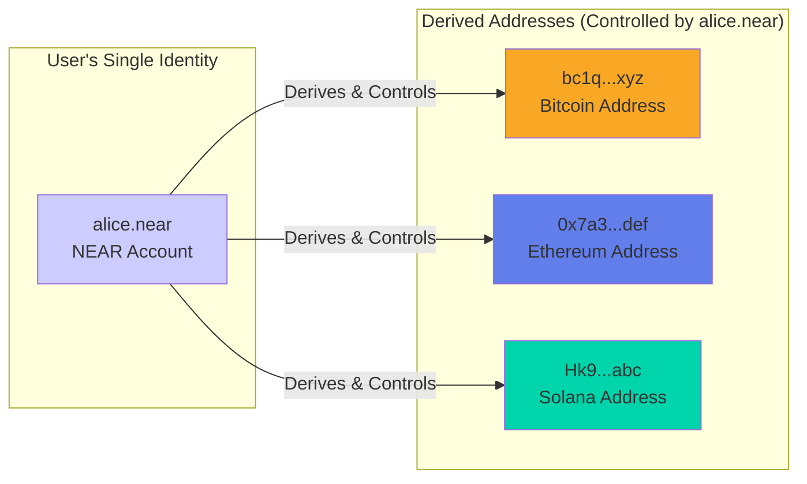

### Example: Controlling Bitcoin from NEAR

**Scenario**: Alice wants to send Bitcoin, but she only has a NEAR account.

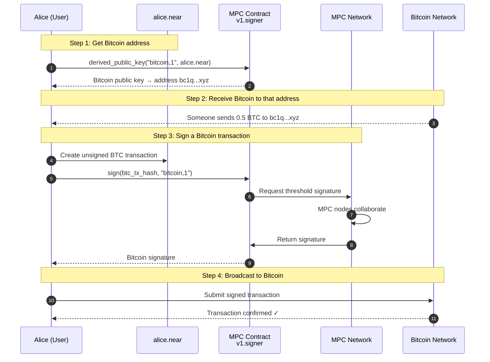

### Code Example

```javascript
// 1. Derive a Bitcoin address from NEAR account
const mpcContract = new Contract(account, "v1.signer", {
  viewMethods: ["derived_public_key"],
  changeMethods: ["sign"],
});

const btcPublicKey = await mpcContract.derived_public_key({
  path: "bitcoin,1",           // Derivation path
  predecessor: "alice.near",   // NEAR account
});
const btcAddress = publicKeyToBitcoinAddress(btcPublicKey);
// Result: bc1q7x8fp4z7n3...

// 2. Create and sign a Bitcoin transaction
const unsignedTx = createBitcoinTransaction({
  from: btcAddress,
  to: "bc1qRecipient...",
  amount: 0.1,
});

const signature = await mpcContract.sign({
  request: {
    payload: Array.from(hashTransaction(unsignedTx)),
    path: "bitcoin,1",
    key_version: 0,
  }
}, "300000000000000"); // 300 Tgas

// 3. Broadcast signed transaction
const signedTx = attachSignature(unsignedTx, signature);
await broadcastToBitcoin(signedTx);
```

### Common Use Cases

| Use Case | Description |
|----------|-------------|
| **Multi-chain Wallet** | Single NEAR account controls BTC, ETH, SOL addresses |
| **Cross-chain DeFi** | Deposit BTC into Ethereum DeFi protocols |
| **DAO Treasury** | DAO on NEAR controls assets on multiple chains |
| **Automated Trading** | Smart contract on NEAR executes trades on other chains |
| **NFT Bridges** | Move NFTs between chains using one identity |

### Key Benefits

- **One Account**: Manage all chains from your NEAR account
- **No Key Management**: No need to secure separate private keys per chain
- **Programmable**: Smart contracts can control cross-chain assets
- **Recoverable**: NEAR account recovery mechanisms protect all chain access

### Costs

| Item | Cost |
|------|------|
| Signature request (NEAR) | ~7 TGas (~$0.001) |
| Target chain fees | Standard (e.g., BTC miner fee) |

---

## Table of Contents

- [How Users Use Chain Signatures](#how-users-use-chain-signatures)
- [System Architecture](#system-architecture)
- [Core Components](#core-components)
  - [MPC Node](#mpc-node)
  - [MPC Contract](#mpc-contract)
  - [Network Layer](#network-layer)
  - [Storage Layer](#storage-layer)
- [Signature Request Flow](#signature-request-flow)
- [Key Generation & Resharing](#key-generation--resharing)
- [Background Operations](#background-operations)
- [Integration with NEAR Core Architecture](#integration-with-near-core-architecture)
- [Security Model](#security-model)
- [Key Modules Reference](#key-modules-reference)

---

## System Architecture

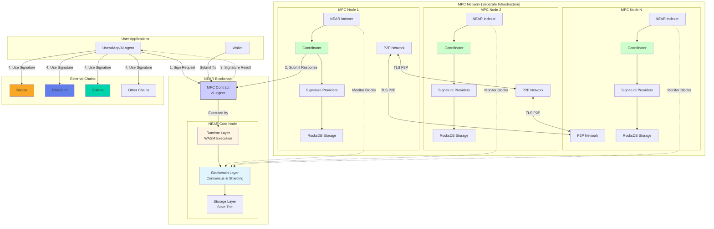

### Architecture Highlights

1. **Separation from NEAR Core**: MPC nodes are **not part of nearcore**. They run as separate processes with their own storage, networking, and compute.

2. **On-Chain Coordination**: The MPC Contract on NEAR serves as the coordination point:
   - Receives signature requests from users
   - Manages participant set and threshold parameters
   - Stores public keys and domain configurations
   - Delivers signature responses back to users

3. **Off-Chain Computation**: Actual cryptographic operations happen off-chain:
   - MPC nodes monitor the contract via their built-in indexers
   - Threshold protocols execute over P2P network
   - Results are submitted back to the contract

4. **Decentralized Network**: Multiple independent MPC nodes collaborate:
   - Each maintains its own keyshare
   - TLS-encrypted mesh network for communication
   - Threshold of participants required for any signature

---

## Core Components

### MPC Node

The MPC node is a Rust binary that performs threshold cryptographic operations. Each node in the network runs this software.

#### Coordinator (`coordinator.rs`)

The coordinator is the central state machine that orchestrates all MPC operations:

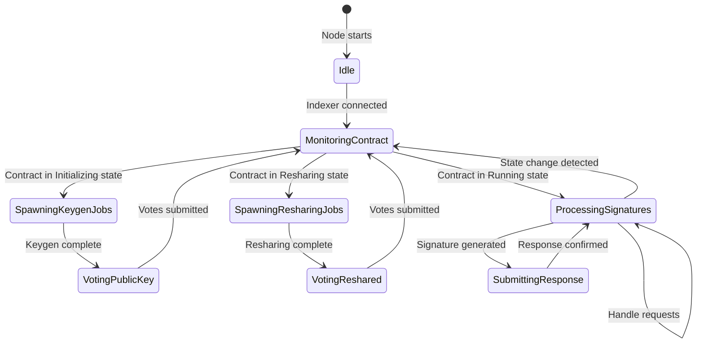

**Responsibilities:**

- Monitors contract state transitions
- Spawns appropriate protocol jobs (keygen, resharing, signing)
- Manages background operations (triple/presignature generation)
- Routes requests to signature providers
- Handles job interruption on state changes

#### Signature Providers

Providers implement the actual cryptographic protocols for different signature schemes:

| Provider | File | Signature Scheme | Protocol |
|----------|------|------------------|----------|
| ECDSA | `providers/ecdsa.rs` | Secp256k1 | FROST threshold ECDSA |
| Robust ECDSA | `providers/robust_ecdsa.rs` | V2Secp256k1 | Enhanced fault-tolerant ECDSA |
| EdDSA | `providers/eddsa.rs` | Ed25519 | FROST threshold EdDSA |
| CKD | `providers/ckd.rs` | BLS12-381 | Confidential Key Derivation |

#### Protocol Runner (`protocol.rs`)

Generic execution engine for any threshold protocol:

- Runs cait-sith/FROST protocols
- Manages message multiplexing across participants
- Separates computation and I/O into parallel tasks
- Tracks message counters for monitoring

### MPC Contract

The smart contract deployed on NEAR that serves as the public interface and coordination layer.

#### Contract State Machine

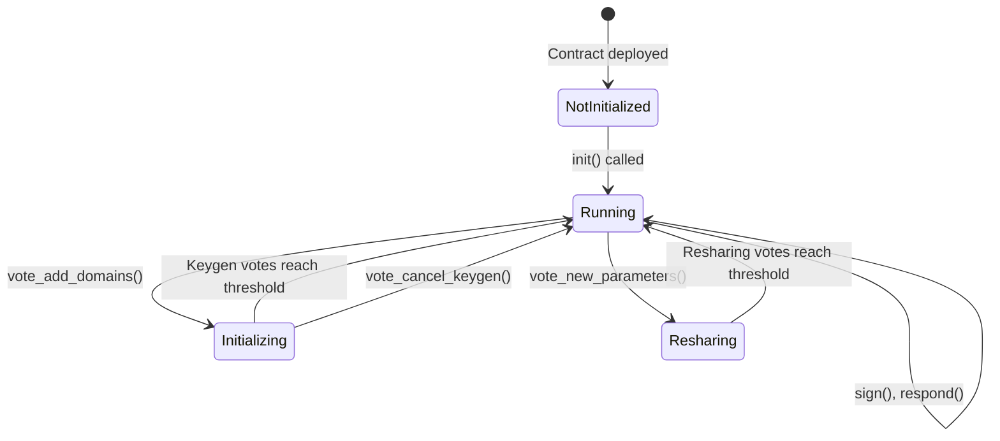

#### Key Contract Methods

**User-Facing:**

| Method | Purpose | Cost |
|--------|---------|------|
| `sign(request)` | Submit ECDSA/EdDSA signature request | ~7 Tgas |
| `request_app_private_key(request)` | Submit CKD request | ~7 Tgas |
| `public_key(domain)` | Get public key (read-only) | Free |
| `derived_public_key(path, predecessor, domain)` | Generate derived key | Free |

**Participant Methods:**

| Method | Purpose |
|--------|---------|
| `vote_new_parameters(epoch_id, proposal)` | Change participants/threshold |
| `vote_add_domains(domains)` | Add new signature domains |
| `vote_pk(key_event_id, public_key)` | Vote for generated public key |
| `vote_reshared(key_event_id)` | Vote for resharing success |
| `respond(request, signature)` | Submit signature result |

### Network Layer

#### P2P Transport (`p2p.rs`)

TLS-based persistent connections between MPC nodes:

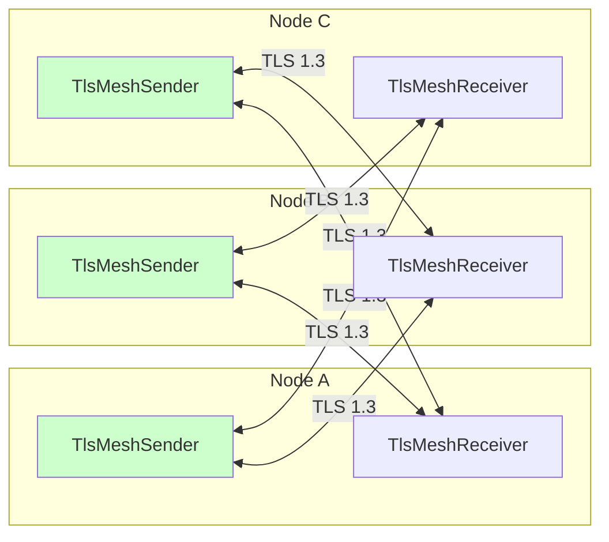

**Key Features:**

- TLS 1.3 encryption for all peer communication
- TCP_NODELAY for low latency
- Keepalive mechanism (5-second intervals)
- Automatic reconnection on failure

#### Network Multiplexing (`network.rs`)

Manages multiple concurrent MPC protocol sessions:

- Each protocol run gets a unique `ChannelId`
- Messages routed to appropriate protocol instances
- LRU cache for handling out-of-order messages

### Storage Layer

#### SecretDB (RocksDB-based)

Persistent storage for cryptographic material:

| Column | Contents |
|--------|----------|
| `SignRequest` | Pending signature requests |
| `CKDRequest` | Pending CKD requests |
| `Triple` | Beaver triples for MPC |
| `Presignature` | Pre-generated partial signatures |
| `VerifyForeignTx` | Foreign chain verification state |

#### Keyshare Storage

Manages threshold key material with two backends:

- **Local**: Files on disk
- **GCP**: Google Cloud Storage for production

---

## Signature Request Flow

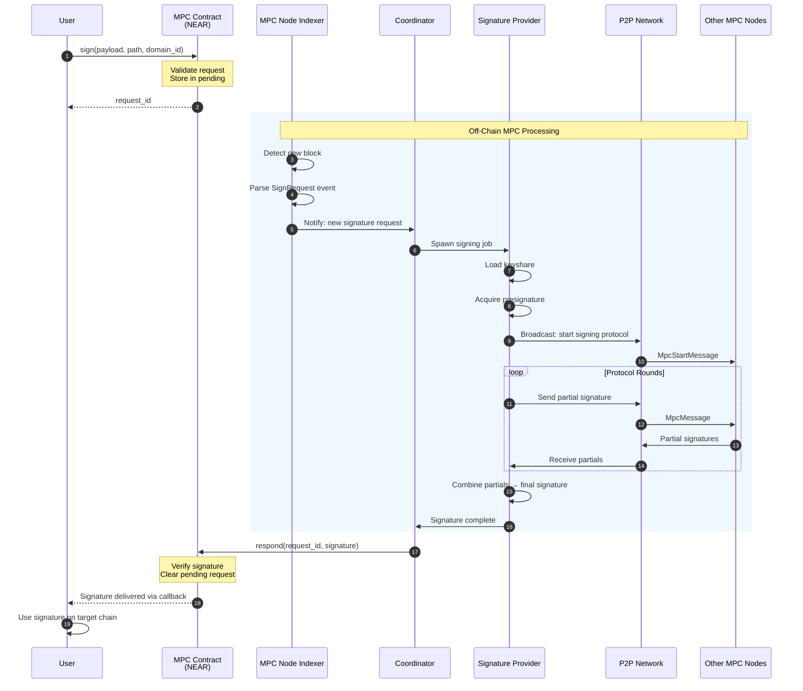

### Flow Description

1. **Request Submission**: User calls `sign()` on the MPC contract with payload and derivation path
2. **Indexer Detection**: Each MPC node's indexer monitors NEAR blocks and detects the new request
3. **Coordinator Dispatch**: Coordinator spawns a signing job with the appropriate provider
4. **Protocol Execution**:
   - Provider loads its keyshare and acquires a presignature
   - Broadcasts protocol start to other nodes
   - Exchanges partial signatures over P2P network
   - Combines partials into final signature
5. **Response Submission**: One node submits the signature back to the contract
6. **Delivery**: Contract delivers signature to user via callback

---

## Key Generation & Resharing

### Key Generation Flow

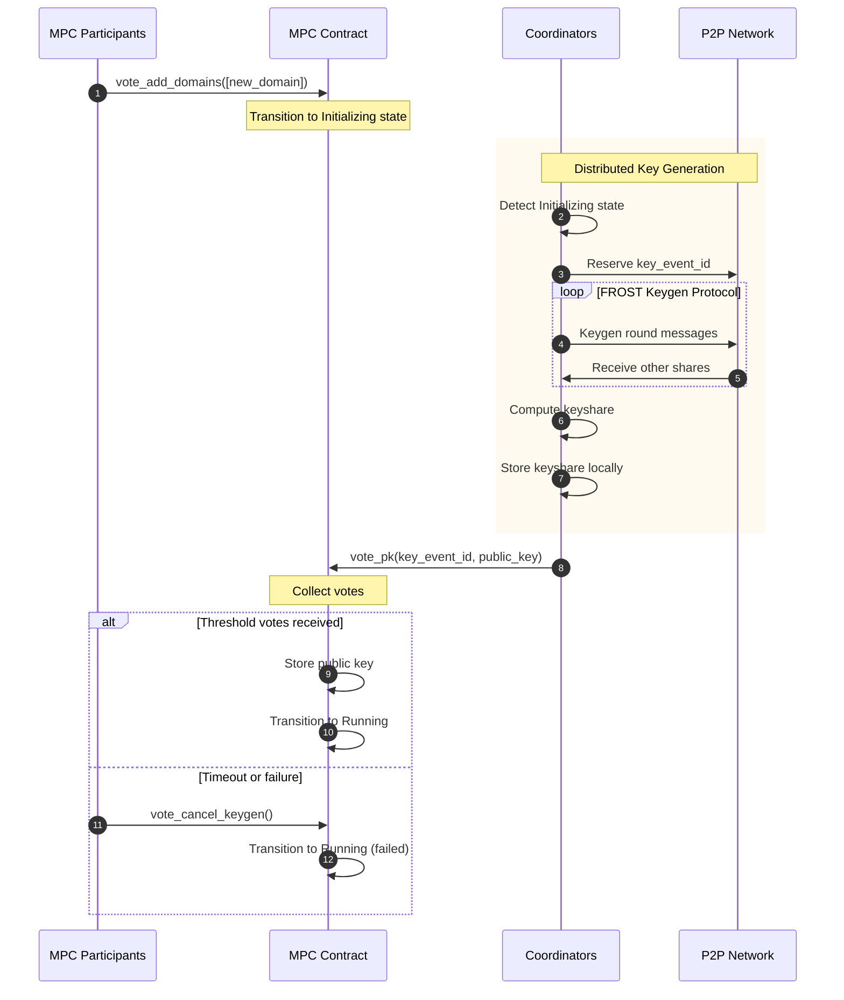

### Resharing Flow

When the participant set changes (nodes added/removed) or threshold changes:

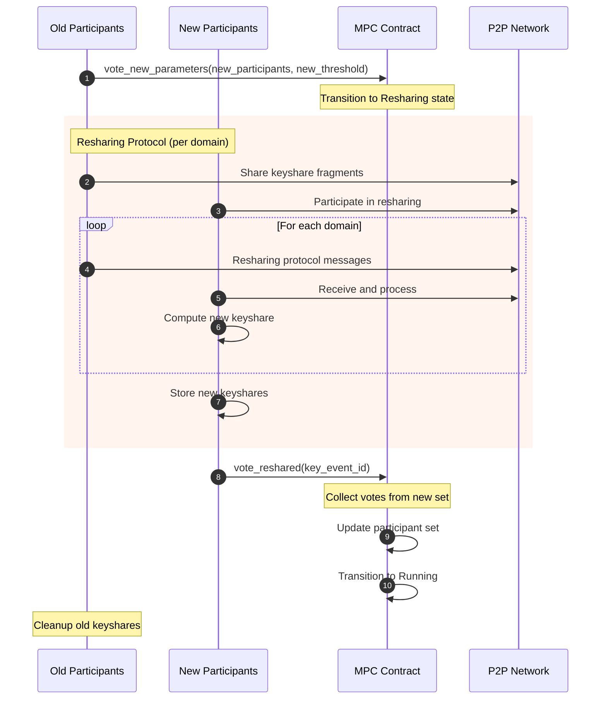

---

## Background Operations

MPC nodes continuously perform background operations to optimize signing performance:

### Beaver Triple Generation

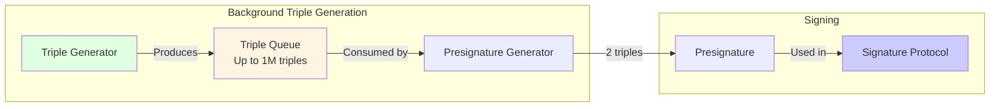

**Beaver Triples**: Pre-computed values that enable efficient secure multiplication in MPC protocols.

- Generated continuously in background
- Each node both initiates and participates
- Up to 1 million triples stored per node

### Presignature Generation

**Presignatures**: Partially computed signatures that reduce online signing to a single round.

- Requires 2 Beaver triples per presignature
- Generated in background when triples available
- Dramatically speeds up signature requests

---

## Integration with NEAR Core Architecture

The MPC system integrates with NEAR's core infrastructure at multiple points:

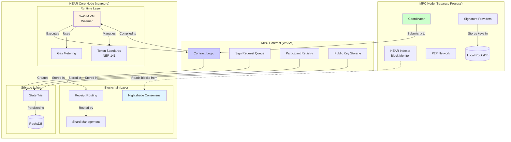

### Integration Points

| NEAR Component | How MPC Uses It |
|----------------|-----------------|
| **Runtime Layer** | MPC Contract executes as WASM in Wasmer VM |
| **Gas Metering** | Signature requests cost ~7 Tgas |
| **Token Standards** | Contract may integrate with NEP-141 for fees |
| **Receipt System** | Cross-contract callbacks for signature delivery |
| **State Trie** | Contract state (requests, keys, participants) stored here |
| **Consensus** | Finalizes signature responses on-chain |

### Key Differences from NEAR Intents

While both MPC Chain Signatures and NEAR Intents are part of NEAR's Chain Abstraction layer, they serve different purposes:

| Aspect | MPC Chain Signatures | NEAR Intents |
|--------|---------------------|--------------|
| **Purpose** | Sign transactions for external chains | Execute optimal swaps/trades |
| **Core Tech** | Threshold cryptography (FROST) | Solver network + escrow contracts |
| **On-Chain** | Single contract (v1.signer) | Verifier + Escrow contracts |
| **Off-Chain** | MPC nodes with P2P network | Solver network (market makers) |
| **Output** | Digital signatures | Completed token swaps |
| **Use Case** | Control Bitcoin/Ethereum accounts | Trade tokens across chains |

---

## Security Model

### Threshold Security

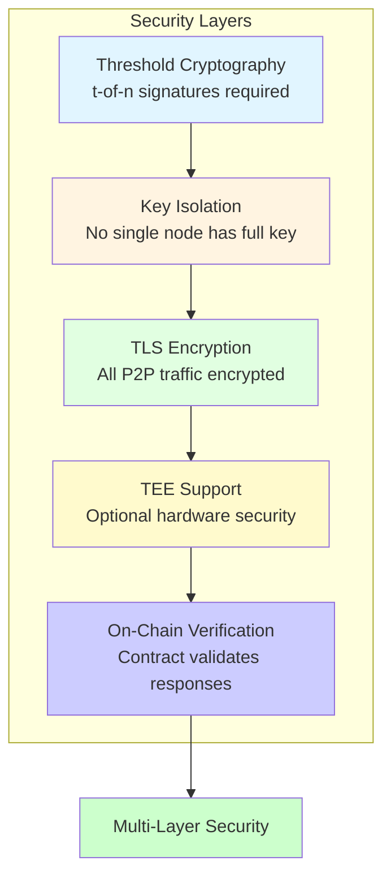

### Security Properties

| Property | Implementation |
|----------|----------------|
| **Key Security** | No single node possesses complete private key |
| **Threshold** | Configurable t-of-n (e.g., 3-of-5) |
| **Network Security** | TLS 1.3 for all peer communication |
| **Replay Protection** | Nonce tracking in contract |
| **TEE Option** | Intel TDX/SGX for hardware isolation |
| **Economic Security** | MPC operators may stake NEAR |

---

## Key Modules Reference

### Node Crate (`crates/node/`)

| Module | File | Responsibility |
|--------|------|----------------|
| Coordinator | `coordinator.rs` | Main state machine, job orchestration |
| Protocol | `protocol.rs` | Generic threshold protocol execution |
| Network | `network.rs` | Message multiplexing, channel management |
| P2P | `p2p.rs` | TLS transport, persistent connections |
| Key Events | `key_events.rs` | Keygen and resharing logic |
| Indexer | `indexer/` | NEAR blockchain monitoring |
| Providers | `providers/` | Signature scheme implementations |
| Storage | `db.rs`, `storage.rs` | RocksDB and keyshare storage |

### Contract Crate (`crates/contract/`)

| Module | Directory | Responsibility |
|--------|-----------|----------------|
| Entry Points | `src/lib.rs` | Public contract methods |
| State Machine | `src/state/` | Protocol state transitions |
| Primitives | `src/primitives/` | Core types and configurations |

### Supporting Crates

| Crate | Purpose |
|-------|---------|
| `contract-interface` | DTOs for contract communication |
| `mpc-primitives` | Shared primitive types |
| `mpc-tls` | TLS transport implementation |
| `node-types` | Node-specific types, attestation |
| `tee-authority` | TEE validation logic |
| `foreign-chain-inspector` | Cross-chain verification |

---

## Further Reading

### MPC System
- [MPC GitHub Repository](https://github.com/near/mpc) - Source code and documentation
- [Chain Signatures Documentation](https://docs.near.org/concepts/abstraction/chain-signatures) - NEAR docs

### NEAR Core
- [NEAR Node Architecture Summary](near-node-architecture-summary.md) - Core protocol architecture
- [NEAR Protocol Specification](https://nomicon.io/) - Technical specification

### Cryptography
- [FROST Protocol](https://eprint.iacr.org/2020/852) - Threshold signature scheme
- [Cait-Sith Library](https://github.com/cronokirby/cait-sith) - Threshold ECDSA implementation
