# NEAR Intents: Architecture & User Experience Guide

## Overview

**NEAR Intents** is a multichain transaction protocol where users express desired outcomes (intents) and a decentralized network of solvers competes to execute them optimally. Unlike traditional blockchain transactions that require users to specify exact execution steps, NEAR Intents separates the "what" (desired outcome) from the "how" (execution path).

This document provides a comprehensive view of the system architecture, key actors, and user experience flows within the NEAR Intents ecosystem.

> **Reference**: For details on the underlying NEAR Protocol infrastructure, see [NEAR Node Architecture Summary](near-node-architecture-summary.md).

## Table of Contents

- [How It Works: A Cross-Chain Swap](#how-it-works-a-cross-chain-swap)
- [Core Architecture](#core-architecture)
  - [System Components](#system-components)
  - [Deployment Model](#deployment-model)
- [Key Actors](#key-actors)
  - [Users](#users)
  - [Solvers (Market Makers)](#solvers-market-makers)
  - [Distribution Channels](#distribution-channels)
  - [Wallets](#wallets)
  - [Exchanges & Bridges](#exchanges--bridges)
  - [Verifier Contract](#verifier-contract)
- [User Experience Flows](#user-experience-flows)
  - [Standard Swap Flow](#standard-swap-flow)
  - [1Click Swap API Flow](#1click-swap-api-flow)
  - [Cross-Chain Transfer Flow](#cross-chain-transfer-flow)
- [Actor Interaction Diagram](#actor-interaction-diagram)
- [Technical Concepts](#technical-concepts)
  - [Intents](#intents)
  - [Intent Types](#intent-types)
  - [Signature Standards](#signature-standards)
  - [Token Identification](#token-identification)
- [Security Model](#security-model)
- [Fee Structure](#fee-structure)
- [Supported Chains & Wallets](#supported-chains--wallets)
- [Appendix: Project Contributors](#appendix-project-contributors)

## How It Works: A Cross-Chain Swap

To understand NEAR Intents, let's follow a concrete example: **swapping ADA (on Cardano) for ETH (on Ethereum)**.

### Where Do the Tokens Go?

Tokens don't physically move between chains. Instead, NEAR Intents uses a **hub-and-spoke model** where NEAR acts as the central settlement layer, with tokens **locked** on source chains and **equivalent wrapped tokens minted** on NEAR:

1. **Deposit Phase**: Your ADA is **locked** in a bridge contract on Cardano. Once verified, an equivalent **wrapped token** (e.g., `nep141:ada.omft.near`) is **minted** on NEAR and credited to your Verifier account. Your original ADA remains held by the bridge contract on Cardano.

2. **Swap Phase**: The actual exchange happens entirely on NEAR—your wrapped ADA is traded for wrapped ETH (`nep141:eth.omft.near`) through an atomic swap with a solver.

3. **Withdrawal Phase**: Your wrapped ETH is **burned** on NEAR. The bridge then **releases** real ETH from its reserves on Ethereum to your address (for outbound transfers, this release is signed by the Chain Signatures MPC network).

### How Are Tokens Secured During Transit?

NEAR Intents uses a **hybrid bridge architecture** with multiple verification methods, selected per chain based on what provides the strongest available trust guarantees:

- **Bridge contracts** on each external chain lock deposited tokens and process withdrawals
- When you deposit ADA, the bridge verifies the deposit on the source chain and **mints** an equivalent wrapped token on NEAR
- When you withdraw ETH, the wrapped token is **burned** on NEAR and the Chain Signatures MPC network **signs a release transaction** on Ethereum
- The Verifier contract on NEAR holds your wrapped tokens in escrow until you explicitly withdraw them or use them in a swap

The trust model varies by chain and direction:

| Direction | Chains | Verification | Trust Model |
|-----------|--------|--------------|-------------|
| **Outbound** (NEAR → external) | All chains | **Chain Signatures MPC** | Distributed trust across MPC validators (2/3+ threshold) |
| **Inbound** (external → NEAR) | Ethereum, Bitcoin | **Light client** on NEAR | Trustless — cryptographic proof of source chain state |
| **Inbound** (external → NEAR) | Solana, Base, BNB, Arbitrum | **Wormhole Guardian network** | Guardian committee (13/19 honest) |
| **Inbound** (external → NEAR) | TON, Stellar | **HOT Bridge** operators | Bridge operator trust |
| **Inbound** (external → NEAR) | TRON | **PoA Bridge** | Proof-of-Authority validator committee |

### How Does Chain Signatures (MPC) Fit In?

**Chain Signatures** is a core component of NEAR's Chain Abstraction Layer and is **already used** by NEAR Intents through OmniBridge — the primary bridge. It serves two distinct roles:

1. **Outbound bridge signing** (current): All withdrawals from NEAR to external chains go through Chain Signatures. When you withdraw ETH, the MPC network collectively signs the release transaction on Ethereum. No single validator holds the full private key — security comes from distributed threshold cryptography (2/3+ of MPC validators must agree).

2. **Direct chain control** (potential future use): Chain Signatures can also enable a NEAR smart contract to directly control addresses on other chains — signing arbitrary transactions without bridges or wrapped tokens. This capability exists in the MPC infrastructure but is not yet used for intent settlement.

| Role | How It Works | Status |
|------|--------------|--------|
| **Outbound bridge signing** | MPC network signs release/mint transactions on destination chains for OmniBridge withdrawals | **Active** — used for all outbound transfers |
| **Inbound verification** | MPC nodes independently verify foreign chain transactions and sign attestations | **In development** — will replace Wormhole for inbound verification |
| **Direct settlement** | Verifier contract triggers MPC-signed transactions on external chains without bridges | **Future** — would eliminate wrapped tokens entirely |

**Why the hybrid approach today?**
- Chain Signatures handles all outbound transfers, providing distributed MPC trust
- Inbound verification varies by chain: light clients where available (Ethereum, Bitcoin), Wormhole Guardians elsewhere (Solana, Base, BNB, Arbitrum)
- HOT Bridge and PoA Bridge cover chains not yet supported by OmniBridge (TON, Stellar, TRON)
- The MPC team is developing **foreign chain transaction verification** to unify all inbound verification under Chain Signatures, which would eliminate the Wormhole dependency

### How Do Solvers Provide Liquidity?

Solvers don't send tokens directly from exchanges to users. Instead, **solvers also deposit their tokens into the Verifier contract** via bridges, just like users do:

1. **Pre-funded accounts**: Solvers maintain inventories of various wrapped tokens (ETH, USDC, BTC, etc.) in their Verifier accounts, ready to trade
2. **Atomic swaps on NEAR**: When filling your order, the solver trades their *already-deposited* wrapped ETH for your wrapped ADA—both sides of the swap happen atomically on NEAR
3. **You withdraw**: After the swap, you withdraw your wrapped ETH, which the bridge converts to real ETH on Ethereum

**So what are CEXs and DEXs used for?**

Solvers use external exchanges for **inventory management**, not direct settlement:

| Purpose | How Solvers Use CEX/DEX |
|---------|------------------------|
| **Price discovery** | Check market rates to offer competitive quotes |
| **Rebalancing** | Withdraw accumulated tokens and sell them to replenish other assets |
| **Arbitrage** | Profit from price differences between NEAR Intents and external markets |
| **Hedging** | Offset risk from large positions |

For example, after your swap, the solver now holds wrapped ADA. They might withdraw it, send it to Binance, sell it for USDT, buy more ETH, and deposit that back into their Verifier account—keeping their inventory balanced for future swaps.

### TEE Solvers: Trustless Liquidity Pools

Where does solver liquidity come from? Solvers can use their own capital, but they can also accept deposits from **external liquidity providers (LPs)**. This creates a trust problem: *"How do I know the solver won't steal my funds or run malicious code?"*

**Trusted Execution Environments (TEEs)** solve this by providing hardware-level security guarantees.

**Implementation Components:**

The [TEE Solver Registry](https://github.com/aurora-is-near/tee-solver) provides the infrastructure:

| Component | Description |
|-----------|-------------|
| **solver-registry** | Smart contract that manages liquidity pool creation and TEE solver verification |
| **intents-vault** | Smart contract that holds LP deposits and integrates with NEAR Intents |
| **Solver Management Server** | TypeScript service that automatically launches TEE solvers when new pools are created |
| **TEE-powered AMM Solver** | Default solver implementation that runs inside the hardware enclave |

**Architecture:**

```
┌─────────────────────────────────────────────────────────────┐
│                      NEAR Blockchain                         │
│                                                              │
│  ┌──────────────────┐       ┌──────────────────────────┐    │
│  │  Solver Registry │       │     Intents Vault        │    │
│  │                  │       │                          │    │
│  │ • Creates pools  │       │ • Holds LP deposits      │    │
│  │ • Verifies TEE   │       │ • Integrates with        │    │
│  │   attestations   │       │   NEAR Intents           │    │
│  │ • Approves code  │       │ • Only releases to       │    │
│  │                  │       │   verified solvers       │    │
│  └────────┬─────────┘       └────────────┬─────────────┘    │
│           │                              │                   │
└───────────┼──────────────────────────────┼───────────────────┘
            │ attestation                  │ access granted
            │ proof                        │ only if verified
            │                              │
      ┌─────┴──────────────────────────────┴─────┐
      │          TEE Solver (Hardware Enclave)    │
      │  ┌─────────────────────────────────────┐  │
      │  │   Approved Docker Image             │  │
      │  │   (e.g., TEE-powered AMM Solver)    │  │
      │  │                                     │  │
      │  │   • Tamper-proof execution          │  │
      │  │   • Cryptographically verified      │  │
      │  │   • Operator cannot modify          │  │
      │  └─────────────────────────────────────┘  │
      └───────────────────────────────────────────┘
                          ▲
                          │ auto-launched
      ┌───────────────────┴───────────────────┐
      │      Solver Management Server          │
      │  • Monitors for new pool creation      │
      │  • Deploys TEE solvers automatically   │
      └────────────────────────────────────────┘
```

**Pool Creation Flow:**
1. LP creates a new liquidity pool in the Solver Registry contract
2. LP deposits funds into the Intents Vault
3. Solver Management Server detects the new pool
4. Server automatically launches a TEE solver with approved Docker image
5. TEE solver registers with the Solver Registry (provides attestation proof)
6. Once verified, solver can operate against the pool's assets

**TEE Security Guarantees:**

| Feature | Benefit |
|---------|---------|
| **Hardware isolation** | Code runs in an encrypted enclave that even the server operator can't access or modify |
| **Remote attestation** | Cryptographic proof that the exact approved Docker image is running |
| **Verified images** | Only pre-approved solver code can be registered and access funds |
| **No intermediary trust** | Security comes from hardware guarantees, not trusting the operator |

**Is TEE required?**

No—TEEs are an **optional enhancement** for solvers who want to accept external liquidity:

| Solver Type | TEE Needed? | Trust Model |
|-------------|-------------|-------------|
| Self-funded solver | No | Solver risks own capital |
| LP-funded solver | Recommended | LPs trust hardware attestation instead of operator reputation |

TEEs enable **trustless liquidity pools** where anyone can provide capital to solvers with cryptographic security guarantees—expanding the available liquidity in the system without requiring trust in individual operators.

### The Complete Flow

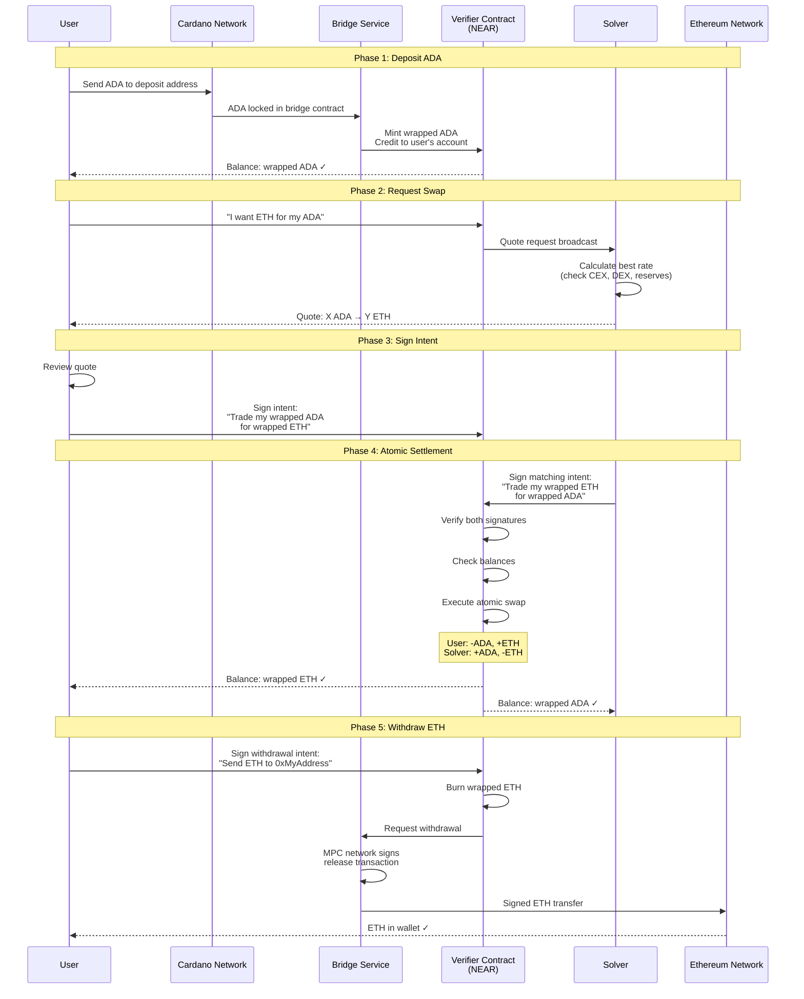

### Key Takeaways

| Aspect | What Happens |
|--------|--------------|
| **Token custody** | Native tokens locked in bridge contracts on source chains; wrapped tokens held in Verifier contract on NEAR until withdrawal |
| **Native tokens** | Locked on source/destination chains; NEAR uses minted wrapped representations |
| **Settlement** | All swaps settle atomically on NEAR—no partial fills possible |
| **Bridge model** | Lock-and-mint (inbound) / burn-and-release (outbound) via OmniBridge, with Chain Signatures MPC signing all outbound releases |
| **User control** | You can withdraw your wrapped tokens anytime; they're in your Verifier account |
| **Solver liquidity** | Solvers pre-deposit wrapped tokens via bridges; they don't send directly from CEXs |
| **CEX/DEX role** | Used by solvers for price discovery, inventory rebalancing, and arbitrage—not direct settlement |
| **TEE solvers** | Optional hardware enclaves allow solvers to accept external LP deposits with cryptographic trust guarantees |

## Core Architecture

NEAR Intents is designed around a simple principle: users should be able to say what they want, not how to get it. The architecture makes this possible by separating concerns across distinct layers, each with a clear responsibility.

At the top, **users** interact through familiar interfaces—wallet apps, swap websites, or trading bots. These interfaces don't execute trades directly. Instead, they help users create and sign **intents**: signed messages that declare a desired outcome like "I want to trade 100 USDC for NEAR at the best available price."

These intents flow into the **distribution layer**, where the **Message Bus** broadcasts them to a network of competing **solvers**. Solvers are independent market makers—professional trading firms, automated bots, or AI agents—who race to find the best execution path. They search across centralized exchanges, DEX liquidity pools, and cross-chain bridges to construct optimal trades.

When a solver offers a quote the user accepts, both parties submit their signed intents to the **Verifier Contract** on NEAR. This smart contract is the trust anchor of the system. It verifies all signatures, checks that both sides of the trade balance out, and executes everything atomically—meaning either the entire trade succeeds, or nothing happens. No partial fills, no stuck funds.

For cross-chain operations, the Verifier coordinates with **bridge contracts** that connect NEAR to external blockchains like Ethereum, Bitcoin, and Solana. This allows users to swap assets across chains in a single intent, without manually bridging tokens themselves.

The result is a system where users get competitive pricing through solver competition, while maintaining full custody of their assets until the moment of atomic settlement.

### System Components

NEAR Intents operates as a three-layer system built on top of NEAR Protocol's core infrastructure:

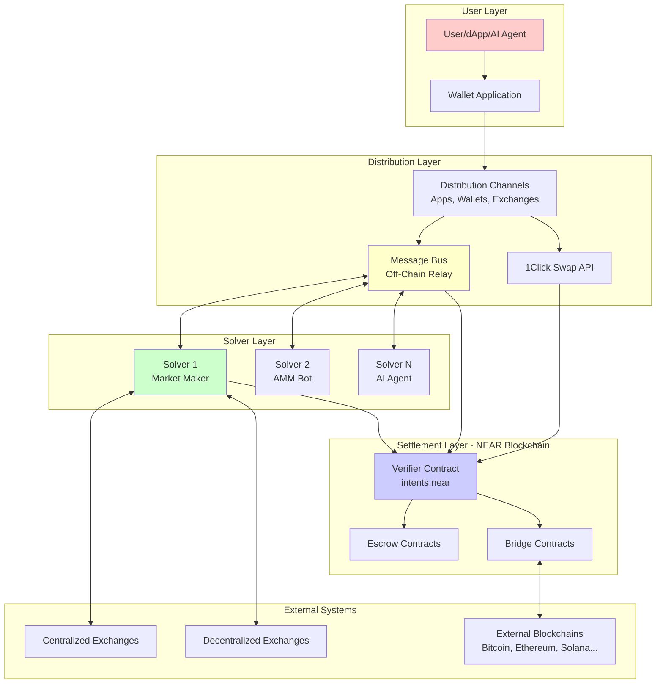

| Component | Description | Deployment |
|-----------|-------------|------------|
| **Verifier Contract** | Smart contract verifying signatures and executing intents atomically | On-chain (NEAR mainnet at `intents.near`) |
| **Message Bus** | Off-chain relay connecting users with solvers for price discovery | Off-chain service |
| **1Click API** | RESTful API abstracting intent complexity for easy integration | Off-chain service |
| **Solvers** | Competing market makers providing liquidity and execution | Off-chain participants |
| **Distribution Channels** | User-facing applications integrating NEAR Intents | Apps, wallets, exchanges |
| **Bridges** | Cross-chain asset transfer mechanisms | On-chain contracts + off-chain relayers |

### Deployment Model

NEAR Intents follows a hybrid on-chain/off-chain architecture:

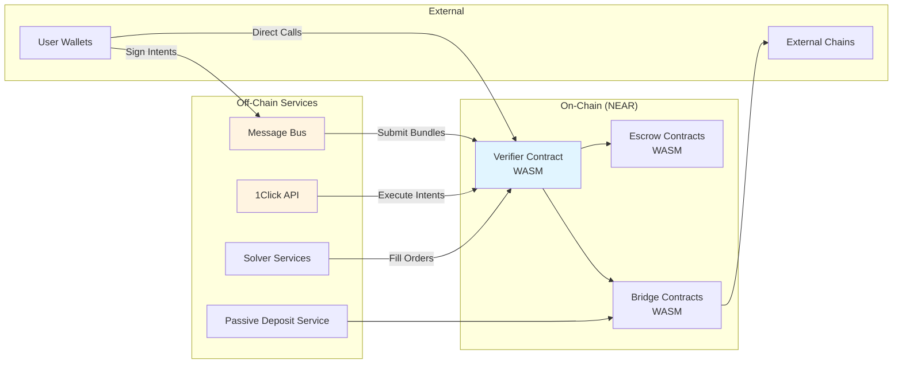

> **Key Insight**: Unlike traditional blockchain protocols, NEAR Intents separates the price discovery (off-chain) from settlement (on-chain), enabling competitive pricing while maintaining trustless execution.

---

## Key Actors

### Users

**Definition**: End-users who want to perform token swaps, transfers, or other blockchain operations without managing the complexity of execution.

**Responsibilities**:
- Express desired outcomes through intents
- Sign intents using their wallet's private key
- Review and accept quotes from solvers
- Manage deposited assets in the Verifier contract

**Capabilities**:
- Create any supported intent type (transfers, swaps, withdrawals)
- Use multiple signature standards based on their wallet type
- Maintain full custody of assets until intent execution
- Cancel or modify intents before execution

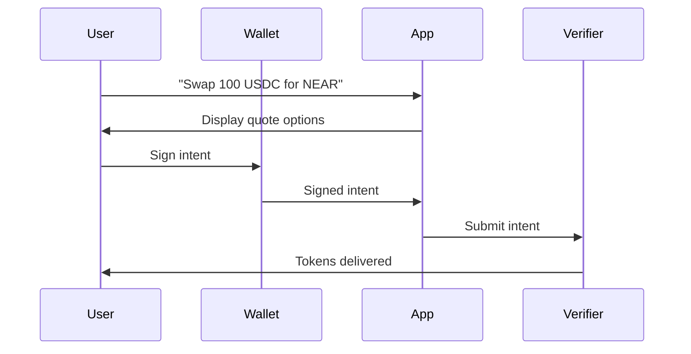

### Solvers (Market Makers)

**Definition**: Entities that compete to fulfill user intents by providing liquidity and optimal execution paths.

**Types of Solvers**:

| Type | Description | Example |
|------|-------------|---------|
| **Professional Market Makers** | High-frequency trading firms with deep liquidity | Traditional finance firms |
| **AMM Bots** | Automated arbitrage bots connecting to DEX pools | Uniswap arbitrageurs |
| **AI Agents** | Machine learning systems optimizing execution | Autonomous trading agents |
| **Bridge Operators** | Entities specializing in cross-chain transfers | Cross-chain protocols |

**Responsibilities**:
- Monitor the Message Bus for quote requests
- Calculate optimal execution paths across venues
- Provide competitive quotes within deadlines
- Execute trades atomically with user intents
- Manage liquidity across multiple chains and venues

**Economic Model**:
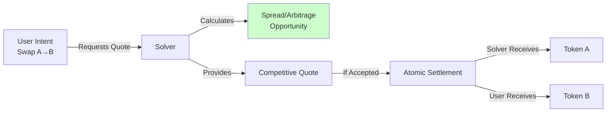

### Distribution Channels

**Definition**: User-facing applications and services that integrate NEAR Intents functionality.

**Types**:

| Channel Type | Description | Integration Method |
|--------------|-------------|-------------------|
| **Web Applications** | Swap interfaces like near-intents.org | SDK / Direct API |
| **Mobile Wallets** | Native wallet apps with swap features | SDK / 1Click API |
| **DEX Aggregators** | Multi-source liquidity aggregators | Message Bus API |
| **Telegram Bots** | Chat-based trading interfaces | 1Click API |
| **AI Assistants** | Natural language trading agents | 1Click API |

**Responsibilities**:
- Provide intuitive user interfaces
- Relay intents to the Message Bus or API
- Display quotes and execution status
- Handle wallet connections and signing

### Wallets

**Definition**: Applications that manage user keys and sign intents across multiple signature standards.

**Supported Wallet Types**:

| Wallet Category | Examples | Signature Standard |
|-----------------|----------|-------------------|
| **NEAR Native** | MyNearWallet, Meteor, Sender | NEP-413 |
| **EVM** | MetaMask, Rainbow, Rabby | ERC-191 |
| **Solana** | Phantom, Solflare | Raw Ed25519 |
| **Bitcoin** | Xverse, Leather | BIP-322 (in progress) |
| **Hardware** | Ledger, Trezor | Via wallet apps |
| **Passkeys** | Browser/OS biometrics | WebAuthn |
| **TON** | Tonkeeper, OpenMask | TonConnect |
| **TRON** | TronLink | TIP-191 |

**Role in the System**:
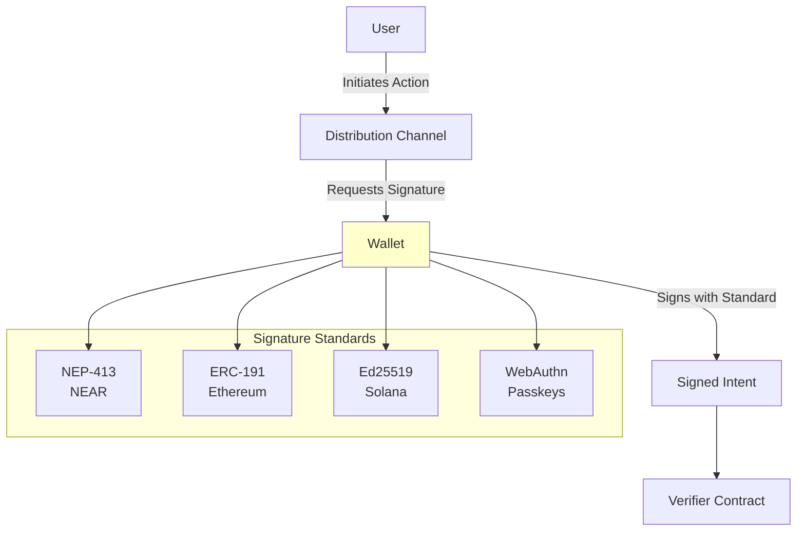

### Exchanges & Bridges

**Definition**: External liquidity sources and cross-chain infrastructure used for deposits, withdrawals, and solver execution.

#### Bridges Used by NEAR Intents

NEAR Intents interfaces with three bridges for cross-chain asset movement (named as "Third-Party Components" in the 1Click Terms of Service):

| Bridge | Chains | Verification | Token Format |
|--------|--------|--------------|--------------|
| **OmniBridge** | Ethereum, Bitcoin, Solana, Base, BNB, Arbitrum | Chain Signatures MPC (outbound); Light clients or Wormhole (inbound) | `<symbol>.omft.near` |
| **HOT Bridge** | EVM chains, Solana, TON, Stellar | Bridge operators | Varies |
| **PoA Bridge** | Select chains | Proof-of-Authority validator committee | Varies |

**OmniBridge** is the primary bridge, built on NEAR's Chain Signatures infrastructure. Outbound transfers (NEAR → external) are always signed by the MPC network. Inbound transfers use light client verification for Ethereum/Bitcoin and the Wormhole Guardian network for Solana, Base, BNB, and Arbitrum.

Market makers use the bridge-specific API for withdrawals and the [Passive Deposit/Withdrawal Service](https://bridge.chaindefuser.com/rpc) for deposits. A [Bridge SDK](https://github.com/defuse-protocol/sdk-monorepo/tree/main/packages/bridge-sdk) is available for integration.

#### Other NEAR Bridges (not directly used by Intents)

| Bridge | Purpose | Status |
|--------|---------|--------|
| **Rainbow Bridge** | Original trustless NEAR ↔ Ethereum bridge using light clients on both sides. Legacy tokens use `<eth_address>.factory.bridge.near` format. Transfers from NEAR → Ethereum take 4-8 hours due to challenge period. | Active (legacy) |
| **Wormhole** | Not a standalone NEAR bridge — used as a component by OmniBridge for inbound verification from chains where NEAR does not run a light client (Solana, Base, BNB, Arbitrum). Will be replaced by MPC-based foreign chain verification. | Active (component) |

#### External Liquidity Sources

| Infrastructure | Role | Examples |
|----------------|------|----------|
| **Centralized Exchanges** | Deep liquidity for major pairs | Binance, Coinbase, OKX |
| **Decentralized Exchanges** | On-chain liquidity pools | Uniswap, Ref Finance, Raydium |

**Integration Flow**:
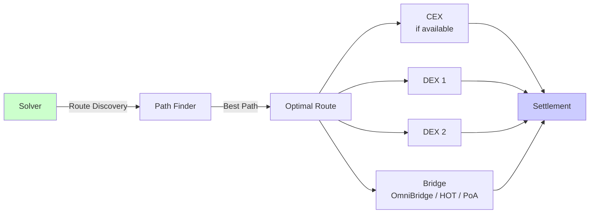

### Verifier Contract

**Definition**: The core smart contract deployed on NEAR mainnet (`intents.near`) that verifies signatures and executes intents atomically.

**Responsibilities**:
- Verify cryptographic signatures across all supported standards
- Validate intent parameters (deadlines, nonces, balances)
- Execute intent bundles atomically (all-or-nothing)
- Manage user balances and account state
- Emit events for tracking and indexing
- Enforce replay protection via nonces

**State Management**:
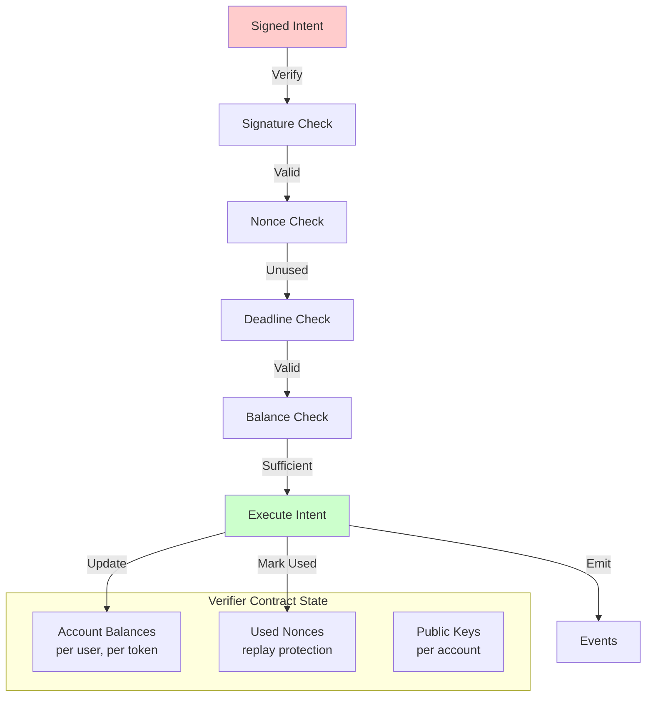

---

## User Experience Flows

### Standard Swap Flow

The complete user journey for a typical token swap:

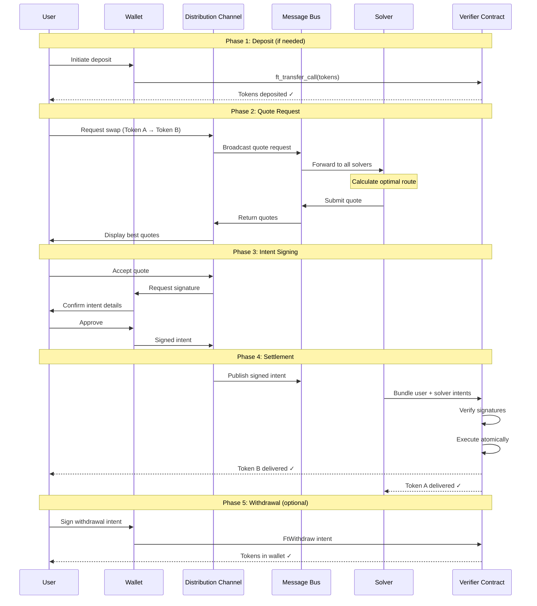

**User Experience Breakdown**:

| Phase | User Action | System Response | Duration |
|-------|-------------|-----------------|----------|
| **1. Deposit** | Transfer tokens to Verifier | Tokens reflected in balance | ~2-3 seconds |
| **2. Quote** | Request swap quote | Multiple quotes displayed | ~1-5 seconds |
| **3. Sign** | Review and sign intent | Wallet confirms signature | User-dependent |
| **4. Settlement** | Wait for execution | Atomic swap completes | ~2-3 seconds |
| **5. Withdrawal** | Request withdrawal | Tokens back in wallet | ~2-3 seconds |

### 1Click Swap API Flow

Simplified flow for integrators using the 1Click API:

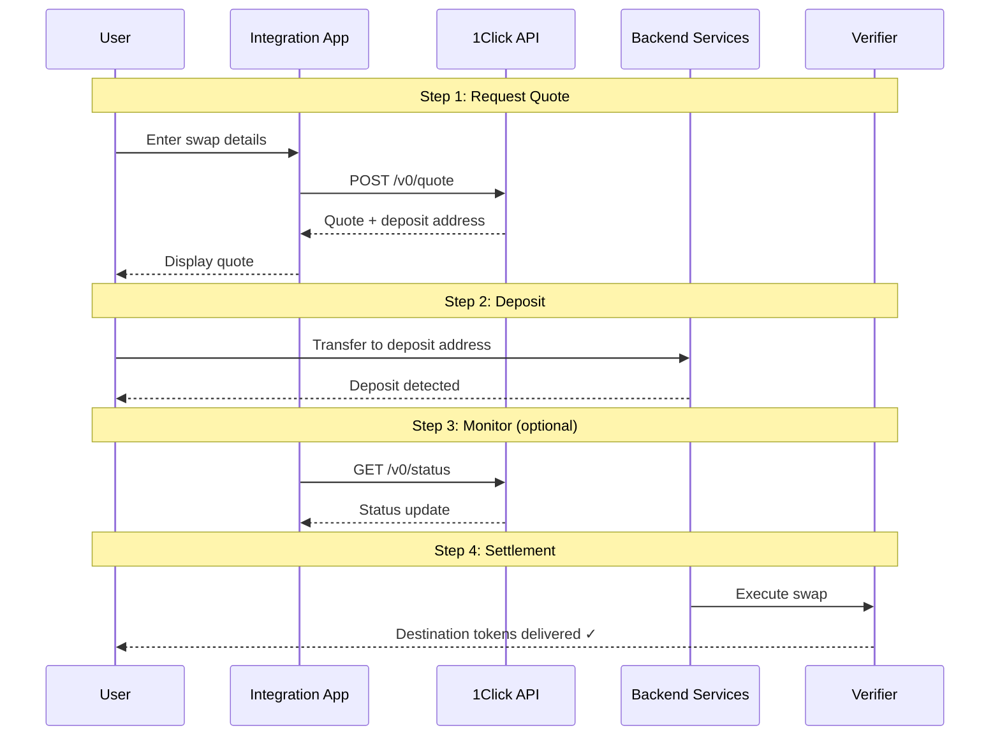

**Status Progression**:
```
PENDING_DEPOSIT → PROCESSING → SUCCESS
                           ↘
                    INCOMPLETE_DEPOSIT → REFUNDED
                                      ↘
                                       FAILED
```

### Cross-Chain Transfer Flow

Flow for transferring assets between chains (e.g., Ethereum → NEAR):

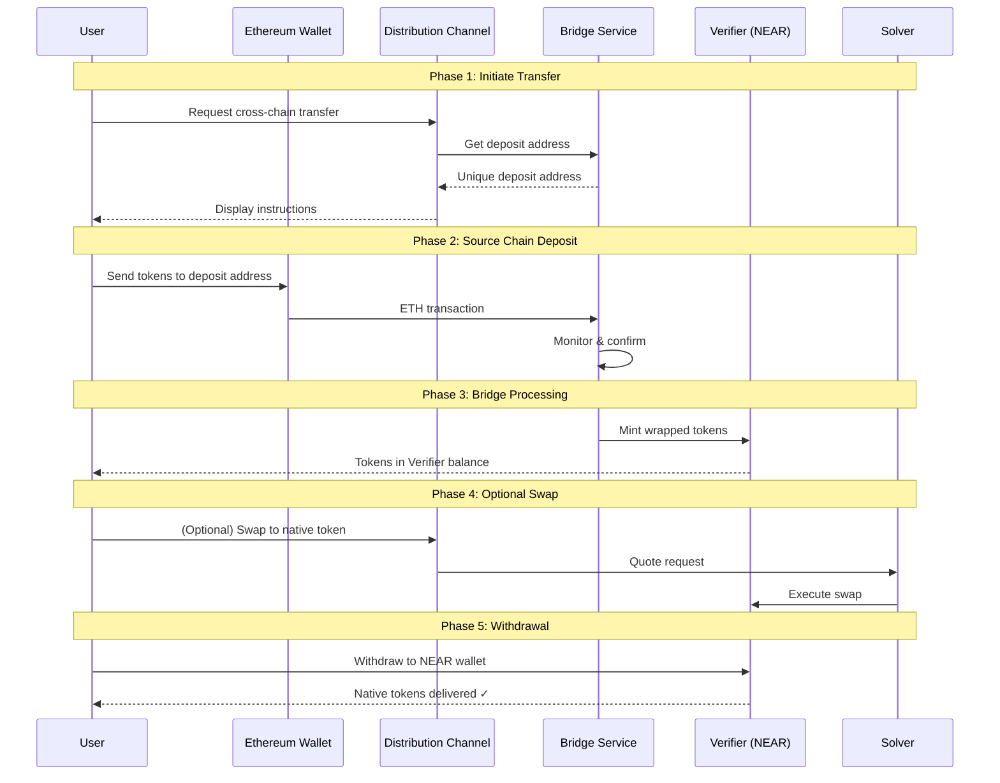

---

## Actor Interaction Diagram

Complete view of how all actors interact in the NEAR Intents ecosystem:

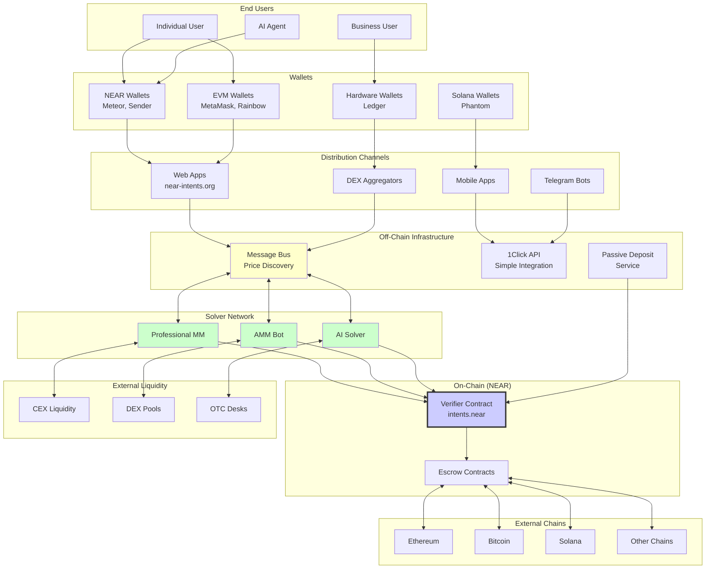

---

## Technical Concepts

### Intents

An **intent** is a signed message expressing a desired action on the user's account in the Verifier contract. Unlike traditional transactions that specify exact execution steps, intents declare outcomes.

**Intent Structure**:
```json
{
  "signer_id": "alice.near",
  "verifying_contract": "intents.near",
  "deadline": "2024-01-15T12:00:00Z",
  "nonce": "base64EncodedUniqueValue",
  "intents": [
    {
      "intent": "TokenDiff",
      "diff": {
        "nep141:usdc.near": "-100000000",
        "nep141:wrap.near": "+5000000000000000000000000"
      }
    }
  ]
}
```

| Field | Description | Example |
|-------|-------------|---------|
| `signer_id` | Account creating the intent | `alice.near` |
| `verifying_contract` | Contract that will execute | `intents.near` |
| `deadline` | ISO-8601 expiration time | `2024-01-15T12:00:00Z` |
| `nonce` | Unique value (base64, 256-bit) | Prevents replay attacks |
| `intents` | Array of intent actions | Transfer, TokenDiff, etc. |

### Intent Types

| Intent Type | Description | Use Case |
|-------------|-------------|----------|
| **Transfer** | Move tokens to another account | Simple transfers within Verifier |
| **TokenDiff** | Declare willingness to exchange tokens | Swaps with solvers |
| **FtWithdraw** | Withdraw fungible tokens | Exit to external wallet |
| **NftWithdraw** | Withdraw NFTs | Exit NFTs to wallet |
| **NativeWithdraw** | Withdraw to external chain | Cross-chain exit |
| **AddPublicKey** | Add signing key to account | Account abstraction |
| **RemovePublicKey** | Remove signing key | Key rotation |
| **StorageDeposit** | Deposit storage on contracts | Enable token receipts |

### Signature Standards

NEAR Intents supports multiple signature standards to enable wallets from any ecosystem:

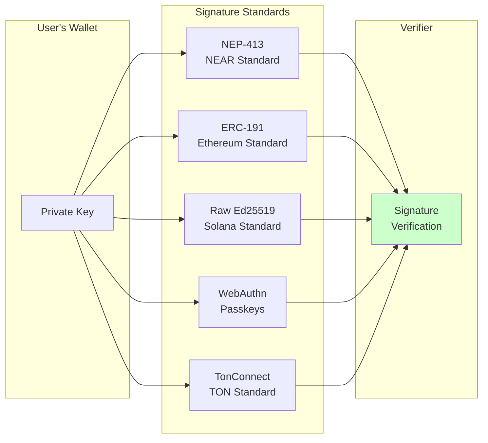

### Token Identification

Tokens in the Verifier contract use the NEP-245 multi-token standard identifier format:

| Token Type | Format | Example |
|------------|--------|---------|
| Fungible (NEP-141) | `nep141:<contract>` | `nep141:wrap.near` |
| NFT (NEP-171) | `nep171:<contract>:<token_id>` | `nep171:nft.near:123` |
| Multi Token (NEP-245) | `nep245:<contract>:<token_id>` | `nep245:mt.near:abc` |

---

## Security Model

### Multi-Layer Verification

Every intent passes through multiple security checks before execution:

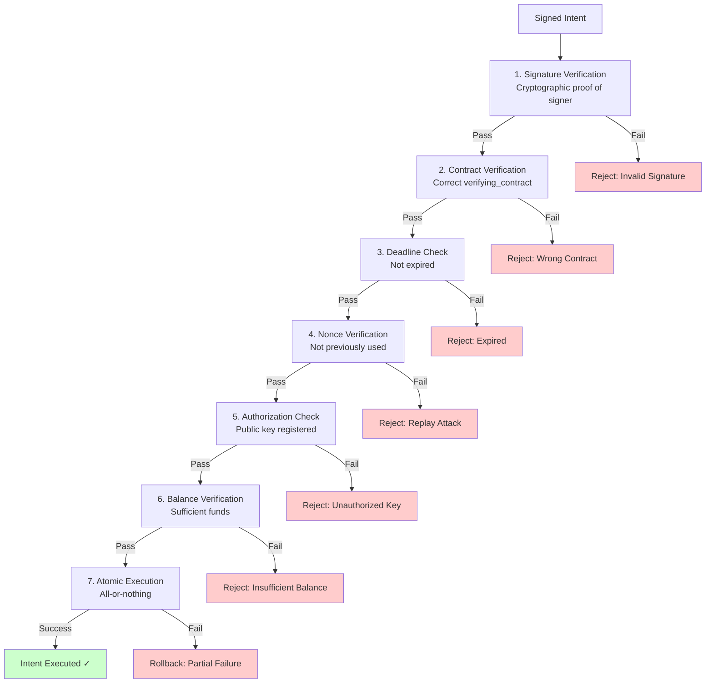

### Compliance Screening

NEAR Intents implements multi-layered compliance screening at the **quote-request stage**, ensuring potentially tainted flows are blocked at the earliest interaction point — before any trade is executed.

#### Layer 1: Real-time screening on all 1Click API quote requests

Every quote request is automatically checked against multiple trusted data sources for overlap between the provided addresses and addresses flagged in external databases:

| Provider | Purpose |
|----------|---------|
| [NEAR Intents AML Portal](https://aml.near-intents.org/) | Sanctions screening |
| Binance AML | Address risk scoring |
| AMLBot & PureFi | Flagged address databases |

#### Layer 2: Enhanced screening on non-dry quote requests

All non-dry (executable) quote requests are additionally screened against [TRM Labs](https://www.trmlabs.com/) datasets. Quotes are **automatically blocked** for any address that TRM Labs flags with:

- **Sanctions** (with `riskType: OWNERSHIP`)
- **Blocking behavior**

#### Blocking behavior

When a flagged address is detected at either layer, the quote request is **immediately rejected**. The user or distribution channel receives a clear response indicating the quote has been blocked. No swap is initiated, and no funds enter the settlement pipeline.

> **Note**: Compliance screening currently applies at the 1Click API level. Users interacting directly with the Message Bus or Verifier contract bypass these checks — enforcement at the protocol level is a potential area for future development.

---

## Fee Structure

| Fee Type | Amount | Description |
|----------|--------|-------------|
| **Protocol Fee** | 0.0001% (1 pip) | Base protocol fee per transaction |
| **Channel Fee** | 0-0.2% | Set by distribution channel |
| **Solver Spread** | Variable | Market-determined price spread |
| **Withdrawal Fee** | 0-0.1% | Specific token/chain combinations |
| **Gas** | ~$0.0001-0.03 | NEAR network gas fees |

> **Note**: 100 pips = 0.01%

## Supported Chains & Wallets

### Blockchain Support

| Chain | Status | Deposit | Withdrawal | Bridge | Notes |
|-------|--------|---------|------------|--------|-------|
| NEAR | ✅ Full | ✅ | ✅ | Native | Direct settlement |
| Ethereum | ✅ Full | ✅ | ✅ | OmniBridge | Light client (inbound), MPC (outbound) |
| Bitcoin | ✅ Full | ✅ | ✅ | OmniBridge | Light client (inbound), MPC (outbound) |
| Solana | ✅ Full | ✅ | ✅ | OmniBridge | Wormhole (inbound), MPC (outbound) |
| Base | ✅ Full | ✅ | ✅ | OmniBridge | Wormhole (inbound), MPC (outbound) |
| Arbitrum | ✅ Full | ✅ | ✅ | OmniBridge | Wormhole (inbound), MPC (outbound) |
| BNB | ✅ Full | ✅ | ✅ | OmniBridge | Wormhole (inbound), MPC (outbound) |
| Polygon | ✅ Full | ✅ | ✅ | OmniBridge | EVM compatible |
| TON | ✅ Full | ✅ | ✅ | HOT Bridge | TonConnect signing |
| Stellar | ✅ Full | ✅ | ✅ | HOT Bridge | SEP-53 standard |
| TRON | ✅ Full | ✅ | ✅ | PoA Bridge | TIP-191 signing |

### Wallet Compatibility

| Wallet | Chain | Signature Standard | Status |
|--------|-------|-------------------|--------|
| Meteor | NEAR | NEP-413 | ✅ Supported |
| MyNearWallet | NEAR | NEP-413 | ✅ Supported |
| Sender | NEAR | NEP-413 | ✅ Supported |
| MetaMask | EVM | ERC-191 | ✅ Supported |
| Rainbow | EVM | ERC-191 | ✅ Supported |
| Phantom | Solana | Ed25519 | ✅ Supported |
| Ledger | Multi | Via apps | ✅ Supported |
| Passkeys | Web | WebAuthn | ✅ Supported |
| Tonkeeper | TON | TonConnect | ✅ Supported |
| Xverse | Bitcoin | BIP-322 | 🔄 In Progress |

---

## Summary

NEAR Intents represents a paradigm shift in blockchain user experience:

| Traditional Approach | NEAR Intents Approach |
|---------------------|----------------------|
| User specifies exact execution | User specifies desired outcome |
| Single execution path | Competitive execution optimization |
| Complex multi-step transactions | Single intent signature |
| Chain-specific operations | Chain-agnostic intents |
| Fixed pricing | Competitive market pricing |
| User manages routing | Solvers optimize routing |

### Key Benefits by Actor

| Actor | Key Benefits |
|-------|--------------|
| **Users** | Simple UX, best prices, cross-chain without complexity |
| **Solvers** | Profit from spreads, access to diverse order flow |
| **Distribution Channels** | Easy integration, customizable fees |
| **Wallets** | Support any signature standard, expanded capabilities |
| **Exchanges** | New liquidity venue, intent-based order flow |

---

## Further Reading

- [NEAR Node Architecture Summary](near-node-architecture-summary.md) - Understanding the underlying NEAR Protocol
- [NEAR Intents Documentation](https://docs.near-intents.org) - Official protocol documentation
- [Message Bus API Reference](https://docs.near-intents.org/market-makers/bus) - Solver integration guide
- [1Click API Reference](https://docs.near-intents.org/integration/distribution-channels/1click-api) - Simple integration API
- [Verifier Contract Reference](https://docs.near-intents.org/market-makers/verifier) - Smart contract details

---

## Appendix: Project Contributors

Analysis of unique contributors across the [defuse-protocol](https://github.com/defuse-protocol) GitHub organization (excluding bots).

### Summary

| Metric | Count |
|--------|-------|
| **Total unique contributors** | 38 |
| **Total repositories** | 13 |
| **Core contributors (3+ repos)** | 9 |
| **Regular contributors (2 repos)** | 8 |
| **Single-repo contributors** | 21 |

### Contributors by Repository

| Repository | Contributors | Description |
|------------|--------------|-------------|
| [defuse-frontend](https://github.com/defuse-protocol/defuse-frontend) | 15 | Main web application (near-intents.org) |
| [docs](https://github.com/defuse-protocol/docs) | 14 | Protocol documentation |
| [sdk-monorepo](https://github.com/defuse-protocol/sdk-monorepo) | 11 | Unified SDK packages |
| [defuse-sdk](https://github.com/defuse-protocol/defuse-sdk) | 10 | Core SDK implementation |
| [near-intents-amm-solver](https://github.com/defuse-protocol/near-intents-amm-solver) | 5 | AMM solver implementation |
| [aurora-engine-exit-contract](https://github.com/defuse-protocol/aurora-engine-exit-contract) | 4 | Aurora bridge contract |
| [one-click-sdk-typescript](https://github.com/defuse-protocol/one-click-sdk-typescript) | 4 | TypeScript 1Click SDK |
| [one-click-sdk-go](https://github.com/defuse-protocol/one-click-sdk-go) | 3 | Go 1Click SDK |
| [rust-near-indexer](https://github.com/defuse-protocol/rust-near-indexer) | 3 | NEAR blockchain indexer |
| [DIPs](https://github.com/defuse-protocol/DIPs) | 2 | Defuse Improvement Proposals |
| [defuse-labs-website](https://github.com/defuse-protocol/defuse-labs-website) | 2 | Labs website |
| [one-click-sdk-rs](https://github.com/defuse-protocol/one-click-sdk-rs) | 2 | Rust 1Click SDK |
| [blocksapi-rs](https://github.com/defuse-protocol/blocksapi-rs) | 1 | Blocks API client |

### Top Contributors

Contributors active across multiple repositories:

| Contributor | Repos | Role |
|-------------|-------|------|
| selfbalance | 8 | Cross-functional |
| jobotics | 5 | Frontend & SDK |
| cawabunga-bytes | 4 | SDK & contracts |
| defuse-es | 4 | Frontend & SDK |
| hyper54n3 | 4 | Frontend & SDK |
| sleepy-buben | 4 | SDK packages |
| amdefuse | 3 | SDK |
| depressedPlumber502 | 3 | Frontend & SDK |
| solverbusfactor | 3 | Docs & solver |

*Data collected February 2025. Excludes automated accounts (bots, CI actions).*
