# NEAR Node Architecture - High-Level Summary

## Overview

NEAR Protocol is a **layer-1, sharded, proof-of-stake blockchain** designed for high performance and developer-friendly smart contract execution. The architecture consists of two independent layers that work together to process transactions and maintain state across a distributed network.

---

## Table of Contents

- [Core Architecture Layers](#core-architecture-layers)
  - [1. Blockchain Layer](#1-blockchain-layer)
  - [2. Runtime Layer](#2-runtime-layer)
- [Key Components](#key-components)
  - [Transactions and Receipts](#transactions-and-receipts)
  - [Account Model](#account-model)
  - [State Storage (Trie)](#state-storage-trie)
  - [Validators and Consensus](#validators-and-consensus)
  - [Gas and Economics](#gas-and-economics)
- [Data Flow Architecture](#data-flow-architecture)
  - [Complete Transaction Lifecycle](#complete-transaction-lifecycle)
  - [Cross-Contract Call Flow](#cross-contract-call-flow)
- [Sharding Architecture](#sharding-architecture)
- [Chain Abstraction Layer](#chain-abstraction-layer)
  - [NEAR Intents Architecture](#near-intents-architecture)
  - [Chain Signatures](#chain-signatures)
  - [Intent Execution Flow](#intent-execution-flow)
  - [Integration with NEAR Core](#integration-with-near-core)
- [Bridge Infrastructure](#bridge-infrastructure)
  - [Hub-and-Spoke Bridging Model](#hub-and-spoke-bridging-model)
  - [OmniBridge](#omnibridge)
    - [Deposit Flow (Inbound)](#deposit-flow-inbound-foreign-chain--near)
    - [Withdrawal Flow (Outbound)](#withdrawal-flow-outbound-near--foreign-chain)
    - [Fast Transfers](#fast-transfers)
    - [Bridge Token Factory](#bridge-token-factory)
    - [Relayer Network](#relayer-network)
  - [Rainbow Bridge (Legacy)](#rainbow-bridge-legacy)
  - [HOT Bridge](#hot-bridge)
  - [PoA Bridge](#poa-bridge)
  - [Wormhole (Component)](#wormhole-component)
  - [Bridge Token Standards](#bridge-token-standards)
  - [Bridge vs Chain Signatures](#bridge-vs-chain-signatures)
- [Node Types](#node-types)
  - [1. Validator Nodes](#1-validator-nodes)
  - [2. RPC Nodes](#2-rpc-nodes)
  - [3. Archival Nodes](#3-archival-nodes)
- [Key Innovations](#key-innovations)
- [Performance Characteristics](#performance-characteristics)
- [Security Model](#security-model)
- [Summary](#summary)
- [Further Reading](#further-reading)

---

## Core Architecture Layers

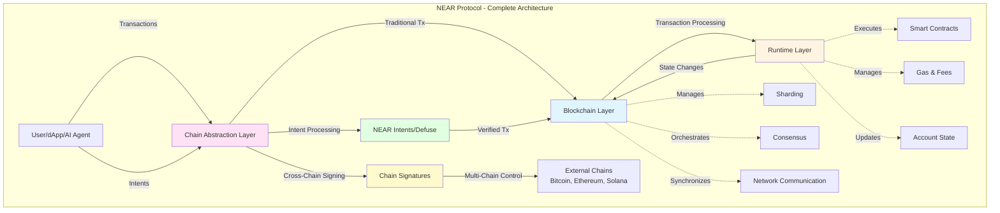

### 1. Blockchain Layer

The blockchain layer handles network-level operations and is responsible for:

- **Sharding**: Distributing the blockchain state across multiple parallel chains (shards)
- **Consensus**: Maintaining agreement on the canonical chain using the Nightshade consensus protocol
- **Block & Chunk Production**: Creating blocks every ~1 second containing chunks from all shards
- **Network Communication**: Routing transactions and receipts between shards and validators
- **State Synchronization**: Replicating and distributing the trie (state tree) across nodes

**Key Point**: The blockchain layer is **oblivious to business logic** - it doesn't know what transactions do, only how to route and organize them.

### 2. Runtime Layer

The runtime layer executes the actual business logic and is responsible for:

- **Smart Contract Execution**: Running WebAssembly (WASM) contracts
- **Account Management**: Managing account balances, keys, and contract storage
- **Gas Calculation**: Computing execution costs and burning/rewarding gas fees
- **Receipt Processing**: Converting transactions into receipts and executing them
- **State Mutations**: Updating the trie based on transaction outcomes

**Key Point**: The runtime layer is **unaware of sharding** - it doesn't know it's operating on only part of the global state.

---

## Key Components

### Transactions and Receipts

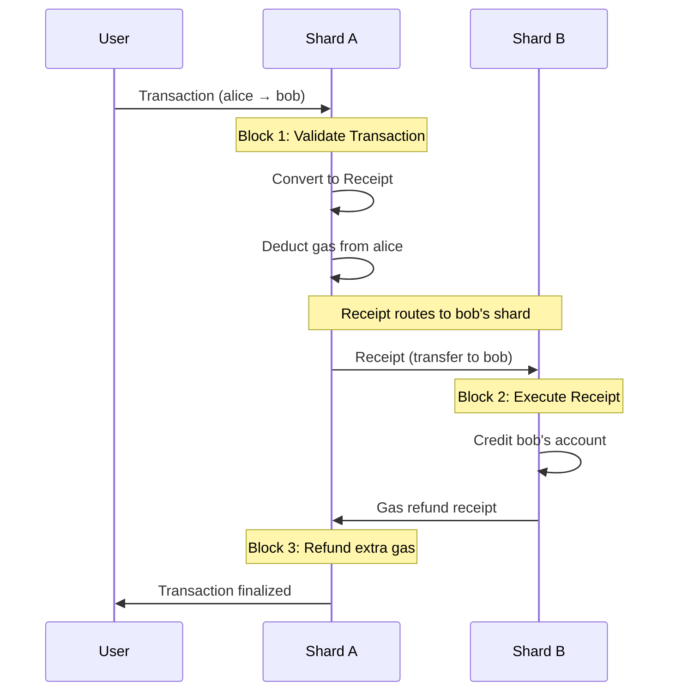

**Transactions** are created by users and contain actions like transfers, function calls, or key management.

**Receipts** are internal messages created by the blockchain to execute cross-shard operations:

- Every transaction converts into at least one receipt
- Receipts can spawn new receipts (e.g., cross-contract calls)
- Receipts travel between shards to reach the appropriate accounts
- Each receipt execution takes one block (~1 second)

### Account Model

NEAR uses an **account-based system** similar to Ethereum:

- Each account has a unique named ID (e.g., `alice.near`) or implicit address
- Every account belongs to exactly one shard
- Account data includes:
  - Balance (available & staked NEAR tokens)
  - Access keys (with different permission levels)
  - Smart contract code (if it's a contract account)
  - Key-value storage (contract state)

**Principle**: The runtime assumes each account lives in isolation - cross-account interactions happen through receipts.

### State Storage (Trie)

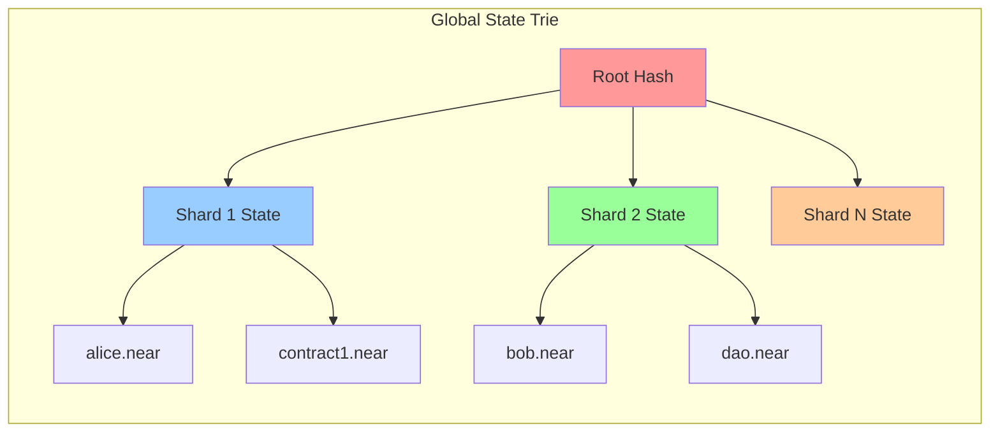

The blockchain state is stored in a **Merkle Patricia Trie**:

- Allows cryptographic verification of state
- Partitioned across shards for parallel processing
- Synchronized between validators for consistency
- Supports efficient state proofs and queries

**Cost**: Storing data costs `~1 NEAR per 100KB` (beyond transaction gas fees)

### Validators and Consensus

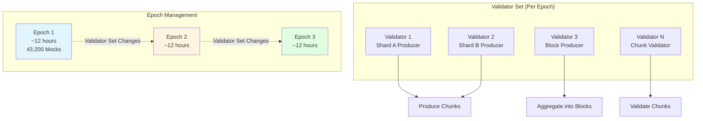

**Validators** are special nodes that:

- Stake NEAR tokens to participate in consensus
- Produce and validate blocks/chunks
- Are rewarded for honest behavior and penalized for misbehavior
- Minimum stake: determined by the 300th largest proposal (>25,500 NEAR)

**Epochs** are 12-hour periods (~43,200 blocks) where:

- The validator set remains constant
- Validator assignments are determined for each shard
- Staking rewards are distributed
- Nodes garbage collect blocks older than 5 epochs unless archival

### Gas and Economics

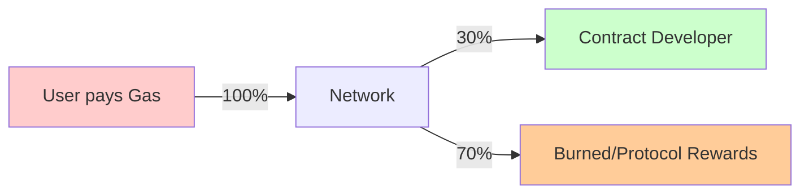

**Gas** serves multiple purposes:

- **Spam Prevention**: Makes it expensive to flood the network
- **Resource Metering**: 1 TGas ≈ 1ms of compute time
- **Developer Incentives**: Contracts earn 30% of gas they burn
- **Economic Policy**: Gas burning creates deflationary pressure

**Gas Price**: 

- Dynamically adjusts based on network congestion
- Floor price: `1 TGas = 0.0001 NEAR`
- Increases 1% if previous block >50% full
- Decreases 1% otherwise

**Transaction Limit**: Max 300 TGas per transaction (~300ms execution time)

---

## Data Flow Architecture

### Complete Transaction Lifecycle

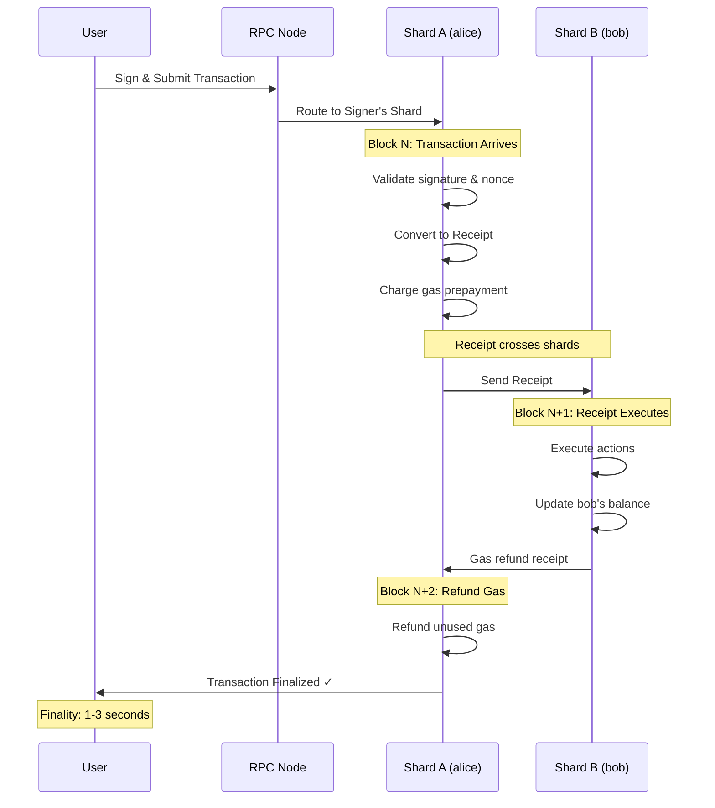

### Cross-Contract Call Flow

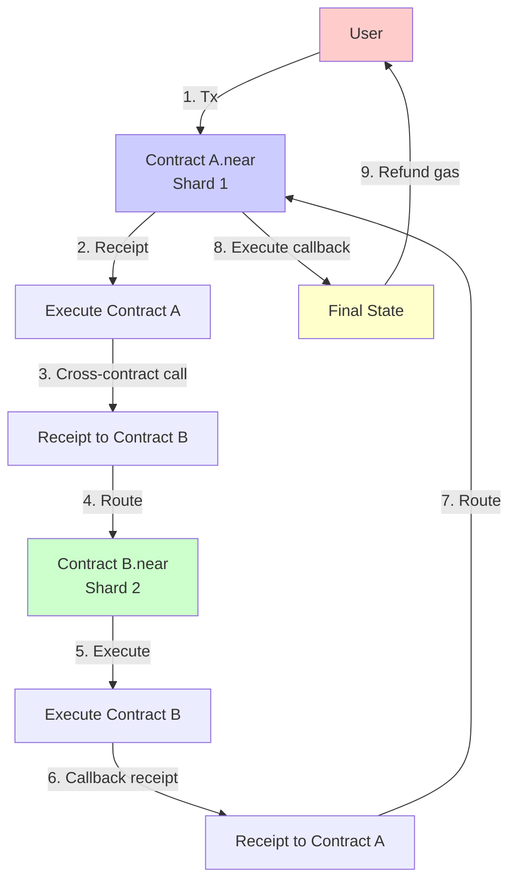

**Key Timing**:

- Simple transfer: 2-3 blocks (~2-3 seconds)
- Function call: 2-4 blocks depending on complexity
- Cross-contract call: +1 block per contract interaction
- Finality: Achieved when all receipts complete

---

## Sharding Architecture

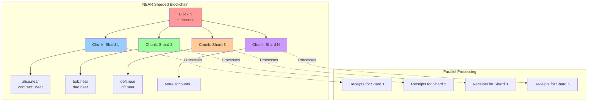

**Nightshade Sharding**:

- Multiple shards process transactions in parallel
- Each shard produces a "chunk" per block
- All chunks aggregate into a single block
- Cross-shard communication via receipts
- Dynamic resharding capability (for future scaling)

**Benefits**:

- Linear scalability with more shards
- Maintains security through validator rotation
- Fast finality (~1-2 seconds)
- Handles millions of transactions per day

---

## Chain Abstraction Layer

NEAR Protocol includes a **Chain Abstraction Layer** that enables seamless multi-chain interactions, intent-based transactions, and cross-chain account control. This layer sits above the core blockchain infrastructure and provides enhanced capabilities for users and developers.

### Deployment Architecture

**Important**: The Chain Abstraction components are **not part of the core NEAR node software** (nearcore). They have a distinct deployment model:

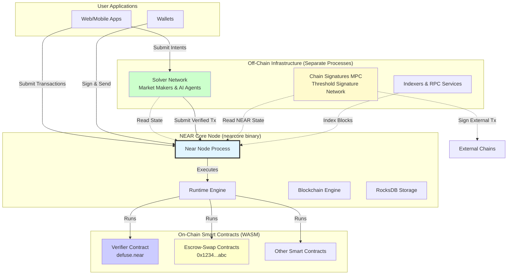

**Component Deployment:**

| Component | Deployment | Runs On | Managed By |
|-----------|-----------|---------|------------|
| **NEAR Core Node** | Native binary | Validator/RPC nodes | Node operators |
| **Verifier Contract** | WASM smart contract | NEAR Runtime (in nodes) | Contract developers |
| **Escrow Contracts** | WASM smart contracts | NEAR Runtime (in nodes) | Deterministically deployed |
| **Solver Network** | Separate services | Off-chain infrastructure | Third-party operators |
| **MPC Network** | Separate nodes | Off-chain network | MPC validators (may overlap with NEAR validators) |
| **Indexers/APIs** | Separate services | Off-chain servers | Service providers |

**Key Distinctions:**

1. **Core Node (nearcore)**:
   - Rust binary compiled to native code
   - Runs the blockchain consensus, networking, and storage
   - Executes WASM contracts in its runtime environment
   - Does NOT include Chain Abstraction as built-in features

2. **On-Chain Contracts**:
   - Rust code compiled to WebAssembly (WASM)
   - Deployed as smart contracts on NEAR blockchain
   - Executed by NEAR nodes when transactions call them
   - Verifier and Escrow contracts are regular smart contracts
   - Use NEAR's gas, storage, and consensus like any contract

3. **Off-Chain Services**:
   - Independent processes/networks
   - Solvers compete off-chain, submit transactions to NEAR
   - MPC network operates separately for cross-chain signing
   - Can be run by anyone (permissionless)

### NEAR Intents Architecture

**NEAR Intents** is a multichain transaction protocol where users express desired outcomes and a decentralized network of solvers competes to execute them optimally. It operates as a layer on top of NEAR's core blockchain infrastructure.

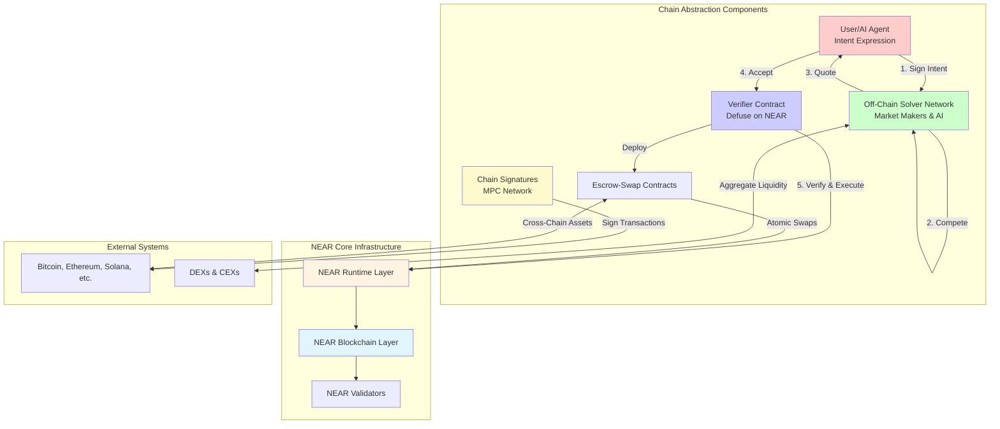

#### Core Components

**1. Intent Layer (User-Facing)**
- Users create signed intents expressing desired outcomes
- Uses NEP-413 standard for payload signing
- Contains: `signer_id`, `verifying_contract`, `deadline`, `nonce`, `message`
- Supports complex multi-step operations

**2. Solver Network (Off-Chain)**
- Decentralized network of market makers and AI agents
- Compete to find optimal execution paths
- Aggregate liquidity across chains and platforms
- Provide quotes for user approval

**3. Verifier Contract (On-Chain)**
- Main smart contract deployed on NEAR
- Verifies signatures and intent validity
- Manages account state and token balances
- Enforces nonce-based replay protection
- Executes verified intents atomically

**4. Escrow-Swap Contracts**
- Deterministically deployed per swap
- Immutable parameters
- Supports partial fills
- Automatic cleanup after completion
- Token-agnostic (NEP-141 & NEP-245)

### Chain Signatures

**Chain Signatures** enable NEAR accounts and smart contracts to sign transactions for any blockchain:

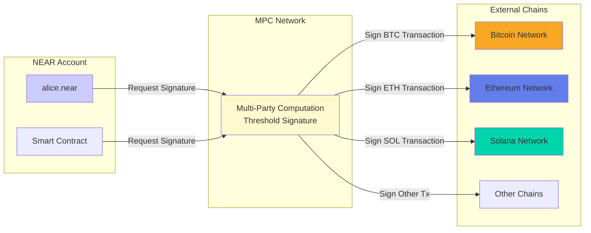

**Key Features**:
- Uses Multi-Party Computation (MPC) for key management
- No single entity controls private keys
- Threshold signature scheme (requires majority)
- Supports all major blockchain signature schemes
- Enables true multi-chain account abstraction

### Intent Execution Flow

**Swimlane Diagram - NEAR Intents Process**

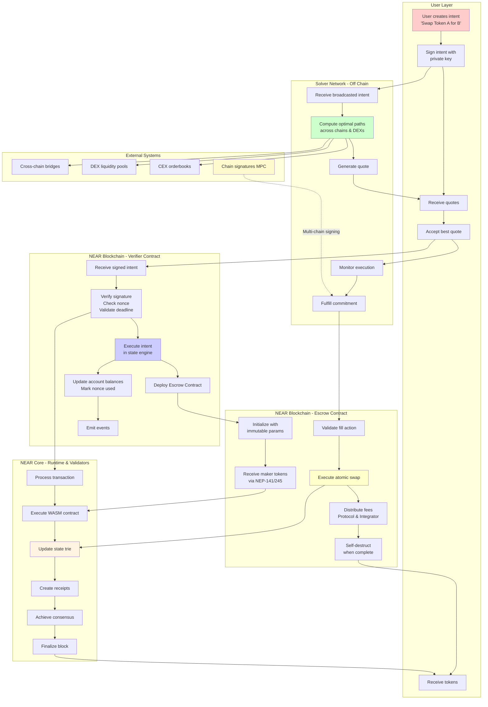

### Integration with NEAR Core

**How NEAR Intents Uses NEAR Infrastructure:**

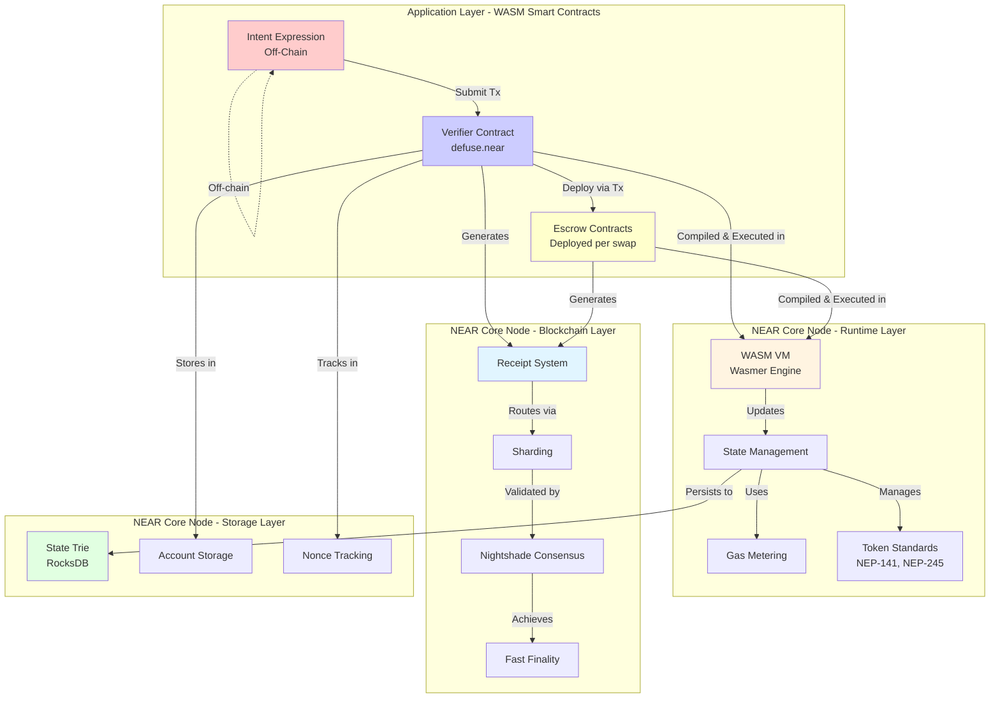

**Execution Flow:**

1. **Contract Deployment** (One-time):
   ```
   Developer → Compile Rust to WASM → Deploy to NEAR → Stored in Account
   ```

2. **Intent Execution** (Per transaction):
   ```
   User → Sign Intent → Submit Tx → NEAR Node receives
   → Runtime loads Verifier WASM → Execute in Wasmer VM
   → Update State Trie → Create Receipt → Consensus → Finalized
   ```

3. **Contract Storage**:
   - Contract WASM bytecode stored in account's `code` field
   - Contract state stored in account's key-value storage
   - Both persisted in the state trie (RocksDB)
   - Loaded into memory when contract is called

**NEAR Components Used by Intents:**

> **Note**: NEAR Intents contracts run **inside** NEAR nodes via the Runtime Layer. They are not separate node processes but WASM contracts executed on-demand when transactions invoke them.

1. **Runtime Layer** (Core Node Component)
   - WASM contract execution for Verifier & Escrow contracts
   - Wasmer VM for running WASM bytecode
   - Gas metering for all operations
   - Token standard implementation (NEP-141, NEP-245)
   - Cross-contract calls for multi-step operations

2. **Blockchain Layer** (Core Node Component)
   - Receipt system for cross-contract communication
   - Sharding for account distribution
   - Consensus for transaction finality
   - Block production for state progression

3. **Storage Layer** (Core Node Component)
   - State trie for persistent storage (RocksDB)
   - Account storage for balances & keys
   - Nonce tracking for replay protection
   - Contract bytecode storage

4. **Security Features** (Core Node Component)
   - Signature verification (NEP-413)
   - Access key management
   - Deadline enforcement
   - Atomic execution guarantees

**Novel Integration Points:**

- **Deterministic Contract Deployment**: Escrow addresses derived from parameters
- **Multi-Signature Verification**: Public key validation across accounts
- **Cross-Shard Intent Execution**: Leverages NEAR's receipt routing
- **Automatic Contract Cleanup**: Uses NEAR's self-destruct mechanism
- **Fee Distribution**: Integrates with NEAR's gas economics

### Security Architecture

**Multi-Layer Verification:**

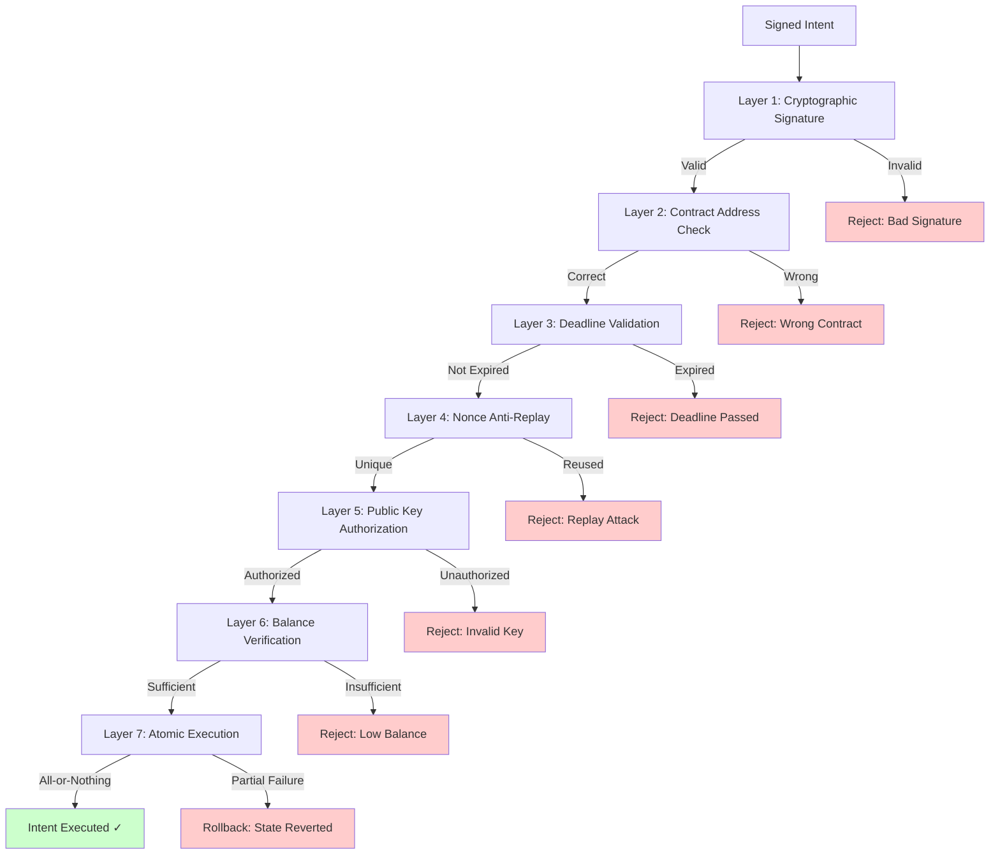

**Security Features:**
- Inherits NEAR's BFT consensus security
- Leverages NEAR's finality guarantees
- Uses NEAR's validator network for verification
- Benefits from NEAR's economic security model
- Integrates with NEAR's access control system

---

## Bridge Infrastructure

Three bridges are explicitly named as "Third-Party Components" in the 1Click Terms of Service: **OmniBridge**, **HOT Bridge**, and the **PoA Bridge**. The original **Rainbow Bridge** (NEAR ↔ Ethereum) remains active but has been largely superseded by OmniBridge for new integrations.

### Hub-and-Spoke Bridging Model

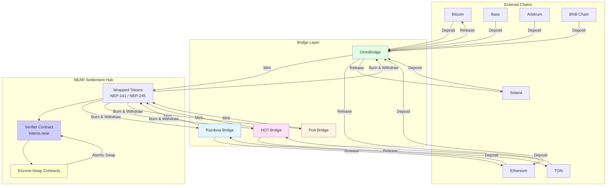

**How it works:**

1. **Deposit Phase**: Assets leave the external chain and enter NEAR as **wrapped tokens** (e.g., `nep141:eth.omft.near`). The bridge operator detects the deposit and mints an equivalent wrapped token on NEAR.
2. **Swap Phase**: The actual exchange happens entirely on NEAR — wrapped Token A is traded for wrapped Token B through an atomic swap with a solver.
3. **Withdrawal Phase**: The wrapped token is burned on NEAR, and the bridge releases the real asset on the destination chain.

### OmniBridge

The **primary multi-chain bridge** for the NEAR ecosystem, built on Chain Signatures (MPC). OmniBridge replaced Rainbow Bridge as the go-to solution for new chain integrations.

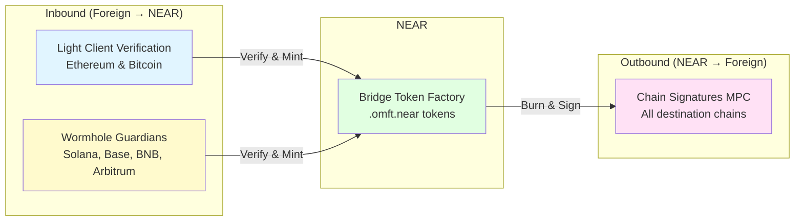

**Verification methods:**

| Direction | Chains | Verification | Trust Model |
|-----------|--------|-------------|-------------|
| **Inbound** | Ethereum, Bitcoin | Light client on NEAR | Trustless (cryptographic proof) |
| **Inbound** | Solana, Base, BNB, Arbitrum | Wormhole Guardian network | Guardian committee |
| **Outbound** | All chains | Chain Signatures (MPC) | Distributed trust across MPC validators |

#### Deposit Flow (Inbound: Foreign Chain → NEAR)

The inbound flow varies based on the source chain's verification method.

**Ethereum / Bitcoin (Light Client Verification):**

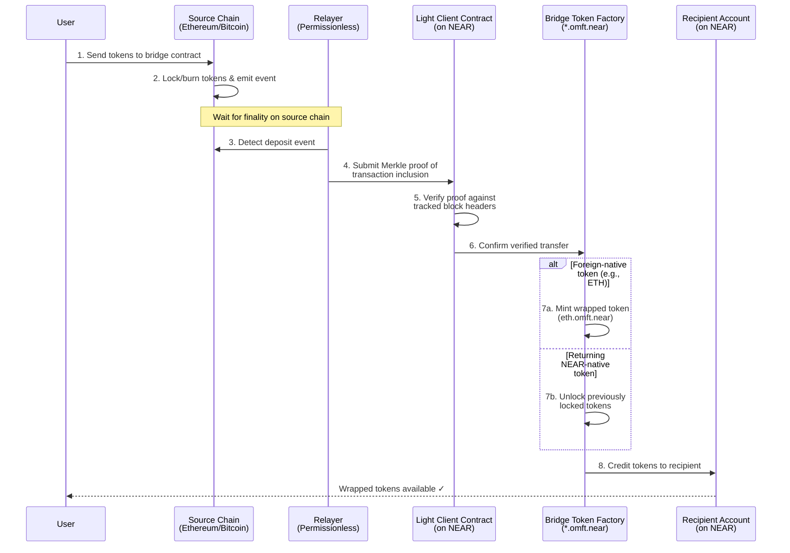

**Solana / Base / BNB / Arbitrum (Wormhole Verification):**

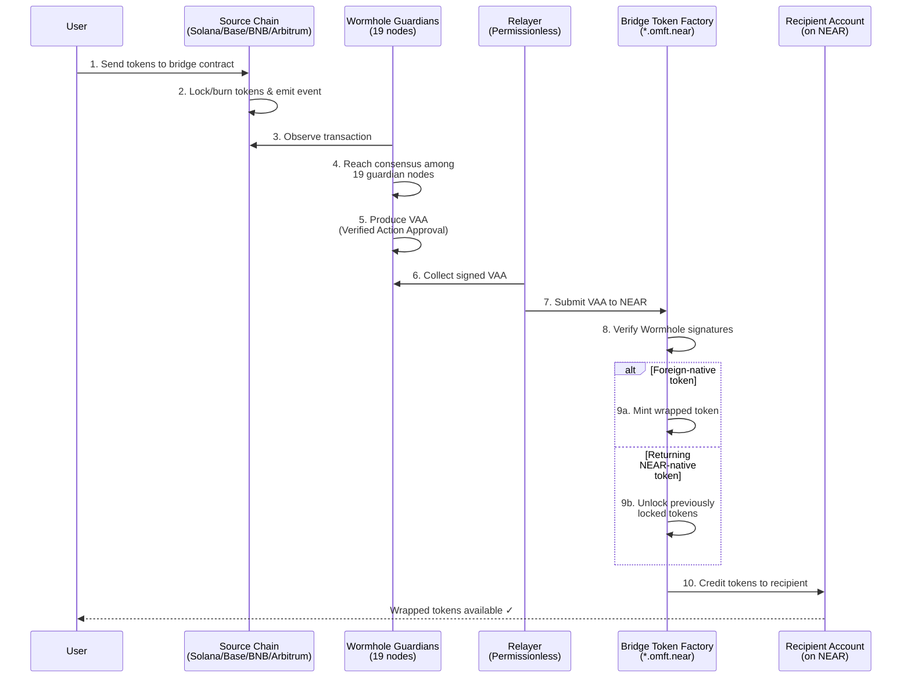

#### Withdrawal Flow (Outbound: NEAR → Foreign Chain)

All outbound transfers use the same mechanism regardless of destination chain — Chain Signatures MPC signing.

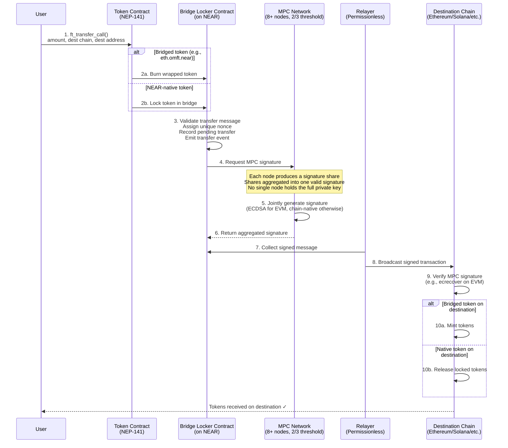

**Transfer lifecycle states:**

```
Initiated → Locked/Burned → MPC Signed → Relayed → Completed
```

#### Chain-to-Chain Transfer (e.g., Ethereum → Solana)

For transfers between two non-NEAR chains, the bridge uses **NEAR as a transparent routing layer**. Rather than minting tokens on NEAR, the bridge creates a forwarding message that routes tokens directly to the destination chain. From the user's perspective, this appears as a single operation — the relayer infrastructure handles the NEAR intermediary step automatically.

#### Fast Transfers

Standard transfers require waiting for source chain finality and MPC signing. **Fast Transfers** allow relayers to expedite this by fronting liquidity:

1. User sends a `FastFinTransferMsg` specifying the destination and a fee premium
2. A relayer **immediately transfers** equivalent tokens (minus fee) to the user on the destination chain from the relayer's own reserves
3. The bridge later **reimburses the relayer** once the original transfer is fully verified and finalized

Fast transfers trade higher fees for near-instant delivery.

#### Bridge Token Factory

The Bridge Token Factory contract on NEAR (`*.omft.near`) serves as both a token factory and custodian:

| Operation | Bridged Tokens (from other chains) | Native NEAR Tokens |
|-----------|------------------------------------|---------------------|
| **First-time bridge** | Deploys new NEP-141 token contract | N/A |
| **Inbound (deposit)** | Mints tokens | Releases (unlocks) tokens |
| **Outbound (withdrawal)** | Burns tokens | Locks tokens |

#### Relayer Network

Relayers are **permissionless** infrastructure operators who monitor for bridge events and execute cross-chain transactions. Critically, relayers **cannot**:
- Forge transfers or steal funds
- Censor transactions (users can self-relay as a fallback)
- Front-run transactions for profit
- Introduce additional security assumptions

Multiple relayers can operate simultaneously, creating competition for faster execution and lower fees. Users can bypass relayers entirely by self-relaying, which creates a natural fee ceiling.

#### Security Model

| Connection Type | Trust Assumptions |
|-----------------|-------------------|
| **Chain Signatures (all outbound)** | NEAR Protocol security (2/3+ honest validators), MPC network security (2/3+ honest nodes), no single entity controls enough MPC nodes to forge signatures |
| **Light Client (ETH/BTC inbound)** | Light client correctness, sufficient block confirmations for finality, chain-specific consensus assumptions |
| **Wormhole (SOL/Base/BNB/ARB inbound)** | Wormhole Guardian network security (13/19 honest guardians) |

#### Future: MPC-Verified Inbound

The MPC team is developing **foreign chain transaction verification** to replace Wormhole and light clients for inbound transfers. In this model, MPC nodes independently query foreign chain RPCs, run extractors over the results, and jointly sign an attestation that the foreign transaction finalized. This would unify all OmniBridge verification under Chain Signatures, eliminating the Wormhole dependency.

**Key features:**
- Permissionless relayer network — relayers cannot forge transfers, steal funds, or censor
- Supports fast transfers where relayers front liquidity for speed
- Supports ERC-1155 multi-token transfers
- Bridged tokens use the `.omft.near` suffix (e.g., `eth.omft.near`, `arb-0xaf88...omft.near`)

**Supported chains:** Ethereum, Bitcoin, Solana, Base, BNB, Arbitrum (expanding)

**Repositories:**
- [Near-One/omni-bridge](https://github.com/Near-One/omni-bridge)
- [Near-One/bridge-sdk-js](https://github.com/Near-One/bridge-sdk-js)
- [Near-One/bridge-sdk-rs](https://github.com/Near-One/bridge-sdk-rs)

### Rainbow Bridge (Legacy)

The **original trustless NEAR ↔ Ethereum bridge**, and the precursor to OmniBridge.

> *"The journey toward truly trustless cross-chain communication took a significant leap forward when the NEAR team created the first trustless bridge with Ethereum (Rainbow Bridge)."*

**Characteristics:**
- Fully trustless using light client verification on both sides
- Bridged tokens use the `<eth_address>.factory.bridge.near` naming convention
- NEAR → Ethereum transfers take **4-8 hours** due to the 4-hour challenge period (a key limitation that motivated OmniBridge)
- Still active for legacy tokens (Bridged USDC/USDC.e, Wrapped BTC, DAI, Frax, etc.)
- ETH-connector contract: `eth.bridge.near`

**Token examples:**
- `a0b86991c6218b36c1d19d4a2e9eb0ce3606eb48.factory.bridge.near` — Bridged USDC (USDC.e)
- `2260fac5e5542a773aa44fbcfedf7c193bc2c599.factory.bridge.near` — Wrapped BTC
- `6b175474e89094c44da98b954eedeac495271d0f.factory.bridge.near` — DAI

### HOT Bridge

A bridge with shared treasury infrastructure across **EVM chains, Solana, TON, and Stellar**. HOT Bridge maintains dedicated treasury and refill addresses on each supported network for AML compliance and transparency.

- Referenced in MPC docs as needing Chain Signatures support: *"Hot bridge should be able to work with this, but it would require significant refactors on their end."*
- Treasury addresses published in the NEAR Intents documentation for transparency

### PoA Bridge

A **Proof-of-Authority bridge** that uses a validator committee model rather than trustless cryptographic verification. Named in the 1Click Terms of Service and Market Maker documentation as one of the supported withdrawal bridges.

### Wormhole (Component)

**Not a standalone NEAR bridge** but used **by OmniBridge** as the inbound message-passing protocol for non-EVM chains. The Wormhole Guardian network verifies transactions from Solana, Base, BNB, and Arbitrum before tokens are minted on NEAR.

> *"Security of the underlying message passing protocol (e.g., Wormhole Guardian network)"*

The MPC team is working on migrating all inbound verification to Chain Signatures, which would eventually remove the Wormhole dependency.

### Bridge Token Standards

Bridged tokens on NEAR follow distinct naming conventions depending on which bridge was used:

| Bridge | Token Naming Pattern | Example |
|--------|---------------------|---------|
| **OmniBridge** | `<chain>-<address>.omft.near` | `arb-0xaf88...omft.near` |
| **OmniBridge** | `<symbol>.omft.near` (native assets) | `eth.omft.near` |
| **Rainbow Bridge** | `<eth_address>.factory.bridge.near` | `a0b86991...factory.bridge.near` |
| **Rainbow Bridge** | `<symbol>.bridge.near` (special) | `eth.bridge.near` |

All bridged tokens implement the **NEP-141** (fungible token) standard, with some supporting **NEP-245** (multi-token) for batch operations.

### Bridge vs Chain Signatures

A common point of confusion: NEAR has both bridges and Chain Signatures, and they serve different purposes.

```mermaid
graph TB
    subgraph "Bridge Model (NEAR Intents uses this)"
        B1[User deposits asset on Chain A] --> B2[Bridge mints wrapped token on NEAR]
        B2 --> B3[Swap wrapped tokens on NEAR]
        B3 --> B4[Bridge burns wrapped token]
        B4 --> B5[Bridge releases real asset on Chain B]
    end
    
    subgraph "Chain Signatures Model (Direct custody)"
        C1[NEAR account requests signature] --> C2[MPC network signs transaction]
        C2 --> C3[Transaction submitted to external chain]
        C3 --> C4[NEAR account controls external assets directly]
    end
    
    style B1 fill:#e1f5ff
    style B5 fill:#e1f5ff
    style C1 fill:#fffacd
    style C4 fill:#fffacd
```

| Aspect | Bridge Model | Chain Signatures Model |
|--------|-------------|------------------------|
| **How it works** | Mint/burn wrapped tokens via bridge contracts | MPC network directly signs external chain transactions |
| **Trust model** | Trust bridge operators to honor deposits/withdrawals | Distributed trust across MPC validators |
| **Used by** | NEAR Intents (for cross-chain settlement) | OmniBridge outbound, direct multi-chain account control |
| **Chain support** | Broad (depends on bridge deployment) | Any chain with standard signature schemes |
| **Latency** | Varies by bridge (seconds to hours) | Near-instant signing, subject to external chain finality |
| **Liquidity** | Requires locked liquidity in bridge contracts | No pooled liquidity needed |

**Key insight:** Chain Signatures **powers** OmniBridge's outbound path (NEAR → external chains), but NEAR Intents settlement itself uses the bridge-mediated wrapped-token model, not direct cross-chain custody.

### Bridge Service Integration

The 1Click Swap API abstracts all bridging complexity from end users:

> *"Instead of requiring users or integrators to manually coordinate multiple blockchain steps (for example, bridging assets to NEAR Protocol, posting intents, and withdrawing assets back to other chains), 1CS automates these routing and settlement steps."*

**Bridge service endpoint:** `https://bridge.chaindefuser.com/rpc`

**Bridge SDK:** [defuse-protocol/sdk-monorepo — bridge-sdk](https://github.com/defuse-protocol/sdk-monorepo/tree/main/packages/bridge-sdk)

**Fee structure:** Bridge fees, gas fees, and protocol fees are passed through to users as part of the total transaction cost.

---

## Node Types

### 1. Validator Nodes
- **Purpose**: Produce and validate blocks/chunks
- **Requirements**: Minimum stake (>25,500 NEAR), high-performance hardware
- **Rewards**: Transaction fees and inflation rewards
- **Responsibilities**: Maintain network security and liveness

### 2. RPC Nodes
- **Purpose**: Serve API requests from users and applications
- **Requirements**: Moderate hardware, good network connectivity
- **Function**: Query state, submit transactions, provide block data
- **Data Retention**: Recent epochs (configurable)

### 3. Archival Nodes
- **Purpose**: Store complete blockchain history
- **Requirements**: High storage capacity (multi-TB)
- **Function**: Historical queries, block explorers, indexing services
- **Data Retention**: All blocks since genesis

---

## Key Innovations

### 1. Asynchronous Execution
- Transactions complete across multiple blocks
- Enables safe cross-contract calls without deadlocks
- Scales better than synchronous models

### 2. Access Keys
- Multiple keys per account with different permissions
- Function-call keys for limited access (no full control)
- Full-access keys for complete account control

### 3. Developer Economics
- 30% of gas burned goes to contract developers
- Creates sustainable revenue for dApp builders
- Incentivizes optimization and usage

### 4. Named Accounts
- Human-readable account IDs (`alice.near`)
- Subaccounts for organization (`app.alice.near`)
- Simplifies user experience vs hex addresses

### 5. Fast Finality
- ~1-2 second transaction finality
- Achieved through efficient BFT consensus
- Much faster than probabilistic finality (e.g., Bitcoin)

### 6. Chain Abstraction
- **NEAR Intents**: Intent-based transaction model separating "what" from "how"
- **Chain Signatures**: Control accounts on any blockchain from NEAR
- **Multi-Chain Interoperability**: Seamless cross-chain operations
- **Solver Network**: Decentralized optimization layer

### 7. Intent-Based Execution
- Users express desired outcomes, not execution steps
- Off-chain solver competition for optimal execution
- On-chain verification and atomic settlement
- Supports complex multi-chain workflows

---

## Performance Characteristics

| Metric | Value |
|--------|-------|
| **Block Time** | ~1 second |
| **Finality** | 1-3 seconds (for simple transactions) |
| **Transaction Throughput** | Sustained >13M tx/day (proven) |
| **Transaction Cost** | ~$0.0001 - $0.03 (depending on complexity) |
| **Validator Set** | ~100 validators per epoch |
| **Epoch Duration** | ~12 hours (43,200 blocks) |
| **Max Gas per Transaction** | 300 TGas (~300ms compute) |
| **Uptime** | 100% since mainnet launch (5+ years) |

---

## Security Model

```mermaid
graph TB
    subgraph "Security Layers"
        PoS[Proof of Stake<br/>Economic Security]
        Validators[Validator Set<br/>Decentralization]
        Slashing[Slashing Conditions<br/>Penalties for Misbehavior]
        Finality[Fast Finality<br/>BFT Consensus]
    end
    
    PoS --> Validators
    Validators --> Slashing
    Slashing --> Finality
    
    Finality --> Security[Network Security]
    
    style PoS fill:#e1f5ff
    style Security fill:#ccffcc
```

**Security Properties**:
- **Economic Security**: Validators stake significant NEAR tokens
- **BFT Consensus**: Can tolerate up to 1/3 of validators being malicious
- **Slashing**: Bad actors lose their stake
- **Finality**: Once finalized, transactions cannot be reversed
- **State Proofs**: Cryptographic verification via Merkle proofs

---

## Summary

NEAR Protocol's architecture achieves a unique balance:

✅ **Scalable**: Sharding enables parallel transaction processing  
✅ **Fast**: ~1-2 second finality for most transactions  
✅ **Developer-Friendly**: WebAssembly contracts, familiar languages (Rust, JavaScript)  
✅ **User-Friendly**: Named accounts, low fees, account abstraction  
✅ **Decentralized**: 100+ validators, proof-of-stake consensus  
✅ **Sustainable**: 5+ years of 100% uptime, billions of transactions processed  

The separation of blockchain and runtime layers provides clean abstractions, allowing each layer to be optimized independently while maintaining a cohesive system that processes millions of transactions efficiently and securely.

---

## Further Reading

### Core Protocol
- [NEAR Architecture Documentation](/docs/docs/protocol/architecture.md)
- [Transaction Execution](/docs/docs/protocol/transaction-execution.md)
- [Data Flow](/docs/docs/protocol/data-flow/near-data-flow.md)
- [Validators](/docs/docs/protocol/network/validators.md)
- [Gas](/docs/docs/protocol/gas.md)
- [Nightshade Whitepaper](https://near.org/papers/Nightshade.pdf)

### Chain Abstraction
- [Chain Abstraction Overview](/docs/docs/chain-abstraction/what-is.md)
- [NEAR Intents Documentation](/docs/docs/chain-abstraction/intents/overview.md)
- [Chain Signatures](/docs/docs/chain-abstraction/chain-signatures.md)
- [Official NEAR Intents Docs](https://docs.near-intents.org)
- [NEAR Intents GitHub Repository](https://github.com/near/intents)
- [Unpacking NEAR Intents: Deep Dive](https://www.near.org/blog/unpacking-near-intents-a-deep-dive)
