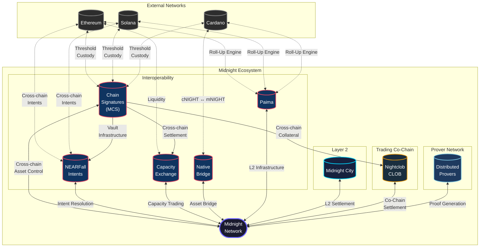
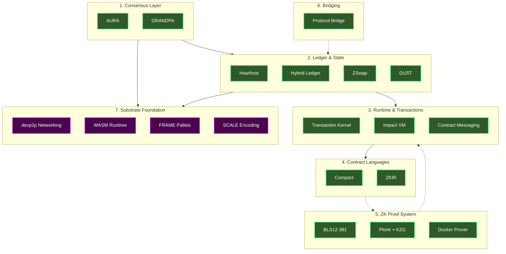
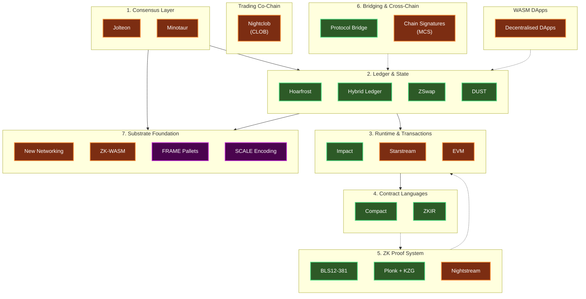

# Midnight Roadmap

## Table of Contents

- [1. Ecosystem](#1-ecosystem)
  - [Ecosystem Status & Cost Tracking](#ecosystem-status--cost-tracking)
- [2. Midnight - Core Platform Roadmap](#2-midnight---core-platform-roadmap)
  - [Component Descriptions](#component-descriptions)
  - [Node Release Roadmap](#3-node-release-roadmap)
- [Research & Development](#research--development)
- [Capability Roadmap](#capability-roadmap)

---

# 1. Ecosystem

## Ecosystem Status & Cost Tracking

| Component | Responsible | Accountable | Cost | Status |
|-----------|-------------|-------------|------|--------|
| **Interoperability** |
| Chain Signatures (MCS) | Allan | TBD | TBD | TBD |
| NEARFall (Intents) | Allan | TBD | TBD | TBD |
| Capacity Exchange | Pi | TBD | TBD | TBD |
| Native Bridge | Jon | TBD | TBD | TBD |
| Paima | Seba | TBD | TBD | TBD |
| **Core Network** |
| Midnight Network | Mike | TBD | TBD | TBD |
| **Layer 2** |
| L2 | Nico | TBD | TBD | TBD |
| **Trading Co-Chain** |
| Nightclob (CLOB) | TBD | TBD | TBD | TBD |
| **Prover Network** |
| Distributed Provers | Ben | TBD | TBD | TBD |

---

# 2. Midnight - Core Platform Roadmap

## Component Descriptions

**1. Consensus Layer** — Block production and finality mechanisms

| Component | Description |
|-----------|-------------|
| AURA | Slot-based block production with SPO validators |
| GRANDPA | Byzantine fault-tolerant finality gadget |

**2. Ledger & State** — State storage and token management

| Component | Description |
|-----------|-------------|
| Hoarfrost | Persistent Merkle-Patricia Trie state storage with O(1) cloning |
| Hybrid Ledger | Combined UTXO + Account model for flexible token handling |
| ZSwap | Multi-asset privacy layer for shielded transactions |
| DUST | Renewable fee resource generated from registered NIGHT |

**3. Runtime & Transactions** — Execution layer for all transaction types

| Component | Description |
|-----------|-------------|
| Transaction Kernel | Core execution engine handling DUST, ZSwap, and contract calls |
| Impact | Interpreter for executing compiled Compact contracts |
| Contract Messaging | Committed message passing for contract-to-contract communication |

**4. Contract Languages** — Developer tooling for smart contracts

| Component | Description |
|-----------|-------------|
| Compact | TypeScript-inspired language with public/private state separation |
| ZKIR | Circuit intermediate representation for ZK proof compilation |

**5. ZK Proof System** — Zero-knowledge cryptography infrastructure

| Component | Description |
|-----------|-------------|
| BLS12-381 | Industry-standard pairing-friendly elliptic curves |
| Plonk + KZG | SNARK proving system with polynomial commitments |
| Docker Prover | Containerised prover for easy deployment |

**6. Bridging & Cross-Chain** — Cross-chain interoperability and native asset control

| Component | Description |
|-----------|-------------|
| Protocol Bridge | Bidirectional cNIGHT ↔ mNIGHT bridge to Cardano |
| Chain Signatures (MCS) | Threshold cryptography enabling Midnight validators to collectively control wallets on external chains (Ethereum, Solana, Cardano). Allows Midnight to encumber, escrow, and release native assets on their origin chain without wrapping or bridging. First deployed as vault infrastructure for NEARFall intents, then integrated into mainnet via Compact contracts for general-purpose cross-chain asset control. |

**7. Substrate Foundation** — Underlying blockchain framework from Parity

| Component | Description |
|-----------|-------------|
| devp2p Networking | Peer-to-peer communication and node discovery |
| WASM Runtime | WebAssembly-based runtime enabling forkless upgrades |
| FRAME Pallets | Modular components for blockchain functionality |
| SCALE Encoding | Deterministic, compact serialization for storage and networking |

**Ecosystem Components** — Higher-level execution environments built on the core platform

| Component | Description |
|-----------|-------------|
| Midnight City | General-purpose L2 for composable DeFi (lending, AMMs, intents, stablecoin transfers). Targets 100-500 TPS while preserving Midnight's privacy guarantees. |
| Nightclob | Purpose-built Substrate-based trading co-chain for CLOB spot trading and perpetual futures. Targets 10,000+ TPS with sub-100ms block times. Operated by a subset of Midnight validators sharing the same trust model. Settles to Midnight L1 as the root of trust. Uses MCS-custodied vaults for cross-chain collateral (BTC, ETH, SOL). Shielded order flow provides institutional-grade confidentiality — orders are encrypted until execution, preventing front-running, queue-jumping, and information extraction. |

## 3. Node Release Roadmap

```mermaid
flowchart LR
    HILO["0.1 Hilo<br/>Token Launch"]
    KUKOLU["1.0 Kūkolu<br/>Network Launch"]
    V11["1.1"]
    V12["1.2"]
    MOHALU["2.0 Mōhalu<br/>Decentralisation"]
    HUA["3.0 Hua<br/>Integration"]
    V40["4.0<br/>Cross-Chain Privacy"]
    FUTURE["Future (TBD)"]

    HILO --> KUKOLU
    KUKOLU --> V11
    V11 --> V12
    V12 --> MOHALU
    MOHALU --> HUA
    HUA --> V40
    V40 --> FUTURE

    %% Styling
    classDef completed fill:#2d5a27,stroke:#4ade80,stroke-width:3px,color:#fff
    classDef current fill:#1e3a5f,stroke:#60a5fa,stroke-width:3px,color:#fff
    classDef future fill:#4a044e,stroke:#c026d3,stroke-width:2px,color:#fff
    classDef tbd fill:#2d2d2d,stroke:#888,stroke-width:2px,color:#fff

    class HILO,KUKOLU completed
    class V11 current
    class V12,MOHALU,HUA,V40 future
    class FUTURE tbd
```

### 0.1 Hilo — Token Launch ✅

- NIGHT TGE
- Exchange Listings

### 1.0 Kūkolu — Network Launch 🚀

- Genesis Block
- Mainnet Activation
- Docker Prover
- Lace Wallet

#### 1.1 Release

- Protocol Bridge : cNIGHT → mNIGHT
- ZKIR v3
- Hosted TEE Prover
- Partner Wallets

#### 1.2 Release

- Composable Contracts
- Additional crypto schemes

### 2.0 Mōhalu — Decentralisation

- Incentivized Testnet
- Capacity Exchange
- WASM Prover

### 3.0 Hua — Integration

- Hybrid DApps
- Jolteon Consensus (Liveness Proof & Substrate Integration)
- Chain Signatures v1: Threshold-signature vaults for NEARFall intents (cross-chain asset custody for intent resolution)
- Nightclob: Architecture design and development begin (Substrate-based CLOB co-chain)

### 4.0 — Cross-Chain Privacy

- Chain Signatures v2: Mainnet integration via Compact contracts (general-purpose cross-chain asset control accessible to all DApps)
- Capacity Exchange via MCS (BTC/ETH/SOL/ADA → DUST without bridges)
- Nightclob v1: Production CLOB co-chain with spot trading, shielded order flow, and MCS-custodied cross-chain collateral

### Future (TBD)

- Minotaur: NIGHT Staking
- Full Decentralisation
- Mobile Prover
- DApp Explorer (Lace)
- GPU acceleration
- Protocol Bridge : mNIGHT-to-cNIGHT
- Wallet Free UX (Embeded Lace)

---

# Research & Development

# Capability Roadmap

Each release delivers platform capabilities that unlock ecosystem possibilities. This section maps what we build to what it enables — distinguishing between deliverables we control and ecosystem outcomes that depend on third parties building on those capabilities.

## 0.1 Hilo — Token Launch ✅

**We built**

- NIGHT token generation event
- Exchange listings

**Capabilities delivered**

- NIGHT token exists as a tradeable asset

**Ecosystem unlocked**

- Market price discovery for NIGHT
- Foundation for staking economics

## 1.0 Kūkolu — Network Launch 🚀

**We built**

- Genesis block and mainnet activation
- Docker Prover
- Lace Wallet
- Compact smart contract language and deployment pipeline
- ZSwap privacy layer
- Selective disclosure via ZK proofs

**Capabilities delivered**

- Privacy-by-default transactions — all transactions are shielded unless explicitly made public
- Smart contract deployment via Compact with public/private state separation
- Selective disclosure — users and contracts can prove facts (KYC status, accredited investor, jurisdiction) without revealing underlying data
- Client-side ZK proof generation via Docker Prover

**Ecosystem unlocked**

- Developers can deploy privacy-preserving smart contracts
- Users can transact with privacy as the architectural default, not an opt-in feature
- Identity and compliance providers can build selective disclosure attestations (ZK-based KYC, accredited investor verification) on top of the existing proof system
- The >90% shielded transaction rate that Zcash never achieved becomes the baseline — privacy is not optional

## 1.1

**We build**

- Protocol Bridge: cNIGHT → mNIGHT (Cardano connectivity)
- ZKIR v3 (improved circuit compilation)
- Hosted TEE Prover (hardware-accelerated proof generation)
- Partner wallet integrations

**Capabilities delivered**

- NIGHT token movement between Cardano and Midnight
- Faster, more efficient ZK circuit compilation
- Hardware-accelerated proof generation — significantly reduced proof times
- Multi-wallet access beyond Lace

**Ecosystem unlocked**

- Cardano community can participate via bridged NIGHT — SPOs and ADA holders gain access to the Midnight ecosystem
- TEE prover improves UX for all applications — faster proofs mean shorter wait times for transactions
- Partner wallets (MetaMask, others) give Ethereum and broader DeFi users an entry point
- Developer experience improves — ZKIR v3 makes building with ZK proofs more practical

## 1.2

**We build**

- Composable Contracts (cross-contract circuit calls)
- Additional cryptographic schemes

**Capabilities delivered**

- Cross-contract ZK composition — one contract can invoke another with ZK proofs preserved across the call boundary
- DeFi composability primitive — the ability for contracts to interoperate is the prerequisite for any meaningful DeFi stack
- Selective disclosure becomes composable — an attestation issued by one contract can be verified and consumed by another

**Ecosystem unlocked**

- DeFi applications become *buildable*. AMMs, lending protocols, vaults, and any multi-contract application require composability to function. Before 1.2, each contract is an island. After 1.2, third-party developers can build the full DeFi stack.
- A KYC attestation issued once can be consumed across multiple DeFi protocols — a user proves compliance once and participates in multiple applications without re-proving
- This is the release that makes the grant-funded DeFi development tracks (AMM reference implementation, lending protocol) technically feasible

## 2.0 Mōhalu — Decentralisation

**We build**

- Incentivized Testnet
- Capacity Exchange
- WASM Prover

**Capabilities delivered**

- Decentralized validation — network moves beyond federated operators to a permissionless validator set
- Multi-token gas payment — BTC, ETH, ADA, and SOL accepted as payment for DUST via capacity exchange
- Browser and mobile-capable proof generation — WASM prover removes the Docker dependency

**Ecosystem unlocked**

- Users from any chain can transact on Midnight without acquiring NIGHT or DUST directly. The "use your existing tokens" onboarding eliminates the single largest friction point for new chain adoption.
- Validator set expansion improves decentralization metrics, security guarantees, and the Nakamoto coefficient — prerequisites for institutional confidence
- WASM prover enables lightweight client applications — proofs can run in browsers, opening the door for web-based DeFi front-ends without server dependencies
- User-space bridges (Wormhole, LayerZero) now have a stable, decentralized network to integrate with — their integration becomes possible at this point
- Oracle providers (Chainlink, Pyth) can deploy price feeds against a decentralized validator set

## 3.0 Hua — Integration

**We build**

- Hybrid DApps (cross-chain application framework)
- Jolteon Consensus (BFT with formal liveness guarantees)
- Chain Signatures v1: threshold-signature vaults for NEARFall intents
- Nightclob: architecture design and development begins

**Capabilities delivered**

- Applications can span Midnight and external chains in a single user flow
- BFT consensus with formal liveness guarantees — production-grade consensus replacing the initial federated model
- Threshold-signature custody on external chains — Midnight validators collectively control wallets on Ethereum, Solana, and Cardano (initially scoped to NEARFall intent resolution)
- NEARFall cross-chain intents — users can express an intent on one chain and have it resolved across chains with privacy

**Ecosystem unlocked**

- NEARFall goes live — cross-chain intent resolution is the first production use of chain signatures. A user on Ethereum can express a swap intent that resolves privately through Midnight.
- Jolteon opens the path to native NIGHT staking via Minotaur — the consensus layer now supports the staking model
- User-space bridges gain threshold-custody backing, enabling stronger security models than multi-sig
- Institutional custody providers (Fireblocks, Copper) can integrate against a production-grade BFT consensus — a prerequisite for institutional capital deployment
- Stablecoin issuers see a network with decentralized BFT consensus, cross-chain reach via intents, and composable DeFi — the prerequisites for native issuance conversations become real
- Chain signatures infrastructure is proven in production through NEARFall, de-risking the Nightclob dependency on MCS

## 4.0 — Cross-Chain Privacy

**We build**

- Chain Signatures v2: mainnet integration via Compact contracts (general-purpose cross-chain asset control)
- Capacity Exchange via MCS (replacing bridge-based capacity exchange)
- Nightclob v1: production CLOB co-chain (depends on MCS being production-ready)

**Capabilities delivered**

- Any Compact smart contract can control assets on external chains — general-purpose cross-chain escrow, encumbrance, and release without wrapping or bridging
- Capacity exchange operates through MCS threshold custody rather than bridges — lower trust assumptions, no bridge risk
- CLOB trading with shielded order flow at 10,000+ TPS with sub-100ms block times, using MCS-custodied vaults for cross-chain collateral

**Ecosystem unlocked**

- The full Pillar 2 thesis is realized. Midnight is no longer a destination chain — it is a privacy layer for the multi-chain economy.
- Stablecoins on origin chains (USDC on Ethereum, USDT on Solana) become accessible from Midnight DApps without wrapping. This is when native stablecoin conversations convert to live integrations.
- Cross-chain lending becomes possible — BTC collateral stays on Bitcoin, loan issued on Midnight, all controlled by Compact contracts via MCS
- Institutional trading venue competitive with CEXs on execution quality. Shielded order flow means market makers can quote without exposing risk limits, traders can place orders without signaling intent. Nightclob is the first on-chain venue where this is architecturally guaranteed.
- Oracle providers (Chainlink, Pyth) feed prices to both Midnight L1 and Nightclob
- Asset issuers (Securitize, Ondo) can tokenize on Midnight knowing the distribution reaches Ethereum, Bitcoin, and Solana natively via chain signatures
- Perpetual futures follow spot on Nightclob — the highest-volume DeFi workload becomes available with the same privacy guarantees
- The exclusive asset thesis (Pillar 1) and the cross-chain privacy thesis (Pillar 2) are both fully operational for the first time

## Future (TBD)

**We build**

- Minotaur: native NIGHT staking
- Midnight City: general-purpose L2 (100-500 TPS)
- Full decentralisation
- Mobile Prover
- DApp Explorer (Lace)
- GPU acceleration
- Protocol Bridge: mNIGHT-to-cNIGHT (reverse direction)
- Wallet Free UX (Embedded Lace)

**Capabilities delivered**

- Native NIGHT staking for network security with validator economics
- L2 execution environment for composable DeFi at 100-500 TPS while preserving privacy guarantees
- Mobile-native proof generation
- Embedded wallet experiences without explicit wallet management

**Ecosystem unlocked**

- Midnight City hosts the high-throughput composable DeFi workloads — lending, AMMs, intents, stablecoin transfers — that need more than L1's TPS but don't require Nightclob's trading-optimized architecture
- Mobile prover brings privacy-preserving transactions to mobile-first users
- Native NIGHT staking completes the validator economics model and enables the full decentralization of the network
- Embedded wallets lower the UX barrier for mainstream adoption — users interact with Midnight without needing to understand wallet management