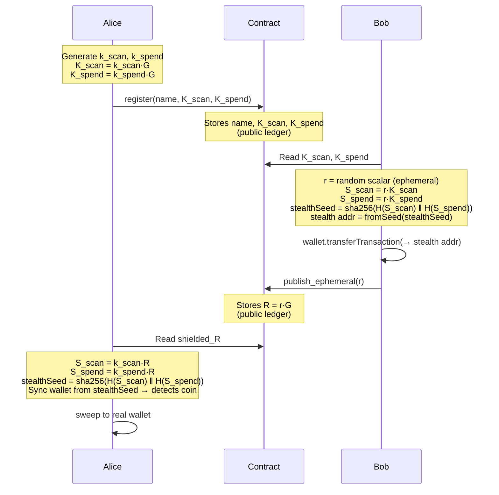

# Named-Account Experiments for Midnight

## Single Named Account

### Summary

A minimal Midnight proof-of-concept for a stealth meta-address name registry. A single named account stores three public ledger fields on-chain:

- **name** — a human-readable identifier (e.g. `alice.midnight`)
- **K_scan** — the scan public key (Jubjub curve point, `NativePoint`)
- **K_spend** — the spend public key (Jubjub curve point, `NativePoint`)

The private scalars `k_scan` and `k_spend` are generated locally and saved to `${name}.json`. Public keys are derived via `k * G` on the Jubjub curve and stored on-chain via the `register` circuit. Senders use `(K_scan, K_spend)` to derive one-time stealth addresses; only the holder of the private scalars can identify and spend from those addresses.

Full technical analysis — including the rationale for the two-key design, privacy properties of each transfer path, Compact API impediments and workarounds, and platform improvement recommendations — is in [design-notes.md](./design-notes.md).

---

### Workflow



**Security properties:**
- Bob knows neither `k_scan` nor `k_spend` — he uses only the public points `K_scan` and `K_spend`.
- `stealthSeed` requires **both** ECDH results; holding `k_scan` alone is insufficient to derive it or spend the coin.
- A view-key holder of `(k_scan, K_spend)` can detect payments via the unshielded escrow path (where `P = K_spend + h·G` is stored publicly) but cannot derive `stealthSeed` and cannot spend shielded coins.

---

### Why Two Keys: Scan and Spend

The stealth meta-address scheme deliberately separates the scan function from the spend function:

| Key | Private scalar | Public point | Purpose |
|-----|---------------|--------------|---------|
| Scan | `k_scan` | `K_scan = k_scan·G` | Identifies incoming payments |
| Spend | `k_spend` | `K_spend = k_spend·G` | Authorises outgoing transfers |

**How it works:**
- The sender picks an ephemeral scalar `r`, computes `R = r·G` (published on-chain) and two shared secrets `S_scan = r·K_scan` and `S_spend = r·K_spend`.
- The stealth seed is `sha256(H(S_scan) ‖ H(S_spend))`, from which a one-time ZSwap wallet is derived.
- Alice scans by computing `S_scan = k_scan·R` and `S_spend = k_spend·R` independently (ECDH), then deriving the same seed and syncing a temporary wallet to detect the note.

**The privacy benefit of separation:**
Because scanning and spending require different secrets, Alice can delegate scanning to a watch-only service — for example a mobile wallet, a tax auditor, or an exchange — by sharing her *view key* `(k_scan, K_spend)`. The view key is sufficient to detect incoming payments via the unshielded escrow path but provides **zero spending authority** over shielded coins: deriving `stealthSeed` requires both private scalars.

Without this split, any entity capable of watching for incoming payments could also drain the wallet. The two-key design mirrors the stealth meta-address scheme described in [ERC-5564](https://eips.ethereum.org/EIPS/eip-5564) and in the Zcash Sapling shielded address design. See [design-notes.md Parts 1–2](./design-notes.md) for the full privacy feasibility analysis.

---

### Instructions

#### Prerequisites

- Node.js 20+
- A funded Midnight preprod wallet (mnemonic)

#### Build

```bash
npm install
npm run compile   # compile the Compact contract
```

#### Deploy

```bash
npm run deploy
```

Prompts for a wallet mnemonic, deploys the contract, and writes `deployment.json`.

#### Register a name

```bash
npm run register
```

Prompts for a wallet mnemonic and a name. Reads private scalars from `${name}.json` if it exists; otherwise generates new scalars, saves them to `${name}.json`, and registers the derived public keys on-chain.

> **Keep `${name}.json` secret** — it contains your private scalars.

#### Query contract state

```bash
npm run contract-state
```

Reads `deployment.json` and prints the current on-chain `name`, `K_scan`, and `K_spend`.

#### Check wallet balance

```bash
npm run balance
```

#### Send shielded tokens (Bob)

```bash
npm run shielded-send
```

Looks up the registered name's `K_scan` and `K_spend`, derives a one-time stealth address using a fresh ephemeral scalar `r`, transfers shielded tokens to that address via `wallet.transferTransaction`, and publishes `R = r·G` on-chain via `publish_ephemeral` so Alice can scan.

Requires:
- A funded wallet with a shielded token balance (any token type).
- The proof server running at `localhost:6300` (for the `publish_ephemeral` ZK proof).

#### Scan and sweep (Alice)

```bash
npm run shielded-scan
```

Reads `shielded_R` from the contract, derives the same `stealthSeed` using `k_scan` and `k_spend` from `${name}.json`, initialises a temporary wallet from the seed, and syncs it to detect any coins. If a balance is found, offers to sweep all detected tokens to Alice's real shielded address (prompts for mnemonic to pay fees).

---

### Unshielded Escrow Path

For an unshielded tNIGHT escrow (public amount), use:

```bash
npm run send    # Bob: deposit tNIGHT into escrow with stealth address P
npm run scan    # Alice: scan, verify ownership, and claim
```

The unshielded path stores `P = K_spend + h·G` and the amount publicly on-chain.

---

## Example

Contract Address: [1ce6f632867d686be000268d60fbb31c4f1c490e049e3aaea0fd30ab5eedcabe](https://www.midnightexplorer.com/contracts?search=1ce6f632867d686be000268d60fbb31c4f1c490e049e3aaea0fd30ab5eedcabe)

| Action             | Transaction                                                                                                                                                                  |
|--------------------|------------------------------------------------------------------------------------------------------------------------------------------------------------------------------|
| Deploy contract    | [0xbb1cd9171eea4c855d12c4b13d3679cd7f1f11b41cafb5473ec6fff5833cad99](https://www.midnightexplorer.com/tx/0xbb1cd9171eea4c855d12c4b13d3679cd7f1f11b41cafb5473ec6fff5833cad99) |
| Register name      | [0x4a7fe8883c506b9cdd5e7f041a3207d7342f4145c3655e68f1dc8871145e499a](https://www.midnightexplorer.com/tx/0x4a7fe8883c506b9cdd5e7f041a3207d7342f4145c3655e68f1dc8871145e499a) |
| Send funds         | [0xa1c91cadb4f8f507eed1f0d7c3a9baa40a55c4a0313691c5b09d149d3f6a3e6c](https://www.midnightexplorer.com/tx/0xa1c91cadb4f8f507eed1f0d7c3a9baa40a55c4a0313691c5b09d149d3f6a3e6c) |
| Publish sent funds | [0xcc7f0251a6990478ae9f359e3969fa347e050c7469dffde75bbac2f06d74748b](https://www.midnightexplorer.com/tx/0xcc7f0251a6990478ae9f359e3969fa347e050c7469dffde75bbac2f06d74748b) |
| Sweep funds        | [0x23ff97a0a2ce5bd7d63949158865991df9db720b43fe88868a0cfc7116d0d597](https://www.midnightexplorer.com/tx/0x23ff97a0a2ce5bd7d63949158865991df9db720b43fe88868a0cfc7116d0d597) |

```console
$ npm run compile

> compact-named-accounts@1.0.0 compile
> compact compile contracts/single-named.compact contracts/managed/single-named

Compiling 4 circuits:
  circuit "claim" (k=11, rows=1747)
  circuit "publish_ephemeral" (k=10, rows=578)
  circuit "register" (k=7, rows=70)
  circuit "send" (k=10, rows=685)
Overall progress [====================] 4/4

$ npm run deploy

> compact-named-accounts@1.0.0 deploy
> tsx src/deploy.ts

╔══════════════════════════════════════════════════════════════╗
║        Deploy Single Named Contract — Midnight Preprod       ║
╚══════════════════════════════════════════════════════════════╝

─── Wallet Setup ───────────────────────────────────────────────

Enter your mnemonic: *****

--- Account Addresses ---

Unshielded : mn_addr_preprod1tqcl5yytaawn4chdwaqp35synp3w2xpclcv9r4uvst4rlg2kul5qft769v
Shielded   : mn_shield-addr_preprod15xtxvtv4svrtslf9zgqexp9errqyq9ktxfpdftnutw4tkwzg029tekpzlgw3s0788cpzn5drad5n3k3whfqly8h05cn9mjuyukztjfqxkdmzn
Dust       : mn_dust_preprod1wwwgnz45r007ecg7x85tpewqpnr0kr85l0zf40zaxpmtx92e7wdxxe6qjfn

Creating wallet...
Syncing wallet to network . . . . . . . . . .
Wallet Synced!

Wallet Address: mn_addr_preprod1tqcl5yytaawn4chdwaqp35synp3w2xpclcv9r4uvst4rlg2kul5qft769v

--- Wallet Balances ---

Shielded:
5260e3017099ddeeb59062569f0bd6c26a6df9b4d3b69909ceadf1303191be8c: 2693

Unshielded:
0000000000000000000000000000000000000000000000000000000000000000: 2000000000

Dust: 5350191687999999982

─── Deploy Contract ────────────────────────────────────────────

Deploying contract (this may take 30-60 seconds)...

✅ Contract deployed successfully!

Contract Address: 1ce6f632867d686be000268d60fbb31c4f1c490e049e3aaea0fd30ab5eedcabe

Saved to deployment.json

─── Deployment Complete! ───────────────────────────────────────

$ npm run contract-state

> compact-named-accounts@1.0.0 contract-state
> tsx src/contract-state.ts

╔══════════════════════════════════════════════════════════════╗
║        Contract State — Midnight Preprod                     ║
╚══════════════════════════════════════════════════════════════╝

Contract: 1ce6f632867d686be000268d60fbb31c4f1c490e049e3aaea0fd30ab5eedcabe

─── Public State ───────────────────────────────────────────────

name           :
k_scan         : (0x0, 0x0)
k_spend        : (0x0, 0x0)

pending_amount : 0 tDUST
pending_R      : (0x0, 0x0)
pending_P      : (0x0, 0x0)

shielded_R     : (0x0, 0x0)

$ npm run register

> compact-named-accounts@1.0.0 register
> tsx src/register.ts

╔══════════════════════════════════════════════════════════════╗
║      Single Named Account — Register                         ║
╚══════════════════════════════════════════════════════════════╝

Contract: 1ce6f632867d686be000268d60fbb31c4f1c490e049e3aaea0fd30ab5eedcabe

Enter your mnemonic: *****

--- Account Addresses ---

Unshielded : mn_addr_preprod1tqcl5yytaawn4chdwaqp35synp3w2xpclcv9r4uvst4rlg2kul5qft769v
Shielded   : mn_shield-addr_preprod15xtxvtv4svrtslf9zgqexp9errqyq9ktxfpdftnutw4tkwzg029tekpzlgw3s0788cpzn5drad5n3k3whfqly8h05cn9mjuyukztjfqxkdmzn
Dust       : mn_dust_preprod1wwwgnz45r007ecg7x85tpewqpnr0kr85l0zf40zaxpmtx92e7wdxxe6qjfn

Creating wallet...
Syncing wallet to network . . . . . . . . . .
Wallet Synced!

Name to register (e.g. alice.midnight): mesonuktion.midnight

Loaded scalars from mesonuktion.midnight.json.

Derived public keys (will be stored on-chain):
  K_scan  x: 0x4aec0e0a946adac2cd9aa40698700c5fbd0037a814b2c1d6be44b8f396af92c4
  K_scan  y: 0x5bf5dece565f71720a1964208d612f6cbf1cf0faa6f53a936c22897d29ba663c
  K_spend x: 0x5e76326d86169af461d67155064a76895988b7d1faa2118a453c337b3e73d364
  K_spend y: 0x6cce69a87a5909f8f7c1ac89d6dcf414a3a54cfd7ec5dae57c8886bbad3b1a28

Register "mesonuktion.midnight"? [y/N] y

Submitting transaction (this may take 20-30 seconds)...

✅ "mesonuktion.midnight" registered successfully.
   Transaction: 003be829cf807cdb988970f5cbb49f0cace41b01d6972afb075837fb55caa9f4eb
   Block:       118894
   Contract:    1ce6f632867d686be000268d60fbb31c4f1c490e049e3aaea0fd30ab5eedcabe

$ json2yaml mesonuktion.midnight.json

name: mesonuktion.midnight
kScanScalar: '0x12270632e2ff74c80adabe81078c9708a491316cfdab384a2a8350bdbdfa904'
kSpendScalar: '0x616a0cb7ad87bf0d19a8479d56c9896d4a3498f66f6064e4553b740afb682b8'

$ npm run contract-state

> compact-named-accounts@1.0.0 contract-state
> tsx src/contract-state.ts

╔══════════════════════════════════════════════════════════════╗
║        Contract State — Midnight Preprod                     ║
╚══════════════════════════════════════════════════════════════╝

Contract: 1ce6f632867d686be000268d60fbb31c4f1c490e049e3aaea0fd30ab5eedcabe

─── Public State ───────────────────────────────────────────────

name           : mesonuktion.midnight
k_scan         : (0x4aec0e0a946adac2cd9aa40698700c5fbd0037a814b2c1d6be44b8f396af92c4, 0x5bf5dece565f71720a1964208d612f6cbf1cf0faa6f53a936c22897d29ba663c)
k_spend        : (0x5e76326d86169af461d67155064a76895988b7d1faa2118a453c337b3e73d364, 0x6cce69a87a5909f8f7c1ac89d6dcf414a3a54cfd7ec5dae57c8886bbad3b1a28)

pending_amount : 0 tDUST
pending_R      : (0x0, 0x0)
pending_P      : (0x0, 0x0)

shielded_R     : (0x0, 0x0)


$ npm run shielded-send

> compact-named-accounts@1.0.0 shielded-send
> tsx src/shielded-send.ts

╔══════════════════════════════════════════════════════════════╗
║       Single Named Account — Shielded Send                   ║
╚══════════════════════════════════════════════════════════════╝

Contract: 1ce6f632867d686be000268d60fbb31c4f1c490e049e3aaea0fd30ab5eedcabe

Recipient : mesonuktion.midnight
K_scan.x  : 0x4aec0e0a946adac2cd9aa40698700c5fbd0037a814b2c1d6be44b8f396af92c4
K_spend.x : 0x5e76326d86169af461d67155064a76895988b7d1faa2118a453c337b3e73d364

Derived stealth address:
  R.x     : 0x2d148cf95bd7a40271ee7c0c16583d27e0d4064a3f8a8ac35e75caa00626e197
  Address : mn_shield-addr_preprod15vzxhyene9xy65tfmm7tuapr7ee9telu286krzpur2kaea2273t86dst64r4aax74gqu0k848mvhxrnu5f7au40u82tnkrsxrvhq04gaj4yxe

Enter your (Bob's) mnemonic: *****

--- Account Addresses ---

Unshielded : mn_addr_preprod17h3dsutzwjt3fxk27s2rffx2llescyyl7030md8mxq8g8y4s89fshsj3jc
Shielded   : mn_shield-addr_preprod1l5s6qnquke4d88zzh0f0mnw6548k0dtze3c793hlxlu27n5qsh28a4w0nfs29r9x7apq9d802s2updrl8nk8mhfq84uq3p584nsfgzgfzwupl
Dust       : mn_dust_preprod1w0uugxzxd92tku9eku0sjgjpx0dxln4v8h6f35pf2x0rn4z9cr7qwgzhfer

Creating wallet...
Syncing wallet to network . . . . . . . . . .
Wallet Synced!

--- Wallet Balances ---

Shielded:
5260e3017099ddeeb59062569f0bd6c26a6df9b4d3b69909ceadf1303191be8c: 5

Unshielded:
0000000000000000000000000000000000000000000000000000000000000000: 2000000000

Dust: 5359876199999999994

Your shielded balances:
  [1] 5260e3017099ddeeb59062569f0bd6c26a6df9b4d3b69909ceadf1303191be8c : 5

Using token: 5260e3017099ddeeb59062569f0bd6c26a6df9b4d3b69909ceadf1303191be8c
Amount to send (available: 5): 2

Send 2 of 5260e3017099ddeeb59062569f0bd6c26a6df9b4d3b69909ceadf1303191be8c to "mesonuktion.midnight"? [y/N] y

Building shielded transfer...
Signing...
Finalizing and submitting...

✅ Transfer submitted.
   Transaction: 0048dd0695aeaee3be554bb0129fe3e57e775577330f3f8087494dcaf3c06c0b4a

Publishing R via publish_ephemeral...
(Requires proof server at localhost:6300)

✅ R published on-chain.
   Transaction: 000dfeca0858a11103435081eb086fbdc5b9b88fb0aec0fa082c34e8cbefe112bc
   Block:       118919

Alice can now claim using: npm run shielded-scan

$ npm run contract-state

> compact-named-accounts@1.0.0 contract-state
> tsx src/contract-state.ts

╔══════════════════════════════════════════════════════════════╗
║        Contract State — Midnight Preprod                     ║
╚══════════════════════════════════════════════════════════════╝

Contract: 1ce6f632867d686be000268d60fbb31c4f1c490e049e3aaea0fd30ab5eedcabe

─── Public State ───────────────────────────────────────────────

name           : mesonuktion.midnight
k_scan         : (0x4aec0e0a946adac2cd9aa40698700c5fbd0037a814b2c1d6be44b8f396af92c4, 0x5bf5dece565f71720a1964208d612f6cbf1cf0faa6f53a936c22897d29ba663c)
k_spend        : (0x5e76326d86169af461d67155064a76895988b7d1faa2118a453c337b3e73d364, 0x6cce69a87a5909f8f7c1ac89d6dcf414a3a54cfd7ec5dae57c8886bbad3b1a28)

pending_amount : 0 tDUST
pending_R      : (0x0, 0x0)
pending_P      : (0x0, 0x0)

shielded_R     : (0x2d148cf95bd7a40271ee7c0c16583d27e0d4064a3f8a8ac35e75caa00626e197, 0x5165dd21862029409aabb028ffcc9678be272fac12ec4fd717b14e349859d358)

$ npm run shielded-scan

> compact-named-accounts@1.0.0 shielded-scan
> tsx src/shielded-scan.ts

╔══════════════════════════════════════════════════════════════╗
║       Single Named Account — Shielded Scan & Sweep           ║
╚══════════════════════════════════════════════════════════════╝

Your registered name (e.g. alice.midnight): mesonuktion.midnight

shielded_R.x : 0x2d148cf95bd7a40271ee7c0c16583d27e0d4064a3f8a8ac35e75caa00626e197

─── Stealth wallet ─────────────────────────────────────────────

Stealth address : mn_shield-addr_preprod15vzxhyene9xy65tfmm7tuapr7ee9telu286krzpur2kaea2273t86dst64r4aax74gqu0k848mvhxrnu5f7au40u82tnkrsxrvhq04gaj4yxe

Syncing stealth wallet . . . . . . . . . .
Synced!

--- Wallet Balances ---

Shielded:
5260e3017099ddeeb59062569f0bd6c26a6df9b4d3b69909ceadf1303191be8c: 2

Unshielded:
(none)

Dust: 0

─── Shielded balances at stealth address ───────────────────────

  5260e3017099ddeeb59062569f0bd6c26a6df9b4d3b69909ceadf1303191be8c: 2

Sweep all detected coins to your real wallet? [y/N] y

Enter your mnemonic (for fees): *****

--- Account Addresses ---

Unshielded : mn_addr_preprod1tqcl5yytaawn4chdwaqp35synp3w2xpclcv9r4uvst4rlg2kul5qft769v
Shielded   : mn_shield-addr_preprod15xtxvtv4svrtslf9zgqexp9errqyq9ktxfpdftnutw4tkwzg029tekpzlgw3s0788cpzn5drad5n3k3whfqly8h05cn9mjuyukztjfqxkdmzn
Dust       : mn_dust_preprod1wwwgnz45r007ecg7x85tpewqpnr0kr85l0zf40zaxpmtx92e7wdxxe6qjfn

Sweep destination: mn_shield-addr_preprod15xtxvtv4svrtslf9zgqexp9errqyq9ktxfpdftnutw4tkwzg029tekpzlgw3s0788cpzn5drad5n3k3whfqly8h05cn9mjuyukztjfqxkdmzn

Syncing sweep wallet . . . . . . . . .
Synced!

Sweeping 2 of 5260e3017099ddeeb59062569f0bd6c26a6df9b4d3b69909ceadf1303191be8c → Alice's real wallet...
  ✅ Swept. Transaction: 00c02f17898e37d319f73eb223f9ed66b7e53f92e7f9b618f9eba0e0a707992663

Done. Run "npm run balance" to confirm arrival in your real wallet.

$ npm run balance

> compact-named-accounts@1.0.0 balance
> tsx src/balance.ts

╔══════════════════════════════════════════════════════════════╗
║        Wallet Balance — Midnight Preprod                     ║
╚══════════════════════════════════════════════════════════════╝

Enter wallet mnemonic: *****

--- Account Addresses ---

Unshielded : mn_addr_preprod1tqcl5yytaawn4chdwaqp35synp3w2xpclcv9r4uvst4rlg2kul5qft769v
Shielded   : mn_shield-addr_preprod15xtxvtv4svrtslf9zgqexp9errqyq9ktxfpdftnutw4tkwzg029tekpzlgw3s0788cpzn5drad5n3k3whfqly8h05cn9mjuyukztjfqxkdmzn
Dust       : mn_dust_preprod1wwwgnz45r007ecg7x85tpewqpnr0kr85l0zf40zaxpmtx92e7wdxxe6qjfn

─── Wallet Setup ───────────────────────────────────────────────

Initializing wallet...
Syncing wallet to network . . . . . . . . . .
Wallet Synced!

--- Wallet Balances ---

Shielded:
5260e3017099ddeeb59062569f0bd6c26a6df9b4d3b69909ceadf1303191be8c: 2695

Unshielded:
0000000000000000000000000000000000000000000000000000000000000000: 2000000000

Dust: 5358831805999999979
```

---

### Privacy Properties

The two transfer paths have substantially different on-chain disclosure profiles.

| Information | Unshielded escrow (`send`/`scan`) | Shielded path (`shielded-send`/`shielded-scan`) |
|---|---|---|
| **Recipient name** | Public (registered on-chain) | Public (registered on-chain) |
| **Recipient public keys** (`K_scan`, `K_spend`) | Public — bound to the name; enable any observer to verify that a payment was directed at this name (unshielded: by computing `P = K_spend + h·G` and matching `pending_P`) | Public — bound to the name; opaque curve points that do not directly reveal additional information beyond the name itself |
| **Sender identity** | Private | Private |
| **Token amount** | **Public** — stored in `pending_amount` | Private — encrypted in ZSwap note |
| **One-time stealth address** (`P`) | **Public** — stored in `pending_P` | Private — embedded in note commitment |
| **Payment event / timing** | **Public** — `pending_R` changes on send | **Public** — `shielded_R` changes on send |
| **Sender–recipient linkability** | **Direct** — same contract slot ties sender's tx to recipient's name | **Indirect** — `shielded_R` reveals a payment occurred; sender's wallet tx is ZSwap-private |
| **Concurrent payments** | Not supported — one pending slot | Not supported — one `shielded_R` slot |

**Key observations:**

- *Both* paths reveal that a payment event occurred and approximately when, because the ephemeral key `R` is published on-chain. Neither provides **graph privacy** — the property that a chain observer cannot infer even the existence of a payment between a sender and a recipient. Here the observer can see a write to the contract's `shielded_R` (or `pending_R`) field at a specific block, establishing a partial edge in the payment graph (unknown sender → `alice.midnight`, ~block N), even though the sender identity and amount remain hidden.
- The shielded path hides the amount and the one-time address; the unshielded path exposes both. For privacy-sensitive transfers the shielded path is strongly preferred.
- The registered public keys `K_scan` and `K_spend` are always public, but they are opaque curve points that carry no identifying information on their own. The **name** is the primary disclosure — it is a durable, stable pseudonym that binds all payments to a single identity. If the name is tied to a real person (e.g. `alice.midnight`), the recipient is identified to any observer. If pseudonymous (e.g. `xk7m.midnight`), the privacy impact is limited to the consistency property: every sender who has ever paid this name used the same key pair, making the name a long-term identifier even if the holder is otherwise unknown.
- A view-key holder of `(k_scan, K_spend)` can verify unshielded payments by computing `P = K_spend + h·G` and matching against `pending_P`, without any spending authority. For the shielded path, deriving `stealthSeed` requires both private scalars, so view-only access to shielded amounts is not yet supported.
- A production deployment would replace the single-slot design with a `Map` keyed by a nullifier or by `R`, enabling concurrent payments and removing the overwrite risk.

See [design-notes.md Part 3](./design-notes.md) for precise definitions of graph privacy and graph leak, and a comparison of the three transfer path variants (unshielded, shielded + bulletin board, shielded + full note-pool scan).

---

### Future Work

The following ideas are candidates for future increments, roughly ordered from local refinements to deeper architectural changes.

1. **Remove tDUST transfer from registration.** The current `register` circuit transfers a nominal tDUST amount as a side-effect, which is an artefact of the proof-of-concept. A cleaner design would store only the public keys and name without any token movement, reducing friction for registrants and decoupling the registry from fee mechanics.

2. **Prevent re-registration.** Nothing currently stops a name from being overwritten by a subsequent `register` call. A production registry should assert in the circuit that the name slot is unoccupied (or require a proof of ownership to update it), preventing hijacking and accidental overwrites.

3. **Support accumulation of multiple payments before scanning.** The single `shielded_R` slot means each new payment overwrites the previous ephemeral key, making unscanned payments undetectable. Replace the slot with a `Map` (keyed by `R` or a payment counter) so that many senders can pay the same name concurrently and Alice can scan and sweep each payment independently.

4. **Support a multi-name registry.** Generalise the contract from a single hard-coded name to a `Map<String, NameRecord>` keyed by name, where each record stores `(K_scan, K_spend, payment_queue)`. This transforms the PoC into a genuine shared registry that multiple parties can register with and pay into without deploying separate contracts.

5. **Investigate scaling properties.** Profile the contract under realistic registry sizes and payment volumes. Key questions: How does proof generation time grow with map size? What is the practical limit on concurrent registered names? How does indexer query latency behave as the payment queue per name grows? This will inform whether a single on-chain registry is viable at scale or whether sharding / off-chain indexing is required.

6. **Consider making the existence of payments private.** Currently both paths reveal that *a* payment event occurred (the ephemeral key `R` is published in a public ledger slot that any observer can watch). Hiding payment existence would require either (a) emitting `R` as a private ledger entry visible only to the recipient, (b) routing `R` through an oblivious messaging layer (e.g. a ZK-friendly anonymous broadcast), or (c) having the recipient scan the ZSwap note stream directly using `(K_scan, K_spend)` without any on-chain hint — analogous to the Zcash full-scan model. Each approach trades scan cost against privacy.

See [design-notes.md Part 6](./design-notes.md) for a detailed discussion of the wallet SDK, Compact language, and protocol features that would make this use case less cumbersome and more scalable.
