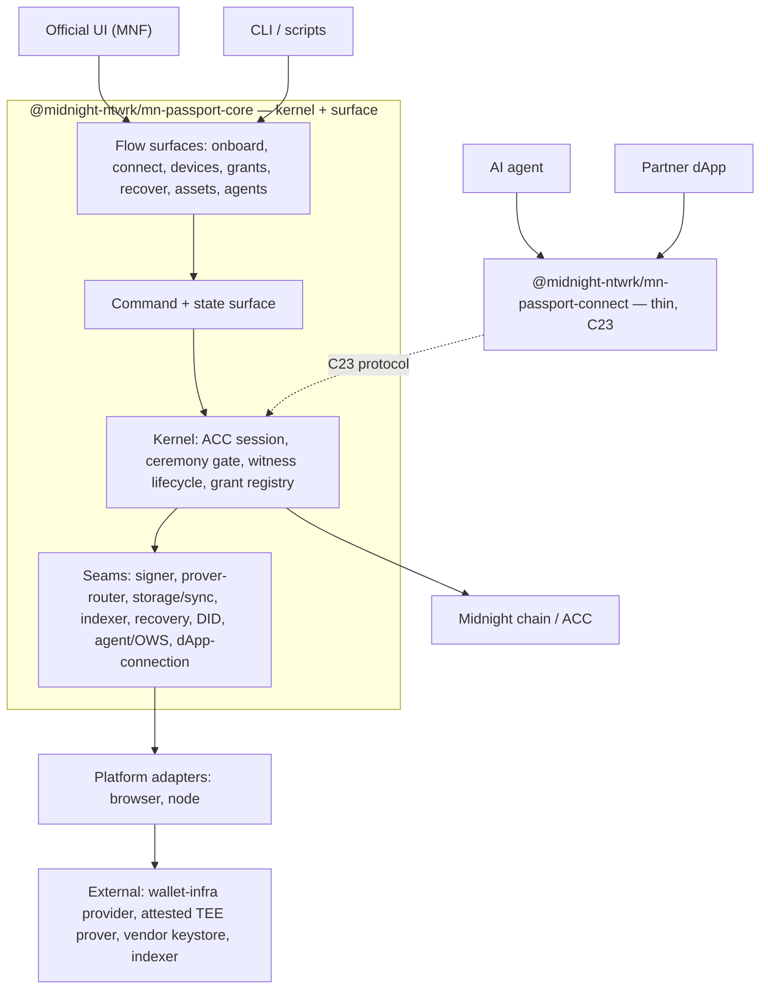
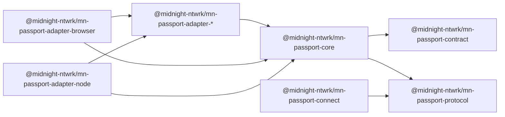
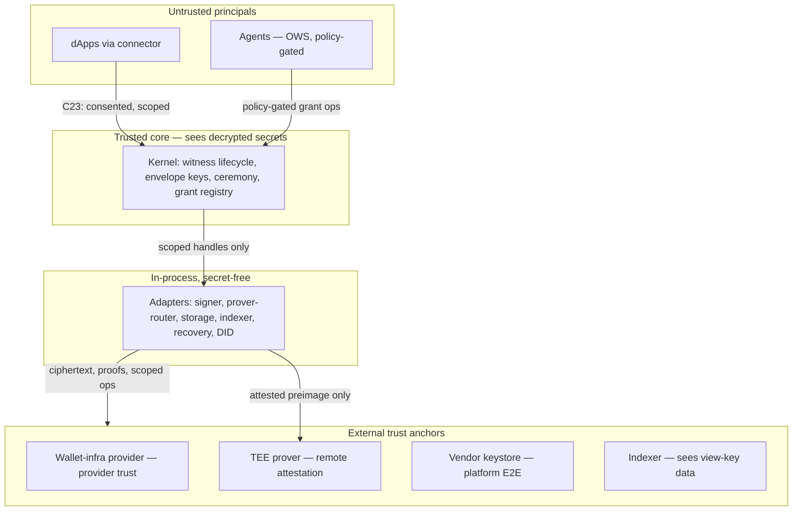
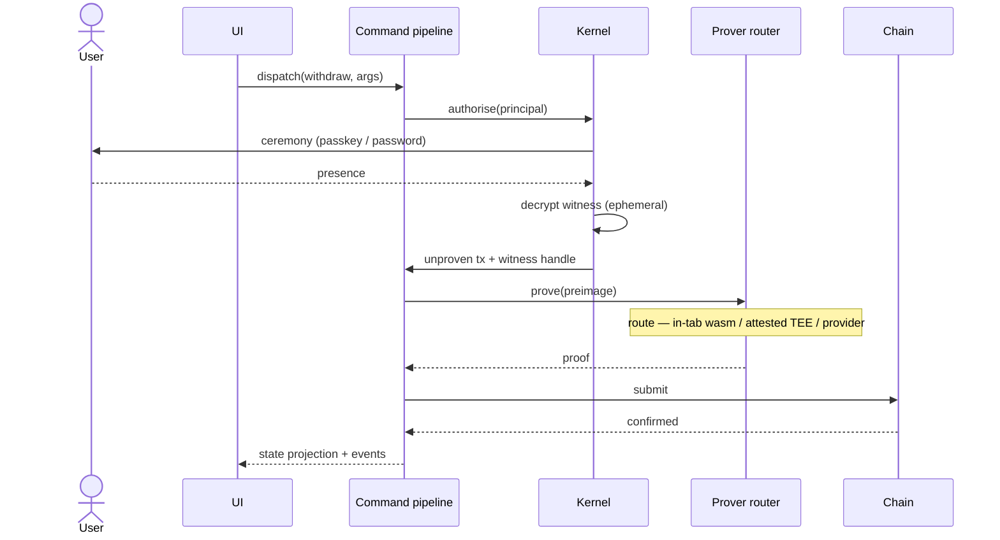

# Midnight Passport SDK — Architecture Approaches (Draft)

> **Status:** draft · 2026/07/20
> **Companion to:** [`sdk-requirements.md`](./sdk-requirements.md). Requirement
> references (§) point there; component references (`[C…]`) and promises
> (`[P…]`) point to [`../../docs/plans`](../../docs/plans).
> **Purpose:** lay out candidate architectures for the SDK, recommend one,
> and map every requirement onto it. Decisions still open are marked
> **[open]** with a stated lean.

## 1. Framing — one core, three faces

The SDK is not one API. It presents **three consumer faces** over a single
ACC-centric core:

| Face | Consumer | Package |
|---|---|---|
| **Wallet** | Official UI (MNF), CLI | `@midnight-ntwrk/mn-passport-core` + adapters |
| **Agent** | AI agents (OWS) | agent adapter (§3.8) |
| **dApp** | Partner dApps | `@midnight-ntwrk/mn-passport-connect` (thin, §3.9) |

The through-line that keeps them coherent: **scoped grants
([C10]/[C11]/[C12]) are the universal authorisation currency.** Devices,
agents, and dApps are all principals holding scoped grants on the ACC; they
differ only in how a grant is *issued and gated* — device by passkey
ceremony (§2.2), agent by OWS policy engine (§3.8), dApp by user consent
plus ceremony (§3.9). One primitive, three issuance paths. The ACC ([C1]) is
the seat of identity; everything else is a mediated interaction with it.

## 2. Reference stack

Every candidate shares this layering; they differ only in how the core
(shaded) is built.

## 3. The three approaches

Three ingredients are settled by the requirements, not in question:
**(i)** typed, multi-package packaging with a clean wallet/dApp split;
**(ii)** a kernel secret-boundary (one place touches decrypted secrets);
**(iii)** a reactive state model so consumers can't recreate the
prototype's state mess. The approaches differ only in **how many of these
you adopt at v1** — an ambition ladder, not rival designs.

### Approach 1 — Thin typed wrappers
Typed ACC bindings + an `Account` facade + injected providers. No kernel,
no reactive surface; the consumer wires everything. Essentially the
prototype, cleaned and typed.
*Buys:* kills the `any`-typing and browser/node duplication.
*Leaves unsolved:* secret containment and state discipline — the two
deeper prototype failures. **Reject as target** (it is, however, migration
step 0).

### Approach 2 — Layered core + provider adapters *(recommended v1)*
Typed `Account` facade (imperative methods) + provider **seams** as adapter
packages + a **minimal kernel boundary**: only the kernel decrypts secrets
and enforces the ceremony. Reads are observable; writes are imperative (no
full command bus yet).
*Buys:* the critical security boundary, substitutable providers ([P8]),
clean packaging — buildable for the October target.
*Cost:* less state-flow discipline than Approach 3; disciplined by
convention until the command bus lands.

### Approach 3 — Kernel + adapters + reactive command bus *(target end-state)*
Every seam has an **adapter** registered with the kernel; every mutation
is a **command** through one pipeline (authorise → build → prove → submit →
confirm), reactive state as the primary API. An adapter holding only a
grant handle *structurally* cannot device-authorise.
*Buys:* strongest secret containment (bounded blast radius per adapter)
and state discipline; the natural home for agent access (§3.8) as an
untrusted adapter.
*Cost:* most upfront design; over-built if adapters stay few.

### Recommendation
**Build Approach 2 for v1, with the kernel boundary and seam interfaces
already shaped like Approach 3 — so 3 is an evolution, not a rewrite.**
Concretely: ship imperative flows over a real kernel secret-boundary and
adapter-packaged providers now; promote seams to registered adapters
and writes to a command bus as the agent and multi-consumer load justify
it. Approach 1 is rejected as a destination because it fixes only the
shallowest of the prototype's three failures.

## 4. The recommended shape in detail

### 4.1 Kernel (the trusted core — keep it small)
The only code that ever holds decrypted secrets. Owns:
- the **ACC session** and typed contract bindings;
- the **witness / secret lifecycle** — decrypt under ceremony, expose an
  *ephemeral handle* to build/prove, best-effort zeroise after ([C7]);
- the **ceremony gate** (§2.2) — passkey PRF or password KDF;
- the **private-state envelope** — seal/open, keyed independently of any
  sync channel (§3.6);
- the **grant registry** — which principals may act, at what scope.

Invariant: secrets leave the kernel only as (a) an in-circuit witness to a
local prover, (b) an attested preimage to a TEE prover, or (c) ciphertext
to storage/sync. Never in plaintext to an adapter, a dApp, or an agent.

### 4.2 Seams (adapters in the full model)
Each is an interface with 2–3 interchangeable adapters; the provider-free
default is always present (§2.1, [P8]):

| Seam | Adapters | Req |
|---|---|---|
| Signer / custody | managed anchor · local in-circuit Jubjub · interim hash-preimage | §2.1, §2.3 |
| Prover (router) | in-tab wasm · attested-TEE remote · provider-routed | §2.5 |
| Storage / sync | vendor keystore (native) · shared provider #58 · local-only | §3.6 |
| Indexer / view-key | hosted · self-hosted | §3.6 |
| Recovery | guardians + paper key | §3.4 |
| DID | `did:midnight` | §3.7 |
| Agent / OWS | OWS policy engine + credential | §3.8 |
| dApp-connection | C23 wallet side | §3.2 |
| External wallet connect (client) | EIP-6963/1193 · Solana Wallet Standard · CIP-30 · Midnight connector | §3.10 |

### 4.3 Command + state surface
- **Reads:** an observable projection of ACC state + session (devices,
  grants, balances, names), rebuilt from indexer + local storage — the
  source of truth, replacing the prototype's per-render `ctx` bag and
  module singletons.
- **Writes:** commands through one pipeline, emitting an event per stage
  (proof provenance, §2.5, is a first-class event here). Instance-scoped
  and disposable — multi-account, no globals.

### 4.4 Packaging

Dependency rule: everything points **inward** to `@midnight-ntwrk/mn-passport-core`'s
interfaces; nothing points outward. `@midnight-ntwrk/mn-passport-connect` links neither the
core nor any adapter — only shared protocol types — so a dApp can never
pull the kernel into its bundle.

**Foundation**

- **`@midnight-ntwrk/mn-passport-protocol`** — the shared wire types and the C23 connection
  protocol (EIP-6963 discovery, CAIP-25-shaped requests,
  Sign-In-with-Passport messages). Deliberately dependency-light so *both*
  the wallet side and the thin dApp connector share it without either
  pulling in the other. No logic — just contracts.
- **`@midnight-ntwrk/mn-passport-contract`** — typed bindings and the exported pure
  commitment circuits over the **externally-owned, versioned ACC artefact**
  (§8.2). Wraps the contract team's published build (compiled module, ZK
  asset manifest, generated types) and owns the connect-time version guard
  (the compatibility contract). The SDK never owns or compiles the
  contract.

**Core**

- **`@midnight-ntwrk/mn-passport-core`** — the platform-neutral heart. Contains the **kernel**
  (ACC session, ceremony gate, witness / secret lifecycle, private-state
  envelope, grant registry), the **command + state surface**, the **flow
  surfaces** (onboard, connect, devices, grants, recover, assets, agents),
  and the **seam interfaces** (signer, prover, storage/sync, indexer,
  recovery, DID, agent, dApp-connection). Holds **no** platform code (`fs`,
  `window`, `fetch`) and **no** concrete provider — only interfaces; this is
  what keeps it portable and unit-testable. Depends on `@midnight-ntwrk/mn-passport-contract`
  and `@midnight-ntwrk/mn-passport-protocol`.

**Platform adapters** — dedupe the prototype's `providers.ts` ≈
`node/wallet.ts` split into one core plus two thin wirings.

- **`@midnight-ntwrk/mn-passport-adapter-browser`** — wires the seams to browser APIs:
  `FetchZkConfigProvider` (ZK assets over HTTP), WebAuthn **PRF passkeys**
  for the ceremony, the in-tab wasm prover (Web Worker), browser storage /
  vendor keystore, `fetch` and `WebSocket`. The default target — Passport
  is browser-first. Consumed by the Official UI (MNF) and web dApps
  embedding the wallet.
- **`@midnight-ntwrk/mn-passport-adapter-node`** — wires the same seams to Node.js so the SDK
  runs **server-side**: filesystem ZK-asset loading (`NodeZkConfigProvider`),
  disk-backed private state (LevelDB), the `ws` WebSocket, Node crypto, and
  a **non-WebAuthn ceremony / signer** (WebAuthn is browser-only, so on Node
  the presence factor is a file / env or hardware key, or — for an agent —
  a policy-gated credential rather than a passkey). Consumers: the **CLI**,
  automated / E2E tests, backend services, and **agent runtimes** (an OWS
  agent or MCP server runs in a Node process and cannot perform a passkey
  ceremony, which is why the agent path is policy-gated, §3.8). This is the
  package that makes the CLI and agent faces possible.

**Seam adapters** — `@midnight-ntwrk/mn-passport-adapter-*`, each implementing one core seam
interface and depending only on that interface plus its own provider SDK;
the provider-free default always ships.

- **`adapter-signer-managed`** — managed custody (§2.1, §2.6): the wallet-infra
  provider (embedded WaaS or extension) authenticates the user and gates the
  ACC device secret via a `signMessage` presence gesture; ACC calls run via
  midnight-js. The provider is the auth / presence layer, not the
  contract-call signer. v1 target: the §2.3 cryptographic binding.
- **`adapter-signer-local`** — decentralised custody: the PRF-derived Jubjub
  device key verified in-circuit, plus the interim hash-preimage signer
  behind the same interface until Schnorr lands (§2.3).
- **`adapter-prover-wasm`** — the in-tab wasm prover (lifted from the prototype
  worker) for small-k circuits (§2.5).
- **`adapter-prover-remote`** — the remote-proving client: provider-routed and
  attested-TEE paths, verifying remote attestation **before** sending any
  preimage (§2.5).
- **`adapter-storage-vendor`** — native vendor-keystore sync adapter (§3.6).
- **`adapter-storage-shared`** — the shared private-storage provider (#58)
  adapter; also the source for dApp witness provisioning (§3.9).
- **`adapter-recovery`** — guardian + paper-key total-loss recovery
  (§3.4, [C14]/[C15]).
- **`adapter-did`** — `did:midnight` create / resolve (§3.7).
- **`adapter-agent-ows`** — the OWS-compatible `ChainSigner` / policy surface
  over the grant primitive (§3.8).
- **`adapter-dapp-connection`** — the wallet side of C23: answers discovery,
  Sign-In-with-Passport, and scoped-grant requests (§3.2).
- **`adapter-wallet-connect`** — the wallet-connector **client**: Passport
  connecting *out* to external wallets (Lace, 1am, Gero, MetaMask, Rabby,
  Phantom), one adapter per standard (§3.10). The opposite direction to
  `adapter-dapp-connection`; foreign-curve wallets attach via the §2.3 binding.

**dApp side**

- **`@midnight-ntwrk/mn-passport-connect`** — the **thin** connector a third-party developer
  installs (§3.9). Implements the dApp end of C23 over `@midnight-ntwrk/mn-passport-protocol`:
  Sign-In-with-Passport, scoped-grant requests, and requesting
  Passport-provisioned witnesses. Minimal footprint, own threat model;
  talks C23 *to* the wallet across a trust boundary and **must not link
  `@midnight-ntwrk/mn-passport-core`** or any adapter.

*Arrows read "depends on". `@midnight-ntwrk/mn-passport-connect` reaches only
`@midnight-ntwrk/mn-passport-protocol` — never the core or an adapter.*

### 4.5 Private storage and backup

The mobile-web constraints (§8.5) force this model; resolve it in three
moves.

**1. Classify state by what it takes to get it back on a new device.**

| Tier | Examples | On a new device |
|---|---|---|
| **Regenerable** | device key (passkey PRF), chain-visible state (view-key + indexer) | Re-derived / re-synced — no stored copy needed |
| **Irreplaceable** | genuinely user-supplied private inputs / dApp witness data | **Cannot be regenerated — recoverable *only* from a durable backup. The data the storage system exists to protect.** |
| **Recovery material** | recovery secret / shares | Preserved and restored by the recovery protocol ([C14]/[C15], guardians) — not the private-state backup |
| **Cache / metadata** | name, ACC address, grant refs, sync cursor | Rebuilt from chain |

The **irreplaceable** tier is the crown jewels: neither on-chain nor
re-derivable, so if the local store is evicted *before* a durable backup
exists it is gone permanently — potentially locking the user out of their
private state. Its backup is the **critical path**, not a footnote. Two
levers keep it small and safe:

- **Shrink it by derivation.** Every secret that *can* be derived from the
  passkey-PRF root under a domain-separated salt (as the device key already
  is) should be — moving it into the *regenerable* tier, where it needs no
  backup. Only truly user-supplied data stays irreplaceable.
- **Preserve recovery material via the recovery protocol** ([C14]/[C15]),
  not local backup — guardians / paper key are its durability story.

**2. Local store — IndexedDB, ciphertext only.** IndexedDB is the durable
local substrate on every mobile engine (OPFS for large *non-secret* assets
such as staged ZK params). It holds only **ciphertext**: each entry is
`{version, nonce, ciphertext}`, keyed per account / context. A per-entry
data key is wrapped by a **ceremony-derived** key (passkey PRF, or password
KDF); plaintext and the wrapping key materialise only transiently inside
the kernel after a §2.2 ceremony. So device theft or an IndexedDB read
(XSS, extracted backup) yields ciphertext only — and the wrapping key MUST
be independent of any channel the backup also uses (the §3.6 lock-and-key
rule: passkey PRF that syncs to the same vendor cloud as the ciphertext
hands the vendor lock and key together).

**3. Backup — mandatory and redundant for the irreplaceable tier.**
IndexedDB is an evictable cache that mobile browsers do not replicate across
devices (§8.5), so the irreplaceable tier MUST have a durable backup, and
the SDK should treat *a confirmed durable backup exists* as a precondition
before the user accrues irreplaceable state. Redundant paths over the
Storage/sync seam:

- **Portable (web + cross-ecosystem):** the shared private-storage provider
  (#58) holds the ciphertext copy — the durable source of truth; the
  provider sees ciphertext only.
- **Native:** vendor keystore (§3.6) as the on-platform fast path.
- **User-held:** an exported encrypted backup / recovery phrase.
- Regenerable and cache/metadata tiers are never backed up — re-derived
  from the passkey PRF and rebuilt from the indexer.

On a recovery epoch bump ([C14]), rotate the data keys, re-seal, and
re-upload. **Net properties:** for regenerable and metadata state, eviction
≠ loss; for the irreplaceable tier, eviction ≠ loss **only if a durable
backup exists** — which is why its backup is mandatory, not a floor.
Provider compromise ≠ disclosure (ciphertext only); device theft ≠
disclosure (needs the ceremony).

## 5. Security architecture

The user's concern with the prototype was security; this is the layer that
answers it. The design is a set of **trust boundaries** with explicit rules
for what may cross each.

Each external anchor carries **one explicit trust assumption**: the
wallet-infra provider is provider-trust; the remote prover is acceptable
*only* under verified remote attestation (§2.5); the vendor keystore is
platform E2E and must not also hold the envelope key (§3.6); the indexer
sees whatever the view-key discloses ([C17]).

A ceremony-gated write, end to end:

For an **agent** write, the `authorise` step resolves to an OWS
policy-engine check against a standing grant instead of a human ceremony
(§3.8) — the one exception to the per-transaction ceremony rule.

## 6. Requirement → architecture map

| Requirement | Lives in |
|---|---|
| Custody paths (§2.1) | Signer seam + kernel |
| Ceremony (§2.2) | Kernel ceremony gate |
| Signing / ECDSA binding (§2.3) | Signer seam; binding committed as an ACC device entry (kernel) |
| Provider model (§2.4) | Seam interfaces + adapter packages |
| Proving paths (§2.5) | Prover-router seam |
| Onboarding (§3.1) | Onboard flow → kernel (deploy ACC) + signer, storage, DID seams |
| dApp auth / authz (§3.2) | dApp-connection seam (wallet side) + grant registry |
| Cross-chain MCS (§3.3) | Deferred post-v1 ([C25]); seam stub |
| Recovery (§3.4) | Recovery seam + kernel (epoch re-auth) |
| Multi-device (§3.5) | Kernel grant registry + signer seam |
| Storage / sync (§3.6) | Storage/sync seam + kernel envelope |
| DID (§3.7) | DID seam |
| Agents / OWS (§3.8) | Agent seam (OWS `ChainSigner`/policy over the grant primitive) |
| dApp connector (§3.9) | `@midnight-ntwrk/mn-passport-connect` package |

## 7. What we lift from the prototype (quarry, not refactor)

The prototype (`demo/mn-passport-foundations`) is a **validated quarry**,
not the SDK skeleton. Lift:
- `account.compact` and its seam design (epoch invalidation, `round` replay
  counter, single `require_device`/`require_grant` auth seam, exported pure
  commitment circuits) → **seeds the contract team's ACC** (§8.2); the SDK
  consumes its published build via `@midnight-ntwrk/mn-passport-contract`.
- the witness pipeline shape ([C7]) → kernel witness lifecycle.
- the browser prover (`wasmProver.ts` + worker split) → prover-wasm
  adapter.

Rebuild (do not port): the app orchestration (god components, logic in JSX
closures), the `any`-typed provider boundary, the module-global singletons,
and the in-memory-only private state. The `require_device` body remains the
single swap-point where hash-preimage gives way to Jubjub Schnorr and the
§2.3 binding.

## 8. Open decisions and questions

1. **Core ambition — decided.** Approach 2 for v1 with Approach-3-shaped
   seams, evolving to Approach 3.
2. **ACC source ownership — decided.** The contract is **not owned by the
   SDK**; it lives in a separate repository (or the same repository under a
   different team). The SDK consumes a **versioned, published ACC artefact**
   (compiled contract module, ZK assets, generated types) and owns only the
   typed bindings over it. This decouples SDK releases from contract
   recompilation and insulates the SDK from transientHash / toolchain
   version instability ([C8]), which the contract team manages. Implies a
   **compatibility contract**: an SDK version resolves against a supported
   ACC version range (with its language / runtime pin).
3. **v1 seam scope [open].** *Lean:* real at v1 — signer (managed +
   interim local), prover (wasm + provider-routed; TEE next), storage
   (local + vendor-native; #58 as it lands), indexer, dApp-connection,
   agent/OWS. Interface-stubbed at v1 — fee/sponsor ([C24]), full recovery
   helper ([C15]), cross-chain ([C25]).
4. **Agent seam [open].** *Lean:* **implement** an OWS-compatible
   `ChainSigner`/policy surface over the grant primitive (grant authoriser
   = the OWS-managed key) rather than **consume** `ows-core`'s key/vault
   model, keeping the ACC the seat of truth.
5. **Mobile web storage & persistence [open question — verify].** The UI
   targets mobile browser / installed PWA. Current-knowledge findings (to
   re-verify against current iOS/Android): there is **no arbitrary
   local-file read/write** on mobile browsers — the File System Access
   pickers are desktop-Chromium only. Durable storage is **IndexedDB** (all
   engines) plus **OPFS** (origin-private sandbox, iOS Safari 15.2+ /
   Android) for larger blobs; both hold ciphertext under the ceremony
   envelope (§2.2). The real risk is **eviction**: iOS ITP caps
   script-writable storage at ~7 days of inactivity, so local private state
   can be deleted. `navigator.storage.persist()` and **installing the PWA
   (Add to Home Screen)** improve durability, more reliably on Android than
   iOS. OS keystore / real files stay native-only (reinforces §3.6:
   vendor-keystore is a native adapter). **Design consequence:** on mobile
   web, local storage MUST be treated as a *reconstructable cache*, not the
   source of truth — the ACC is authoritative, the device key re-derives
   from the passkey PRF (§2.1), and cross-device sync (§3.6) plus recovery
   ([C14]) must cover eviction. *To verify:* current iOS `persist()` grant
   behaviour and installed-PWA storage durability.
