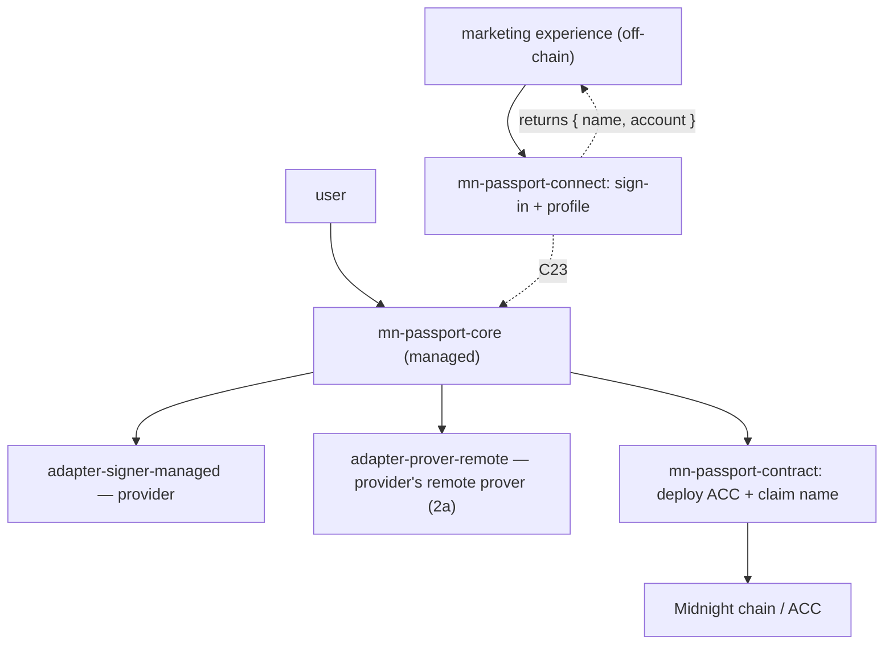

# Midnight Passport SDK — Beta (v1) scope

> **Status:** draft · 2026/07/24
> **Reduces:** [`sdk-requirements.md`](./sdk-requirements.md) and
> [`architecture.md`](./architecture.md) to the smallest slice that ships a
> usable beta. Every in-scope item points to its full-scope section; every
> deferral says where it will come from later. Built the way
> [`development-workflow.md`](./development-workflow.md) describes.

## 1. Purpose

Ship a reduced beta that does two things well:

1. proves **full account setup** works end to end on the **managed path**, and
2. lets a first reference dApp — a **marketing experience**, fully off-chain
   for now — sign a user in and read their profile.

Everything not needed for those two is explicitly deferred (§4). The beta is
deliberately the *managed, provider-backed* path only: it is the fastest way
to something real in users' hands and it is what the account-custody
prototype already demonstrated.

## 2. In scope

**(1) Full account setup** — deploy the Account Custody Contract (ACC) and
claim the name (`alice.passport.night`). Covers onboarding (§3.1), the ACC
(§1.1 / C1) and the name service (§2 / C2). The DUST fees for these setup
transactions are **sponsored by the provider** (see item 3), so a zero-DUST
user can onboard with no faucet or separate fee mechanism.

**(2) Managed path only** — the account is set up and used through the
**wallet-infrastructure provider** (the managed custody path, §2.1 / §2.6).
The decentralised, self-custody path (in-circuit Jubjub device keys, §2.1
decentralised / §2.3) is **out of beta**. Passkeys are **always** used to
confirm transactions (§2.2): the provider's own login is passkey-based, and
that passkey is the presence gate on every managed-path action. What is
deferred is the decentralised *use* of the passkey (deriving an in-circuit
device key), not the passkey itself.

**(3) Proving via the provider's remote proof server only** — all proofs
route to the provider's remote prover (§2.5 **path 2a**, provider-routed).
Beta does **not** do in-tab WASM proving or a direct TEE prover, and it does
**not** run the k-threshold router: everything goes to the provider
regardless of circuit size. The SDK encrypts the witness to that prover's
enclave (§2.5); the provider returns the proof. The same provider path also
**sponsors the DUST fees** — including the account-setup transactions (item
1) — so beta needs no separate fee/sponsor mechanism (Capacity Exchange,
§3.11, stays out of beta). Because beta proves remotely by default (there
is no in-tab option yet), there is no in-tab → remote switch to consent to;
instead the reduced-privacy posture (the witness goes to the provider's
enclave) is disclosed at onboarding and shown as a standing reminder, per
§2.5.

**(4) dApp connect — sign-in + profile read only** — the connector (§3.9)
implements **Sign-In-with-Passport** and returns the user's **profile: the
ACC contract address plus the alias (name)**. That is the whole surface in
beta. No witness provisioning (#58), no scoped-grant issuance or spending,
no deposits.

**Reference dApp — a marketing experience (fully off-chain for now).** It
installs `mn-passport-connect`, signs the user in, and reads
`{ name, account }` to identify and personalise for the user (for example,
gating or tailoring the experience per Passport account). It runs entirely
off-chain: it never spends, never asks for a grant, and never touches
witness state. That read-only shape is exactly why it is a safe first
integration and a good dogfooding partner.

## 3. The active slice (packages and adapters)

Live in beta:

- `mn-passport-core` — a slim build: the onboarding flow and the connect
  answer, the kernel, the seams.
- `mn-passport-contract` — ACC bindings for deploy and the calls onboarding
  needs.
- `mn-passport-connect` + `mn-passport-protocol` — the dApp side, sign-in and
  profile read only.
- `adapter-signer-managed` — the provider-backed custody path.
- `adapter-prover-remote` — pinned to the provider's remote proof server
  (path 2a).

Not built for beta: `adapter-signer-local`, `adapter-prover-wasm`,
`adapter-agent-ows`, `adapter-wallet-connect`, `adapter-fee-capacity-exchange`,
and the witness-provisioning half of the connector.

## 4. Out of scope for beta (deferred, with pointers)

| Deferred | Comes from |
|---|---|
| Decentralised / self-custody path (in-circuit Jubjub) | §2.1 decentralised, §2.3 |
| In-tab WASM proving; direct TEE prover | §2.5 paths 1 and 2b |
| Witness provisioning to dApps | #58 · §3.6 / §3.9 |
| Scoped grants (issue / spend) beyond sign-in | §3.2 · C10–C12 |
| Agents / OWS | §3.8 |
| External wallet connections | §3.10 |
| DUST sponsorship / Capacity Exchange | §3.11 |
| Deposit mechanism (paying a Passport account) | §3.12 |
| Recovery (lost-device / total-loss) | §3.4 · C13–C15 |
| DID (`did:midnight`) | §3.7 |
| Multi-device beyond the provider's own | §3.5 |

Beta leans on the **provider** for anything managed it happens to offer
(recovery, multi-device); Passport's own versions of those come after beta.

## 5. Open questions to close before beta ships

- **Provider remote-prover readiness.** Item (3) assumes the provider's
  remote proof-server integration (with fee sponsorship) exists. If it is not
  ready, beta proving and fee-paying are blocked or need an interim (a local
  proof server + a stopgap fee payer). Confirm the timeline with the
  provider.
- **Managed key binding.** In the prototype the managed device secret is a
  random, browser-local value that does not port across devices (§2.6,
  demo-grade). Acceptable for beta? If a beta user needs the same account on
  a second device, the portable §2.3 binding is needed sooner rather than
  later.

## 6. Delivery

Beta is anchored to a single GitHub issue and planned into small,
reviewable PRs via `mn-skills-spec-driver` (development-workflow §3). Rough
tranches:

1. Managed onboarding — ACC deploy + name claim, proofs via the provider's
   remote prover.
2. Connect — Sign-In-with-Passport returning `{ name, account }`.
3. Marketing-experience integration against the connector (off-chain).
4. Hardening and the beta demo.
