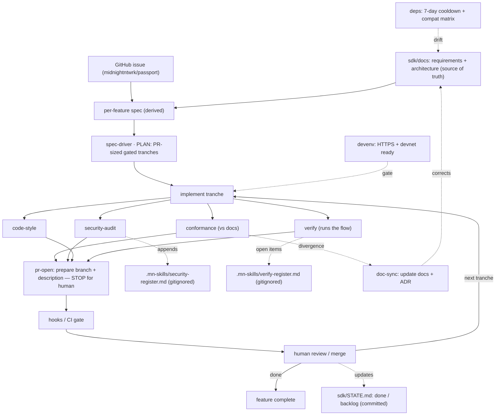
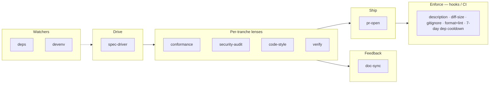

# Development workflow — the `mn-skills` family

> **Status:** draft · 2026/07/24
> **Companion to:** [`sdk-requirements.md`](./sdk-requirements.md) (the *what/why*)
> and [`architecture.md`](./architecture.md) (the *how*). This document is the
> *how we build it* — the Claude-harness skills that drive SDK development and
> how they orchestrate a spec from plan to merged PR.

**Naming, to avoid a collision:** development-time skills are prefixed
**`mn-skills-*`**; the shipped runtime packages are **`@midnight-ntwrk/mn-passport-*`**
(§4.4 of the architecture). `mn-skills-*` build the SDK; `mn-passport-*` *are*
the SDK.

---

## 1. Rationale

A development workflow has to do two things, and it is easy to build one that
only does the first:

1. **Produce and check code** — plan the work, write it, and review it for
   design conformance, security, and style.
2. **Close two feedback loops** — *does it actually run?* and *did we just
   learn the docs are wrong?*

The second is where the real surprises live. On this project specifically,
the two largest course-corrections during planning were exactly those loops
firing: discovering how the managed flow *actually* executes a contract call
(a "does it run" finding), and correcting the managed-path model in the docs
afterwards (a "the docs were wrong" finding). A workflow with no first-class
home for either will drift — the code stops matching reality, and the docs
stop matching the code.

Two principles fall out and shape everything below:

- **Skills assist and judge; hooks/CI enforce.** Anything that must be
  *guaranteed* — a PR always has a description, the security register never
  gets pushed, dependencies respect the cooldown — lives in the deterministic
  layer (hooks/CI), because the harness runs it, not the model. Skills draft,
  review, and advise; they never *guarantee*. Mixing the two produces a skill
  that "usually" adds a description.
- **`sdk/docs` is the source of truth; conformance gives it teeth; doc-sync
  keeps it true.** Per-feature specs are *derived from* the requirements and
  architecture. `mn-skills-conformance` checks code against those docs, so
  they must stay current — which is `mn-skills-doc-sync`'s job. Without the
  sync loop, conformance quietly validates against stale truth.

---

## 2. The skills

All prefixed `mn-skills-`. Each entry: what it does, when it fires, and what
existing tooling it leans on (we wire, we do not reinvent).

### Spine

**`mn-skills-spec-driver`** — plan, then loop.
- *Plan phase* (harness plan mode): a per-feature spec → an ordered set of
  **tranches, each sized to one small/medium PR**, each with an acceptance
  gate. PR boundaries are decided here, up front — not bolted on later. The
  plan phase also **requires the spec's GitHub issue** (from
  `midnightntwrk/passport/issues`); if the spec names none, it **stops and
  asks for it** before planning — no untraceable work.
- *Loop phase* (harness `/loop`): per tranche → implement → run the review
  lenses → `mn-skills-pr-open` → **stop for human review/merge** → next
  tranche. On each tranche's completion or slip it updates **`STATE.md`**
  (§3) so the progress and backlog view stays current.

### Review lenses (run per tranche, parallelisable, each also invokable alone)

**`mn-skills-conformance`** — the design guard. Checks the change against the
requirements + architecture: seam/adapter structure, package-dependency rules
(`connect` never links `core`; deposits ride `contract` — arch §4.4), the
normative MUSTs (ceremony gate §2.2, deposit-not-address §3.12,
encrypt-preimage-to-enclave §2.5), naming, and the two version axes. Its
checklist is *derived from* `sdk/docs`. Consulted at plan time so the plan
aligns; enforced at review time so the code does.

**`mn-skills-security-audit`** — key-management review. Two outputs:
1. *Blocking findings* — fixable mismanagement (secret in the wrong place,
   witness not zeroised, missing ceremony gate) → fix now.
2. *Residual-risk register* — "insecure but not resolvable right now" items,
   each with **risk → why it can't be fixed yet → mitigations**, appended to
   a **gitignored** register (§4). This is the demo's hand-written
   `DECISIONS.md` "Known gaps" list, automated and maintained per PR.

**`mn-skills-code-style`** — project coding preferences. Grounded in
`.claude/rules/` (British English + Oxford comma, `YYYY/MM/DD` dates, Rust
style) plus TS conventions, and the **Midnight** brand for any UI —
Midnight Passport is a Midnight-branded product, not an IOG-branded one.
Judgment layer (prose in comments/docs, brand adherence, i18n,
error-taxonomy consistency); the mechanical part (format/lint) is
backstopped in CI.

**`mn-skills-verify`** — *does it run?* Drives the affected flow end-to-end
rather than trusting that review passed. Leans on the repo's existing
`midnight-verify` (`/verify`, devnet, contract/witness/sdk testers) and
`midnight-cq` (test runner, test-quality). A change that passes conformance,
security, and style but does not prove or submit is not done. Open
validations it cannot close (e.g. a `[PROVISIONAL]` item awaiting a real
account) are recorded in the **verify register** (§4), owned here jointly
with doc-sync.

### Feedback

**`mn-skills-doc-sync`** — *did we learn the docs are wrong?* When
implementation diverges from `sdk/docs` (reality contradicts an assumption),
the defined path is: update the requirements/architecture **and record the
decision as an ADR**. Closes the loop that conformance depends on. Leans on
the repo's existing ADR / `arcsop` machinery. Owns the **verify register** of
provisional decisions and open validations that still need re-checking.

### Ship

**`mn-skills-pr-open`** — small/medium sizing check (flags a split if the
diff is too large) and the **PR description** ("what's being built" + link to
the spec tranche **and the spec's GitHub issue** — `Refs #NN`, or `Closes #NN`
on the tranche that finishes it). **Prepares** the branch, commits, and
description, then **stops for explicit human confirmation before
pushing/opening** — the loop never performs the outward action on its own.

### Watchers (fire on a schedule / on dependency changes, not per tranche)

**`mn-skills-deps`** — upstream drift and supply-chain hygiene. Midnight
breaks often, and the SDK pins midnight-js / ledger / zkir / compact **and**
the ACC artefact (arch §8.2). This skill:
- **Never adopts a package version younger than 7 days.** A version published
  less than 7 days ago sits in a **cooldown quarantine** — the window in which
  a supply-chain compromise of an underlying library is most often caught and
  yanked. Adoption (new dependency or version bump) waits out the 7 days.
  Checked against registry publish time (`npm view <pkg> time`). The only
  override is an urgent security patch, taken as a *conscious, recorded*
  decision — never silently.
- Pins **exact versions** with a committed lockfile; verifies versions with
  `npm view`, never from memory; adds **no custom registry config**
  (`@midnight-ntwrk/*` are on public npm).
- Maintains the **compatibility matrix** — the two version axes (wire:
  `mn-passport-protocol`; binding: `mn-passport-contract` ↔ deployed ACC,
  arch §4.6) — and flags when an upstream bump requires a matrix update.
Leans on `release-notes` and `troubleshooting`.

**`mn-skills-devenv`** — guards the dev environment. Passkeys require an
**HTTPS / secure context even locally** (a `localhost` HTTP redirect will not
do), alongside devnet + proof server + compact CLI. Leans on
`midnight-tooling:*` (devnet, proof-server, doctor).

### Deferred (named, not built yet)

**`mn-skills-release`** — version bump + changelog + publishing the
compatibility matrix. Publish-time; sequence after the core loop is proven.

### Not skills

- **Generic bug / quality review** — the harness's `/code-review` and
  `/review` already do this; the lenses above encode *our* rules, which a
  generic reviewer cannot know.
- **The merge decision** — human.
- **Per-feature spec *authoring*** — currently the plan phase of
  `mn-skills-spec-driver`; split into its own skill only if authoring proves
  heavy.

Fold-ins (not new skills): error-taxonomy + proof-provenance → conformance;
UX / a11y / i18n + brand → code-style.

---

## 3. Orchestrating a spec

The unit of work is a **per-feature spec derived from `sdk/docs`** (the big
docs are the source; a feature spec is what gets driven).

0. **Derive the spec** — from the relevant requirements + architecture
   sections into a concrete feature spec (scope, decisions, tranches), naming
   its **GitHub issue**.
1. **Plan** — `mn-skills-spec-driver` turns it into PR-sized, gated tranches;
   if the spec named no issue, it **stops and asks** before planning.
2. **Loop** — for each tranche:
   a. `mn-skills-devenv` confirms the environment is ready.
   b. Implement the tranche.
   c. Run the lenses in parallel: `conformance`, `security-audit`,
      `code-style`, `verify`. Blocking findings are fixed before proceeding.
   d. Registers update: security-audit → security register; verify/doc-sync →
      verify register (both gitignored).
   e. If conformance finds the code diverging from the docs for a *good*
      reason, `mn-skills-doc-sync` updates `sdk/docs` + records an ADR — the
      docs are corrected, not the code bent to a stale doc.
   f. `mn-skills-pr-open` prepares the branch + description, links the PR to
      the spec's GitHub issue, and **stops**.
   g. The hooks/CI gate runs; a human reviews and merges.
3. **Repeat** until the spec's tranches are done. `STATE.md` reflects done /
   in-progress / backlog throughout; anything not completed lands in the
   backlog with a reason, never silently dropped.

Running alongside, on their own cadence: `mn-skills-deps` (drift + cooldown +
matrix) and `mn-skills-devenv`.

### Diagram — the orchestration loop

*(All skills prefixed `mn-skills-`; shortened in nodes.)*

### Diagram — the family by role

### `STATE.md` — progress and backlog

`sdk/STATE.md` is the human-readable, **committed** record of SDK development
— distinct from the gitignored registers (§4), because progress is meant to
be shared, not hidden. `mn-skills-spec-driver` maintains it as tranches land
or slip, in three parts:

- **Done** — completed tranches / PRs, each with its issue and PR links.
- **In progress** — the tranche currently in the loop.
- **Backlog** — tranches planned but **not completed** (deferred, blocked, or
  descoped), each with a reason and its issue. This is where non-completed
  tasks live so nothing is silently dropped.

Because every entry carries an issue number (below), "what's done / what
remains" is always traceable to the issue tracker.

### Issue traceability

Every per-feature spec **must name a GitHub issue** from
[`midnightntwrk/passport/issues`](https://github.com/midnightntwrk/passport/issues).
The chain runs **issue → spec → tranches → PRs → `STATE.md`**:

- A spec without an issue → `mn-skills-spec-driver`'s plan phase **stops and
  asks** before starting work.
- `mn-skills-pr-open` links each PR back to that issue (`Refs #NN`, or
  `Closes #NN` on the finishing tranche).
- The hooks/CI gate checks the PR references its issue (§4).
- `STATE.md` entries carry the issue number, closing the loop.

---

## 4. Enforcement layer (hooks / CI)

Deterministic guarantees, run by the harness/CI rather than judged by a skill:

- **PR description present**, referencing its spec tranche **and its GitHub
  issue** (`Refs`/`Closes #NN`).
- **Diff-size guardrail** — a soft warning past a threshold (advisory, so it
  does not fight a legitimately larger change), pointing back to
  `mn-skills-pr-open`'s split suggestion.
- **Registers gitignored** — `.mn-skills/` is git-ignored; the security and
  verify registers live there and never push.
- **`STATE.md` committed** — `sdk/STATE.md` is *not* under `.mn-skills/`;
  progress and backlog are shared project state, tracked in the repo.
- **Format + lint** pass.
- **7-day dependency cooldown** — CI rejects a lockfile that introduces a
  package version published less than 7 days ago, unless an override marker
  (with a recorded reason) is present.

`.mn-skills/` joins the repo's existing gitignored working dirs (`.planning/`,
`.serena/`).

---

## 5. Conventions adopted

Stated so the doc is decisive; each is revisitable.

- **Prefix** `mn-skills-` for every development skill.
- **Specs are per-feature**, derived from `sdk/docs`; the big docs are the
  source of truth.
- **Two gitignored registers** under `.mn-skills/`: the *security register*
  (owned by `security-audit`) and the *verify register* of provisional /
  open-validation items (owned by `doc-sync`, fed by `verify`). Persistent
  and appended — accepted risks and open validations accumulate and are
  re-checked, not regenerated.
- **The loop stops before outward actions** — it prepares PRs; it does not
  push or open them without explicit human go.
- **Enforcement in hooks/CI, judgment in skills.**
- **Packaged as one `mn-skills` plugin** — the skills and their backing
  hooks travel together.
- **Every spec names a GitHub issue**; planning refuses to start without one.
  Traceability runs issue → spec → tranches → PRs → `STATE.md`.
- **`STATE.md` (committed)** tracks done / in-progress / backlog; the two
  registers (gitignored) track residual risks and open validations.

---

## 6. Open items

- Whether `mn-skills-verify` is a distinct skill or simply "the loop always
  runs `/verify` before `pr-open`". Drafted here as distinct (it wraps
  existing tooling and owns register entries), revisitable.
- The exact diff-size threshold for the advisory guardrail.
- Whether per-feature spec authoring warrants its own skill or stays inside
  `spec-driver`'s plan phase.
